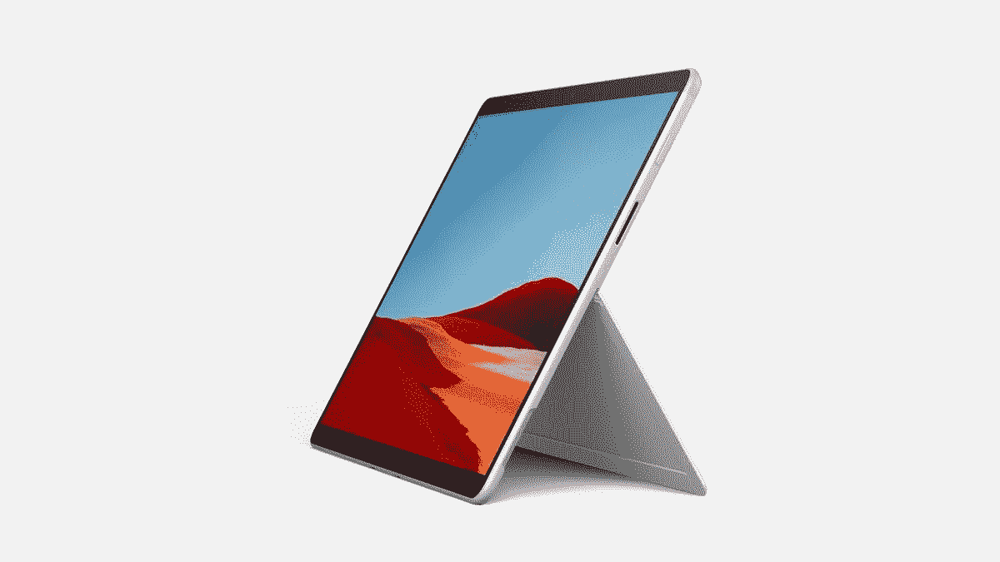

# 微软的新 Surface 设备今天随 Windows 11 上市

> 原文：<https://www.xda-developers.com/new-surface-devices-laptop-studio-pro-8-now-available/>

微软的最新一代 Surface 设备从今天开始可以购买，同时最近还推出了 Windows 11。今天上市的新设备包括 Surface Laptop Studio、Surface Pro 8、Surface Go 3 和 Surface Pro X 的 Wi-Fi 版，此外，Surface Slim Pen 2 和新的 Surface Pro Signature 键盘也于今天上市。

[Surface Laptop Studio](https://www.xda-developers.com/surface-laptop-studio) 可以说是最令人兴奋的设备，因为它是 Surface 的全新外形。这是一款功能强大的笔记本电脑，采用英特尔 H35 系列处理器、NVIDIA GeForce RTX 显卡、Thunderbolt 4 支持以及独特的可转换外形。你可以像使用笔记本电脑一样使用它，但是你可以移动显示屏使它离你更近，或者用它来绘图和写作。它还支持新的 Surface Slim Pen 2，在一些应用程序中具有触觉反馈，这让你感觉像在纸上写字。如果你想了解更多，请查看我们对 Surface Laptop Studio 的[评论，或者使用下面的链接购买，起价 1599 美元。如果你对数字艺术或手写感兴趣，你也可以购买](https://www.xda-developers.com/surface-laptop-studio-review/) [Surface Slim Pen 2](https://www.amazon.com/Microsoft-Surface-Slim-Pen-Matte/dp/B09DK2YSH2?tag=xda-47gp9ib-20&ascsubtag=UUxdaUeUpU5276&asc_refurl=https%3A%2F%2Fwww.xda-developers.com%2Fnew-surface-devices-laptop-studio-pro-8-now-available%2F&asc_campaign=Short-Term) 。

 <picture></picture> 

Surface Laptop Studio

##### 微软 Surface Laptop Studio

Surface Laptop Studio 配备了全新的设计、更强大的内部部件、120Hz 显示屏和 Thunderbolt 支持，使其成为迄今为止功能最丰富的 Surface 设备之一。

Surface Pro 8 也是一个重要的发布，以我们要求的方式升级了 Surface Pro 系列。它配备了更大的 13 英寸显示屏，更小的边框，现在它的刷新率为 120 赫兹，就像 Surface Laptop Studio 一样。与 Surface Laptop Studio 一样，Pro 8 支持 Surface Slim Pen 2 中的触觉反馈，此外还有一个新的 Surface Pro 签名键盘，其中包括一个容纳 Surface Slim Pen 2 的笔库。当然，它还配备了最新的英特尔处理器和其他高端规格，包括 Thunderbolt 4 支持。你可以阅读我们对 Surface Pro 8 的[评测，或者使用下面的链接购买，起价 1099 美元。你也可以购买](https://www.xda-developers.com/surface-pro-8-review/) [Surface Pro 签名键盘](https://shop-links.co/1753893892472029215?u1=678bea30-cb6d-4d54-9828-36a10e9e73fe)来获得更像笔记本电脑的体验。

 <picture></picture> 

Surface Pro 8

##### 微软 Surface Pro 8

Surface Pro 8 是微软的旗舰平板电脑，它采用了全新的设计，120Hz 的显示屏，Thunderbolt 4 等等。

如果你想要更实惠的东西， [Surface Go 3](https://www.xda-developers.com/surface-go-3/) 是目前另一款可用的设备。它搭载了比前代更强大的处理器，但除此之外，它仍然是一款轻量级、超便携的平板电脑。它配有全高清+显示屏、高质量网络摄像头和处理基本任务的稳定性能。起价 399 美元。

 <picture></picture> 

Surface Go 3

##### 微软 Surface Go 3

Surface Go 3 用新的第 10 代处理器刷新了其前身。

今天还推出了新的仅支持 Wi-Fi 的版本 [Surface Pro X](https://www.xda-developers.com/surface-pro-x/) ，微软基于 ARM 的 Surface 平板电脑。除了取消 LTE 支持和将基础价格降低 100 美元之外，没有太多新的东西，这意味着它现在的起价为 899 美元。然而，您确实获得了高分辨率屏幕、稳定的性能、超薄的外形和超长的电池续航时间。你可以在下面查看一下。

 <picture></picture> 

Surface Pro X

##### 微软 Surface Pro X

Surface Pro X 是一款基于 ARM 的高端平板电脑，在轻薄的设计中提供了出色的性能和电池续航时间。它现在只有 Wi-Fi 模式。

提醒一下，这些 Surface 设备都是自带 Windows 11 的，现在也有了。如果你想了解新操作系统的更多信息，请查看我们的 [Windows 11 评论](https://www.xda-developers.com/windows-11-review/)，我们认为这是一个几乎每个 Windows 10 用户都会喜欢的升级。