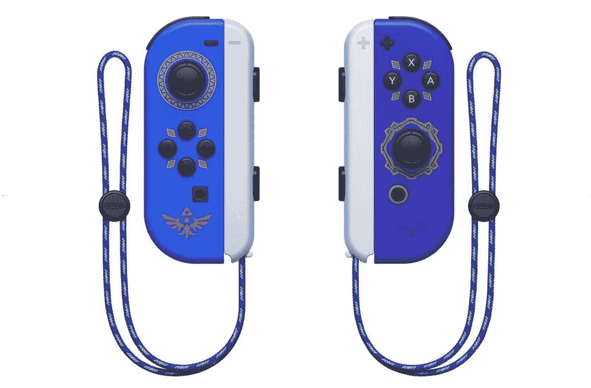
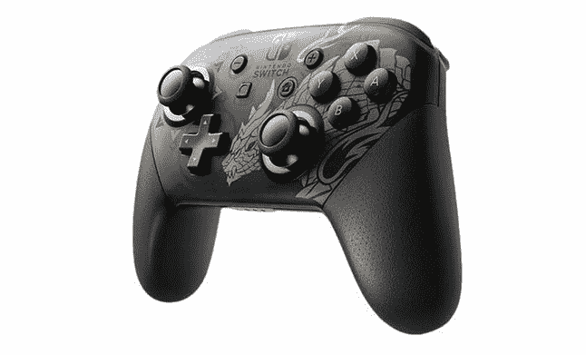
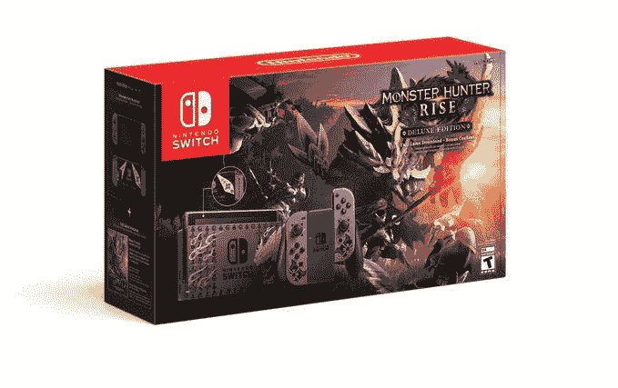

# 任天堂 Direct 推出了新的配件——请在这里预订

> 原文：<https://www.xda-developers.com/nintendo-direct-switch-accessories/>

最新的任天堂 Direct 已经来了又走了，不管你对游戏公告或新的超级粉碎兄弟终极角色感觉如何，是时候购买一些新的任天堂 Switch 配件了。新的 Joy-Cons，Pro 控制器，甚至另一个限量版开关都是待价而沽！Pro 控制器也是我们为系统推荐的[开关控制器之一](https://www.xda-developers.com/best-nintendo-switch-controllers/)，所以你可能不想错过一个特别的！这里是预购的地方。

让我们从每个人都想要的东西开始吧——特殊的天空之剑。任天堂 Direct 发布了 Wii Zelda 游戏的重制版，同时发布的还有特别的蓝色和紫色的游戏。欢乐合唱团也装饰有塞尔达传说的图像。很整洁！

这些游戏可能是任天堂直销产品中最受欢迎的，所以你会想在它们有货的时候抓住它们。当你去看商店页面时，它们也可能缺货。一定要报名股票通知！以下是目前您可以预购这些玩具的零售商:

 <picture></picture> 

Skyward Sword HD Edition Joy-Cons

##### 天空之剑高清版

 <picture></picture> 

Skyward Sword HD Edition Joy-Cons

##### 天空之剑高清版

 <picture></picture> 

Skyward Sword HD Edition Joy-Cons

##### 天空之剑高清版

如果你是一个怪物猎人的粉丝，我相信你对下个月下旬发布的怪物猎人:崛起感到兴奋。你可能会更兴奋，然后，得知一些开关配件来庆祝游戏的发布了！有一个售价 75 美元的专业控制器，上面有一个新的金色野兽。控制器本身仍然是黑色的，所以它比 Joy-Cons 更少出现在你的面前，但它仍然很好看！

 <picture></picture> 

Switch Pro Controller (Monster Hunter Rise)

##### 开关专业控制器(怪物猎人崛起)

 <picture></picture> 

Switch Pro Controller (Monster Hunter Rise)

##### 开关专业控制器(怪物猎人崛起)

 <picture></picture> 

Switch Pro Controller (Monster Hunter Rise)

##### 开关专业控制器(怪物猎人崛起)

不过，玩 Rise 需要开关吗？嗯，有一个特别的套装非常适合你！任天堂 Switch 怪物猎人崛起豪华版比其他开关贵一点，价格为 370 美元，但与[红蓝马里奥版](https://www.xda-developers.com/nintendo-switch-mario-edition/)和动物穿越版开关不同，你将获得游戏副本和奖励内容。一点都不差！这也不仅仅是一个普通的灰色开关，因为开关的背面、码头和游乐设施都有怪物猎人主题的贴花。dock 上的设计也与上面 Pro 控制器上的设计相似！

虽然这很难推荐给那些已经有一个开关的人，但对于还没有抓住任天堂游戏机的怪物猎人粉丝来说，这绝对是一个很好的选择。

 <picture></picture> 

Nintendo Switch Monster Hunter Rise Deluxe Edition

 <picture></picture> 

Nintendo Switch Monster Hunter Rise Deluxe Edition

 <picture></picture> 

Nintendo Switch Monster Hunter Rise Deluxe Edition

你选择哪个开关配件？请在评论中告诉我们！