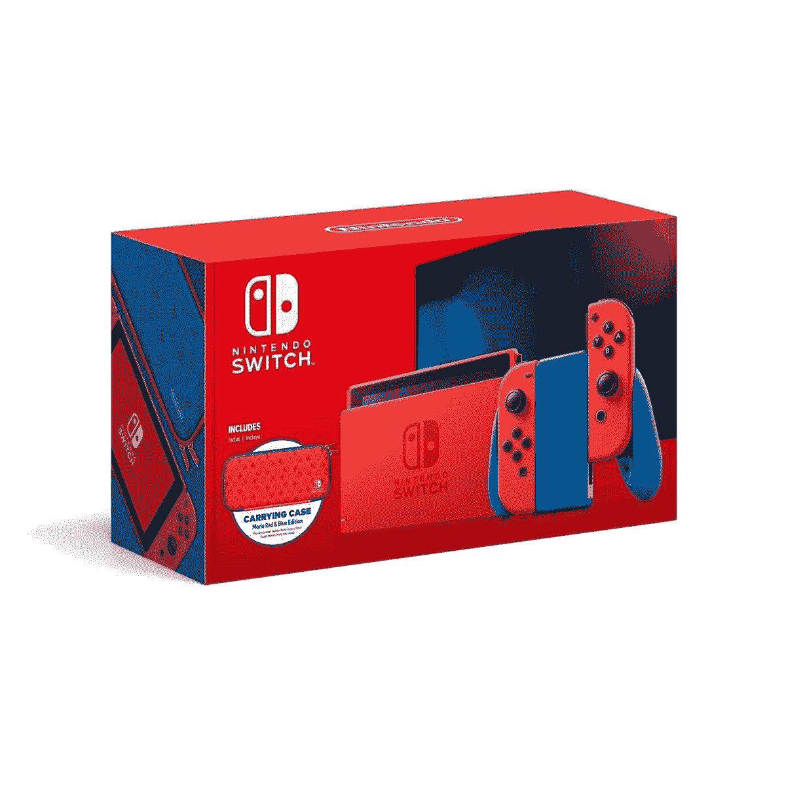
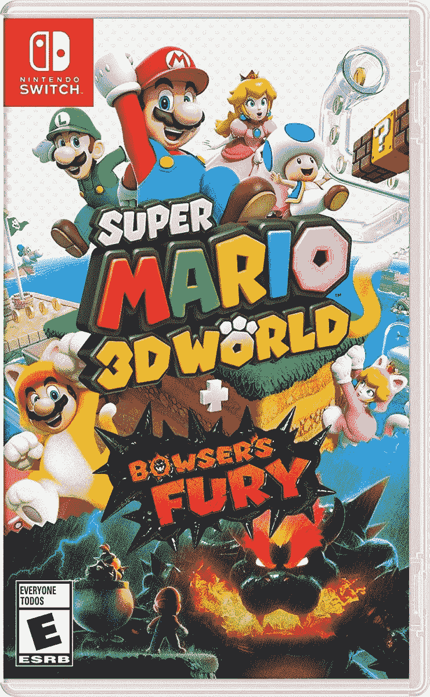

# 在这里你可以买到任天堂 Switch 马里奥版！

> 原文：<https://www.xda-developers.com/nintendo-switch-mario-edition/>

为了纪念马里奥 35 周年，任天堂发布了一款特别的红蓝马里奥版任天堂 Switch。主机使用马里奥标志性的红色和蓝色，真正让它流行起来。控制台看起来很整洁！虽然任天堂还没有宣布是否限量发售，但你不想让你的购买碰运气，对吗？不要担心，我们已经收集了以下销售最新交换机的零售商。

与特别版[动物穿越开关](https://shop-links.co/1732012654171470941?u1=b6b78a3d-c028-4a57-99ab-53400d5ee20a)相比，特别的红蓝配色开关的有趣之处在于，整个控制台是不同的颜色。开关本身是具有讽刺意味的马里奥红色，配有红色的 Joy-Cons(不要与[超级马里奥奥德赛红色 Joy-Cons](https://www.amazon.com/Nintendo-Switch-Joy-Japan-Super-Odyssey/dp/B077Z9FJ2S?tag=xda-dfung1d-20&ascsubtag=UUxdaUeUpU834&asc_refurl=https%3A%2F%2Fwww.xda-developers.com%2Fnintendo-switch-mario-edition%2F&asc_campaign=Short-Term) 混淆，后者更暗)和红色的开关基座。是啊，这是...挺红的！不过，Joy-Con 的持有者是蓝色的，这有助于打破红色配色。

这个版本还配有一个以马里奥为主题的便携包和一个屏幕保护器。由于这个 Switch 版本仍然是 300 美元，它实际上比其他 Switch 版本便宜一些。然而，[任天堂旅行箱](https://www.xda-developers.com/best-nintendo-switch-travel-case/)和[屏幕保护套](https://www.xda-developers.com/best-nintendo-switch-screen-protectors/)并不贵。因此，你可能会想根据你是否喜欢它的外观来决定你是否购买这个特殊的 Switch 版本。

在美国，你可以从这些零售商那里买到这种新开关。很难说是否会出现对游戏机的大规模抢购——虽然 Switch 的库存在过去几个月里已经持平，但红蓝马里奥版 Switch 的限量版还不得而知。所以如果你想要的话，一定要尽快拿到一个！

 <picture></picture> 

Nintendo Switch Mario Edition at Amazon

 <picture></picture> 

Nintendo Switch Mario Edition at Amazon

 <picture></picture> 

Nintendo Switch Mario Edition at Amazon

 <picture></picture> 

Nintendo Switch Mario Edition at Amazon

 <picture></picture> 

Nintendo Switch Mario Edition at Amazon

顺便说一下，这种特殊的红蓝版开关将与新的马里奥游戏一起发布，或者更确切地说，是 Wii U 游戏的扩展端口——超级马里奥 3D 世界+布瑟的愤怒。这个开关不附带任何免费游戏，所以如果你需要在设备上玩的东西，你最好开始使用最新的！

 <picture></picture> 

Super Mario 3D World + Bowser's Fury

##### 超级马里奥 3D 世界+布瑟之怒

在上享受 Wii U classic...好吧，说实话，一个你真正拥有的控制台！超级马里奥 3D 世界+布瑟的愤怒港口新内容的标题。