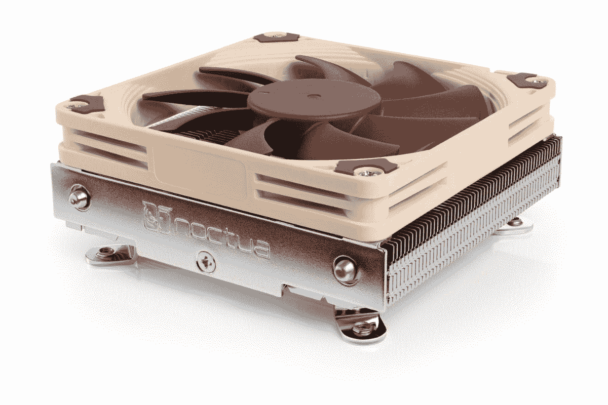
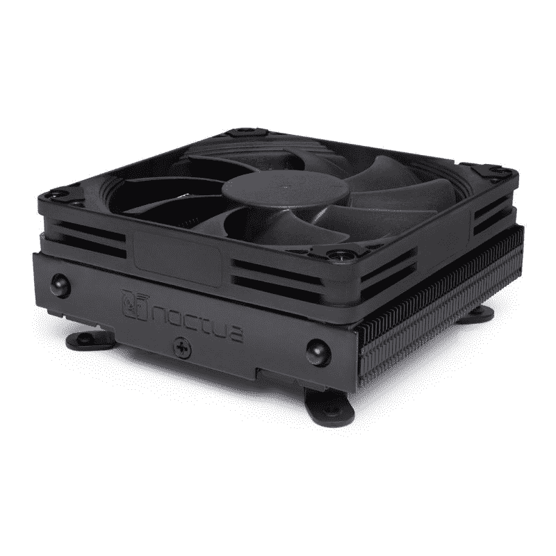
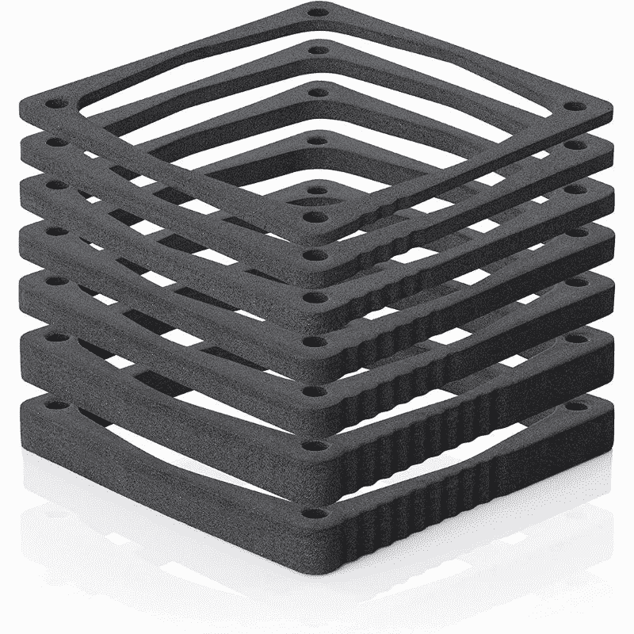

# Noctua 的 NH-L9i-17xx 冷却器为英特尔阿尔德湖带来低姿态冷却

> 原文：<https://www.xda-developers.com/noctua-nh-l9i-17xx-coolers-low-profile-cooling-intel-alder-lake/>

# Noctua 的新 NH-L9i-17xx 冷却器为英特尔阿尔德湖 CPU 带来了低调的冷却

Noctua 推出了新的 NH-L9i-17xx 低姿态冷却器，以扩展其用于新的英特尔 Alder Lake CPUs 的空气冷却器系列。

Noctua 凭借其卓越品质的空气冷却器在 PC 硬件领域掀起了波澜。少数 Noctua 冷却器已经成为我们收集的市场上你能买到的最好的 CPU 冷却器。嗯，该公司正在进一步扩大其空气冷却器系列，增加了两个新的低姿态 CPU 冷却器。Noctua 将把 NH-L9i-17xx 和 NH-L9i-17xx chromax.black 带到[英特尔最新的第 12 代 Alder Lake CPU](https://www.xda-developers.com/intel-alder-lake-review/)。这些低调的 CPU 冷却器，对于那些不知道的人来说，非常适合构建紧凑型 HTPCs 和小型(SFF)PC。

## Noctua NH-L9i-17xx 和 NH-L9i-17xx chromax.black

NH-L9i-17xx 配备了一个 NOC tua NF-a9x 14 92 毫米风扇，支持通过 PWM 自动控制风扇速度。作为最终用户，您可以根据您选择的声音模式来修改风扇速度。在安静的环境中运行系统非常方便。在典型的 Noctua 时尚中，由于 NA-RC7 低噪音适配器(L.N.A ),风扇运行非常安静。对于那些不太喜欢 Noctua 双色设计的人来说，[NH-L9i-17xx](https://noctua.at/en/noctua-introduces-nh-l9i-low-profile-cpu-coolers-for-lga1700-and-na-fd1-fan-duct)chromax . black 本质上是具有全黑美学的 NH-L9i-17xx。

NH-L9i-17xx 的薄型设计允许风扇远离您的 RAM 和 PCIe 组件。这对于采用紧凑主板的小型电脑来说至关重要。这种特殊的冷却器利用了 Noctua 定制设计的 SecuFirm2 安装系统，这意味着它易于安装，并且通过正确的安装支架与多种插座兼容。新的 Noctua NH-L9i-17xx 是 LGA 1700 专用的冷却器，它将直接成为我们为 [LGA 1700 插座](https://www.xda-developers.com/cpu-coolers-socket-lga-1700/)推荐的 CPU 冷却器。

## Noctua NA-FD1 导管套件

除了几个新的低姿态 CPU 冷却器，Noctua 还推出了一个新的风扇导管附件套件。顾名思义，这个特殊的配件创造了一个走廊，将空气推到外面。它弥合了风扇和穿孔机箱面板之间的间隙，提高了冷却性能。Noctua 表示，新的管道套件可以将工作温度降低 5°C 或更多，这非常好。导管由 EVA 泡沫垫片制成，可以 1 毫米的增量堆叠。这些管道堆叠在一起，最大高度可达 45 毫米。

## 定价和可用性

新的 NH-L9i-17xx 和 NH-L9i-17xx chromax.black 风扇和 NA-FD1 导管套件附件已经可供购买。Noctua 建议 NH-L9i-17xx 的零售价为 44.90 美元，全黑的 NH-L9i-17xx chromax.black 的零售价为 54.90 美元。另一方面，NA-FD1 导管套件的零售价为 12.90 美元。请记住，NH-L9i-17xx 是 LGA 1700 专用型冷却器。AMD 用户将不得不购买支持 AM4 插座的 AMD 专用型号。您可以使用以下链接购买新的 Noctua NH-L9i-17xx 冷却器和 NA-FD1 导管套件。

 <picture></picture> 

Noctua NH-L9i-17xx CPU Cooler

##### 诺克图阿 NH-L9i-17xx

Noctua NH-L9i-17xx 是一款薄型空气冷却器，适用于紧凑型 HTPCs 和小型(SFF)产品。这是原 NH-L9i 冷却器的 LGA 1700 专用版本。

 <picture></picture> 

Noctua NH-L9i-17xx chromax.black CPU Cooler

##### 诺克图阿 NH-L9i-17xx

Noctua NH-L9i-17xx chromax.black 是标准 NH-L9i-17xx 空气冷却器的全黑色变体。这也是原 NH-L9i 冷却器的 LGA 1700 专用版本。

 <picture></picture> 

Noctua NA-FD1 Duct kit

##### Noctua NA-FD1 导管套件

Noctua NA-FD1 导管套件附件可用于创建一个走廊，让热空气直接离开机箱。您可以以 1 毫米为增量将管道堆叠在一起，最大高度可达 45 毫米。