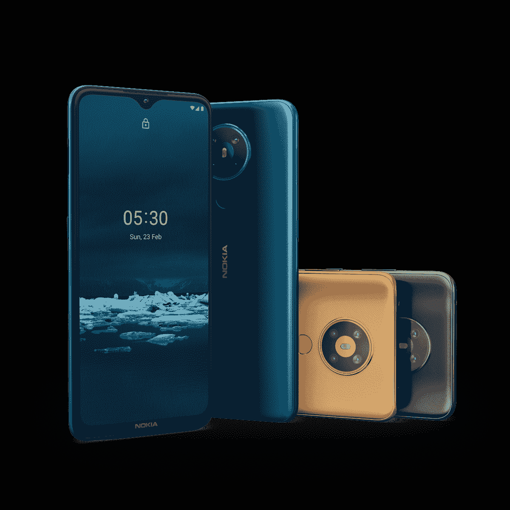

# Android One 让诺基亚 5.3 在印度廉价手机市场脱颖而出

> 原文：<https://www.xda-developers.com/nokia-5-3-pure-android-one-user-experience-review/>

诺基亚 5.3 是首批因新冠肺炎而推迟发布的智能手机[之一，紧随 2016 年后推出的其他诺基亚品牌设备的脚步。由于 HMD Global 对谷歌 Android One 计划的承诺，它提供了相对纯粹的 Android 软件体验。最近，诺基亚 5.3 在印度](https://www.xda-developers.com/nokia-8-3-5g-nokia-5-3-nokia-1-3-announced/)推出[，在印度，智能手机公司经常采用一种令人讨厌的方法让智能手机更实惠——](https://www.xda-developers.com/nokia-5-3-c3-hmd-global-launch-india/)[在系统应用](https://www.xda-developers.com/xiaomi-miui-ads-hamper-user-experience/)中提供令人讨厌的广告。然而，HMD Global 的智能手机为用户提供了一个独特的主张；例如，诺基亚 5.3 以₹13,999 的价格带来了无臃肿软件、无广告的安卓体验，同时软件更新承诺比同价位的智能手机持续时间长得多。

2016 年 12 月，在中断两年多之后，诺基亚品牌重新出现在智能手机市场。这种中断是由于微软在 2014 年收购了诺基亚的手机业务——曾经是世界上最大的手机相关实体——并最终将其清算。这些事件是该公司领导层错误选择的结果，其中最糟糕的可能是在行业其他人都倾向于 Android 时，选择坚持使用 Windows Mobile 作为首选操作系统。当芬兰初创公司 HMD Global(由诺基亚移动部门的前员工组成)需要重振诺基亚品牌时，这个决定非常明确。他们不会——再一次——忽视 Android 已经成为的巨大力量！

HMD Global 承诺，在他们将诺基亚智能手机品牌重新引入市场一年后，将根据谷歌的 Android One 计划发运设备。标志着他们进入 Android One 俱乐部的关键设备包括[诺基亚 6 (2018)](https://www.xda-developers.com/nokia-6-2018-official-snapdragon-630-soc-bothie-camera-mode-ozo-audio/) 和[诺基亚 7 Plus](https://www.xda-developers.com/nokia-8-sirocco-nokia-7-plus-nokia-6-nokia-1-8110-reloaded/) 。自那以后，诺基亚品牌一直与纯粹的 Android 体验保持一致，成为与谷歌和 Android One 品牌相关的最大品牌之一。诺基亚 5.3 保证了未来两年的 Android 版本更新和一年的安全更新，保证了长期的软件支持。

在更详细地解释这一点的重要性之前，我们先来看看诺基亚 5.3 在规范方面提供了什么:

### 诺基亚 5.3 规格

| 

规格

 | 

诺基亚 5.3

 |
| --- | --- |
| **尺寸&重量** |  |
| **显示** |  |
| **SoC** | 八核骁龙 665

*   11 纳米
*   4 个 2GHz Kryo 260 + 4 个 1.8GHz Kryo 260
*   Adreno 610 GPU

 |
| **风筒&储存** |  |
| **电池&充电** |  |
| **后置摄像头** | 

*   **主:**1300 万像素后置摄像头，f/1.8 光圈
*   **辅助:** 5MP 广角摄像头
*   2MP 深度传感器
*   2MP 宏观传感器

**视频:** |
| **前置摄像头** | 800 万像素前置摄像头，f/2.0 光圈 |
| **港口** | USB 类型-C |
| **安全** |  |
| **连通性** |  |
| **安卓版本** |  |

## Android One 如何让诺基亚 5.3 与众不同

Android 作为一个开源操作系统的好处在于，你可以体验到不同的味道。市场上有各种各样的定制 Android 软件体验，其中一些最常见的包括小米的 MIUI、一加的 OxygenOS、三星的 One UI、OPPO 的 ColorOS、华为的 EMUI 等等。每一个定制的 Android 版本都在视觉和功能上增加了不同的组件和功能。但与此同时，一个相对被低估的 Android 版本是通常所说的香草或股票 Android。

简而言之，用户通常所说的普通 Android，通常被认为是 Android 的准系统版本，从 AOSP (Android 开源项目)代码到一些基本应用程序，如 Gmail，Photos，Maps，YouTube 等，几乎没有任何视觉变化。来自谷歌。与原始设备制造商广泛个性化的 Android 版本不同，传统的 Android 用户界面保持不变，没有改变谷歌的初衷。虽然预装应用的设置可能会因制造商而异，但一个普通的 Android 用户界面在视觉上与谷歌为自己的 Pixel 智能手机设计的 Android 几乎相同。

根据谷歌的条件和建议，谷歌 Android One 计划下的智能手机用户界面本质上是一套应用程序的股票 Android。某些制造商不是基于开源版本的 Android 开发自己的用户界面，而是与谷歌合作，简单地优化硬件的用户体验。

这些应用程序可能由一些实用程序补充，这些程序符合干净软件体验的要求。HMD Global 的诺基亚 5.3 是 Android One 计划的一部分，也提供了我们刚才讨论的相同的干净体验。

### 没有膨胀软件的干净软件体验

在印度等对价格敏感的市场，许多智能手机制造商竞相以最低的价格提供最好的硬件规格。这些品牌然后通过软件合作伙伴关系，在智能手机上预装第三方应用程序和服务来收回这些成本。预装的第三方应用程序在某种程度上既是广告，也是任何特定应用程序或服务的销售点。

*在优质的小米和 OPPO 设备上预装膨胀软件，而在诺基亚 5.3 的 Android One UI 上没有第三方应用或膨胀软件*

价格较低的用户，尤其是发展中国家的用户，往往缺乏删除这些应用程序所需的技术技能，最终成为这些应用程序的用户。尽管用户可能喜欢这些应用程序和服务，但潜在的担忧是，T2 缺乏用户数据隐私，T4 不信任这些应用程序。

*从左到右:MIUI 中的系统应用，MIUI 中的应用安装建议，三星 One UI 中的提示性推送通知广告*

HMD Global 承诺提供干净的软件体验，这在很大程度上意味着他们忽略了任何第三方应用程序的预安装。对这种方法的看法可能会有所不同——虽然一些用户更喜欢在他们的设备上预装大量的应用程序，但一些人喜欢从头开始。但从数据安全的角度来看，干净的用户界面减少了任何危及用户数据的应用程序的范围。

除了保护用户的数据，Android One 设备还被要求定期获取安全补丁。定期安全更新的承诺确保智能手机能够防御最新的安全漏洞。

### 保证两年的 Android 更新

作为谷歌概述的 Android One 要求的一部分，制造商必须提供至少三年的安全更新保证。同时，Android One 认证的智能手机也必须接受至少两年的 Android 版本更新。

HMD Global 不负众望，及时更新了不同价位的智能手机。最近，他们推出了针对诺基亚 3.1 和诺基亚 5.1 的 Android 10 更新。这两款手机都是在 2018 年年中推出的，并且预装了 Android 8.1 Oreo。这使得 Android 10 成为他们的第二次重大操作系统更新。值得注意的是，诺基亚 3.1——两者中更实惠的选择——是 2018 年少数几款体验 Android 10 的入门级智能手机之一。

HMD Global 最近还宣布了 Android 11 发布的[时间表](https://www.xda-developers.com/hmd-global-nokia-android-11-update-schedule/)，该公告包括诺基亚 8.1 和诺基亚 9 Pureview 等高端设备，诺基亚 7.2 和诺基亚 6.2 等中端设备，甚至诺基亚 2.2 等入门级设备。所有上市的智能手机都运行 Android 9 Pie，这意味着 Android 11 将是他们的第二次操作系统更新。

很少有智能手机制造商能达到 HMD Global 那样的支持水平——比如一加和谷歌，尽管它们维护的设备要少得多。虽然谷歌承诺在 Pixel 设备上进行三次操作系统更新，但一加已经对其智能手机进行了三次连续更新，包括 OnePlus 3/3T 和 OnePlus 5/5T，这两款手机分别更新到 Android 9 Pie 和 Android 10。

值得注意的是，谷歌和一加一直将智能手机定位于高端(或准高端)市场。另一方面，HMD Global 能够在相对更长的时间内保持设备(尤其是低端和中档设备)的最新状态，这一点要优于在类似价格区间竞争的其他制造商。

### Android One 提供了像素级体验，但价格要低得多

Android One 计划最初是为了在低端设备上提供干净的 Android 体验，特别是针对东南亚和非洲等市场。它的发展很大程度上依赖于几个制造商，比如日本的夏普，该公司发布了 Aquos 507SH，具有不错的中档规格。2017 年，谷歌与摩托罗拉合作，在美国发布了由 Google Fi 支持的 Moto X4 Android One Edition，为小米和 HMD Global 等品牌加入这一潮流铺平了道路。虽然其他品牌似乎已经结束了(或者说[忽略了](https://www.xda-developers.com/download-xiaomi-mi-a3-redmi-note-8-pro-official-android-10-update/))合作关系，HMD Global 仍然完全致力于 Android One。

像诺基亚 5.3 这样的设备除了可以享受谷歌的软件支持之外，还能享受其他智能手机可能享受不到的某些好处。除了模仿谷歌 Pixel 智能手机的用户界面，Android One 设备还可以在接收 Pixel 智能手机的功能方面比其他任何设备都要早。谷歌的通话屏幕是一项让谷歌助手代表你与来电者通话的功能，去年专门为选择 Android One 设备而推出。

### “纯粹”可能不是“最好”的 Android 体验

虽然这篇文章主要强调了为什么诺基亚 5.3 的 Android 体验最接近谷歌希望用户体验的东西，但我们并不认为“纯粹的”Android 体验也是“最好的”体验。Android 的开源特性允许不同的制造商为他们的用户提供不同的定制体验。大多数情况下，这些定制用户体验成为公司的卖点，甚至对他们的身份至关重要。除了视觉上的增强，品牌也增加他们自己的功能，或者[用功能更丰富的版本](https://www.xda-developers.com/miui-10-beta-digital-wellbeing/)取代谷歌的应用，以确保消费者的忠诚度。在某些使用案例中，这可以超越营销，实际上意味着用户可以获得比普通 Android 更好的功能，从而导致*非常明显的*消费者粘性。

另一方面，安卓系统并不是一个品牌的专属，这让用户不必再坚持使用熟悉的品牌。他们可以使用不同品牌的智能手机，如 HMD Global、摩托罗拉、谷歌、华硕等。—没有任何显著的学习曲线。

总的来说，不同风格的 Android 提供了一些独特的特征来吸引和吸引用户。股票 Android，更具体地说是 Android One，通过确保一个无膨胀的界面，谷歌的一些 Pixel 软件功能，以及保证至少两代 Android 版本的交付来实现这一点。

## 诺基亚 5.3:注定要比竞争更持久

可以理解的是，诺基亚 5.3 比印度其他运行类似硬件的智能手机价格更高。其₹13,999 价位的竞争对手包括[红米 Note 9 Pro](https://www.xda-developers.com/tag/redmi-note9pro/) 、 [POCO M2 Pro](https://www.xda-developers.com/tag/poco-m2pro/) 、 [Realme Narzo 20 Pro](https://www.xda-developers.com/realme-narzo-20-narzo-20-pro-narzo-20a-launched-india/) 、[三星 Galaxy M21](https://www.xda-developers.com/tag/samsung-galaxym21/) 等。在硬件方面，每款手机都比诺基亚 5.3 有明显的优势 Redmi 和 POCO 手机采用了更强大的处理器，Narzo 采用了更快的充电速度和 90Hz 的显示屏，Galaxy M21 提供了更大的 6000mAh 电池和 AMOLED 显示屏。

撇开短跑和马拉松的比喻不谈，这些手机都没有提供 HMD Global 为诺基亚 5.3 提供的软件体验和更新保证，这使得它成为任何寻求更长时间使用手机的用户的绝佳选择。

 <picture></picture> 

Nokia 5.3

##### 诺基亚 5.3

诺基亚 5.3 承诺了一个干净和没有膨胀的 Android 体验，在这个价格区间是罕见的。