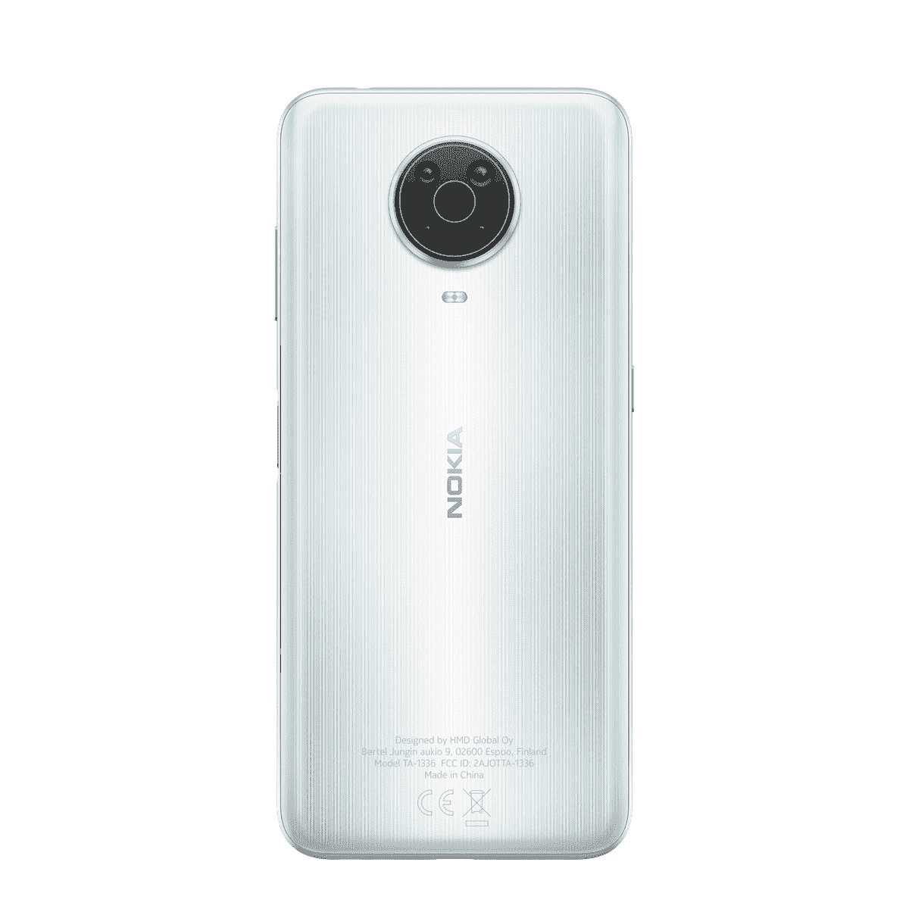

# HMD Global 的经济型诺基亚 G20 在印度上市

> 原文：<https://www.xda-developers.com/nokia-g20-goes-on-sale-in-india/>

# HMD Global 最新的经济型诺基亚手机现在在印度销售

如果你打算购买诺基亚 G20 峰会，从今天开始，你可以从亚马逊和诺基亚的网站上买到。

诺基亚 G20 是 HMD Global 最新推出的经济型智能手机。早在四月它就被公之于众，五月登陆欧洲，一个月后[登陆美国](https://www.xda-developers.com/nokia-g20-launch-us/)。本月早些时候，它进入了印度市场，今天它终于开始在全国销售。

如果你打算购买诺基亚 G20 峰会，从今天开始，你可以从亚马逊和诺基亚的网站上买到。这款手机有两种颜色:夜蓝和冰川银，并有一个 4GB + 64GB 的内存版本。这款手机在₹12,990 定价，但是你可以在有限的时间内在亚马逊和诺基亚网站上享受₹500 早鸟折扣。同时，购买诺基亚 G20 和诺基亚 Power 耳塞的用户可以享受₹2099 优惠。

 <picture></picture> 

Nokia G20

诺基亚 G20 提供 6.5 英寸显示屏、联发科 G35 SoC、4GB RAM、四摄像头和近乎库存的 Android 体验，并承诺及时更新软件。

**[诺基亚 G20 XDA 论坛](https://forum.xda-developers.com/f/nokia-g10-g20.12217/)**

提醒一下，诺基亚 G20 是 HMD Global 的一款低预算智能手机。它配备了 6.5 英寸高清+液晶显示器、联发科 Helio G35 SoC、4GB 内存、四后置摄像头、5050 毫安时电池，并运行接近库存版本的 Android 11。与来自摩托罗拉和 Realme 的 Redmi Note 10 和其他类似价格的手机相比，诺基亚 G20 无疑给人留下了印象。然而，干净的软件和 Android 13 之前的更新承诺让这款手机在竞争中占据优势。

## 诺基亚 20 国集团:规格

| 

规格

 | 

诺基亚 20 国集团

 |
| --- | --- |
| **尺寸和重量** |  |
| **显示** | 

*   6.5 英寸
*   1600 x 720 高清以上
*   60Hz 刷新率
*   20:9 宽高比
*   水滴凹口

 |
| **SoC** | 

*   联发科 Helio G35 SoC
    *   8 倍 ARM Cortex-A53 @ 2.3GHz
    *   4x 臂皮质-A53 @ 1.5
*   IMG PowerVR GE8320 GPU

 |
| **RAM 和存储器** | 

*   4GB 内存
*   64GB 闪存存储
*   MicroSD 卡支持

 |
| **电池&充电** | 

*   5050 毫安时电池
*   10W 充电

 |
| **后置摄像头** | 

*   主要:4800 万像素主要
*   二级:5MP 超宽
*   第三级:2MP 微距镜头
*   四元镜头:200 万像素深度镜头

 |
| **前置摄像头** |  |
| **端口** | 

*   USB 类端口
*   3.5 毫米耳机插孔

 |
| **连通性** | 

*   4G LTE
*   蓝牙 5.0
*   C 型端口
*   WiFi 802.11 . b/g/n/AC(2.4 GHz+5 GHz)

 |
| **安全** | 侧装式指纹读取器 |
| **软件** | 

*   安卓 11
*   保证更新到 Android 13

 |