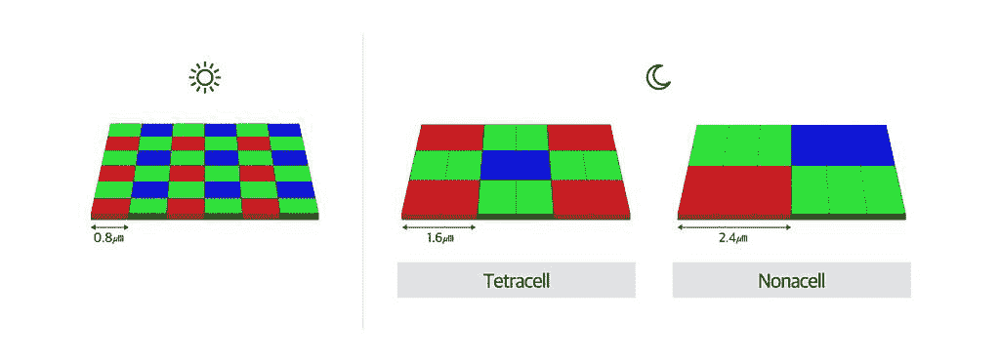

# 诺娜-宁滨和特拉-宁滨解释道:Galaxy S22 相机的这些功能是什么？

> 原文：<https://www.xda-developers.com/nona-binning-tetra-binning-explained/>

像素宁滨是近年来谈论智能手机相机时越来越频繁的一个术语，它与一些手机不断提高的相机分辨率密切相关。如今，大多数 Android 手机都有 48MP、50MP 甚至 108MP 传感器，其中大多数都有某种形式的像素宁滨。例如，三星 Galaxy S22 和 Galaxy S22 Plus 配备了采用 tetra-宁滨技术的 50MP 摄像头，而 Galaxy S22 Ultra 配备了采用 nona-宁滨技术的 108MP 摄像头。但是这一切意味着什么呢？

简单来说，像素宁滨就是将多个像素合成一个像素的行为。你把一组 4 个相邻的像素组成一个 2×2 的阵列(在四宁滨的情况下),然后把它们组合成一个单一的大像素。诺娜-宁滨是一样的，但它不是四个像素，而是在一个 3×3 的阵列中结合了九个像素。这样做是为了提高画质，降低噪点，但这是为什么呢？让我们仔细看看。

## 像素和感光度

一、什么是像素？在相机领域，像素这个词是指代感光点的一种简化方式，感光点是相机传感器上的单个感光区域。这些像素/感光点使相机能够捕捉光线，从而拍摄出照片。像素通常以微米或微米( m) 来度量，但它们的大小可能会有很大差异。相机传感器有数百万个像素(因此有百万像素这个术语)，像素越多，理论上它能产生的图像就越详细。

但是有一个问题。虽然理论上增加像素大小可以增加图像的细节，但将更多像素塞进相同大小的传感器意味着每个像素都需要更小，因此，它无法捕捉更多的光。对于智能手机来说，这些摄像头传感器通常相当小，因此可以放在相对紧凑的机箱中，所以增加更多像素并不总是更好。在某个时候，你开始得到一个有噪声的图像，为了得到一个看起来不错的最终图像，需要做更多的处理。

想想看，现在大多数智能手机相机的分辨率都比专用和专业相机高，但认为它们实际上会更好是疯狂的。专业相机的像素可能更少，但每个像素都要大得多，因此，每个像素都捕捉到更多的光，因此图像更清晰、更明亮。

但在不完全由相机专家组成的智能手机市场，更高的数字对营销和消费者更有吸引力，因此像素数量总是在增加。进入像素宁滨，它允许智能手机获得两个世界的最佳。

## 诺娜宁滨和特拉宁滨

通过像素宁滨，相机可以拥有一个具有大量像素的传感器——如 Galaxy S22 和 Galaxy S22 Plus 中的 50MP，或 Galaxy S22 Ultra 中的 108MP 但它可以组合这些像素以提高感光度。在三星 Galaxy S22 Ultra(和其他手机)的情况下，你会得到一个 108MP 的摄像头，像素大小为 0.8m，但它使用纳米宁滨技术将 3×3 阵列中的 9 个像素合并为一个。这意味着你得到 2.4 米的有效像素大小，因此相机可以为单个像素获得更多的光线信息。

反过来，这种技术也意味着你拍出来的照片最终的分辨率其实要低很多。使用诺娜宁滨，108 百万像素的相机可以拍摄 12 百万像素的图像，这是默认的拍摄模式。不过，你可以选择 108 百万像素的照片，如果你在光线充足的场景中，并且你的手很稳定，那么这可能会很方便，所以你可以用更高的分辨率捕捉详细的图像。

 <picture></picture> 

How tetra-binning and nona-binning work (for the same pixel size) | Image source: Samsung

四宁滨是一个类似的概念，但它不是将九个像素合并成一个像素，而是将四个像素合并成一个 2x2 的阵列。大多数 48MP 或 64MP 智能手机摄像头都是这样做的，三星 Galaxy S22 和 Galaxy S22 Plus 上的 50MP 摄像头也是如此。这不一定更糟，因为它仍然取决于宁滨之前每个像素的大小。例如，Galaxy S22 型号的像素大小为 1 m，因此使用 tetra-宁滨，最终的 1250 万像素照片中的像素为 2 m。这与 Galaxy S22 Ultra 的 12MP 图像的 2.4 米相差不远。

不过，Galaxy S22 Ultra 有一个优势，那就是新的自适应像素功能。这是我们在其他智能手机上没有见过的，它允许手机捕捉完整的 108 百万像素分辨率的图片，同时也获得了诺娜宁滨的好处。从本质上来说，这款相机既可以拍摄 12MP 的像素仓照片，也可以拍摄 108MP 的照片，它将像素仓照片的光线信息与全分辨率照片的细节水平相结合。

最后一个问题是，诺娜宁滨或特拉宁滨是否真的比像素更大、分辨率更低的传感器更好，答案是，这要看情况。我们生活在计算摄影时代，现在与高分辨率传感器相比，拥有一个好的处理算法同样重要，如果不是更重要的话。iPhone 13 Pro Max 拥有 2021 年[最佳相机之一](https://www.xda-developers.com/best-smartphone-cameras/)，并且它明显坚持使用 12MP 传感器，多年来一直如此。但今年所有其他顶级相机都有更高分辨率的传感器，包括三星 Galaxy S21 Ultra 的 108MP 相机。在你亲自尝试之前，使用像素宁滨并不一定能说明相机的质量。

* * *

这就是关于像素宁滨的简单解释，特别是四宁滨和诺娜宁滨。这只是三星 Galaxy S22 系列众多[相机功能中的一个，这是近年来最有趣的 Galaxy S 发布会之一。除了摄像头的改进，Galaxy S22 Ultra 还会有新的处理器、新的软件功能和内置的 S Pen。](https://www.xda-developers.com/samsung-galaxy-s22-series-camera-features/)

如果你想了解更多，请查看我们关于 Galaxy S22 的[实践文章，或者如果你觉得更有趣，请查看](https://www.xda-developers.com/samsung-galaxy-s22-hands-on/) [Galaxy S22 超实践](https://www.xda-developers.com/samsung-galaxy-s22-ultra-hands-on/)。如果你有兴趣购买它们，你可以看看我们关于三星 Galaxy S22 系列的[最佳交易综述。下面也可以买。](https://www.xda-developers.com/best-samsung-galaxy-s22-deals/)

 <picture></picture> 

Samsung Galaxy S22

三星 Galaxy S22 有三个摄像头，主 50MP 摄像头支持 tetra-宁滨技术。

 <picture></picture> 

Samsung Galaxy S22 Plus

##### 三星 Galaxy S22 Plus

Galaxy S22 Plus 具有相同的相机设置，支持 tetra-宁滨。

 <picture></picture> 

Samsung Galaxy S22  Ultra

Galaxy S22 Ultra 拥有最好的摄像头设置，有四个摄像头，主 108MP 传感器中有一个宁滨。