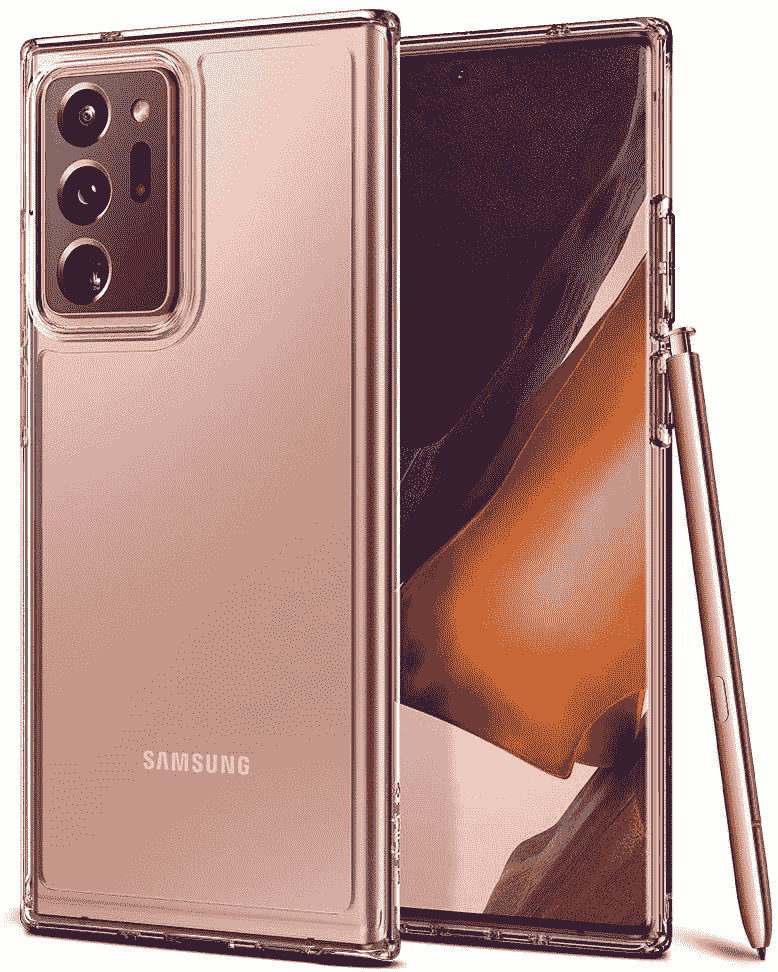

# 三星 Note 20 Ultra 作为亚马逊的今日交易节省 375 美元！

> 原文：<https://www.xda-developers.com/note-20-ultra-dotd/>

# 快点！三星 Note 20 Ultra 节省 375 美元，成为亚马逊的今日交易

三星 Note 20 Ultra 比亚马逊便宜 375 美元！不过，你需要抓紧时间，因为这是亚马逊当天的交易，明天就会消失。

本周有很多不可思议的单日交易，今天也不例外！亚马逊的今日交易是三星 Note 20 Ultra 5G，我们对智能手机的评论非常热烈。你可以在手机的神秘黑色或神秘古铜色配色上节省 375 美元，但折扣仅在当天结束前有效！

你可能想知道随着[三星 Galaxy S21](https://www.xda-developers.com/samsung-galaxy-s21/) 旗舰智能手机的发布，Note 20 Ultra 是否仍然值得购买。答案比是或不是要复杂一点(这就是为什么我们有 [Galaxy S21 对比 Note 20 Ultra](https://www.xda-developers.com/samsung-galaxy-s21-ultra-vs-galaxy-note-20-ultra/) 的文章！)，但简而言之，这款智能手机仍然引人注目，最重要的是，它肯定会更频繁地上市销售...就像今天一样！

而且 Note 20 Ultra 无论如何都没有过时。除了 Galaxy Z Flip 2，这是三星在 2020 年的最高级别旗舰设备，它在规格和受欢迎程度上都有所表现。虽然 Galaxy S21 Ultra 是技术的前沿，但 Note 20 Ultra 仍然处于领先地位。这款旗舰产品包括一支 S Pen，并内置了一个支架。对于 Galaxy S21 手机，S Pen 只兼容 Ultra，需要单独购买。

亚马逊现在也在进行额外的促销活动。购买三星智能手机可以让你在黑色的三星 Galaxy Buds Pro 上节省 100 美元。如果你需要一副新的，高质量耳塞的建议零售价打五折是很划算的。

无论哪种方式，请确保在当天结束前从亚马逊购买 Note 20 Ultra 以节省费用！

 <picture></picture> 

Spigen Ultra Hybrid Case

##### 三星 Galaxy Note 20 Ultra

亚马逊的今日交易为您的 Note 20 Ultra 5G 节省了 375 美元！您可以将 Galaxy Buds Pro 添加到购物车中，也可以节省 100 美元。

你捡了一个吗？请在评论中告诉我们！