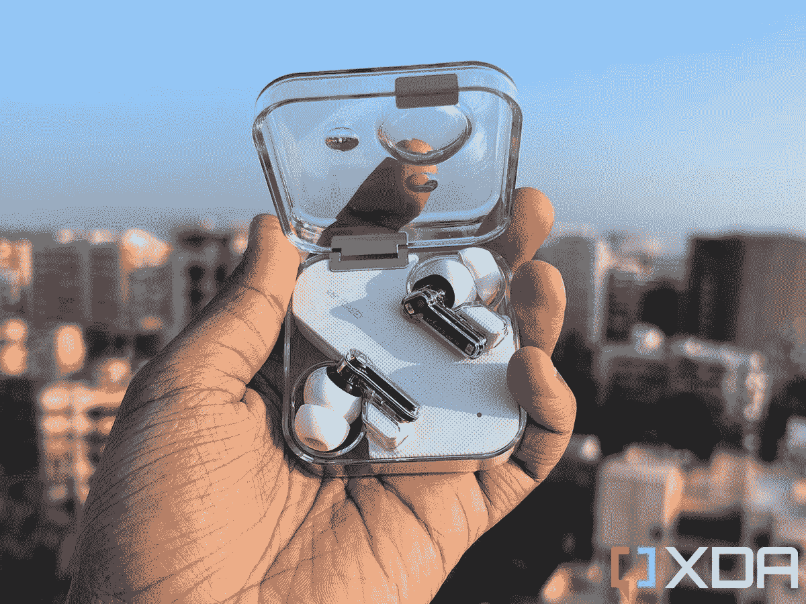

# 没有任何东西以成本增加为由将价格提高 50 美元

> 原文：<https://www.xda-developers.com/nothing-ear-1-price-hike/>

# 没有任何东西以成本增加为由将价格提高 50 美元

Nothing 的首席执行官 Carl Pei 宣布该公司的首款 TWS 耳塞“Nothing Ear 1”提价。请继续阅读，了解更多信息。

 <picture></picture> 

Nothing Ear 1

在 7 月推出首款智能手机后，Nothing 正准备在本月推出另一款无线耳塞。该公司在过去几周内分享了各种耳塞的预告，并确认将于 10 月 26 日正式推出新的 Nothing Ear(棒)。当我们在等待即将到来的 TWS 耳塞时，没有任何东西宣布该公司最初的耳塞 [Nothing Ear 1](https://www.xda-developers.com/nothing-ear-1-review/) 将大幅提价。

Nothing 的首席执行官 Carl Pei 在最近的一条推文中宣布了更新的价格，透露由于成本增加，Ear 1 将从 10 月 26 日起上调至 149 美元。裴在随后的一条推特上解释了价格上涨的原因，*“当我们开始开发它的时候，我们只有 3 名工程师。一年后，我们有 185 个。在此期间，Ear (1)已经收到了 15 个固件和调整更新，与我们推出时完全不同。”*

价格上涨可能会让买家转向其他选择，如价格低于 100 美元的[三星 Galaxy Buds 2](https://www.amazon.com/Wireless-Cancelling-Bluetooth-Lightweight-Lavender/dp/B09424NL98/?tag=xda-17isob7-20&ascsubtag=UUxdaUeUpU44244&asc_refurl=https%3A%2F%2Fwww.xda-developers.com%2Fnothing-ear-1-price-hike%2F&asc_campaign=Short-Term) 或 [Pixel Buds A 系列](https://www.amazon.com/Google-Nest-GA02213-Pixel-Charging/dp/B0977RX58V/?tag=xda-17isob7-20&ascsubtag=UUxdaUeUpU44244&asc_refurl=https%3A%2F%2Fwww.xda-developers.com%2Fnothing-ear-1-price-hike%2F&asc_campaign=Short-Term)。这些选项可以说比 Nothing Ear 1 更好，无论是在音频质量还是(现在的)价格方面。即将推出的 [Ear (stick)](https://www.xda-developers.com/nothing-ear-stick-leaked-renders/) 可能会比 Ear 1 更实惠，因为它可能不会提供 ANC 支持，所以想要没有标志性透明设计的耳塞的买家可能会在本月晚些时候在这个价格范围内获得另一种选择。

请注意，价格上涨并不影响 Nothing 的第一款智能手机——Nothing Phone 1。这款设备在各个市场仍有售，起价为 399 英镑。

你想买一副新的 TWS 耳塞吗？你会选择更新价格的 Nothing Ear 1 吗？请在下面的评论区告诉我们。