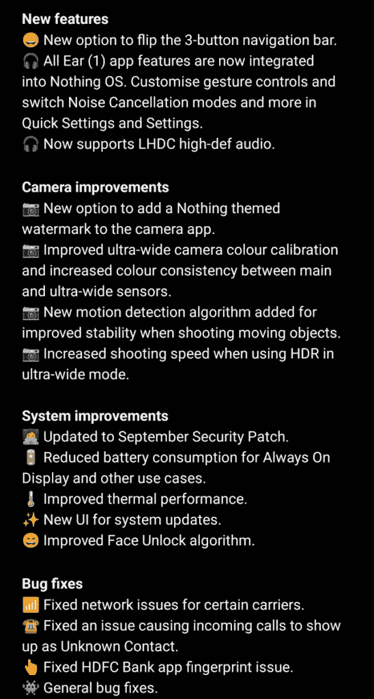

# Nothing OS 1.1.4 更新带来了相机改进、Ear 1 应用集成等等

> 原文：<https://www.xda-developers.com/nothing-os-1-1-4-update/>

本周，Nothing 首席执行官卡尔·佩(Carl Pei)像往常一样搞怪，通过他的 Twitter 账户调侃即将出现的新事物。今天，他宣布了 [Nothing Phone 1](https://www.xda-developers.com/nothing-phone-1-review/) 的新更新，提供了新功能、相机改进和漏洞修复。

**[无事电话 1 XDA 论坛](https://forum.xda-developers.com/f/nothing-phone-1.12585/)**

新的空中下载(OTA)固件更新没有为版本 1.1.4 带来任何操作系统。它提供了令人印象深刻的相机改进，其中最重要的是它为超广角相机带来了改进的颜色校准，现在它与主相机对齐。Nothing 还应用了一种新的运动检测算法，可以在拍摄移动物体时实现更好的稳定性。此外，该公司还提高了超宽相机在 HDR 拍照时的拍摄速度。它还增加了给照片添加无水印的功能。

 <picture></picture> 

Image via Reddit user adaaamb

至于新的东西，现在没有任何东西将 Nothing Ear 1 应用程序的功能直接集成到 Nothing OS 中。这意味着您不再需要导航到 Ear 1 应用程序来控制和自定义无线耳机的设置。此外，这款手机现在将支持 LHDC 高清音频。虽然一个小细节，你现在可以翻转手机上的三按钮导航条。Nothing OS 1.1.4 将采用 2022 年 9 月的 Android 安全更新[并通过优化手机的常亮显示屏来延长电池寿命。虽然没有很多关于手机过热的报告，但它确实提供了改进的热性能，以及改进的面部解锁算法。](https://www.xda-developers.com/september-2022-android-security-update/)

像往常一样，有一些一般性的错误修复，没有 OS 版本 1.1.4 解决某些运营商出现的一些网络问题。它还修复了一个问题，该问题可能导致来电显示为未知联系人，以及 HDFC 银行应用程序的指纹问题。总而言之，这是一个相当大的更新，没有什么保持致力于其手机。它正在推出，所以如果你还没有收到，请耐心等待。像往常一样，可以下载更新，但我们目前没有完整更新包的下载链接。我们会尽快更新这篇文章的链接。

下载:

* * *

**来源** : [卡尔·佩](https://twitter.com/getpeid/status/1571120091793858567)(推特) [adaaamb](https://www.reddit.com/r/NothingTech/comments/xgl85v/nothing_os_114_is_here_ear_1_integration_more/) (Reddit)