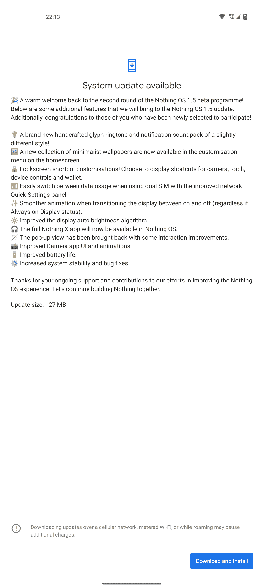

# 没有什么 OS 1.5 公开测试版 2 带来了一系列的增强

> 原文：<https://www.xda-developers.com/nothing-os-15-android-13-open-beta-2/>

看起来基于 Android 13 的 Nothing OS 1.5 的最新更新提前推出了。Nothing 的创始人兼首席执行官卡尔·裴(Carl Pei)在 Twitter 上分享了这一消息，比原计划提前了四天发布。虽然在这个版本中有很多变化，但最大的变化可能是这个版本中，所有的国际固件已经被合并为 T2。如果感兴趣，并且你在测试程序中，你应该很快就会看到更新登陆你的手机，只有 127MB。

 <picture></picture> 

Image via XDA Senior Member [neilphetamine](https://forum.xda-developers.com/m/neilphetamine.1975600/)

虽然您可以查看上图中关于更新的完整注释，但我们也在下面以更清晰的方式提供了它们。

系统更新可用

热烈欢迎回到第二轮的无操作系统 1.5 测试计划！

以下是我们将在 Nothing OS 1.5 更新中带来的一些附加功能。

此外，祝贺你们中新入选的人！

一个全新的手工制作的字形铃声和通知声音包略有不同的风格！

一系列新的极简主义壁纸现已出现在主屏幕的定制菜单中。

锁屏快捷方式定制！选择显示相机、手电筒、设备控制和钱包的快捷方式。

通过改进的网络使用双 SIM 卡时，轻松切换数据使用方式

快速设置面板。

在打开和关闭之间切换显示时，动画更流畅(无论是否

总是处于显示状态)。

改进了显示器自动亮度算法。

完整的 Nothing X 应用现在可以在 Nothing OS 中使用了。

弹出视图已经恢复，并做了一些交互改进。到改进的相机应用程序 ui 和动画。

延长电池寿命。

增加了系统稳定性和错误修复

感谢您一直以来对我们改善一无所有的努力的支持和贡献

OS 体验。让我们继续一起建造虚无。

更新大小:127 MB

虽然 Nothing 尚未宣布 Nothing OS 1.5 稳定版的发布日期，但如果测试版继续推进而不出现问题，我们最有可能预计它将在 2023 年上半年的某个时候到来。该测试版最近通过该公司的[测试会员计划](https://www.xda-developers.com/nothing-phone-1-us-debut/)向美国人提供，该计划提供对测试版的保证访问，以及 300 美元的一无所有手机 1。

如果你想试用基于 Android 13 的最新测试版 Nothing OS，并且不想在该公司注册，可以通过前往你的 [Nothing Phone 1 更新跟踪器](http://www.xda-developers.com/nothing-phone-1-nothing-os-update-tracker/)来实现。我们也有一个关于[在你的手机上安装更新](http://www.xda-developers.com/how-to-sideload-nothing-os-ota-updates-on-nothing-phone-1/)的方便简单的指南。因为这是测试版，为了安全起见，建议[在开始之前备份你可能有的任何信息](https://www.xda-developers.com/how-to-backup-android/)。当然，如果你有任何问题，你可以通过访问下面的论坛来加入我们的 Nothing Phone 1 社区。

**[无事电话 1 XDA 论坛](https://forum.xda-developers.com/f/nothing-phone-1.12585/)**

* * *

**来源:** [卡尔·佩](https://twitter.com/getpeid/status/1613833388682784768)(推特)