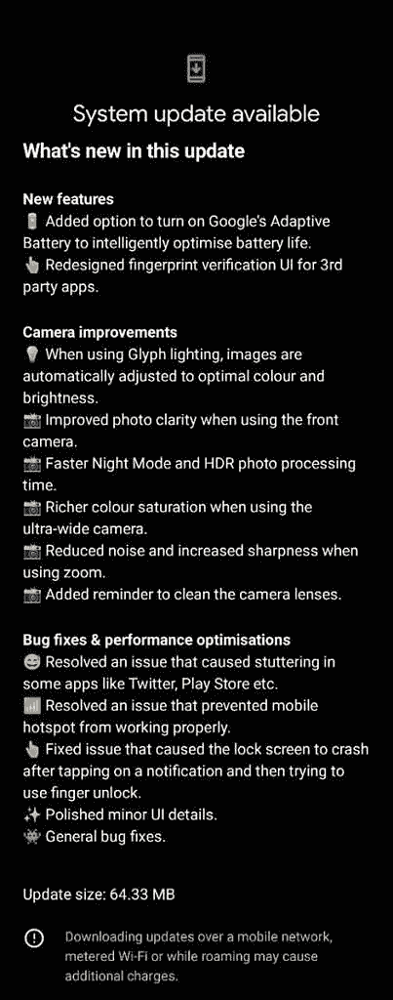

# 没有什么 OS 1.1.3 更新带来可喜的相机改进

> 原文：<https://www.xda-developers.com/nothing-phone-1-gets-nothing-os-1-1-3-update/>

虽然围绕虚无的炒作已经基本平息，但该公司一直埋头苦干，定期提供新的固件版本。今天，[7 月中旬发布的](https://www.xda-developers.com/nothing-phone-1-review/)的 [Nothing Phone 1](https://www.xda-developers.com/nothing-phone-1-review/) 收到了新的空中下载(OTA)固件更新，对相机、UI、性能改进和漏洞修复进行了大量改进。

**[无事电话 1 XDA 论坛](https://forum.xda-developers.com/f/nothing-phone-1.12585/)**

Nothing OS 版本 1.1.3 对手机摄像头进行了多项改进。那些经常自拍的人会很高兴地知道，新的更新提高了使用前置摄像头时照片的清晰度。在夜间模式和 HDR 设置下拍摄的照片和视频的处理时间得到了改善。使用超广角相机拍摄的照片将具有更好的色彩饱和度，当使用变焦时，相机噪音也会降低，清晰度会提高。作为额外的奖励，手机现在会提醒你清洁相机镜头，以防有污迹。

 <picture></picture> 

Screenshot courtesy: Nothing Discord member Exodusnick

该更新还提供了一个重新设计的用户界面，用于在与第三方应用程序一起使用时进行指纹验证。那些希望从手机电池中获得更高性能的人会很高兴地知道，没有任何东西可以启用谷歌的自适应电池选项。谷歌的自适应电池可以学习使用模式，并大大提高电池寿命。此外，还对 Twitter 和谷歌 Play 商店等应用程序造成的口吃问题进行了调整。

以前，手机的移动热点不工作的问题。在最新的更新中，这个问题已经解决。最后，一个当点击通知时导致锁屏崩溃的错误被修复了。除了较小的 UI 更新，还应用了一般的错误修复。64.33MB 更新目前可以通过 OTA 下载。当然，下载更新是可能的，但是你会想要[查看我们的指南](https://www.xda-developers.com/how-to-sideload-nothing-os-ota-updates-on-nothing-phone-1/)，它可以带你在一无所有的手机 1 上完成这个过程。我们目前还没有增量更新的下载链接，但是我们会尽快更新这篇文章。

下载:

*感谢 XDA 资深会员 [j1505243](https://forum.xda-developers.com/m/j1505243.7180076/) 的下载链接！*