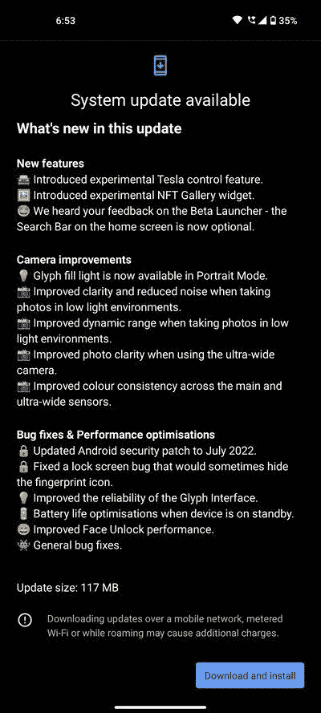

# Nothing Phone 1 更新带来 2022 年 7 月补丁和相机改进

> 原文：<https://www.xda-developers.com/nothing-phone-1-nothing-os-1-1-0-update/>

# Nothing Phone 1 接收不到任何 OS 1.1.0 更新，包含 2022 年 7 月的补丁和相机改进

Nothing 已经开始为 Nothing Phone 1 推出 Nothing OS 1.1.0，带来 2022 年 7 月的安全补丁等等。

一周前，Nothing Phone 1 刚刚发布，但它已经获得了一些新功能和漏洞修复的更新。Nothing OS 1.0.2，即发布日更新，增加了对 HDR10+的支持，并引入了大量与字形界面相关的改进。现在，没有比 OS 1.1.0 更好的了。

**[无事电话 1 XDA 论坛](https://forum.xda-developers.com/f/nothing-phone-1.12585/)**

无操作系统 1.1.0 更新正在逐步推广到世界各地的手机 1 单位。变更日志包括几个修正，包括过多的相机性能调整。最新版本还为大众带来了一个专用的 NFT 画廊小工具和实验性的特斯拉控制功能。最后但同样重要的是，新版本将 Android 安全补丁级别提升至 2022 年 7 月。

 <picture></picture> 

Screenshot credit: Nothing Discord Community member Aakash.bhatt1

这是手机 1 的 Nothing OS 1.1.0 更新的完整变更日志:

*   **新功能**
    *   引入实验性特斯拉控制功能。
    *   推出实验性的 NFT 画廊小工具。
    *   我们听到了你对测试版的反馈——主屏幕上的搜索栏现在是可选的。
*   **摄像头改进**
    *   字形补光现在在肖像模式下可用。
    *   在弱光环境下拍照时，清晰度提高，噪点减少。
    *   改善了在弱光环境下拍照时的动态范围。
    *   使用超宽相机时提高了照片清晰度。
    *   提高主传感器和超宽传感器的颜色一致性。
*   **错误修复&性能优化**
    *   Android 安全补丁更新至 2022 年 7 月。
    *   修正了有时会隐藏指纹图标的锁屏错误。
    *   提高了字形界面的可靠性。
    *   设备待机时的电池寿命优化。
    *   改进了面部解锁性能。
    *   常规错误修复。

 <picture></picture> 

Nothing Phone 1

Nothing Phone 1 是一款外观时尚的手机，拥有炫酷的半透明背面和快速灵活的用户界面。

* * *

## 下载:适用于无手机 1 的无操作系统 1.1.0

如果你手中已经有一部什么都没有的手机 1，那么开始发送更新按钮将是一个好主意，因为相机的改进看起来非常令人印象深刻。如果你还没有收到更新通知，不要担心——我们会提供下载链接，这样你就可以下载新版本，而不用等待 OTA 的推出。

*感谢 XDA 公认开发者 [mlgmxyysd](https://forum.xda-developers.com/m/mlgmxyysd.8430637/) 和 XDA 资深会员 [Some_Random_Username](https://forum.xda-developers.com/m/some_random_username.8234677/) 的下载链接！*