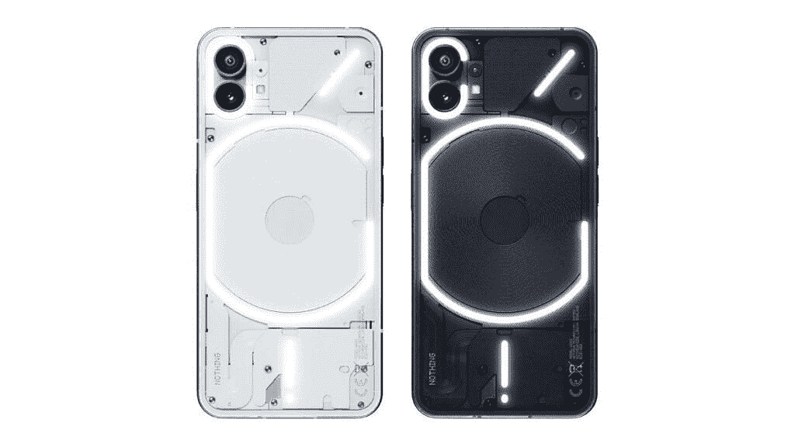
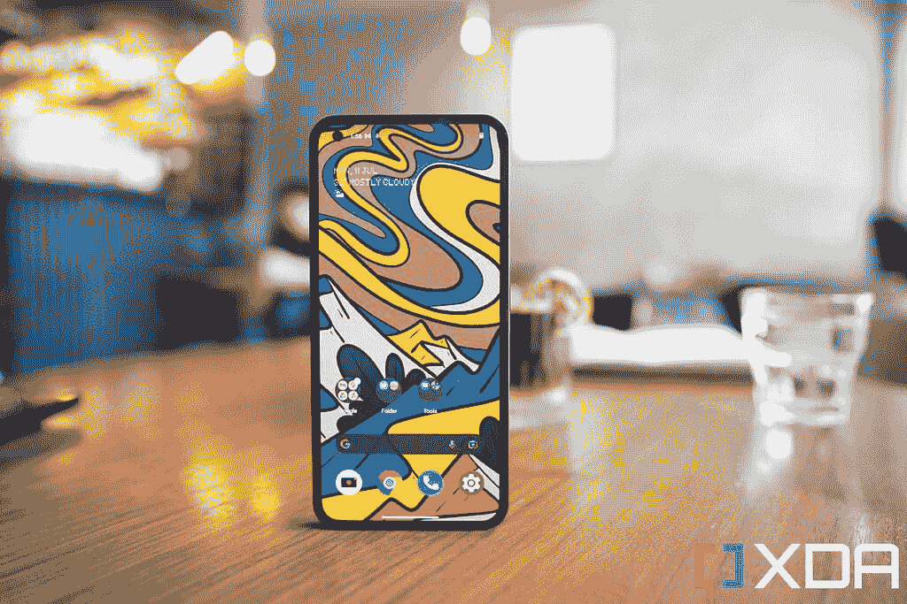
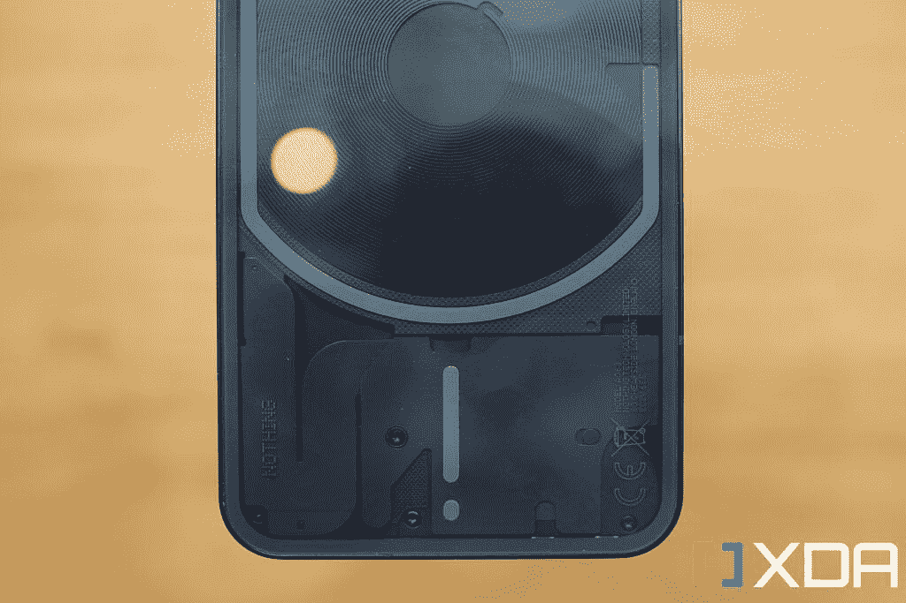
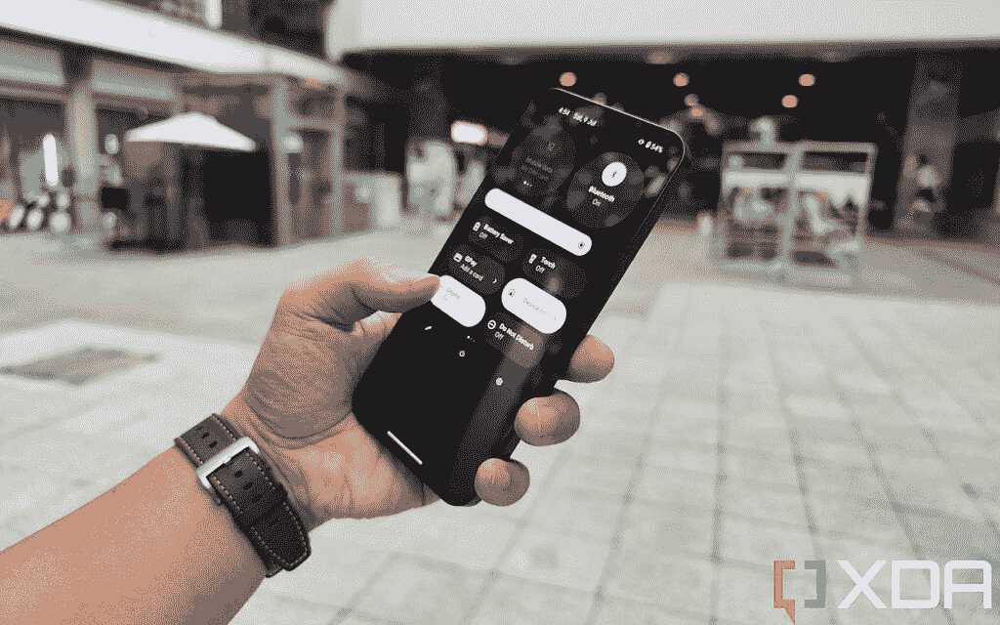

# 无手机 1 回顾:好手机，更好的营销

> 原文：<https://www.xda-developers.com/nothing-phone-1-review/>

我不确定这是否是世界各地的情况，但在美国的体育文化中，粉丝们不仅喜欢争论哪个运动员更好，还喜欢争论哪个运动员得到了恰当的评价。要点是，仅仅优秀是不够的，运动员必须至少和宣传的一样优秀或者更优秀(通常是媒体或者像耐克这样的服装公司)。不符合宣传的结果是可怕的“高估”的绰号，运动员通常会受到批评或嘲笑。

这就是一无所有的手机 1 所发生的事情。它被大肆宣传，以至于我一直在手机上看到来自科技媒体同行的恶评，尽管这是一部*绝对不错的* *手机*价格并不算高。老实说，它的起价为 399 英镑(470 美元)，在我看来没有太多抱怨。有更超值的产品吗？当然，小米的 12 Lite 可以说是一款更好的手机，价格更低，但目前在更多市场上没有什么手机可以买到，它有更干净的安卓软件和不同的原创设计。印度市场竞争更加激烈，这是 Nothing Phone 1 面临更多竞争的地方，所以根据你的需求，你可以这样或那样摇摆。

## 无手机 1:价格和可用性

Nothing Phone 1 将于 7 月 21 日开始在部分市场发售，包括英国、法国、德国、日本、香港、印度、马来西亚、芬兰、葡萄牙等六个国家。英镑、印度卢比和港币的价格如下。

*   8+128GB: 399/₹32,999/HK$3,699
*   8+256 GB:449/₹35,999/ 3999 港元
*   12+256GB: 499/₹38,999/HK$4,399

 <picture></picture> 

Nothing Phone 1

Nothing 的第一款手机带来了华而不实的硬件设计，最少的软件和一个不错的主摄像头。

* * *

## 无手机 1:规格

| 

规格

 | 

无电话 1

 |
| --- | --- |
| **打造** | 

*   IP53 防尘防水
*   颜色:

 |
| **尺寸&重量** | 

*   159.2 x 75.8 x 8.3mm 毫米
*   193.5 克

 |
| **显示** | 

*   6.55 英寸有机发光二极管
*   大猩猩玻璃(没有说明是哪个版本)
*   2400 x 1080
*   120 赫兹
*   1200 尼特峰值亮度
*   HDR10+

 |
| **SoC** | 高通骁龙 778G Plus |
| **闸板&存放** | 

*   8GB + 128GB
*   8GB + 256GB
*   12GB + 256GB

 |
| **电池&充电** | 

*   4500 毫安时
*   33W 有线快速充电支持
*   15W 无线快充支持
*   不含充电器

 |
| **安全** | 显示光学指纹扫描仪 |
| **后置摄像头** | 

*   主要:50MP IMX766，f/1.9，1/1.56 英寸
*   超宽:50MP JN1，f/2.2，114 度视野

 |
| **前置摄像头** | 16MP 自拍相机 |
| **端口** | USB 类型-C |
| **音频** | 立体声扬声器 |
| **连通性** | 

*   5G
*   4G LTE
*   无线网络 6
*   蓝牙 5.2
    *   BLE 音频支持
    *   骁龙声音支持
    *   AAC/LDAC/LHDC/aptX 自适应

 |
| **软件** | Android 12 上没有操作系统 |
| **其他特征** | 字形照明接口 |

***关于这个动手:**没事给我发了个电话 1 来测试。这篇评论是在使用该设备大约七天后撰写的。这篇文章中没有任何内容。*

* * *

## 无手机 1:设计概述

*   整体造型和手感与 iPhone 12/13 Pro Max 非常相似，但略小
*   四面对称的边框——这在安卓手机中很少见
*   透明背面带有灯带，看起来很酷，或者是一种噱头，具体取决于个人观点

## 

Nothing Phone 1 的整体形状和手感*与 iPhone 12 和 13 系列*非常相似，尤其是 Pro Max 手机，侧面非常平坦，圆角也很圆。当你拿着这款手机时，你的手掌感觉主要是铝框架，因为坚硬的角度阻止了手机的背部坐在你的手掌上。Nothing Phone 1 的横向宽度更小，重量更轻，这使得它的握持更加舒适。

我一直直言不讳地说，我觉得拿着 iPhone 12/13 的设计语言不舒服，这里也是一样。平坦的侧面给手机一种成熟、强大的机器氛围，但它不像弯曲的侧面那样柔软地依偎在手掌中。我说的不一定是曲面屏手机，即使是旧的 iPhone X/11 型设计也有圆形的侧面。值得一提的是，小米和 Oppo 最近也发布了侧面平坦的手机，但那些品牌添加了微妙的倒角，以软化锋利的边缘。Nothing Phone 1 没有做到这一点，它走的是整个 iPhone 的路线，手机的两侧以一个突然的 90 度角结束。

这种设计看起来很酷，但拿起来没有弯曲的手机舒服

我想我抱怨的一个很大原因是因为我倾向于裸体使用手机，而一个外壳将显著软化这些平边设计的尖角。

Phone 1 最引人注目的特点显然是背面设计:半透明的外观似乎可以让人一窥手机的内部。我们看到的大部分实际上是一个覆盖手机实际内脏的设计作品，但我们可以看到无线充电线圈和一些精心放置的螺钉。

 <picture></picture> 

The bottom left part of the phone's back design is meant to resemble Manhattan in the New York City subway map.

对一些人来说，背板设计的底部看起来像一头大象，但没有什么告诉我它实际上是根据纽约市地铁图，特别是曼哈顿的图案设计的(左下角部分肯定类似于曼哈顿)。我个人非常喜欢这种外观，中央放置的无线充电线圈的螺旋设计增加了一个漂亮的靶心般的美感，吸引了眼球。

 <picture></picture> 

Nothing Phone 1

### 字形界面

手机背面有四条灯，其中两条分别环绕摄像头模块和无线充电线圈。这就是 Nothing 所说的“字形界面”,灯光并不完全是为了装饰。没有一种设计可以让这些灯为各种智能手机任务闪烁特定的模式，比如当电话铃响、收到通知或谷歌助手被召唤时。据 Nothing 说，随着闪光灯一起播放的声音效果是受经典任天堂娱乐系统和卡西欧电子表的启发，这意味着它们有这种复古的电子产品氛围。如果你想知道他们为什么选择这种特定的“C，正斜杠，G，感叹号”设计，我们实际上不知道为什么。

我可以看到所谓的字形界面对一些人有用。能够为特定的联系人设置特定的灯光模式对于接到很多电话的人来说很有用。还有一个选项，当你把手机面朝下翻转时，可以关闭通知声音，但灯条仍然亮着(没有人把这叫做“翻转到字形”)。这个想法是你可以在拿起电话之前决定通知是否值得检查。

然而，这些情况都不适合我。我几乎不再给任何人打电话，我接的唯一的语音电话来自我的工作主管。我所有的家人和朋友都通过 WhatsApp 短信或语音信息联系我。我也从不觉得有必要把手机面朝下，因为我很少参加查看手机是“不礼貌”的活动。

灯光的亮度可以在设置中进行调整，也可以在光线较暗的情况下用作拍摄照片的补光灯，因为灯光比典型的智能手机手电筒更分散，它照亮人脸的亮度比典型的智能手机手电筒略低。尽管如此，在我看来，在拍摄人脸时，你应该避免使用任何智能手机闪光灯——除非拍摄对象拥有完美无瑕的皮肤纹理，否则这永远不会让人觉得好看。

### 处理器

Nothing Phone 1 由高通骁龙 778G Plus 驱动，这是一款可靠的中端 SoC，足以满足 99%的智能手机用户。没有人说他们选择这款芯片是因为它提供了足够的性能而不会过热，这一点我同意。这个“plus”版本的芯片是一个相对较新的迭代更新，允许它支持无线充电。

### 显示

6.55 英寸的有机发光二极管屏幕充满活力，典型的最大亮度为 500 尼特，峰值最大亮度为 1200 尼特。屏幕大部分时间看起来都很棒，120Hz 的刷新率提供了流畅的动画，颜色看起来很有冲击力，四面都有美观的对称边框。最大亮度比大多数 2022 旗舰手机稍低，但除非我在非常恶劣的晴天使用它，否则这个屏幕亮度是好的。

值得注意的是，显示器不是 LTPO 面板，这意味着刷新率可以是 60 赫兹或 120 赫兹。这意味着屏幕的电池效率不高，但在这个价格范围内也是意料之中的。屏幕下方有一个光学显示指纹扫描仪(类似于一加 9 或 2020 年代 BBK 手机中的扫描仪位置)。位置不理想，但没什么大不了的，相反，我对它的慢速度感到恼火。手机解锁只需要多一拍。请注意，我是在与中国的中档手机进行比较，如小米 12 Lite 或 Oppo Reno 手机，它们都有出色的扫描仪。一些非中国手机，如三星 Galaxy A53，甚至谷歌 Pixel 6 系列，都有糟糕的显示指纹扫描仪，速度甚至更慢。

## 触觉、扬声器、电池和内存

低于 500 美元或 600 美元的手机并不总是保证有好的触觉，谢天谢地，Nothing Phone 1 有一个好的触觉引擎，可以提供强大而精确的触觉。我喜欢在手机打开振动的情况下打字。

同样好的是双扬声器和 UFS 3.1 内存，同样，在这个价位的手机中并不总是有保证。4500 毫安时电池，IP53 防水防尘等级，仅 15W 无线充电，比你在类似价位从其他品牌获得的电池要少一点，但也不错。

* * *

## 无手机 1:相机

*   50MP 索尼 IMX766 主摄像头和 50MP 三星 JN1 超宽
*   主摄像头有能力，超宽也就可以了
*   视频现在有一种奇怪的橙色色调

这款手机内置了与卡尔·裴的前公司一加公司的手机非常相似的摄像头。后置摄像头系统包括一个 50MP 索尼 IMX766 传感器，具有 f/1.9 光圈和一个 50MP 三星 JN1 超宽。前者用于[一加诺德 2T](https://www.xda-developers.com/oneplus-nord-2t-review/) ，后者最近用于[一加 10 Pro](https://www.xda-developers.com/oneplus-10-pro-review/) ，以及其他一些 BBK 手机，如 [Iqoo 9 Pro](https://www.xda-developers.com/iqoo-9-pro-review/) 。

这些是功能强大、久经考验的传感器，但也是稳固的中端组件。例如，IMX766 的图像传感器尺寸仅为 1/1.56 英寸，远小于 [Galaxy S22 Ultra](https://www.xda-developers.com/samsung-galaxy-s22-ultra-review/) 或[小米 12S Ultra](https://www.xda-developers.com/xiaomi-12s-ultra-hands-on/) 的尺寸。但是，我们必须记住，这是一部低于 500 美元的手机。而且没事的软件图像处理也挺好的。

看看这些照片:对于一个首次上市的公司的 470 美元左右的手机来说，一点也不差。

特别是上面的最后两个镜头，并不容易拍摄-它们是明亮的灯光穿过窗户的高对比度镜头，对于一个中等距离的人来说，这确实是很好的动态范围和曝光。

正如中端手机通常的情况一样，当我们转向超宽时，相机显示它确实不是旗舰产品。白天的超广角镜头在真空中也不错，但明显比主相机拍摄的要柔和。而到了晚上，质量差距明显拉大。颜色也发生了重大转变。

说到颜色，我用 Nothing Phone 1 拍摄的一些视频也呈现出非常不稳定的颜色，例如一种极其温暖的色调，使我的肤色看起来像橙色。主摄像头的稳定性很好(就其价格范围而言)，但超宽的电子图像稳定性非常差。当我翻盘的时候也有一点果冻的效果。你可以在下面的视频样本中看到所有的问题。我必须提到，我正在审查手机的预发布模型，在我拥有该设备的一周内，没有任何东西已经发送了两个软件更新，所以也许这些问题可以通过更多的更新来解决。但截至目前，视频性能甚至低于中等水平，因为像小米 12 Lite 这样的产品可以拍摄更好的视频。视频分辨率也达到了 4K/30fps，而不是 60fps 或 8K 选项，但这绝对没问题。

如果你想看我在这里分享的所有照片样本的全尺寸版本，我已经把它们上传到 Flickr 相册了。

* * *

## 无手机 1:性能和软件

*   超级干净的 Android 皮肤，没有第三方膨胀软件
*   流畅的动画(Twitter 应用程序除外)
*   总体表现良好

### 软件

Nothing Phone 1 在 Android 12 上运行一个非常轻便但时尚的 Android 皮肤，名为 Nothing OS。我注意到的关于 Nothing OS 的第一件事是最初的手机设置界面完全是黑色的，包括谷歌注册屏幕。在过去的几年里，我大概经历了 100 次这样的 Android 设置过程，而谷歌的登录界面总是白色的。我认为这种全黑的审美是我的黑色型号特有的，我认为白色型号可能会有一个更传统的白色设置屏幕。

一旦完成设置，你进入了 Nothing OS，你可能会注意到的下一件事是，手机只安装了谷歌的核心应用，没有膨胀软件——或者至少是膨胀软件的传统定义(预装的第三方应用)。实际上，我觉得谷歌越来越大的应用套件既傲慢又烦人。当然，在所有 Android 手机上预装 Google Play、YouTube、Chrome、Google Contacts 和地图是有意义的。但我对谷歌电视、谷歌播放音乐、YouTube 音乐、谷歌 One、谷歌 Home、谷歌 Pay 和谷歌 Duo 毫不在乎，事实上这些应用程序现在都被塞进了最近的安卓手机，其中大多数都无法卸载，这意味着这些仍然是臃肿的软件。这是一个 GMS 问题，而不是一个无关紧要的问题，所以在电话 1 这一端没有投诉。毕竟，与我测试过的所有手机相比，Nothing Phone 1 预装的应用程序最少。唯一预装的非谷歌应用是相机、计算器和录音机应用。

主界面感觉非常类似于典型的股票 Android，只有两处变化。首先是让应用程序图标在主屏幕上看起来很大的能力(见下面的第二张图片)，这对于那些希望一两个应用程序在主屏幕上脱颖而出以方便访问或访问的人来说可能很有用。

另一个是简化了通知阴影中的快捷切换按钮。几乎所有的安卓手机都有单独的 WiFi、蜂窝数据和移动热点按钮。没有什么将这三者结合成一个比通常更大的按钮(见上图中的第三张)，用户可以通过水平滑动来循环。这对我来说很有意义，因为这些都与手机上网有关。我想有些人可能不同意这一点。

在我测试过的所有手机中，Nothing Phone 1 搭载的应用程序最少

深入到设置页面，它看起来也像一个普通的 Android 设置，除了每个设置页面标题都使用了 Nothing 的基于点的字体。据我所知，有两个没有排他性的设置页面是大多数 Android 手机都没有的:“字形界面”和“实验功能”。第一个是你定制界面的地方(分配联系人，改变灯光亮度等)；后者将让手机连接到特斯拉汽车。我认为这项功能还没有准备好，即使准备好了，我也没有特斯拉来测试。

### 一般性能

与三星的 OneUI 相比，Nothing OS 的动画非常流畅，速度明显更快，动画效果更好。它让我想起了很多 OxygenOS 或 Oppo 的 ColorOS，因为即使简单地拉动通知面板也会带来流畅的动画。

然而，就像三星的银河 S22 Ultra 一样，当在推特上滚动时，动画偶尔会口吃。我不确定推特到底有什么问题，但它碰巧在视觉上很不协调。但正如我所说，三星 1200 美元的手机也有同样的问题。另一个问题是手机的自动亮度设置经常会让手机屏幕变得太暗，尤其是当我处于相机模式时。正如我所说，指纹扫描仪比大多数其他光学扫描仪都慢。

自动亮度问题，以及视频中的橙色，是需要解决的主要问题。除此之外，我在接下来的几天里使用手机、在谷歌地图上导航、在 Spotify 上流媒体以及在 Slack 和 WhatsApp 上发送信息都没有遇到任何问题。

至于基准测试，XDA 团队最初有所担心，因为我们的高级技术编辑亚当·康威(Adam Conway)在软件中发现了一行代码，暗示软件考虑操纵基准测试——本质上，是一部手机决定限制现实世界应用的性能，而不是基准测试应用来获得更高的分数——但是在运行包括运行两个版本的极客基准测试(一个官方版本，一个修改版本)在内的测试后，分数非常接近，这意味着没有这种基准测试作弊把戏。太好了。

标准的日常表现一直很好，我一直在家里和镇上使用手机，应用程序也一直运行良好，我没有遇到崩溃或任何不寻常的情况。

电池续航时间不错，4，500 毫安时电池能够轻松完成一个典型的工作日，但在周末我频繁使用手机时，电池续航时间会接近 12 小时。这是一个可以接受的电池，不是很好，也不是很坏。

* * *

## 您应该购买免费电话 1 吗？

**如果出现以下情况，您应该购买 Nothing Phone 1:**

*   你喜欢这个设计，并且发现字形界面很酷或者很有用。
*   您不想为一部手机支付超过 500 美元的费用，并且您不喜欢使用(或无法使用)小米的各种中端手机。
*   你想要一款软件干净的手机，它比普通的安卓手机更有个性。

**如果出现以下情况，您不应购买 Nothing Phone 1:**

*   您用手机拍摄了大量视频，没有时间等待潜在的软件补丁来解决当前的橙色问题。
*   您想要绝对最好的价值，小米 12 Lite 在您所在地区上市。如果您在印度，您还有其他物有所值的选择。

 <picture></picture> 

Nothing Phone 1 in the hand.

正如我所说的，没有电话 1 是一个完美的中档电话与一些有趣的想法。我喜欢透明的背部设计和最小的软件。即使我没有从背面的灯带中得到任何实际的好处，我也认为它们看起来不错。

但是，这是裴和虚无的营销几个月来一直暗示的革命性、不同和独特的设备吗？不。小米的 12 Lite 更便宜，具有相同的 SoC、更好的指纹扫描仪和视频性能。

如果忽略字形接口，Phone 1 几乎和其他任何小米/Poco/Iqoo/Realme 中游侠一样。这并没有错——这些品牌制造出了好的手机——但对于更厌倦/愤世嫉俗/刻薄的技术人员来说，嘲笑和称这款手机被高估是完全公平的。

 <picture></picture> 

Nothing Phone 1

Nothing Phone 1 是一款外观时尚的手机，拥有炫酷的半透明背面和快速灵活的用户界面。