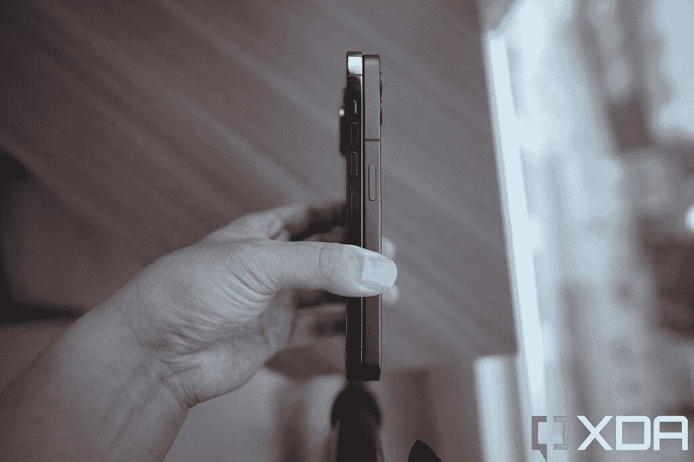
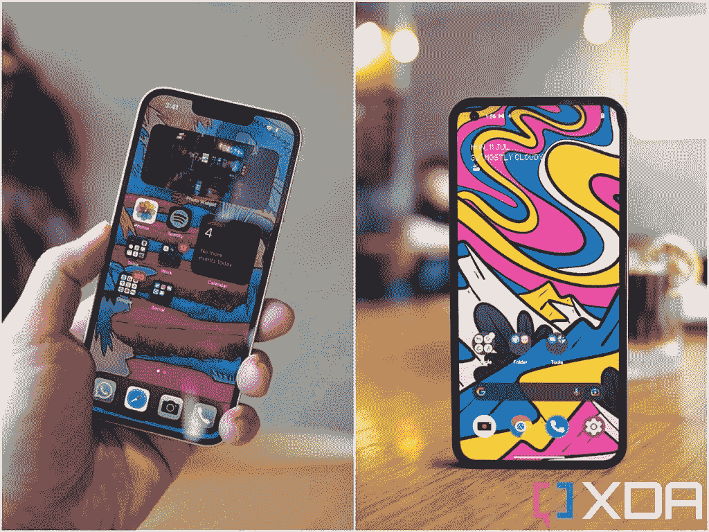

# Nothing Phone 1 vs 苹果 iPhone 13:哪款手机适合你？

> 原文：<https://www.xda-developers.com/nothing-phone-1-vs-apple-iphone-13/>

城里最新的安卓手机看起来既独特又熟悉。这款 [Nothing Phone 1](https://www.xda-developers.com/nothing-phone-1-review/) 的特点是一个引人注目的透明背板，露出一些闪光的光带，但它也有一个与 [iPhone 13](https://www.xda-developers.com/apple-iphone-13-review/) 系列非常相似的整体形状。今天我们来对比一下这两者。

值得注意的是，两款手机之间有近 300 美元的价格差异，但 iPhone 13 是最受欢迎和主流的 iPhone，所以在我们看来，进行比较仍然是合理的。

 <picture></picture> 

Apple iPhone 13

##### 苹果 iPhone 13

iPhone 13 是最主流的 iPhone，理由很充分——它的大小刚好合适，既不像 Pro Max 那样太贵，也不像 Mini 那样太小。

 <picture></picture> 

Nothing Phone 1

Nothing Phone 1 是智能手机的一次非常好的、令人惊讶的完美尝试——也非常有价值。

## 无手机 1 vs 苹果 iPhone 13:规格

| 

**规格**

 | 

**没事电话 1**

 | 

**苹果 iPhone 13**

 |
| --- | --- | --- |
| **构建** | 

*   玻璃背面
*   金属框架

 | 

*   铝制中框
*   玻璃正面和背面
*   前玻璃的“陶瓷护罩”

 |
| **尺寸&重量** | 

*   159.2 x 75.8 x 8.3mm 毫米
*   193.5 克

 | 

*   146.7 毫米 x 71.5mm 毫米 x 7.65mm 毫米
*   174 克

 |
| **显示** | 

*   6.55 英寸有机发光二极管
*   大猩猩玻璃(没有说明是哪个版本)
*   2400 x 1080
*   120 赫兹
*   1200 尼特峰值亮度
*   HDR10+

 | 

*   6.1 英寸超级视网膜 XDR 有机发光二极管
*   2，340 x 1，080 分辨率
*   60Hz 刷新率
*   120Hz 触摸采样速率
*   1300 尼特峰值亮度
*   HDR10
*   真实色调显示

 |
| **SoC** | 

*   高通骁龙 778G Plus

 |  |
| **闸板&存放** | 

*   8GB/12GB LPDDR5 RAM
*   128GB/256GB UFS 3.1 存储

 | 

*   4GB 内存
*   128GB/256GB/512GB

 |
| **电池&充电** | 

*   4500 毫安时
*   33W 有线快速充电支持
*   15W 无线快充支持
*   不含充电器

 | 

*   3240 毫安时
*   高达 20W 的有线充电
*   最高 7.5W 的无线充电
*   MagSafe 充电功率高达 15W

 |
| **安全** | 显示指纹扫描仪 | Face ID |
| **后置摄像头** | 

*   主要:50MP IMX766，f/1.9，1/1.56 英寸
*   超宽:50MP JN1，f/2.2，114 度视野

 | 

*   初级:12MP 宽，f/1.6 光圈，1.6μm
*   次要:12MP 超宽，f/2.4 光圈

 |
| **前置摄像头** | 16MP，f/2.4 | 12MP 原深感摄像头系统 |
| **端口** |  |  |
| **音频** |  |  |
| **连通性** | 

*   5G
*   长期演进
*   无线网络 6
*   蓝牙 5.1

 | 

*   5G(低于 6 GHz 和毫米波)
*   支持 4×4 MIMO 和 LAA 的千兆级 LTE
*   支持 2×2 MIMO 的 Wi-Fi 6 (802.11ax)
*   蓝牙 5.0

 |
| **软件** | 基于 Android 12 的 NothingOS | iOS 15 |
| **其他特性** | 字形照明接口 | 杂志保险箱 |

* * *

## Nothing Phone 1 vs 苹果 iPhone 13:设计和硬件

Nothing Phone 1 采用 6.5 英寸有机发光二极管屏幕，比 iPhone 13 大一点(事实上，它的尺寸更接近 iPhone 13 Pro Max)，但粗糙的手感非常相似。Nothing Phone 1 提供了一个玻璃后盖，四面都是平的铝制框架。边角采用与 iPhone 相同的圆形设计，手感非常相似。(注意:下面的照片是装有 iPhone 13 Pro Max 的 Nothing Phone 1，而不是标准的 iPhone 13 -但它给了你一个好主意，因为 iPhone 13 只是 Pro Max 的一个较小版本)。

 <picture></picture> 

The Nothing Phone 1 (left) with an iPhone 13 Pro Max (right).

当然，Nothing Phone 1 也有前面提到的背面设计:透明的玻璃揭示了手机的“内脏”，只是你看到的大部分东西只是装饰。它们是精心设计的模块化产品，旨在唤起人们对 80 年代复古设备的感觉。背面装有四个 LED 灯条，据说由 700 多个灯组成。这些灯主要用于装饰，但它们也有一些实际用途，如为特定联系人的来电闪烁特定模式(由您自己设置)，或在拍照时用作补光灯。

与此同时，iPhone 13 的设计更加低调，尤其是我测试的纯白款。它拥有 6.1 英寸的有机发光二极管屏幕，比 Nothing Phone 1 更小更轻，重量为 174 克，Nothing Phone 1 的重量为 194 克。

### 显示

将这些手机翻转过来，Nothing Phone 1 的屏幕不可否认地更有吸引力，对称的边框包裹着四周，只有右上角有一个小孔。与此同时，iPhone 13 失去了相当多的屏幕。虽然人们可以很容易地争辩说，凹口带来了 Face ID 形式的优越的生物安全系统。Nothing Phone 1 使用光学显示扫描仪，但与 Android 同行相比，它有点慢。如果我没有戴面具，我解锁 iPhone 13 比解锁一无所有的手机 1 更容易。

 <picture></picture> 

iPhone 13 (left) and Nothing Phone 1 (right).

重要的是，Nothing Phone 1 显示屏刷新高达 120Hz，而 iPhone 13 只是一个 60Hz 的面板。随着 2022 年下半年的临近，不可否认的是，60Hz 面板在移动领域有点过时。

### 社会学

iPhone 13 在处理能力上明显胜出，因为它运行的是苹果的 A15 Bionic，比支持 Nothing Phone 1 的高通骁龙 778G Plus 芯片强大得多。然而，这些能力差异只会在真正密集的任务中表现出来，如编辑和导出 4K 视频，或进行各种 iPhone 机器学习任务，如对视频应用人工散景，或通过几次点击和滑动在几秒钟内快速从静止图像中移除背景。但我认为这些更适合有创造力的人。只需要一部手机来发送电子邮件、浏览网站、观看视频和浏览社交媒体的普通人不会注意到这种功率差异。

### **摄像机**

iPhone 13 和 Nothing Phone 1 都在背面提供了双摄像头系统，前面有一个自拍摄像头。iPhone 的主系统是一对 12MP 摄像头，而 Nothing Phone 1 装有一个 50MP 主摄像头和一个 8MP 超宽摄像头。

在很大程度上，这两款手机的主摄像头都能捕捉到出色的图像，iPhone 的快门反应更灵敏，并且在照片中总能找到更好的白平衡，但 Nothing Phone 1 的图像由于传感器更大而表现出更强的散景，如果你像素窥视，图像会稍微清晰一些。

超宽摄像头在 iPhone 13 上并不显眼，但很坚固，在一无所有的 iPhone 1 上也很普通。也就是说，它们在白天都很好，但在晚上拍摄时，你会看到两部手机中的主要图像细节都有所下降，尤其是在一无所有的手机 1 上。

自拍对两款手机来说都很好，但 iPhone 在视频性能方面明显胜出，视频具有更好的稳定性，更好的曝光度和更好的颜色——后者由于早期的一个错误而变得更差，导致 Nothing 的视频过于温暖。我相信这将通过软件更新得到解决，但我必须根据这些手机当时在我手中的表现来评估它们。

### 记忆、触觉、扬声器

Nothing Phone 1 的内存更大，但这并不重要，因为 iOS 一直比 Android 需要更少的内存来运行。两款手机的内存都是 128GB。虽然 Nothing Phone 1 的触觉和扬声器都很好，但 iPhone 13 只是稍微好一点。触觉更加精确，听觉更加丰富。但当你考虑到这两款手机之间有 300 美元的差异时，我认为没有什么比好更好的了——它们比其他一些品牌在相同价位上提供的更好。

* * *

## 无手机 1 vs 苹果 iPhone 13:软件

Nothing 手机运行一个名为 Nothing OS 的 Android 12 的轻量级版本。它几乎就像是骨架香草 Android，除了少数几个定制功能，如定制前述 LED 灯条的选项(该公司称之为字形界面)，以及在主屏幕上制作应用程序图标的选项。有一些前瞻性的软件触摸尚未准备好进行测试，比如连接到特斯拉汽车的能力(这样手机就可以直接解锁车门)。但总的来说，体验非常 Android，只是比通常的更干净。没有销售代表自豪地谈论手机如何“绝对没有膨胀软件”,这基本上是真的。这款手机只安装了谷歌的一系列应用程序(尽管在我看来，这些应用程序实在太多了)，而且只有两个什么也没有的应用程序:一个拍照应用程序和一个录音应用程序。就是这样。这确实是我见过的开箱即用手机预装应用数量最少的一次。

与此同时，iPhone 13 运行的是 iOS 15，对大多数人来说应该很熟悉。这是典型的 iPhone。我对苹果没有优化或区分他们的软件以适应不同的屏幕尺寸感到不满——无论你使用 5.4 英寸的 iPhone 13 Mini 还是 6.5 英寸的 iPhone 13 Pro Max，软件的行为都完全一样——但该软件似乎最适合这种 6.1 英寸的 iPhone 尺寸。

进行另一场 Android vs iOS 的辩论没有多大意义，因为在这一点上大多数人都知道每个软件的优缺点。iOS 显然对 iPhone 13 进行了很好的优化，但在 Nothing 手机中运行的 Nothing OS 也相当流畅。我广泛使用了这两款手机，没有遇到任何重大错误或应用程序崩溃。

## Nothing Phone 1 vs 苹果 iPhone 13:性能和电池寿命

正如前面提到的，苹果 A15 Bionic 明显比高通骁龙 778G Plus 更强大，所以 iPhone 13 只是一部更强大的手机，正如你在下面的 Geekbench 评分中看到的那样。但对于更随意的智能手机使用，Nothing Phone 1 已经足够强大了。事实上，Nothing Phone 1 的屏幕更快的刷新率让手机感觉比 iPhone 13 更快。

作为一个媒体消费设备，我更喜欢 Nothing Phone 1，因为它的屏幕更少被打断。两款手机的扬声器质量也差不多。

在续航能力方面，Nothing Phone 1 的电池明显更大，它确实可以持续稍长时间。从我个人的使用来看，Nothing Phone 1 一次充电可以坚持 14 个小时左右，而 iPhone 13 可以坚持 12 到 13 个小时左右。请记住，我是一个经常使用相机的重度用户。对于更休闲的用户来说，我确信这两款手机都可以使用一整天。

* * *

## Nothing Phone 1 vs 苹果 iPhone 13:哪款手机适合你？

 <picture></picture> 

Alpine Green

好吧，考虑到有 300 美元的价格差距，你的预算可能会发挥很大的作用。在我看来，iPhone 13 是一款稍微更有能力的手机，但我认为 Nothing Phone 1 是一款更好的价值。iPhone 13 拥有更强大的处理器(如果你执行密集型任务)，iOS 被更好的应用和硬件生态系统包围，但另一方面，Nothing Phone 1 的屏幕和续航能力更好。

如果你在市场上购买一部手机，并且不想支付超过 500 美元，那么 Nothing Phone 1 绝对是最佳选择之一。至于 iPhone 13，嗯，还需要我多说吗？这是最主流的 iPhone，因此能多花一点钱的人，或者想进入苹果生态系统的人，会对 iPhone 13 感到满意。

 <picture></picture> 

Apple iPhone 13

##### 苹果 iPhone 13

iPhone 13 是最主流的 iPhone，理由很充分——它的大小刚好合适，既不像 Pro Max 那样太贵，也不像 Mini 那样太小。

 <picture></picture> 

Nothing Phone 1

Nothing Phone 1 是智能手机的一次非常好的、令人惊讶的完美尝试——也非常有价值。