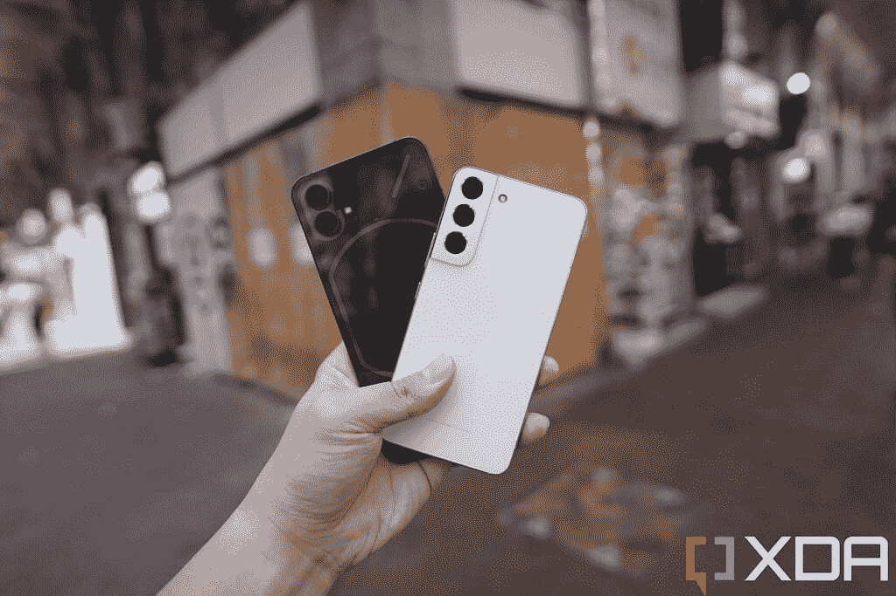
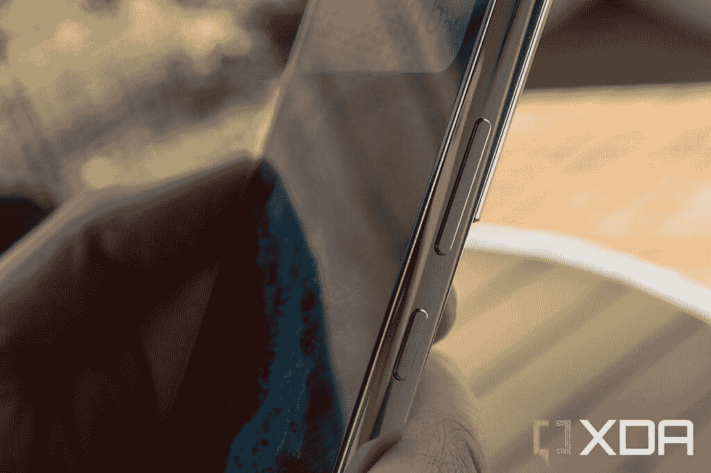
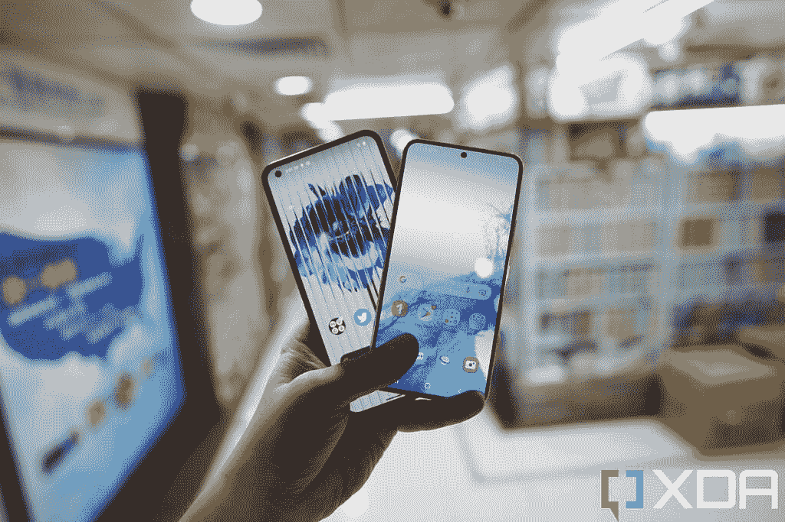
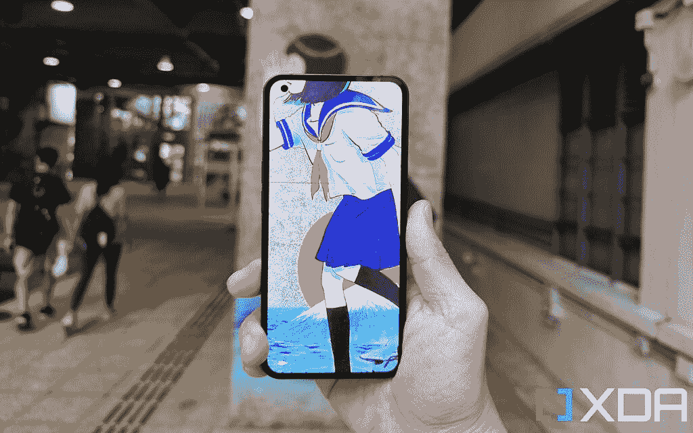
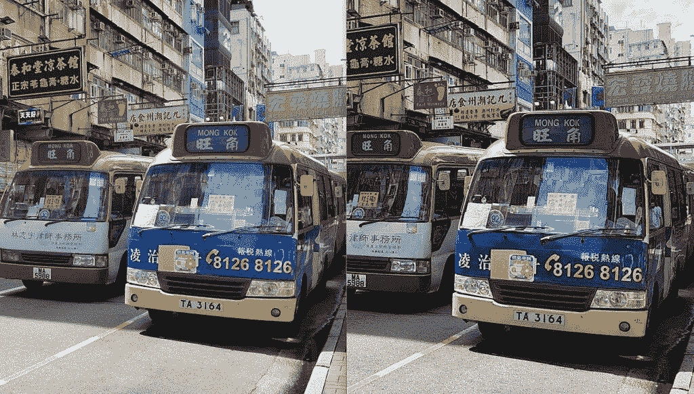

# Nothing Phone 1 vs 三星 Galaxy S22:浮华新人挑战老牌守旧派

> 原文：<https://www.xda-developers.com/nothing-phone-1-vs-samsung-galaxy-s22/>

在闪亮登场之后，最新的 Android 手机在这里上市了，尽管我们在 XDA 对 Nothing Phone 1 有着良好的印象 -这是第一次尝试-但值得将其与 Android 老大 Galaxy S22 系列进行比较。考虑到显著的价格差异，与 Galaxy S22 Ultra 进行比较没有意义，所以我们将新款 Nothing Phone 1 与最实惠的 [Galaxy S22](https://www.xda-developers.com/samsung-galaxy-s22-review/) 版本进行匹配。价格上还是有一点差距，但是通过[的定期交易和销售](https://www.xda-developers.com/best-samsung-galaxy-s22-deals/)，Galaxy S22 的价格通常会比官方建议零售价低一点。

 <picture></picture> 

Nothing Phone 1

一无所有的手机 1 是最新的产品，对于第一次使用它的人来说，这是一款非常完美的手机。

 <picture></picture> 

Samsung Galaxy S22

三星 Galaxy S22 是三星的基础型号旗舰手机，虽然它失去了令人敬畏的变焦镜头和 S-Pen，但它仍然是一款非常好的旗舰手机。

**浏览本文:**

* * *

## 无手机 1 vs 三星 Galaxy S22:规格

| 

规范

 | 

三星 Galaxy S22

 | 

无电话 1

 |
| --- | --- | --- |
| **打造** | 

*   铝制中框
*   大猩猩玻璃 Victus 回
*   大猩猩玻璃 Victus 正面

 | 

*   铝制中框
*   大猩猩玻璃 5 正面

 |
| **尺寸&重量** | 

*   146 x 70.6 x 7.6 毫米
*   168 克

 | 

*   159.2 x 75.8 x 8.3mm 毫米
*   193.5 克

 |
| **显示** | 

*   6.1 英寸 AMOLED
*   1080 x 2340 像素
*   高达 120Hz 的可变刷新率

 | 

*   6.55 英寸有机发光二极管
*   大猩猩玻璃(没有说明是哪个版本)
*   2400 x 1080
*   120 赫兹
*   1200 尼特峰值亮度
*   HDR10+

 |
| **SoC** | 

*   高通骁龙 8 第 1 代(美国、中国、印度和其他地区)
*   Exynos 2200(欧洲、南美和其他地区)

 | 

*   高通骁龙 778G Plus

 |
| **闸板&存放** |  |  |
| **电池&充电** | 

*   3700 毫安时
*   25W 有线快速充电(包装盒中不含充电器)
*   15W 无线充电

 | 

*   4500 毫安时
*   33W 有线快速充电支持
*   15W 无线快充支持
*   不含充电器

 |
| **安全** | 超声波显示指纹扫描仪 | 光学显示指纹扫描仪 |
| **后置摄像头** | 

*   **初级:** 50MP 宽，f/1.8
*   **二级:** 12MP 超宽，f.2.2
*   **第三:** 10MP 长焦，3 倍光学

 | 

*   **主要:** 50MP IMX766，f/1.9，1/1.56 英寸
*   **超宽:** 50MP JN1，f/2.2，114 度视野

 |
| **前置摄像头** | 10MP | 16MP |
| **端口** | USB-C | USB-C |
| **音频** | 立体声扬声器 | 立体声扬声器 |
| **连通性** | 

*   5G(毫米波)
*   支持 2x2 MIMO 的 Wi-Fi 6 (802.11ax)
*   蓝牙 5.2
*   国家足球联盟

 | 

*   5G(毫米波)
*   支持 2×2 MIMO 的 Wi-Fi 6 (802.11ax)
*   蓝牙 5.1
*   国家足球联盟

 |
| **软件** | Android 12 之上的一个 UI 4.3 | NothingOS Android 12 |
| **其他特征** | 双物理 SIM | 单一 SIM 卡 |

* * *

## 无手机 1 vs 三星 Galaxy S22:硬件和设计

## 

Galaxy S22 和 Nothing Phone 1 都是带有平板显示面板的玻璃金属夹层板，但中间的铝制框架有所不同。三星的边框有点圆，整体手感更柔软，弯曲，而 Nothing Phone 1 选择完全平坦的侧面，90 度角，就像 iPhone 12 和 13 一样。

 <picture></picture> 

Nothing Phone 1's flat sides.

Nothing 的硬角，以及 Nothing Phone 1 更宽、更厚、更重(159mm 到 146mm8.3mm 到 7.6mm193g 到 168g)意味着在我看来这款手机没有 S22 握起来舒服。

 <picture></picture> 

The Galaxy S22's rounded sides.

背面是两款手机最大的不同之处:Nothing Phone 1 的半透明背面显示了一些精心设计的内部结构，以及该公司称为“字形界面”的 LED 灯条。相比之下，Galaxy S22 更低调，尽管相机模块溢出两侧，融入底盘，看起来很有趣，很独特。

Nothing Phone 1 的字形界面主要是为了展示，但也有一些实际用途:你可以为特定的联系人分配特定的灯光模式。例如，您可能想为朋友和家人设置一种模式，为同事设置另一种模式，这样您只需看一眼手机背面就可以知道是否要接那个电话。然而，这是假设你把手机正面朝下，背面朝上(或者面朝你)。我几乎从不这样做(也很少接电话)，所以这个功能对我来说几乎没有用处。我真的很喜欢灯带的外观和玻璃面板下的纹理设计。

 <picture></picture> 

The bottom left part of the phone's back design is meant to resemble Manhattan in the New York City subway map.

### 显示

 <picture></picture> 

Galaxy S22 (front) and Nothing Phone 1 (back).

两款手机都使用三星 AMOLED 显示屏，但 Galaxy S22 的面板更好。虽然两款手机的像素几乎相同，但 Galaxy S22 的屏幕更小，意味着 PPI(每英寸像素)数更高。Galaxy S22 屏幕也是 LTPO 面板，刷新率可以在 48 赫兹到 120 赫兹之间，而 Nothing Phone 1 的面板被锁定在 60 赫兹或 120 赫兹。S22 的屏幕也变得更亮，并且具有大猩猩玻璃 Victus 保护，以保护 Nothing Phone 1 的大猩猩玻璃 5。三星手机的边框也更薄。

然而，这主要是为了吹毛求疵而吹毛求疵。在真空中，Nothing Phone 1 显示屏仍然是一个非常好看的面板，具有比我们大多数电脑或电视屏幕更好的色彩再现和刷新率。当谈到智能手机的显示面板时，我们只是被质量宠坏了，而三星恰好是最好的。

 <picture></picture> 

Nothing Phone 1 display is still more than good enough for most people.

### 社会学

在引擎盖下，Galaxy S22 由高通骁龙 8 Gen 1 或 Exynos 2200 驱动，具体取决于地区，而 Nothing Phone 1 运行的是高通骁龙 778G Plus。如果我们只是比较高通的设备，那么毫无疑问，Galaxy S22 的 SoC 更有能力，尽管它运行得有点热。但是如果你生活在一个有 Exynos 版本 Galaxy S22 的地区，那么这可能是一场更加接近的战斗。

一个主要的警告:我没有试过 Exynos 2200，但是我的同事 Adam Conway 试过，他发现它是一个非常有问题的表现者，经常滞后。他并不孤单:Exynos 芯片不如高通芯片是移动领域的一个持续趋势。

### 内存、存储和其他硬件位

Galaxy S22 在所有版本中都只有 8GB 的内存，而 Nothing Phone 1 则有 8GB 或 12GB 的选项。存储配置完全相同:128GB 或 256GB 的 UFS 3.1 存储。

两款手机都提供立体声扬声器和强大、精确的触觉，但三星的手机防水性能更好，因为它的 IP68 高于 Nothing Phone 1 的 IP53。这意味着 Galaxy S22 可以短暂浸泡在水中，但 Nothing Phone 1 只能防溅。

* * *

## 无手机 1 vs 三星 Galaxy S22:相机

50MP 传感器构成了这里的两个主摄像头，但它们使用不同的传感器:Galaxy S22 使用三星自己的 GN5 传感器，而 Nothing Phone 1 使用索尼的 IMX766 传感器。两者的图像传感器尺寸实际上非常接近，但 Galaxy S22 的 f/1.8 光圈比 Nothing Phone 1 的 f/1.9 光圈略快。

两个主摄像头在真空下都非常好，在下面的画廊中，看起来差不多。

但是当我放大并在更大的显示器上检查它时，我可以看到 Galaxy S22 的拍摄稍微好一些——更详细，曝光更好，等等。

 <picture></picture> 

100% crops, Nothing Phone 1 main camera (left) and Galaxy S22 main camera (right).

当我们转向超宽相机时，这种趋势更加明显。三星的镜头具有明显优越的动态范围和图像清晰度。

Galaxy S22 也有一个很好的 3 倍长焦变焦镜头，而 Nothing Phone 1 没有，所以起初看起来是一场势均力敌的战斗已经迅速转向三星这边。话说回来，Galaxy S22 要贵几百块。

* * *

## 无手机 1 vs 三星 Galaxy S22:软件和性能

比较这两款手机的软件是一个很好的衡量标准，你是否喜欢手机制造商保持软件轻便和精简，或者拥有大量品牌特有的功能。在 Android 12 上运行的 NothingOS 基本上是普通的 Android，只是做了一些调整:有一个专门定制字形界面的设置页面，手机中的一些标题文本使用了 Nothing 的基于点的字体。大概就是这样。Nothing Phone 1 甚至几乎只配备了谷歌应用程序，只有两个额外的必要应用程序:Nothing 的相机和录音应用程序。

与此同时，Galaxy S22 的 One UI 改变了许多 Android 的东西。例如，应用托盘水平滑动而不是垂直滑动。有近十几个三星专用的应用程序，手机非常希望你在使用过程中安装这个或更新那个。我其实很喜欢使用一些三星的应用程序，比如三星的互联网浏览器，但它会显示一个弹出菜单，要求我每隔一周更新一次浏览器(不知何故，三星无法在手机休眠时自动做到这一点)。很讨厌。

但三星也带来了一些普通操作系统所没有的附加功能。你有多种方式进行多任务处理，不仅包括股票分屏方法，还包括在浮动窗口中打开应用程序的能力。你甚至可以使窗口透明，变小或变大。NothingOS 不允许应用程序在启动时以窗口模式打开。后来的一次更新启用了这一功能，但它更加基本。

一个用户界面还提供三星 DeX，允许 Galaxy S22 将类似 Windows 的布局输出到外部显示器。这也非常有用。

所有这些额外的功能可能会影响系统的速度和流畅性，因为一个 UI 没有 NothingOS 那么快和灵活。打开或关闭应用程序时，偶尔会出现动画掉线的情况。在 Twitter 上滚动时有时会出现口吃。NothingOS 并非完全不受这些事情的影响，但它们发生的频率要低得多，UI 只是以看似更快、更流畅的速度来回跳动。

如果你打算多年使用你的手机，那么 Galaxy S22 软件有一个更明显的优势:三星承诺四年的 Android 更新，而 Nothing Phone 1 只承诺三年。

两款手机的整体性能都很好(记住，我只说骁龙版本的 Galaxy S22)。当然，骁龙 8 Gen 1 比骁龙 778G Plus 更强大，但只有当你真正执行视频编辑或长时间游戏会话等密集型任务时，你才会注意到这一点。在大多数正常使用情况下，这两款手机都能以大致相同的性能水平处理所有任务。

两种设备的扬声器都很强劲，因此两者都是同样好的媒体消费设备，特别是因为它们都易于长时间持有。

至于续航能力，由于缺乏可变刷新率，Nothing Phone 1 可能有一个更耗电的面板，但明显更大的电池(4，500 毫安时，Galaxy S22 的 3，700 毫安时)使其电池寿命更长。对我来说，Nothing Phone 1 可以在一天中度过整整 13 个小时，而 Galaxy S22 没有机会超过 11 个小时，通常在 10 个小时后会剩下最后 5%的电量。

两款手机的包装盒中都没有充电器，但 Nothing Phone 1 的充电速度更快，为 33W，达到 Galaxy S22 的 25W 最大速度。没有糖衣:Galaxy S22 的电池寿命和充电在 2022 年低于标准。

* * *

## Nothing Phone 1 vs 三星 Galaxy S22:你该拿哪个手机？

Galaxy S22 是一款更好的手机——你会得到略好的显示屏、更好的处理器和明显更好的相机系统，但它也要贵得多，起价为 799 美元，而 Nothing Phone 1 的起价大约相当于 480 美元。但当然，我不能给出一个直接的美国价格的原因是，Nothing Phone 1 目前不在美国销售。

因此，对于许多美国人来说，这是为他们做出的选择，这很好，因为 Galaxy S22 及其更大的兄弟姐妹都是非常好的安卓手机。但对于欧洲和亚洲的许多人来说，值得考虑节省数百美元来购买 Nothing Phone 1，因为 Galaxy S22 真的没有比这更好。

不过，如果你不介意多付一点钱，Galaxy S22 是一款非常精致的旗舰产品，可以做任何事情。但如果最终没有什么能把手机带到美国，那就太好了，这样美国消费者就能有更多的选择。

 <picture></picture> 

Nothing Phone 1

一无所有的手机 1 是最新的产品，对于第一次使用它的人来说，这是一款非常完美的手机。

 <picture></picture> 

Samsung Galaxy S22

三星 Galaxy S22 是三星的基础型号旗舰手机，虽然它失去了令人敬畏的变焦镜头和 S-Pen，但它仍然是一款非常好的旗舰手机。