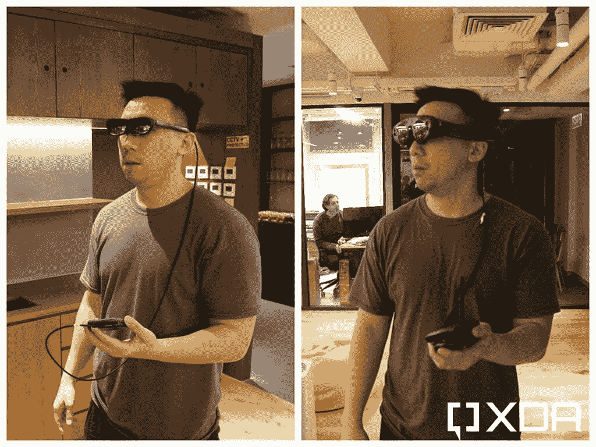
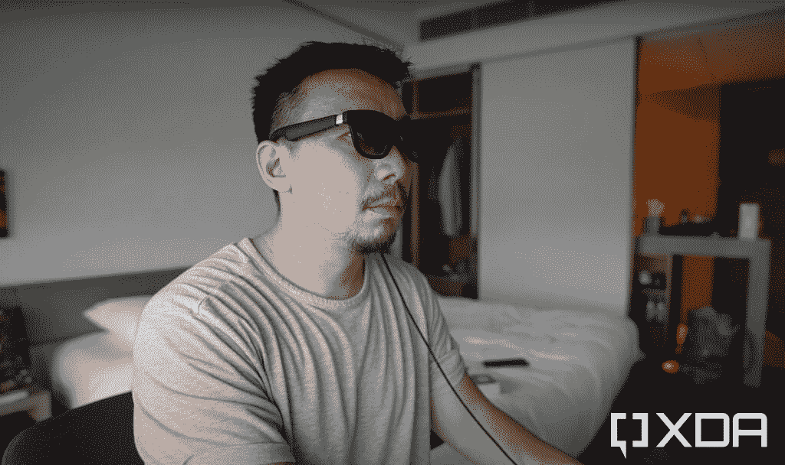
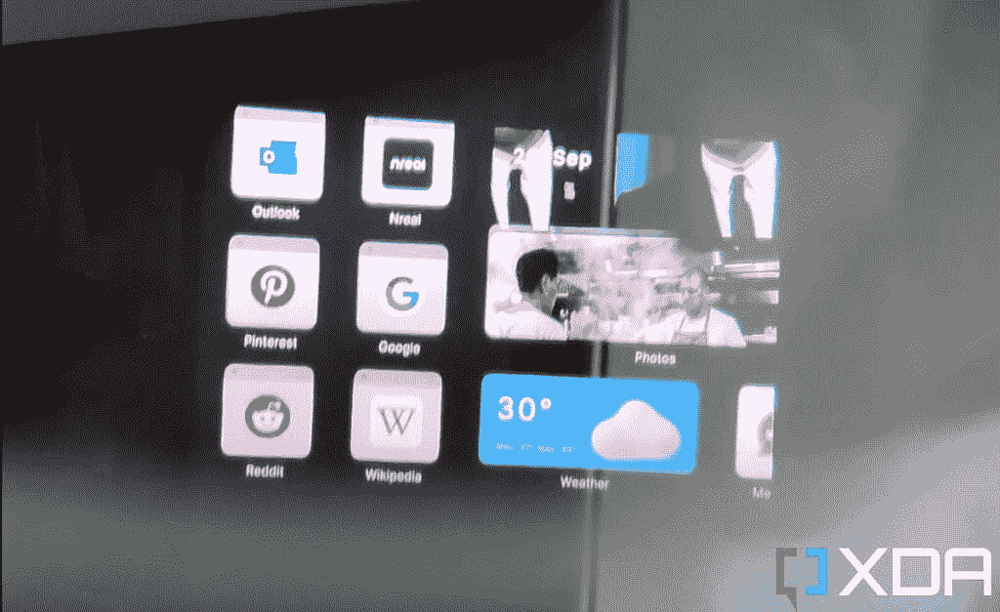
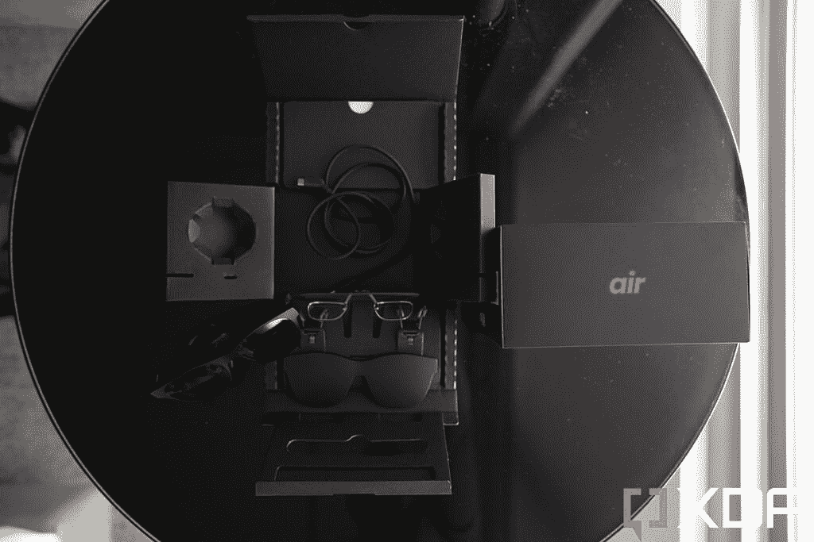
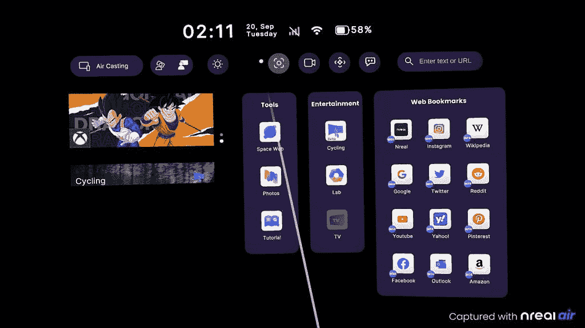
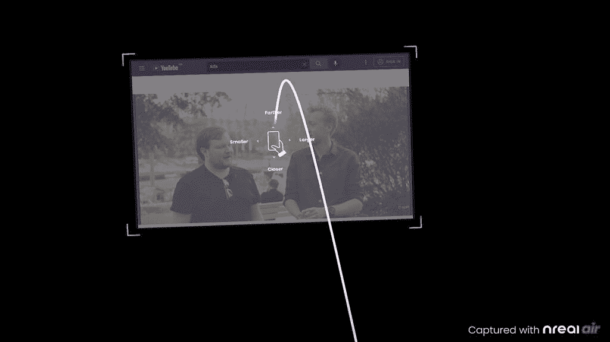
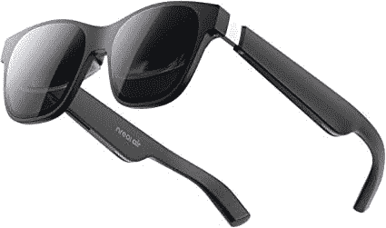

# Nreal Air 评论:虚拟 Mac 桌面很吸引人，但它最好用作可穿戴的大屏幕

> 原文：<https://www.xda-developers.com/nreal-air-review/>

我还记得三年前遇见增强现实眼镜制造商 Nreal 的创始人徐驰。我们在香港的一个合作空间见面，就在他准备飞往拉斯维加斯的几个小时前，他将在 CES 2019 上介绍他公司的首款增强现实(AR)眼镜。

我记得很清楚，因为徐推出了一款令人兴奋的产品——AR 眼镜，比当时微软和 Magic Leap 的产品体积小得多，价格也低得多。

“人们戴着笨重的 AR 眼镜(比如微软的 HoloLens)会感到不自在，”他当时对我说，然后递给我一个后来成为 Nreal 灯的原型，让我试穿。

虽然原型 Nreal 眼镜比微软的 HoloLens 小得多，但我仍然认为 Nreal 灯仍然太笨重，看起来很笨拙。在繁忙的工作场所穿着它们，我肯定会感到不自在。这东西在我身上看起来很傻。

 <picture></picture> 

Testing a prototype of the Nreal Air (left) and a retail unit of Microsoft's HoloLens (right) in 2019.

输送到我眼睛的视觉效果也感觉闪烁不定，几分钟后让我头疼。我还必须携带一个小盒子，然后连接到智能手机，只是为了让眼镜工作。长话短说，这是一个非常笨重的产品和体验，听起来很酷，但没有主流吸引力。

快进到三年半后，Nreal 的最新产品 Nreal Air 已经取得了重大进展，我认为现在可能已经具有主流吸引力。

这些进步不仅仅包括硬件的改进 Nreal Light 要小得多，不需要独立的盒子来工作，视觉效果看起来更加身临其境——还因为这种眼镜现在可以与地球上最主流、最广泛使用的消费产品一起工作:[iphone](https://www.xda-developers.com/best-iphone/)和 [MacBooks](https://www.xda-developers.com/best-macs/) 。

哦，眼镜在我脸上也不再看起来那么傻了——至少我认为不是？

 <picture></picture> 

The Nreal Light.

定价为 379 美元，Nreal Air 对大众来说可能还是有点太贵了。但对于那些有一些可消耗收入的人来说，这是一个足够合理的切入点，他们需要一个可以在家里和长途通勤中佩戴的便携式屏幕。

* * *

## 真实空气:这是什么？它是如何工作的？

自 2022 年初以来，Nreal Air 实际上已经可以购买，但上周它在美国重新推出，因为它在亚马逊上可以买到，并且正式获得了对 iPhones 和 MAC 的支持。在此之前，Nreal Air 只能与安卓、任天堂 Switch 和 iPad Pro 等 USB-C 设备兼容。

Nreal Light 是一副塑料 AR 眼镜，整体设计借鉴了标志性的雷朋旅行者外观。有两个 1080p 微型有机发光二极管双目屏幕，它们一起将视觉效果投射到佩戴者的面部前方。视觉效果可以变得相当于看一台 201 英寸的电视。

与我在 2019 年尝试的原型 Nreal 眼镜不同，视觉效果有了很大改善，Nreal 已经获得了 TÜV 莱茵的官方证书，获得了“低蓝光”、“无闪烁”和“眼部舒适”就我而言，我可以确认我戴着眼镜看了两个小时的电影，没有感到不舒服。

通过随附的可拆卸 USB-C 电缆进行连接。对于带有 USB-C 3.0 的设备，像最近的三星 Galaxy 旗舰产品或 2021 年的 iPad Pro，你可以简单地插入眼镜，立即镜像屏幕。

 <picture></picture> 

The pair of 1080p OLED screens.

一对扬声器——一只胳膊一个——可以输出不错的音频，不过你可能想用无线耳塞来获得真正的沉浸感。右臂上还有一个摇杆可以调节亮度。这种眼镜完全由它所插入的设备供电。在 Galaxy Z Fold 4 上，我发现两个小时的电影观看时间会耗尽我手机近 30%的电量。

这款眼镜重量轻，只有 76 克，Nreal 包括多个鼻梁架，可以适应不同的鼻子尺寸。还有一个加处方镜片的夹子我没试，因为我的视力没问题。

这是 AR 眼镜，意味着你可以在现实世界中投射视觉覆盖。为此，Nreal Air 配备了一系列传感器，以实现 3d 旋转头部跟踪运动。这意味着如果我投射一个视觉图像，当我转动我的头时，显示器会跟着移动。这些镜片是普通的透明镜片，所以如果你愿意，你可以将影像投射到“真实世界”上。

 <picture></picture> 

Projecting a virtual desktop onto the real world.

但我发现这种模式几乎毫无意义，因为没有足够多的应用程序真正带来任何真正的 AR 功能。相反，我更喜欢用附带的镜头盖盖住镜头(这意味着我不再能透过眼镜看到东西)，而是将视觉效果投射到黑色画布上。

 <picture></picture> 

The Nreal package includes a lens cover along with the required cables.

白天，即使戴上镜头盖，光线和“真实世界”仍然会偷偷进入我的周边视觉，所以体验仍然不是那么身临其境。

但是如果我晚上在黑暗的房间里使用新鲜空气呢？然后体验急剧改善，真的感觉像一个屏幕在我面前浮动。

我经常花一天的最后一个小时躺在床上阅读/消费手机/平板电脑上的内容，就像其他人一样。我有两种方法:要么我仰卧并用手握住设备，要么我把设备靠在枕头或床头柜上，然后侧身躺着。真实的空气已经完全取代了对这些尴尬姿势的需求，因为我现在在床上戴着眼镜，让内容自然地在我的面前传播。这让我可以以更自然的姿势面朝上躺下，不用手就能观看内容。新鲜空气改变了我睡觉前度过一天最后一个小时的方式。

* * *

## 真实空气:软件

Nreal Air 可以直接与我已经拥有的许多设备即插即用，但为了充分利用它，Nreal 建议你下载专为 Nreal 产品打造的应用程序“Nebula”。Nebula 通过投影真实设计的 UI 来取代屏幕镜像。你可以通过头部运动或像触控板一样在手机屏幕上滑动来浏览界面。

 <picture></picture> 

Nebula's homescreen UI

在 Nebula 中，你仍然可以访问你手机的所有内容，但你现在可以打开多个浮动窗口(与屏幕镜像相比，你受到手机 UI 所能显示内容的限制)。这些窗口可以与现实世界“一起玩”，将它们自己映射到墙上，所以如果我放低身体，屏幕似乎以一个角度在我上方盘旋。

我发现将内容映射到现实世界对我来说也太花哨了，所以我把它关掉，只是以正常的角度投影到我的面前。你可以调整屏幕的大小和位置，尽管这个过程可能很棘手，需要大约 10 分钟的学习曲线。

 <picture></picture> 

Playing a YouTube video via Nebula's floating window.

如上所述，视觉效果看起来很棒，尽管我觉得 Nreal Air 的亮度级别太高了。当我在黑暗的房间里使用它时，即使是最低的亮度水平对我的眼睛来说也有点太亮了。我更喜欢在黑暗的房间里观看较暗的内容。

### 使用 iPhone 是一件麻烦的事情——我想说不用麻烦了

可以说，Nreal Air 重新推出的一个主要广告点是它现在可以与 iPhones 兼容。但是，过程太麻烦，不值得。因为 iPhone 仍然使用过时的专有端口(Lightning)，所以你必须使用两个而不是一个加密狗来让眼镜与 iPhone 配合工作:你需要一个由 Nreal 制造的特定适配器(官方名称为 Nreal Adaptor)，价格为 60 美元。这个适配器只能将 Nreal 的 USB-C 输出转换为 HDMI。然后，你仍然需要一个 HDMI 到 Lightning 适配器来让它的其余部分工作。连接看起来像这样。

所有这些麻烦，你甚至不能使用 Nebula UI，因为该应用程序在 iOS 上不可用——你只能镜像你的 iPhone 屏幕。简直太麻烦了。但好消息是，Nreal Air 与苹果的另一款产品配合得很好。

### 但是和 Mac 一起使用感觉很超前

Nebula 在 macOS 上可用，这个 Mac 版本不同于 Android 版本。它没有覆盖 Nreal 的自定义浮动 UI。相反，它镜像了 Mac 的显示屏，并在侧面扩展了两个。下面的 Nreal 提供的宣传图片有通常的广告点缀(屏幕没有显示得那么大)，但总体概念是准确的。

我没有任何专业工具来捕捉我看到的确切的虚拟桌面；我最多能做的就是把一个智能手机摄像头放在眼镜上，但你可以想象一下虚拟桌面的样子。

这样做的好处应该很明显。Nreal Air 可以虚拟地扩展 MacBook 屏幕，这样你就可以打开更多的窗口，而不会感到杂乱。目前，用于 Mac 的 Nebula 软件还处于测试阶段，其视觉效果不如 Android 应用那样身临其境或清晰。例如，如果我把头摇得太多，会有一点果冻效应。但是它已经可以使用了，我用虚拟桌面写了这篇文章的一部分，这个页面在主屏幕上，Slack 在另一个屏幕上，Twitter 在第三个屏幕上。

* * *

## 你应该买真正的空气吗？

我回想起我与徐的会面，他是多么渴望宣传 AR 的好处，以及它将如何改变我们的日常生活。他并不孤单，任何制造 AR 眼镜的人，无论是谷歌还是微软，都试图向我们出售一个未来，在这个未来中，AR 覆盖层可以为我们提供现实世界中的逐向导航，或者在我们看东西时向我们显示上下文信息，就像托尼·斯塔克的钢铁侠头盔为他做的那样。

很明显，我们离那个目标还很遥远，我不确定那个未来是否会到来。尽管我不相信 AR，但我相信有一个虚拟的大屏幕，你可以带着它去任何地方。这个周末我要登上一趟长途航班，我肯定会把真实的空气装进我的随身包里，这样我就可以在比飞机提供的更大、更好的屏幕上看电影了。

如果 Nebula Mac 应用程序有所改进，视觉效果变得更加稳定，我甚至会在咖啡店用 MacBook 工作时戴着它。至少，Nreal Air 是我每晚躺在床上看 YouTube、读 Twitter 的机器。

我知道，我知道——那些宣扬数字排毒和睡前远离屏幕重要性的人，大概都在摇头。但我主要以评论智能手机为生，所以无论如何我都很难离开屏幕。

现在，你应该买这个吗？如果你想到我刚才描述的使用场景，并认为“酷！”你不介意花 379 美元，那当然。如果你对你面前有更多屏幕的想法感到厌恶，那就远离它。

可能还有第三类人，他们认为这项技术很酷，但是现在 379 美元的价格太高了。我确实认为这可能是最大的群体，价格将使 Nreal Air 暂时成为利基产品。

 <picture></picture> 

Nreal Air

##### 真实空气

Nreal Air 是一种 AR 眼镜，可以在你面前投射相当于 200 英寸的屏幕。