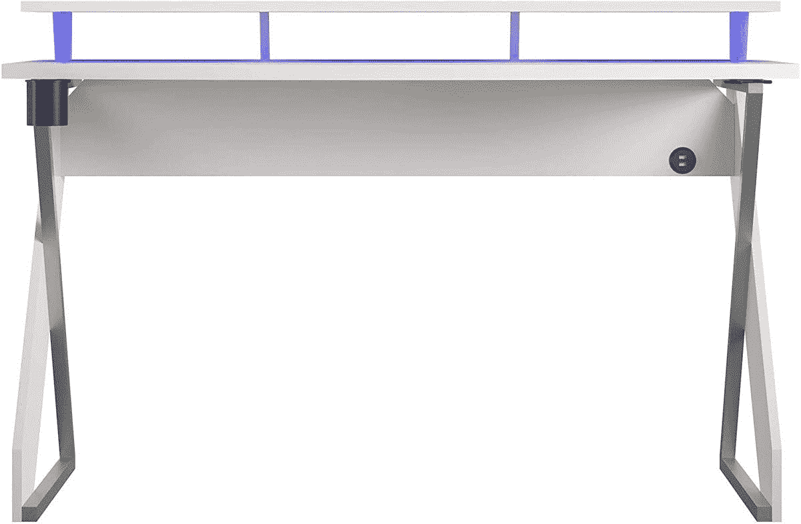

# 如果你在家工作，这款 NTENSE Xtreme Riser 办公桌售价 144 美元(优惠 155 美元)

> 原文：<https://www.xda-developers.com/ntense-xtreme-riser-144-black-friday/>

# 如果你在家工作，这款 NTENSE Xtreme Riser 办公桌售价 144 美元(优惠 155 美元)

NTENSE Xtreme Riser 售价 144 美元，比建议零售价低 155 美元。它有一个内置的 riser、USB 端口、耳机挂钩等。

黑色星期五已经结束，但在网络星期一到来之前，仍有大量交易出现。我们发现的一个是 NTENSE Xtreme Riser 书桌，它看起来是任何在家工作设置的完美书桌。它的建议零售价为 300 美元，但现在它的折扣是有史以来最大的，只有 144 美元。

 <picture></picture> 

NTENSE Xtreme Riser

##### NTENSE Xtreme Riser

NTENSE Xtreme Riser 是一个价格合理的不错的桌子，也有专门的耳机和饮料支架。

带升降器的桌子的优点在于，升降器可以更好地支撑显示器，使其与你的眼睛保持水平。这张桌子还有一个内置耳机支架和一个内置杯架，后者特别有用，这样你就不会把饮料洒到重要的 PC 外设上。

桌子内置了电缆管理功能，提升器下方有 led 指示灯，背面右侧有两个 USB 端口。杯架和耳机挂钩也可以移动，NTENSE 说它们可以在四个不同的位置之间移动。升降器可以承受 30 磅，而书桌本身可以承受 80 磅。它需要组装，亚马逊的清单表明需要两个成年人来建造 NTENSE Xtreme Riser。

组装后，这张桌子的高度为 34.1 英寸，宽度为 53.6 英寸，深度为 23.7 英寸，这意味着这张桌子上还有足够的空间放置两台显示器。如果你想在你的电脑上添加一些其他的东西，那么一定要看看我们的[最佳电脑和游戏网络星期一交易](https://www.xda-developers.com/best-black-friday-pc-gaming-deals/)。