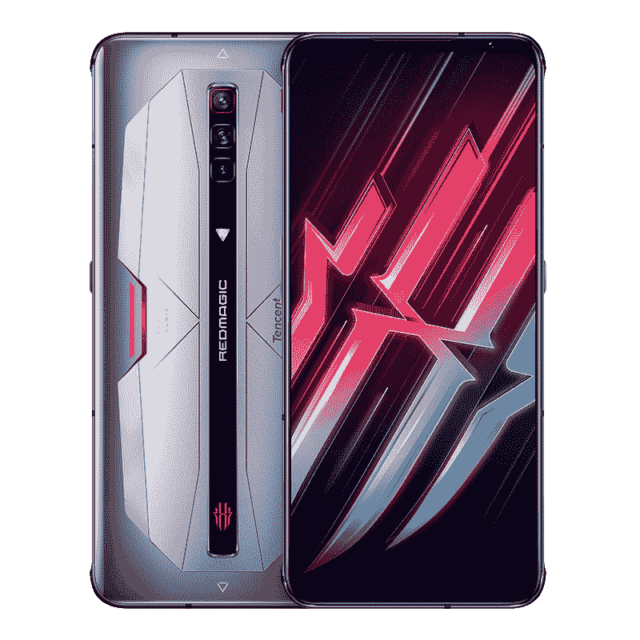

# 努比亚红色魔法 6 回顾-疯狂的 165 赫兹 AMOLED 游戏显示器[视频]

> 原文：<https://www.xda-developers.com/nubia-red-magic-6-review-video/>

# 努比亚红色魔法 6 回顾-疯狂的 165 赫兹 AMOLED 游戏显示器[视频]

XDA 的 TK Bay 最近得到了腾讯版 Nubia Red Magic 6，下面是他对这款设备的看法。

上个月，努比亚[在中国发布了其最新的游戏手机](https://www.xda-developers.com/red-magic-6-series-china-launch/)-红色魔法 6。这款手机随后在国际上推出，配有更大的电池和预装的谷歌应用程序。努比亚最新的游戏手机在原始硬件方面可谓无所不用其极，配备了 6.8 英寸 AMOLED 显示屏，刷新率高达 165Hz，触摸采样率高达 500Hz，顶级的[骁龙 888](https://www.xda-developers.com/qualcomm-snapdragon-888-explained-specs-features/) 芯片组，12GB 内存，128GB UFS 3.1 存储，5,050mAh 电池，66W 快速充电，内置主动冷却风扇。XDA 的 TK Bay 最近得到了腾讯版的红色魔法 6，下面是他对这款设备的看法。

在评测中，TK 从一个简短的视觉参观开始，展示了 Nubia Red Magic 6 的各种古怪的设计元素，包括背面酷炫的 RGB 照明，内置冷却风扇的排气装置，专用的游戏开关，中置后置摄像头等等。

\ r \ nht TPS://www . YouTube . com/watch？v=B2bBfj91X9o\r\n

接下来，TK 讲述了平滑的 165Hz 刷新率显示器以及它如何提供平滑的滚动体验。他甚至给了我们一个 60Hz 和 165Hz 之间的简单比较，你可以清楚地看到为什么他喜欢让面板一直运行在 165Hz。

TK 还深入概述了 Red Magic 的游戏模式及其各种功能，以及主动冷却风扇如何保持 CPU 温度在可控范围内。有关现实生活中的游戏体验、热性能以及双核冷却器附件如何工作的更多信息，请查看 TK 的完整评论。

**[红魔 6 XDA 论坛](https://forum.xda-developers.com/f/nubia-red-magic-6.12159/)**

 <picture></picture> 

Red Magic 6

##### 红色魔法 6

Red Magic 6 是市场上最好的游戏手机之一，具有疯狂的 165Hz AMOLED 显示屏，骁龙 888，内置主动冷却风扇，肩部触发按钮等等。

## 努比亚红魔 6 系列:规格

| 

规格

 | 

红色魔法 6 /红色魔法 6 Pro

 |
| --- | --- |
| **尺寸和重量** | 

*   169 毫米 x 77.09mm 毫米 x 9.7mm 毫米(9.6 毫米专业型号)
*   220 克

 |
| **显示** | 

*   6.8 英寸 AMOLED (2400 x 1080)
*   165 赫兹刷新率
*   高达 500Hz 的触摸采样率
*   10 位颜色支持
*   100% DCI-P3 宽色域覆盖
*   Goodix AMOLED 触摸控制器

 |
| **SoC** | 

*   高通骁龙 888:
    *   1 个 Kryo 680 Prime 内核@ 2.84GHz
    *   3 个 Kryo 680 性能内核@ 2.4GHz
    *   4 个 Kryo 680 高效内核@ 1.8GHz
*   肾上腺素 660

 |
| **RAM 和存储器** | 

*   红色魔法 6
    *   12GB LPDDR5 内存
    *   128 GB UFS 3.1 闪存存储
*   红色魔法 6 Pro
    *   16GB LPDDR5 RAM
    *   256GB UFS 3.1 闪存存储

 |
| **电池&充电** | 

*   5050 毫安时
*   66W(盒内 30W 砖)
*   支持 USB PD 3.0、QC 3.0、4.0、5.0 标准

 |
| **后置摄像头** | 

*   **初级:** 64MP
*   **次要:** 8MP 超宽
*   **第三级:** 2MP 宏

 |
| **前置摄像头** |  |
| **端口/按钮** | 

*   USB 类端口
*   3.5 毫米音频插孔
*   电容式空气触发按钮

 |
| **连通性** | 

*   5G NR
*   蓝牙 5.1
*   无线网络 6
*   2x2 MIMO
*   WiFi 802.11 . b/g/n/AC(2.4 GHz+5 GHz)
*   USB cast

 |
| **安全** | 

*   Goodix 的光学欠显示指纹读取器

 |
| **其他功能** | 

*   内置主动冷却风扇

 |
| **软件** | 

*   搭载 RedMagic OS 4.0 的 Android 11

 |