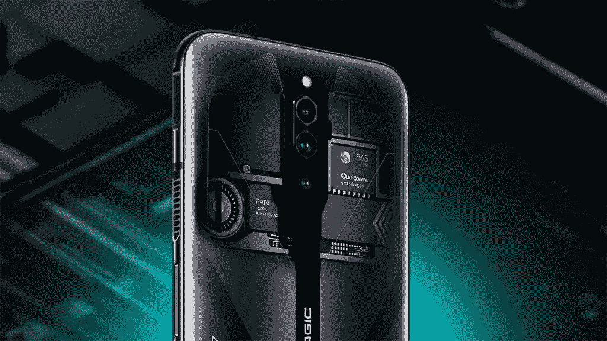
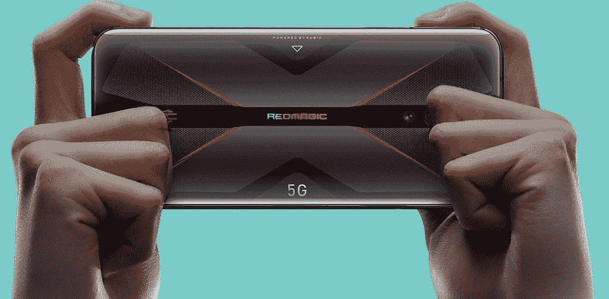
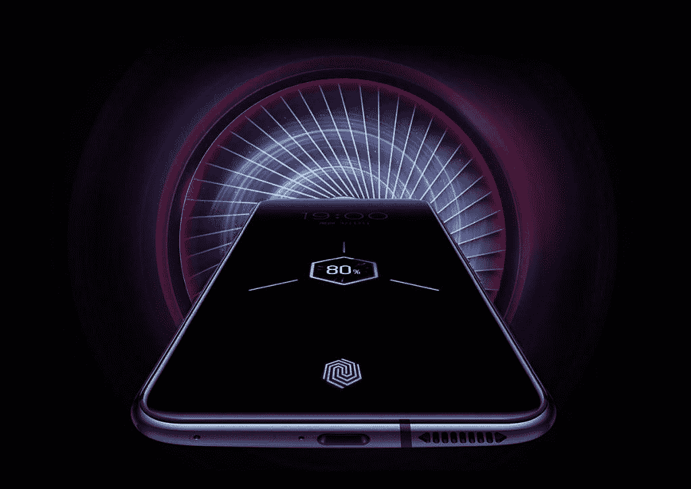

# Nubia RedMagic 5G 成为终极游戏手机的五种方式

> 原文：<https://www.xda-developers.com/nubia-redmagic-5g-ultimate-gaming-phone/>

有许多手机将自己标榜为“游戏手机”，但这些手机往往忽略了基本的游戏功能。如果你正在寻找一款真正的游戏手机，它实现的功能真正使它成为一款出色的游戏设备，那么看看 Nubia RedMagic 5G 。这款新手机于 2020 年 3 月 12 日发布，实现了几项重要功能，使其成为终极游戏手机。

| 

努比亚 RedMagic 5G

 | 

规范

 |
| --- | --- |
| 芯片集 | 高通 SM8250 骁龙 865 (7 纳米以上) |
| 随机存取存储 | 8/12GB |
| 显示 | 144 赫兹 6.65 英寸 AMOLED 显示屏，分辨率为 1080x2340p |
| 储存；储备 | 128/256GB |
| 主摄像机 | 64+8+2MP [8K 视频] |
| 自拍相机 | 800 万像素 |
| 电池 | 4500 毫安时，最高 55 瓦快充 |
| 操作系统（Operating System） | 安卓 10，Redmagic 3.0 |

## 144 赫兹的显示屏比其他手机捕捉更多的动作

您可能熟悉许多桌面游戏电脑中的 144Hz 显示器。现在，这种类型的显示器在 Android 设备上是可能的。努比亚采用这种高性能显示器来满足当今游戏玩家的高标准。RedMagic 5G 是世界上第一款大规模生产的 144Hz 显示屏手机。这为普通人带来了价格合理的 144Hz 显示器。这是一个大胆的举措，将有助于改变智能手机显示屏的标准。更高的刷新率意味着当以更高的 FPS 玩游戏时，你的游戏会看起来更流畅。1080x2340p 显示屏的像素密度为 387ppi，让您的游戏变得清晰而细致。

这种先进的显示将会给你一个明显的优势。在一个小的移动屏幕上看到更多细节的能力将有助于你在 PUBG 等流行的竞技游戏中。在常规的 90Hz 显示器上，较低的帧速率使游戏的元素融合在一起。将玩家与背景或周围的图形区分开来变得更加困难。在 144 赫兹时，你会注意到当相机快速移动时，你更容易看到远处的敌人并保持清晰的视觉效果。

## 主动液体冷却让您玩得更久，而不会感到热

任何在手机上玩图形密集型游戏的人都知道，这可能会导致发热问题。在 Android 上玩游戏会变得很困难，因为手机会变得很热，拿着不舒服。Nubia RedMagic 5G 通过集成的液冷系统解决了这个问题。一个 L 形的液体冷却管穿过手机，由一个转速为 16，000 RPM 的小风扇辅助。冷空气从手机的一侧吸入，而热空气从另一侧排出。这最终让你的手机保持 200%的凉爽。

虽然其他一些手机提供了与 Nubia RedMagic 5G 类似的规格，但没有主动液体冷却系统，它们没有达到 Nubia 设定的新游戏标准。所有这些规格的电源都安装在手机上，会导致游戏时温度更高。这使得 Nubia RedMagic 5G 与其他旗舰设备相比，具有更出色的游戏体验。

 <picture></picture> 

Nubia RedMagic 5G Liquid Cooling

 <picture></picture> 

Nubia RedMagic 5G 16,000 RPM Fan

## 增强游戏性的控制和性能

手机游戏玩家的一个流行配件是蓝牙控制器。使用四个手指而不仅仅是拇指的能力意味着你现在可以同时瞄准、射击和移动。Nubia RedMagic 5G 在手机侧面增加了触发按钮，无需第三方控制器。现在，您拥有了全控制器的一些优势，而不需要连接额外的设备。这些触发按钮与手机边缘齐平，不会增加设备的体积。触发器也是可定制的，这意味着您可以将不同的操作映射到这些按钮。

 <picture></picture> 

Nubia RedMagic 5G with Built-in Pro Triggers

4D 震动是一个在游戏过程中给你真实振动反馈的功能。这是另一个功能，让你的手机感觉更像你拿着一个游戏控制器。

Nubia RedMagic 5G 由骁龙 865 芯片组提供支持，最高可选择 12GB 内存。这些规格不仅足以运行最强大的游戏，而且可以让你的 Discord 语音聊天在后台进行，甚至可以同时运行几个其他应用程序。

为了进一步推动这些规格，努比亚提供了游戏空间 2.1。这个游戏启动器允许你控制你的冷却风扇，使用游戏加速器技术，并利用 RedMagic Time 游戏录制。

## 4500 毫安时电池，让您的供电时间更长

RedMagic 5G 有一个 4500mAh 的大电池，可以 18W 快速充电。您可以升级这是一个 55W 的快速充电选项，以更快地为您的手机充电。您可以在一天中轻松地玩几个游戏，而无需充电。对于比赛时间通常超过 30 分钟的游戏，你不必担心在跑着拿充电器的时候找不到地方躲起来。

RedMagic 5G 拥有 18W 快速充电功能，可升级至 55W 快速充电功能，可快速充电，让您玩得更久。不要让电量不足的电池拖你的后腿。

 <picture></picture> 

Nubia RedMagic 5G Fast Charging

## 最有价值的游戏智能手机

[RedMagic 5G](https://bit.ly/2WQPYpF) 最大的特点之一就是价格标签。虽然这款手机的功能规格几乎可以媲美市场上的任何旗舰手机，但这款手机的基本款只需 579 美元。对于一部配备 144Hz 显示屏和骁龙 865 的手机来说，这个价格是惊人的。

如果你将 RedMagic 5G 与这个价格区间的其他手机进行比较，如一加 8、小米 Poco F2 Pro 或谷歌 Pixel 4，你会发现努比亚是唯一一个配备 144Hz 显示屏的选择。额外的游戏功能，优质的构建和最新的规格，使 RedMagic 5G 成为起价低于 600 美元的最超值手机。

| 

努比亚 RedMagic 5G

 | 

价格

 |
| --- | --- |
| 8GB+128GB/日蚀黑 | $579.00 |
| 8GB+128GB /飞车手罗德红 | 579.00 美元(现已预购) |
| 12GB+256GB /脉冲 | $649.00 |

**[预购红魔](https://bit.ly/3bN6VWg)的飞车手罗德红版本。2020 年 6 月 1 日至 6 月 8 日上市。飞车手罗德红 1%的预购收入将捐赠给一个非盈利慈善组织“儿童游戏”。**

###### *我们感谢努比亚赞助这篇文章。我们的赞助商帮助我们支付与运行 XDA 相关的许多费用，包括服务器成本、全职开发人员、新闻撰稿人等等。虽然您可能会在门户内容旁边看到赞助内容(这些内容将始终被标记为赞助内容),但门户团队对这些帖子不承担任何责任。赞助内容、广告和 XDA 仓库完全由一个独立的团队管理。XDA 绝不会通过接受金钱来赞扬一家公司，或以任何方式改变我们的观点或看法，从而损害其新闻诚信。我们的意见不能被收买。*