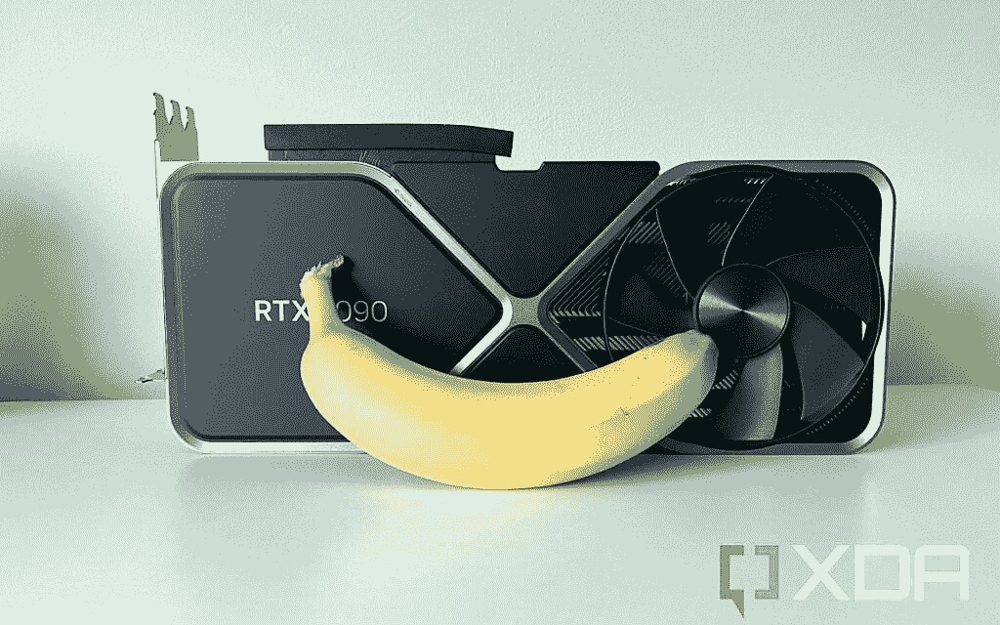

# Nvidia GeForce RTX 4090 评测:没有什么比它更好的了

> 原文：<https://www.xda-developers.com/nvidia-geforce-rtx-4090-review/>

对于电脑游戏玩家来说，今年的圣诞节无疑提前到来了。AMD 还没有展示它的下一代[显卡](https://www.xda-developers.com/best-graphics-cards/)，但是 Nvidia 甚至 Intel 已经有了，有很多可以谈论的。不同的方法，是的，但是非常有趣。英伟达一如既往，凭借其新旗舰 GeForce RTX 4090 直击要害。

当描述 Nvidia 在 GPU 技术领域的下一步行动时，我们已经没有什么陈词滥调可以使用了。从低端到庞大、耗电的 RTX 3090 系列，RTX 30 系列已经相当不可思议了。不过，RTX 4090 是另一回事。

自然，新一代比老一代更强大。但是对上一代人的收益的承诺是令人兴奋的。新建筑有望成为又一次巨大的飞跃。多年来，我们一直在谈论光线跟踪和 4K 游戏，RTX 4090 的到来使这两者成为规范，并提供了一个我们以前从未见过的 GPU。

游戏从来没有这么好过。

***关于本次评测:**本次评测使用英伟达提供的 RTX 4090 Founders 版进行测试。Nvidia 没有人对这篇评论**的内容发表任何意见。***

 <picture></picture> 

Nvidia RTX 4090 Founders Edition

##### 英伟达 RTX 4090 创始人版

没有什么比得上这里提供的性能，绿色团队的最新摧毁了上一代。

## Nvidia GeForce RTX 4090 的定价和供货情况

*   Nvidia GeForce RTX 4090 在各大零售商处均有销售
*   创始人版和一些具有额外功能的第三方卡在美国的起价为 1，599 美元

Nvidia GeForce RTX 4090 于 2022 年 10 月 12 日在亚马逊、新蛋和百思买等主要零售商上市销售。创始人版和一系列第三方卡在美国的起价为 1，599 美元。

一些具有定制冷却或工厂超频等额外功能的第三方版本的价格高于基本价格，但这将有所不同。作为一个高需求的项目，早期的库存销售非常快，但补货将继续发生。

## Nvidia GeForce RTX 4090 规格、硬件和设计

*   显卡太大了，可能会挡住主板上的插槽
*   尽管它很大，但没有任何明显的下垂
*   它有照明，但我们不确定是什么触发了它

| 

规格

 | 

英伟达 GeForce RTX 4090

 |
| --- | --- |
| **GPU** | 阿达·洛芙莱斯&#124; AD102 |
| **GPU 核心** | 16,384 |
| **基准时钟** | 2235 兆赫 |
| **升压时钟** | 2520 兆赫 |
| **内存** | 24GB GDDR6X |
| **内存带宽** | 1，018 GB/秒 |
| **内存接口宽度** | 384 位 |
| **RT 内核** | 128 |
| **TDP (W)** | 450 |
| **所需系统功率(W)** | 850 |

RTX 4090 的一切都是巨大的。规格表巨大，价格巨大，实际显卡巨大。创始人版本实际上似乎是最小的，但不要让这愚弄你。

我们发现[与其他物品的选择](https://www.xda-developers.com/how-big-invidia-rtx-4090/)相比，大小是一个潜在的问题。它占用了一个 PC 机箱中的三个 PCIe 插槽，根据您的主板布局，您可能会失去实际 PCIe x16 插槽的使用。例如，在我的华硕 Prime Z690-P 上，RTX 4090 位于顶部插槽，我无法使用全尺寸的 PCIe 4.0 扩展槽，仅仅是因为这张卡的厚度。第三方版本的定制冷却器可能更糟糕。

深度也是一个问题，虽然不完全是卡的大小。再加上使用 16 针到 4 x 8 针适配器电缆供电的必要性(对我们许多人来说，至少在一段时间内)，嗯，你需要一个深的外壳。在我的 Lian Li Lancool 205 Mesh 中，当使用适配器时，我根本无法将玻璃侧面板装上。有了专用电缆，我**可能会，**但实际上，Cablemod 的直角适配器将成为我们许多人的方式。

 <picture></picture> 

Banana for scale

PCB 本身并不是特别大。这只是**所有的**散热片。Founders Edition 本质上是一个巨大的金属块，两侧有鳍来帮助气流。它有两个大粉丝在卡片的两端和两边。令人惊讶的是，它不会受到下垂的影响。尽管它的整体大小和重量，它非常坚硬。事实上，我的老款微星 RTX 2080 比 RTX 4090 小得多，受到的影响要严重得多。我原以为需要一个支架，但事实并非如此。我还有一个，以防万一，但是我很惊讶。

尽管很大，创始人版没有任何下垂。

创始人版也有非常微妙的照明，但我不完全确定是什么触发了它。GeForce RTX 徽标亮起，风扇和 RTX 4090 徽标之间的条带也亮起。但标志照明是零星的，会随机关闭，该地带从来没有出现在所有，直到我安装了海盗船 iCue 完全不相关的东西。不管它是如何打开的，当它打开时，它看起来很好。

 <picture></picture> 

The RTX 4090 12VHPWR to 8-pin adapter cable

纠正电源适配器混乱不一定[需要新的电源](https://www.xda-developers.com/power-supply-nvidia-rtx-4090/)。虽然 MSI 和 Thermaltake 等品牌开始出现 ATX 3.0 单元，但更多的人已经开始提供 12VHPWR 至 8 针电缆，您可以在现有单元上使用。请咨询您的电源制造商以了解更多信息。

RTX 4090 在缺乏对最新显示输出的支持方面也有点落后。虽然它有 HDMI 2.1，但没有 DisplayPort 2.0。这不是一个大问题，但是当它变得更加相关时，你就不能添加它了。这是一款可以并且应该使用很多很多年的显卡，但没有最新最好的显卡会有一点点问题。甚至英特尔也在低于 400 美元的显卡上安装了 DisplayPort 2.0。

## 游戏性能

*   就性能而言，目前市场上几乎没有其他产品能与 RTX 4090 相提并论
*   这是如此强大，它几乎要求你在 4K 玩游戏
*   你甚至可以在 8K 下玩游戏——如果你有显示器支持的话

RTX 4090 是 GeForce 家族的一部分，这意味着它主要针对游戏玩家。然而，我怀疑普通的 PC 游戏玩家是否需要考虑这些显卡。

表演是可笑的。绝对荒谬。我喜欢它，但我不确定我是否需要它。我不确定有人真的准备好了。

RTX 4090 的表演很滑稽，我喜欢。

当谈到 RTX 4090 的性能，绝对没有什么可以与之相比。到目前为止，我们所看到的一切都表明，在某些情况下，RTX 3090 的性能提升高达 70%。AMD 将不得不抛出一些严重的热量来跟上，直到 RTX 4080 到来，4090 几乎是在真空中。

无论哪种方式，让我们看看一些基准。下表显示了 RTX 4090 在 1440p 和 4K 的一系列游戏中的表现。在所有情况下，每一个图形设置都被设置为最高，我们确定了光线跟踪涉及的地方。在某些情况下，你会看到来自[英特尔 Arc A770 16GB](https://www.xda-developers.com/intel-arc-a770-review/) 的比较数据，这是一款最近评测的 1440p 显卡。这两者并不具有丝毫竞争力，但它表明了 RTX 4090 到底有多领先。

| 

基准

 | 

英特尔 Arc A770 16GB

 | 

Nvidia GeForce RTX 4090 创始人版

 |
| --- | --- | --- |
| 超火力打击 | 7,106 | 24,473 |
| 时间间谍(DX12) | 13,412 | 35,278 |
| 时间间谍极限(DX12) | 6,334 | 19,275 |
| DirectX 射线跟踪 | 31.5 帧/秒 | 136.73 FPS |

在新的 3DMark Speed Way 测试中获得 9921 分，在 Port Royal ray tracing 测试中获得高达 25520 分，GeForce RTX 4090 只是让所有数字都变得 brrr。它现在还没有平等，A770 和 RTX 4090 之间的 DXR 测试表明，如果你真的关心光线跟踪，你仍然需要一个高端的 GPU。在相同的测试中，RTX 4090 比旧的 RTX 2080 要好 10 倍，后者是最初的高端光线跟踪显卡。所以你可以看到我们走了多远。

接下来，我们来考察一些游戏。

| 

比赛

 | 

RTX 4090 创始人版(1440 便士)

 | 

RTX 4090 创始人版(4K)

 | 

英特尔 Arc A770 16GB (1440p)

 |
| --- | --- | --- | --- |
| *Forza Horizon 5* |  |  |  |
| 漫威的蜘蛛侠重拍 | 

*   94 FPS(最大 RT，无 DLSS)
*   190(最大 RT + DLSS 3.0)

 | 

*   78 FPS(最大 RT，无 DLSS)
*   159 FPS(最大 RT，DLSS 3.0)

 |  |
| *五档* |  |  |  |
| *地铁出埃及记:增强版* | 

*   113 FPS (w/ RT 最大设置)
*   130 帧/秒(带 RT + DLSS)

 | 

*   72 FPS ( w/ RT 最大设置)
*   114 帧/秒(带 RT + DLSS)

 | 

*   61 FPS (w/ RT 正常设置)

 |
| *古墓丽影* | 

*   205 帧/秒(w/ RT)
*   234 帧/秒(带 RT + DLSS)

 | 

*   121 FPS (w/ RT)
*   198 帧/秒(带 RT + DLSS)

 |  |
| *杀手 3* | 

*   116 FPS(迪拜 w/ RT)
*   141 FPS(迪拜 w/ RT + DLSS)
*   92 FPS(带 RT 的达特穆尔)
*   110 帧/秒(达特穆尔带 RT + DLSS)

 | 

*   64 帧/秒(迪拜 w/ RT)
*   118 FPS(迪拜 w/ RT + DLSS)
*   55 FPS(达特穆尔带 RT)
*   93 FPS(达特穆尔带 RT + DLSS)

 | 

*   114 FPS(达特穆尔)
*   125 FPS(迪拜)
*   119 FPS (XeSS Ultra，达特穆尔)
*   55FPS(中国，XeSS Ultra，RT)

 |
| *赛博朋克 2077* | 

*   159 FPS
*   85 FPS(带 RT Ultra)
*   128 FPS(带 RT Ultra + DLSS 2.0)

 | 

*   121 FPS
*   77 FPS(带 RT Ultra)
*   121 FPS(带 RT Ultra + DLSS 2.0)

 |  |
| *看门狗军团* |  | 

*   61 FPS (w/ RT)
*   99 帧/秒(带 RT + DLSS)

 |  |

RTX 4090 几乎使 4K 成为强制性的。我玩 1440p 游戏，我有一台非常棒的戴尔 165Hz 1440p 游戏显示器，我觉得没有理由放弃它。然而，它完全被 RTX 4090 打败了。有些游戏，比如《杀手 3》(Hitman 3)(T13)，你可以真正提高光线追踪，或者关闭 DLSS，你在 1440p 的 165Hz 范围内。但大多数时候，RTX 4090 都迫切需要更多的像素。

这也让 8K 游戏首次成为现实。不仅仅是它能做到，而且它能以你可能真的想玩的帧速率做到。我没有 8K 显示器可以测试，也不打算很快购买，但信息就在那里。

### 热量和性能调整

有点令人惊讶的是，至少创始人版处理得很好。热量、内存速度、风扇速度——一切都很棒。好吧，它吸取了大量的电力，但在股票设置上，我还没有看到它超过 400W。

但是有太多的上升空间。库存功率限制是你在盒子上看到的 450 瓦，但 Founders Edition 的实际最大功率限制似乎是一个荒谬的 600 瓦——即使看起来很粗略，但我确信仍然非常安全。像 MSI Afterburner 这样的工具将允许通常的调整，在特定卡允许的任何边界内增加内存速度、内核速度和功率限制。

无论我如何尝试，在股票设置上，温度将在 60-65 摄氏度左右达到峰值，即使是在 420 瓦和尽可能多地使用 GPU 的情况下。这两个大风扇和巨大的散热器在保持冷却方面做得很好，听起来不像喷气发动机。在过去的 Nvidia 显卡上，我经常发现股票风扇曲线对于保持噪音很好，但在冷却 GPU 方面没有用，但 RTX 4090 似乎找到了一个令人满意的中间点。风扇也会在空闲时停止转动，因为 GPU 会运行得足够冷，以至于它不需要它们。当你一天工作的时候，你不会听到耳朵里没完没了的风扇噪音。

不过，似乎确实可以从 RTX 4090 中提取一些里程数。下图显示了 Unigine 叠加基准在 8K 优化预设上的一组结果。在这种情况下，内核时钟是固定的，但内存速度增加了。

几乎线性的扩展表明，虽然阿达·洛芙莱斯似乎是内存带宽饥饿时，GPU 绑定，有性能增益。至少，我们希望所有 RTX 4090 卡能够增加 1000 到 1500 之间的偏移，最多 2100。在同一测试中，粗略估计 RTX 3090 的性能提高了 75%。但这也考虑到了严重超频，液冷 RTX 3090 和新鲜出炉的 RTX 4090。

对于游戏，你可以用同样的方法增加你的基准分数和平均 FPS。例如，向内存添加+1000 会使 *Borderlands 3* 平均增加大约 10 FPS，同时将其功率提高到 450W。如果你认为值得，这将由你决定。当核心时钟增加到 3 GHz 时，我的单元似乎遇到了稳定性问题，尽管它在游戏中的增益是最小的。即便如此，Founders Edition 也没有接近 600W 的绝对极限，温度也没有超过 70 度。所以，如果你喜欢修补，你就有了一个可以尽情享受的游乐场。

### DLSS 3.0

RTX 4090 的推出不仅仅是硬件的巨大威力。英伟达还推出了其 DLSS 升级技术的最新版本，该技术甚至需要 40 系列 GPU 才能运行。有很多可以进入它，但 TL；dr 是每秒多帧——差不多。[据英伟达](https://www.nvidia.com/en-us/geforce/news/dlss3-ai-powered-neural-graphics-innovations/):

> 基于 DLSS 超级分辨率，DLSS 3 增加了光学多帧生成功能，以生成全新的帧，并集成了 NVIDIA Reflex 低延迟技术，以实现最佳响应。DLSS 3 由英伟达阿达·洛芙莱斯架构的新第四代张量内核和光流加速器提供支持，该架构支持 GeForce RTX 40 系列显卡。
> 
> DLSS 帧生成卷积自动编码器接受 4 个输入-当前和先前的游戏帧，由 Ada 的光流加速器生成的光流场，以及运动矢量和深度等游戏引擎数据。

有人质疑这是真的 FPS 增加还是某种欺骗。我所能说的是，如果你继续结果，那么它会像预期的那样工作。如果你真的仔细观察 DLSS 3.0 的开启和关闭，你将能够找到缺点。边缘可以更柔和，可以有一点点类似于 DLSS 性能模式的闪烁，并且您可能会挑出细节受损的区域。但问题在于:只有当你非常仔细地审视时，你才能发现这些问题。

DLSS 3.0 似乎能够将帧速率提高一倍，这令人惊讶。

但如果你像正常人一样玩游戏，这几乎是无法区分的，部分原因是你将获得一些严重的 FPS。我还没有测试过*赛博朋克 2077* ，因为它只通过 Steam 作为预发布更新提供，而且它还没有在 GOG 版本中提供，但它已经被添加到*蜘蛛侠重制版、*中，结果会自己说话。视觉效果仍然很好，但报告的帧速率翻了一番。当你升级到 4K(甚至 8K)并使用光线追踪时，这种魔法是受欢迎的。

获得 DLSS 3.0 的游戏列表目前相当小，但有一个很好的选择，包括每个人的最爱，*巫师 3* 。我不是很确定*巫师 3* 是否需要 DLSS 3.0，至少不是为了 RTX 4090，但永远不要拒绝性能部门的一点帮助。

## 编码性能

*   该卡有一个 NVENC 编码器*和一个 AV1 编码器*
*   我们发现 RTX 4090 可以在不到两分钟半的时间内以 40，000 的比特率渲染出 4K60 的剪辑
*   24GB VRAM 使使用任何软件都变得轻而易举

作为一个游戏玩家，而不是内容创作者，我可以欣赏 RTX 4090 的巨大威力，但我也可能没有它也能快乐地生活。但它的专业应用程序将这种显卡放在一个联盟中。好吧，游戏性能也是如此，但它仍然令人兴奋。

首先，除了许多人已经依赖的出色的 NVENC 编码器之外，RTX 4090 通过硬件 AV1 编码器更上一层楼。在 RTX 卡上解码已经有一段时间了，但这是我们第一次能够反过来。[我们 AV1](https://www.xda-developers.com/av1/) 的解说将帮助您理解为什么这是一件大事。但是你不一定能从 RTX 4090 上的 AV1 得到更快的编码，因为它与使用 NVENC 的常规旧 h.264 差不多。

无论使用 AV1 还是 NVENC，RTX 4090 都是一个编码巨头。

这并不是说这个东西的编码性能不是非常令人印象深刻。在 DaVinci Resolve 18 Studio 中，RTX 4090 可以在不到两分钟半的时间内以 40，000 比特率渲染出 4K60 的剪辑。比较 ICAT 中的 h.264 和 AV1 输出，不可能看出质量上的差异。当然，AV1 导出文件要小得多。

除了导出之外，GPU 能力和大容量 24GB VRAM 的结合使使用 Resolve 18 等软件变得轻而易举。即使有高分辨率的镜头和时间线，也没有减速或迟缓的迹象。它简单地吞噬一切，好像什么都不是。

我还在 OBS Studio 中试用了 AV1 编码。该功能将在未来的更新中推出，但可以在 28.1 测试版中试用。下面的示例剪辑是使用 AV1 以 1440p 的“不可区分”质量设置(为了比真正的无损捕获更小的文件)捕获的。由于硬件编码器独立于推动游戏的 GPU 位，因此对其性能没有明显影响。RTX 4090 是一个如此糟糕的东西，它在处理这两项任务时完全没有问题。

最终结果也很棒。该文件比类似的非 AV1 编码小，但仍保留了所有细节。

这只是充分利用 RTX 4090 非游戏部分的两个应用程序。其他即将添加 AV1 支持的包括 Discord，而 XSplit 也支持它。简单的解释是，如果你已经使用 NVENC，RTX 4090 将把性能提高几个档次。对于内容创作者来说，这是一项严肃但明智的投资。以前可能需要多台电脑才能完成的任务，现在只需一台配备 RTX 4090 的机器就能轻松完成。仅马力一项就能让工作流程变得更加简单快捷。

## 你应该买英伟达 GeForce RTX 4090 吗？

我知道你**想**买一台 Nvidia GeForce RTX 4090，但是你应该买吗？这比简单的是或不是要复杂得多。

**你应该买英伟达 GeForce RTX 4090 如果:**

*   你热衷于寻找精英中的精英
*   你喜欢超频
*   你是一个可以利用 GPU 能力的内容创作者或专业人士
*   你打算在 4K 甚至 8K 玩游戏

**你不应该买英伟达 GeForce RTX 4090 如果:**

*   你唯一的目的就是游戏
*   你不是在 4K 赌博
*   价格令人不快

购买 RTX 4090 有很多理由，但这些不一定是你应该购买的理由。对于大多数阅读这篇文章的人，我可以很自信地说，你不需要一个。你可以更明智地花钱，以同样的价格建造一台完整的个人电脑。虽然很刺激，但完全是矫枉过正。

如果你想买一个，你必须在 4K 坚持不懈。仍然有很多时候，你可以在 1440p 的时候用大量的光线跟踪反射稍微绊倒它。但很大程度上，如果你在 4K 以下的分辨率上玩游戏，它只会嘲笑你。你现在对这个显卡做的任何事情都不会真正使它相位化。

换一辆 RTX 4090 就像从一辆沃尔沃里走出来，进入一辆兰博基尼。

如果你的唯一目的是玩游戏，这也不一定是最明智的选择。它实在是太强大了。爱好者和那些喜欢超频和推动硬件到它的临界点的人绝对会喜欢它，并且很大程度上不需要任何理由来购买一个。但即使它有时比 RTX 3090 好 70%,目前也没有任何游戏对它构成挑战。

RTX 4090 在与其他东西结合时最有意义，无论你是在机器学习或创意工作中利用 GPU 加速，还是在单台机器上寻找游戏和流媒体工具。当你从游戏中抽身出来，欣赏这款显卡带给你的一切时，你会更容易理解它的意义。

一代接一代，RTX 4090 是一个巨大的飞跃，并没有伴随着巨大的价格上涨。但是它仍然很贵，而且很可能不是你所需要的。但是，如果你陷入拥有一个，你会有一个疯狂的经历。这就像从沃尔沃里走出来，进入了兰博基尼。现在没什么能碰这个显卡。我们将不得不等待英伟达自己做到这一点。

 <picture></picture> 

Nvidia RTX 4090 Founders Edition

##### 英伟达 RTX 4090 创始人版

消费者图形的不可触摸的国王，或者至少直到 RTX 4090 Ti 出现。