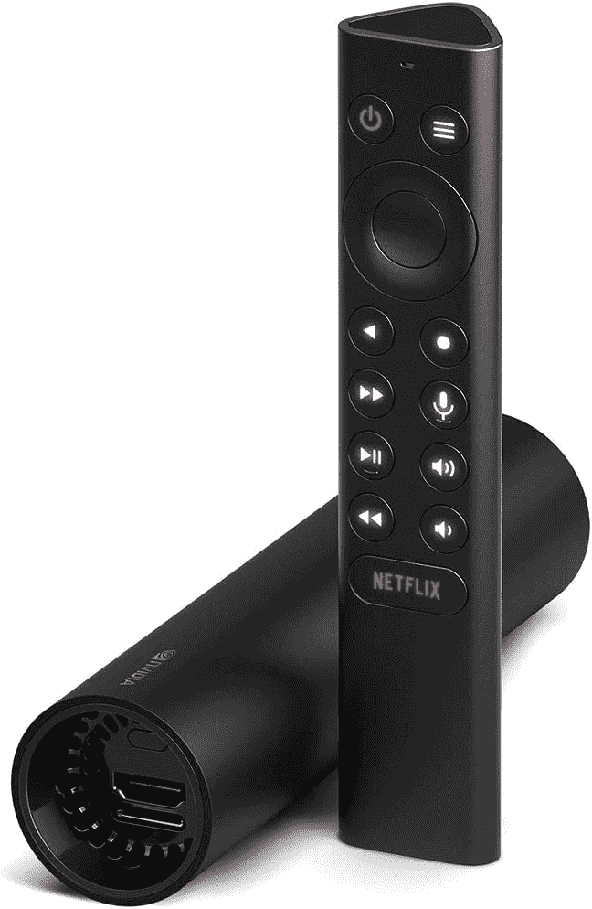

# 交易:NVIDIA SHIELD TV 在亚马逊 Prime Day 优惠 25 美元

> 原文：<https://www.xda-developers.com/nvidia-shield-tv-deal-prime-day-2021/>

如今，由于在线流媒体平台和联网流媒体电视设备的过剩，切断脐带比以往任何时候都更容易。如今，大多数电视甚至带有内置流媒体选项或成熟的智能电视操作系统。但是，如果你仍然拥有一台“笨”电视，或者你讨厌在你的“智能”电视上运行的软件，该怎么办呢？在这种情况下，你会想拿起一个外部流媒体电视播放器，其中最好的是 NVIDIA SHIELD TV。

英伟达的 SHIELD TV 系列自 2015 年以来一直存在，该系列的一次更新发生在 2017 年，另一次发生在 2019 年。由于 Tegra X1 芯片与大多数流媒体电视设备中的芯片相比相对强大，NVIDIA 在 Android TV 上的恒星软件支持以及过多的功能，SHIELD TV 被许多人誉为你可以购买的最佳流媒体播放器。 [2019 refresh](https://www.xda-developers.com/nvidia-shield-tv-pro-shield-tv-stick-announced/) 向阵容中添加了一款新的电子狗大小的设备，该设备现在在亚马逊 Prime Day 打折 25 美元。

SHIELD TV streaming stick 是一个圆柱形加密狗，可以挂在电视机后面看不见的地方。如果你的 WiFi 网络无法穿透你的电视，那么可以拔掉这根棍子，让信号更好。如果您想要更快或更稳定的 4K HDR 流媒体或云游戏连接，那么 SHIELD TV dongle 有一个千兆以太网端口可供您使用。尽管它很小，但它甚至有一个可扩展存储的 microSD 卡插槽。在内部，SHIELD TV stick 有 8GB 的内部存储空间用于存储所有应用程序，2GB 的内存用于快速性能，802.11ac WiFi 支持和蓝牙 5.0 LE 支持。该设备还支持 Dolby Vision、Dolby Atmos、HDR10 等音频和视频标准。最后，该设备配有一个巧克力形状的控制器。

 <picture></picture> 

NVIDIA SHIELD TV Streaming Stick (2019)

##### NVIDIA Shield 电视棒

盾牌电视是一个流媒体电视棒，支持 4K HDR 流媒体，运行安卓电视，并有一个整洁的人工智能升级功能。较便宜的型号通常零售价为 150 美元，但你可以在今天结账时以 25 美元的价格买到。

更大更贵的 SHIELD TV Pro 拥有更多 RAM、更多存储空间、两个全尺寸 USB 3.0 端口，并支持附加软件功能，但更小、加密狗大小的型号对大多数人来说完全合适。它仍然拥有我所说的任何流媒体电视播放器的最佳功能:人工智能升级。利用这一功能，视频源中的帧通过神经网络运行并放大，从而产生质量更好的图像。这一点特别明显，在动画内容中效果非常好，这就是为什么我使用 SHIELD TV 来代替我的索尼电视的内置软件。