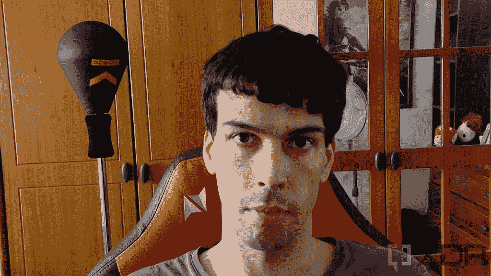

# Obsbot 微型 4K 网络摄像头评论:高品质的智能视频功能

> 原文：<https://www.xda-developers.com/obsbot-tiny-4k-webcam-review/>

除了我评论的笔记本电脑内置的摄像头之外，我通常不会评论很多网络摄像头，但当 Obsbot 有机会评论这个小小的 4K 摄像头时，我立刻就感兴趣了。这是一款 4K 相机，有一个非常特别的挂钩——可以在你四处走动时跟踪你。有其他相机可以做到这一点，但这一个物理旋转，以确保你总是在帧中。

这是市面上最贵的网络摄像头之一，但坦率地说，如果你想要最好的网络摄像头体验，很难想象还能买什么。我绝对喜欢使用 Obsbot 微型 4K，如果你有钱花，我绝对推荐它。图像质量和跟踪功能使它绝对值得，即使我希望看到 Windows Hello 集成。

 <picture></picture> 

Obsbot Tiny 4K

##### 小小 4K

Obsbot 微型 4K 网络摄像头有一个高分辨率的传感器和人工智能，可以在你走动时跟踪你。

**浏览本文:**

## 小小 4K:价格和可用性

*   Obsbot 微型 4K 可以在亚马逊或者 Obsbot 的网站上买到
*   它的价格是 269 美元，所以相当昂贵

Obsbot Tiny 4K 是一个相对较新的产品，但它已经可以在 Obsbot 自己的网站和亚马逊上购买。它的价格高达 269 美元，是最贵的网络摄像头之一。

如果你想要更便宜的东西，还有一个稍微小一点的版本，去掉了 4K 和自动对焦和 HDR 等功能。

## 小小 4K:规格

| **相机** | 1/2.8 英寸 4K 索尼传感器，F2.2，86 FOV，自动对焦，HDR，4 倍变焦**最大视频分辨率:** 3840 x 2160 @ 30fps，1920 x 1080 @ 60fps |
| **音频** | 带噪声消除功能的双全向麦克风 |
| **万向节** | 2 轴万向架**最大可控调整**:-150°至+150°平移，-45°至+45°倾斜**调整速度:**120°/s(最大)**结构上可能的调整**(软件不可控制):-160°至+160°平移，-90°至+90°倾斜 |
| **安装系统** | 磁性安装包括支持 1/4 英寸螺丝安装 |
| **电力需求** | USB 3.0 连接**或** USB 2.0 + DC 输入 |
| **系统要求** | 推荐 4K/1080p@60fps: **Mac** :搭载第八代英特尔酷睿 i5 或更高版本的 Mac**Windows:**第七代英特尔酷睿 i5 或更高版本，8GB 内存 |
| **尺寸(WxDxH)** | **不带支架:** 58 x 58 x 89.5 毫米(2.28 x 2.28 x 3.52 英寸)**带磁性支架:** 58 x 58 x 142 毫米(2.28 x 2.28 x 5.59 英寸) |
| **重量** | **不带底座:** 147 克(0.32 磅)**带磁性底座**T42:176 克(0.39 磅) |
| **价格** | $269 |

## 设计和包装:它装在一个非常漂亮的盒子里

*   Obsbot 微型 4K 装在一个带把手的结实的手提箱里
*   包装盒包括一个磁性底座和你需要的所有电缆

我们通常不怎么在评论中谈论包装，但我想在这里简单提一下，因为 Obsbot Tiny 4K 在盒子里有一个非常好的手提箱。当你打开包装时(在穿过几层纸之后)，你会看到这个坚硬的盒子，配有一个提手，相机和附带的配件都整齐地存放在里面。

这真的很好，你默认得到这个，它使你可以很容易地把相机带到任何地方，而不用担心它坏了。这并不能证明高价是合理的，但它证明了这是一种高端产品，而且它也是如此。你不会白付钱的。该套件包括两条电缆-一条 USB-C 到 USB-C(加上一个 Type-C 到 Type-A 适配器)用于电源和数据，一条 USB Type-A 到 DC in。第二根电缆是为只有 USB 2.0 的电脑准备的，因为单个端口不足以给网络摄像头供电。如果你有一个 USB 3.0 端口，你只需要第一根电缆。

相机本身有一个不寻常的设计，这是启用它提供的智能跟踪功能所必需的。它坐在一个圆形的底座上，几乎可以绕着四周旋转。有一个手臂可以举起相机，给它上下倾斜的空间，这样它就可以跟着你了。移动的范围足够大，它可以跟踪你应该在的任何地方。你可以手动旋转和倾斜相机，或者使用人工智能跟踪功能。你也可以将相机完全向下倾斜，完全关闭，这是一个很好的隐私保护措施。

在正面，相机有一排灯，用来指示一些事情。默认情况下，一盏绿灯亮起，表示相机已打开。当您启用跟踪时，您会看到所有三个灯都变成绿色。当您执行手势时，蓝色灯光表示手势正在被识别，当摄像机失去对您的跟踪时，灯光变为黄色。

底部有一个用于 1/4 英寸支架的螺钉，因此您可以将相机连接到您想要的任何位置。然而，这个盒子还包括一个更容易使用的磁性底座。只要把底座放在你的显示器上，把相机放在上面，它就会牢牢地固定住。磁铁很强，所以你可以放心相机不会掉下来。

值得一提的是，与其他网络摄像头相比，该摄像头相当重。考虑到里面包含的所有技术，你可能会想到这一点，但这是值得注意的。如果你的笔记本电脑有一个松动的铰链，它可能会因为重量而移动，尽管我个人没有在我的任何笔记本电脑上遇到过这种情况。

## 图像质量和跟踪:如果你想四处移动，这是惊人的

*   如果你在镜头前移动很多，跟踪功能是很棒的
*   图像质量远远优于任何笔记本电脑网络摄像头

这款相机的卖点显然是智能跟踪功能，所以我们将从这一点入手。Obsbot 微小的 4K 是一个人工智能驱动的网络摄像头，它实际上甚至不需要任何特殊的软件就能工作。有一个 Obsbot TinyCam 应用程序可以用来进行额外的手动控制，但没有它智能都在那里。

当你第一次打开摄像头时，它不会马上跟踪你。相反，它使用手势识别来启用该功能。你可以举起手，手掌对着相机，一旦相机识别出这个手势，它就会在你移动时开始跟踪你。我已经提到了移动的范围相当大，但也许更重要的是，相机很快。

其他高端相机，如戴尔 UltraSharp 4K，也有跟踪功能，但都是基于软件的，对你的动作反应可能会很慢。另外，那台相机经常放大照片的随机部分。小小的 4K 机器人反应灵敏，运行良好。它确实需要相对清晰地看到你的脸，但这通常不是问题。

当您使用另一个内置功能:缩放时，这可能会成为问题。如果你用右手在你的脸旁边做一个 L 形手势，相机将切换变焦(默认情况下是 4 倍变焦)，聚焦在你的脸上。如果你靠近相机，这可能是一个问题，因为你的脸可能不适合在框架中，这反过来会影响跟踪。如果你移动，相机有时不能足够快地响应，或者如果你看向别处，它可能会停止识别你的脸。

 <picture></picture> 

Picture taken with 4x zoom enabled

公平地说，如果这种情况发生在你身上，你可能一开始就不应该变焦。您可以始终使用相同的手势来恢复缩放级别，但是让相机放大太近也会使手势更难被一致地识别。一旦你掌握了窍门，你肯定可以让它工作，但它不是，但跟踪不是绝对完美的。

我没有太多使用高端网络摄像头的经验，但我可以肯定地说，Obsbot Tiny 4K 的图像质量非常好。我总是看起来清晰明了，当然比我用过的任何笔记本电脑摄像头都要好，包括联想 Yoga 6 的 1080p 摄像头。它对不均匀的光线反应相当好，有一个 HDR 功能来帮助这一点，尽管这需要 TinyCam 软件。我发现当光线从我的窗户进入时，HDR 会有所帮助，但在晚上室内照明时，我更喜欢关闭 HDR 时的图像质量。

相机以高达 4K 的分辨率和每秒 30 帧的速度录制，或者如果您喜欢更流畅的视频，也可以以 1080p 和 60fps 的速度录制。再说一次，图像质量总体来说非常好，虽然你会注意到昏暗的灯光下有更多的噪音，但这比我试过的任何笔记本电脑网络摄像头都好，所以我总是想让这个相机插上电源，特别是考虑到它给你带来的其他一切。

在这个价位上，我唯一希望这款相机具备的就是 Windows Hello 面部识别功能。如果你看看其他高端网络摄像头，如前面提到的戴尔 UltraSharp 4K 或罗技布里奥，它们也很贵，但它们都有添加 Windows Hello 面部识别的好处。虽然我要说这不是一个必要的功能，但它肯定会使这个高价格标签更容易接受。

## Obsbot TinyCam 软件:更多手动设置

*   Obsbot TinyCam 软件为网络摄像头提供了各种手动设置
*   它不会自动安装，所以你必须自己找到它

到目前为止，我们主要关注相机本身可以做什么，但你可以通过 Obsbot TinyCam 软件获得更多功能。这款应用程序在 Windows 和 macOS 上都可以使用，它可以给你额外的控制。只要你打开应用程序，你就可以获得万向节控制，所以你可以手动旋转和倾斜摄像头，以及缩放控制。

此外，您可以为网络摄像头保存多达三个预设位置，因此，如果您不想依赖跟踪，但希望相机为不同的位置做好准备，您可以将它们保存为预设并在它们之间动态切换。

点击侧边菜单上的齿轮图标也会给你一堆更高级的设置。在这里，您可以关闭手势识别，调整自动睡眠定时器(如果一段时间不使用，相机将进入睡眠状态)，更改使用变焦手势时的默认变焦因子，启用 HDR，等等。

这里有几个值得注意的特性包括跟踪模式，有三个选项可供选择。默认的跟踪模式专注于你的面部，但也有净空模式，它试图确保你的头部上方有空间，所以它不会被切断，还有运动模式，当你四处移动时，它可以提高跟踪的有效性。

还有视频配置窗口，可以让你手动调整亮度、对比度、饱和度和各种图像设置。你有足够的控制，这是伟大的，如果你想实现一个特定的外观与网络摄像头。

该应用程序还允许您更新网络摄像头的固件，这可能包括未来的修复或新功能。总而言之，如果你想从小小的 4K 中获得更多，Obsbot TinyCam 软件真的很有用，但坦率地说，我不认为它对于基本使用是必不可少的。图像质量开箱即用，追踪功能没有它也能正常工作。尽管如此，软件自动安装可能更有意义，但相反，你必须自己去寻找，这有点令人失望。

## 你应该买小 4K 吗？

总的来说，Obsbot 微型 4K 绝对是一个神奇的网络摄像头，如果你在互联网上展示内容，这是一个简单的推荐。追踪功能非常好用(而且很快)，图像质量也很好。这绝对是一次升级，甚至超过了目前市面上最好的笔记本电脑。然而，你真的需要确定你需要它，因为这是一项非常大的投资。

**你应该买 Obsbot 托尼 4K 如果:**

*   如果你做在线演示需要你到处走动
*   你想要没有装饰的高质量图像
*   你有钱花

**你不应该买 Obsbot 小 4K，如果:**

*   你想要 Windows Hello 面部识别
*   你只是想要一个比笔记本电脑更好的基本网络摄像头

我认为，能让你远离这个网络摄像头的最大因素是缺乏 Windows Hello 面部识别，尤其是当你能找到其他支持它的高端网络摄像头时。然而，这些网络摄像头缺乏这种相机提供的出色跟踪功能，所以你必须选择你的优先事项。