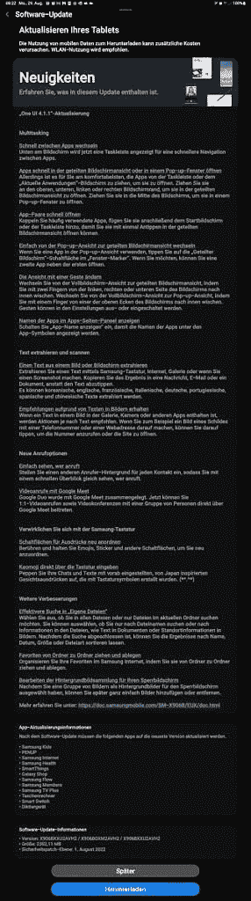

# Galaxy Tab S8 系列的 One UI 4.1.1 带来了新的多任务功能

> 原文：<https://www.xda-developers.com/one-ui-android-12l-galaxy-tab-s8-series/>

三星在最近推出的 [Galaxy Z Fold 4](https://www.xda-developers.com/samsung-galaxy-z-fold-4-review/) 中推出了基于 Android 12L 的 One UI 4.1.1。新的软件版本包括针对大屏幕设备的优化和功能，现在终于可以用于三星的旗舰产品 Galaxy Tab S8 系列。

Galaxy Tab S8、Galaxy Tab S8 Plus 和 [Galaxy Tab S8 Ultra](https://www.xda-developers.com/samsung-galaxy-tab-s8-ultra-review/) 的 One UI 4.1.1 更新目前正在向美国、欧洲和韩国的用户推出。它包括三星在本月早些时候的 Galaxy Unpacked 活动中展示的新任务栏功能。它可以让你在常用的应用程序之间快速切换，或者以分屏模式或弹出窗口的方式打开应用程序。您也可以使用它在分屏模式下打开常用的应用程序对。此外，One UI 4.1.1 还包括一个新的双指手势，可以帮助用户在全屏和分屏视图之间快速切换。

 <picture></picture> 

Via: Sammobile

除了这些多任务处理的改进，One UI 4.1.1 还包括一个为联系人设置自定义呼叫背景的新选项。此外，该版本中更新的“我的文件”应用程序允许用户在文件中搜索信息。平板电脑还支持新的文本扫描功能，用户可以从图像中复制文本并与其他人分享。您还可以使用它将复制的文本翻译成中文、法语、德语、意大利语、韩语、葡萄牙语和西班牙语。

该版本还包括一个新版本的三星互联网浏览器应用程序，该应用程序提供了拖放支持，可以帮助用户重新排列喜欢的网站，并能够对文件夹中的书签进行排序。最后，Galaxy Tab S8 系列的一个 UI 4.1.1 包括 2022 年 8 月的 Android 安全补丁。

Android 12L 更新适用于所有三款平板电脑的 Wi-Fi 和蜂窝版本，其大小略超过 2.3GB。如果你没有在 Galaxy Tab S8 上收到更新提示，你可以通过前往设备设置中的*软件更新*部分来手动检查。

* * *

**Via:** [Sammobile](https://www.sammobile.com/news/galaxy-tab-s8-android-12l-update-one-ui-4-1-1-better-multitasking/) ， [Reddit](https://www.reddit.com/r/GalaxyTab/comments/x14iem/tab_s8u_android_12l_update_us_wifi_version/)