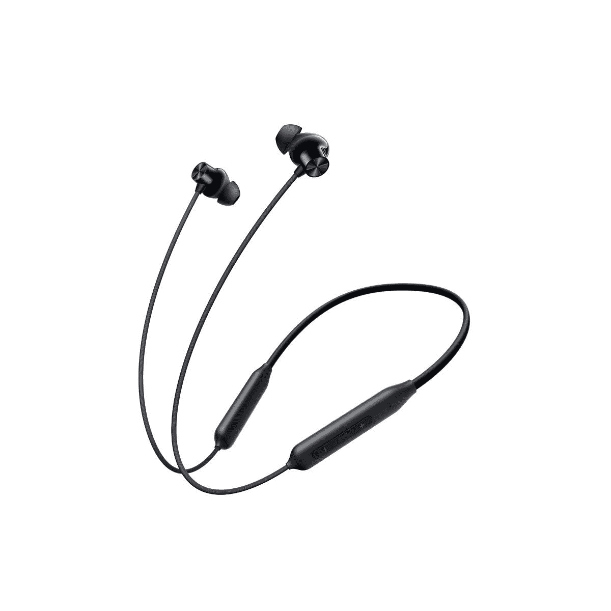
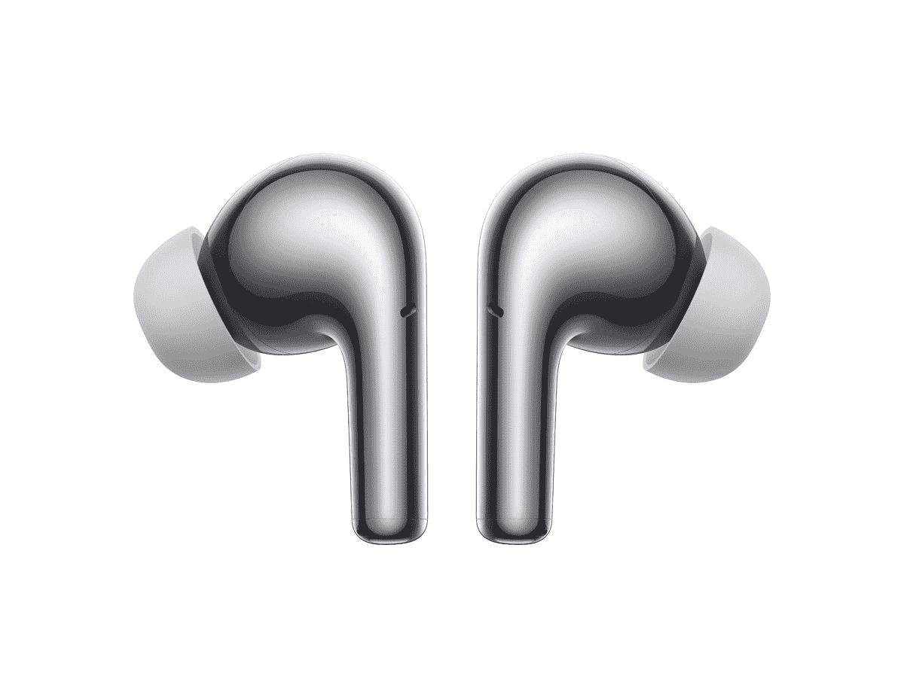

# 一加 10 Pro 终于带着 OxygenOS 12.1 全球首发；子弹无线 Z2 和辐射银芽专业标签沿

> 原文：<https://www.xda-developers.com/oneplus-10-pro-launched-globally/>

一加在今年 1 月发布了一加 10 Pro，号称是一加手机有史以来最好的规格表。有一个陷阱，那就是缺少一个非专业的变体。这里仍然只有 Pro 版本，但该公司承诺将推出比去年顶级型号更便宜但更实惠的产品。

一加 10 Pro 配备了一个[高通骁龙 8 Gen 1](https://www.xda-developers.com/qualcomm-snapdragon-8-gen-1/) ，高达 12GB 的内存，512GB 的存储空间，以及一个相当大的 6.7 英寸 LTPO 显示屏。该显示器的分辨率为 1440p，刷新率为 120Hz，最大亮度为 1500 尼特。它在美国和欧洲的起价分别为 899 美元和 899 美元，更高存储版本的起价将升至 899 美元/€999 美元。

 <picture></picture> 

OnePlus 10 Pro

##### 一加 10 专业版

一加 10 Pro 是一加最新的旗舰智能手机，搭载骁龙 8 Gen 1，高达 12GB 的内存，高达 256GB 的存储空间，以及美国以外的 80W SuperVOOC 快速充电。

## 一加 10 专业版:规格

| 

规格

 | 

一加 10 专业版

 |
| --- | --- |
| **打造** | 

*   铝制中框，玻璃背板

 |
| **尺寸&重量** | 163 x 73.9 x 8.55 毫米 |
| **显示** | 

*   6.7 英寸 QHD+120 赫兹流体 AMOLED
*   第二代 LTPO 校准:1Hz 至 120Hz

 |
| **SoC** | 高通骁龙 8 代 1 |
| **闸板&存放** | 

*   高达 12GB LPDDR5 RAM
*   高达 256GB 的 UFS 3.1 存储

 |
| **电池&充电** | 

*   5000 毫安时
*   80W SuperVOOC 有线快速充电
*   50W AirVOOC 无线快速充电
*   反向无线充电支持

 |
| **安全** | 显示屏内指纹传感器 |
| **后置摄像头** | 

*   **主:** 48MP，索尼 IMX789
*   **次要:** 50MP，超广角，三星 S5KJN1SQ03，150 FoV
*   **三级:** 8MP，OmniVision OV08A19

 |
| **前置摄像头** | 32MP，索尼 IMX615 |
| **端口** | USB Type-C 3.1 |
| **音频** | 双立体声扬声器 |
| **连通性** |  |
| **软件** | 

*   中国:基于 Android 12 的 ColorOS 12.1
*   全球:基于 Android 12 的 OxygenOS 12

 |
| **其他特性** | 

*   警报滑块
*   x 轴线性电机

 |

* * *

## 设计和展示

新的一加 10 Pro 采用了不同于该公司以前设备的全新设计。虽然这款手机从正面看起来或多或少难以区分，但背面有一个新的摄像头设计，有点让人想起三星 Galaxy S21。它从边缘开始呈方形，以容纳三个摄像头，并向外弯曲到设备的主体，而不是突然切断。哈苏品牌显著地蚀刻在相机岛的侧面。

一加 10 Pro 配备了 6.7 英寸 120 赫兹的 LTPO AMOLED 面板，与一加 9 Pro 非常相似。这是第二代 LTPO，虽然一加说可以低至 1Hz。

总体而言，一加 10 Pro 比去年的一加 9 Pro 更具个性。围绕着“P2D 50T”的信息(我们被告知这意味着“第二代，50MP，三镜头”)，有一个 LED 手电筒。下面是标准的一加徽章，没有别的了。

目前还没有消息表明一加是否打算在中国以外推出白色版的一加 10 Pro。

* * *

## 性能和软件

一加 10 Pro 拥有最新、最棒的高通骁龙 8 第 1 代 SoC。一加旗舰产品预计将采用最新的硅材料，一加 10 Pro 也不例外。该芯片组配有高达 12GB 的 LPDDR5 RAM 和高达 256GB 的 UFS 3.1 存储。如果你不熟悉，骁龙 8 Gen 1 保留了高通已经运行了一段时间的 1+3+4 配置，单个主内核基于 ARM 的新 Cortex-X2。

这基本上是迄今为止智能手机中性能最好的硬件，一加对快速流畅操作系统的承诺也体现在基于 [Android 12](https://xda-developers.com/android-12) 的 OxygenOS 12.1 上。因此，你可以期待市场上任何装有一加 10 Pro 的智能手机都具有一些最高端的性能。

一加还承诺三年的平台更新，理论上将其提升到 Android 15，之后还有一年的安全补丁。

* * *

## 照相机

虽然一加 10 Pro 的摄像头模块有了一个引人注目的新外观，但内部的硬件与去年的一加 9 Pro 相似:这是一个三摄像头系统，由一个 48MP，f/1.8，1/1.43 英寸的主摄像头组成；一个 8MP，f/2.4 的长焦变焦镜头，3.3 倍光学变焦；以及 50MP，f/2.2 超宽摄像头。主镜头和变焦镜头的传感器与一加 9 Pro 相同，所以唯一的区别是 10 Pro 使用了不同的超宽传感器。这个超宽镜头是一个三星 JN1 传感器，具有 150 度的宽视野，但由于图像传感器尺寸较小，它可以说是一个不如一加 9 Pro 的传感器。

如果你想了解我们的想法，我们已经[评测了一加 10 Pro](https://www.xda-developers.com/oneplus-10-pro-camera-review/) 的中国版相机。虽然我们印象深刻，但这是与去年的旗舰产品相比，所以我们需要等待，看看它与最近的型号相比表现如何。

* * *

## 电池和充电

一加 10 Pro 在设备中装有 5000 毫安时的电池，盒子里有一个 80W 的 SuperVOOC 充电器。这次是 OPPO 品牌的充电器，在砖块上有一个 USB-A 端口，而不是旧的 USB-C 端口。这款手机还支持 OPPO 的无线充电解决方案 50W AirVOOC。

80W SuperVOOC 充电器声称这款手机在大约半小时内充满电，这是令人难以置信的快，比去年一加 9 Pro 中包含的 65W 快速充电还要快一点。请注意，美国仍然限制这款设备只能进行 65W 充电，因为该公司声称 80W SuperVOOC 目前不支持美国电源插座中常见的 110/120 伏交流电。你不会错过太多，因为 65W 快速充电也很快，两者之间的差异可能只是几分钟。

* * *

## 一加 10 专业版:定价和供货情况

一加 10 Pro 在美国的起价为 899 美元，€在欧洲为 899 美元，英国为 799 美元。从 8GB 内存、128GB 存储型号升级到 12GB 内存和 256GB 存储，分别需要花费 999 美元、€999 美元和 899 美元。在印度，从₹66,999 的 8GB 内存、128GB 存储型号开始，一直到₹71,999 的 12GB 内存、256GB 存储型号。

这款手机现在可以在北美和欧洲预订，如果你预订的话，你会得到一双一加 Buds Pro。感兴趣的买家将能够从一加的网站和其他主要的电子商务平台，如亚马逊、百思买和 B & H，获得解锁的单元。公开销售将于 4 月 5 日开始。

 <picture></picture> 

OnePlus 10 Pro

##### 一加 10 专业版

一加 10 Pro 是一加最新的旗舰智能手机，搭载骁龙 8 Gen 1，高达 12GB 的内存，高达 256GB 的存储空间，以及美国以外的 80W SuperVOOC 快速充电功能。

* * *

## 一加子弹无线 Z2

| 

规范

 | 

一加子弹无线 Z2

 |
| --- | --- |
| **颜色** | Magico 黑色和光束蓝色 |
| **尺寸** | 124.3 x 174.5 x 13.1 毫米 |
| **重量** | 230 克 |
| **驱动尺寸** | 12.4 毫米 |
| **频率响应范围** | 20Hz-20000 khz |
| **驾驶员敏感度** | 

*   400 赫兹时为 114 3dB
*   1000 赫兹时为 109±1 分贝

 |
| **编解码器支持** | AAC 和 SBC |
| **最大声压级** | 102 分贝 |
| **阻抗** | 32Ω |
| **蓝牙版** | 蓝牙 5.0 |
| **蓝牙连接范围** | 10 米 |
| **电池容量** | 200 毫安时 |
| **电池寿命和快速充电** | 50%体积时 30 小时，20 小时 10 分钟 |
| **触摸功能** | 单触、双触、三触、长触 |
| **防水防尘** | IP55 |
| **语音助手** | 是 |
| **价格和供货情况** | 印度@ ₹xx |

一加还在印度推出了一加子弹无线 Z2，这是最初的一加子弹无线 Z 的继任者。它们提供了更快的充电速度，更好的电池寿命，更大的驱动器，可以在你的耳朵里更好地再现声音，比子弹无线 Z 和子弹无线 Z 低音版更全面。

首先，一加承诺，10 分钟的充电时间将为你带来 20 小时的播放时间，是一加子弹无线 z 在相同时间内充电时间的两倍。充满电也将为你带来 30 小时的播放时间。对于一副耳机来说，这是令人难以置信的快速充电，基本上只需充电十分钟就可以让你使用几天。

更棒的是为一加子弹无线 Z 的音频提供动力的 12.4 毫米驱动器——迄今为止一加音频产品中最大的驱动器。它们将为您的音乐提供更丰富、更深沉的低音，通过采用反失真算法，增加音量仍将提供清晰的音频质量。

一加子弹无线 Z2 是 IP55 防尘防水，有两种颜色；Magico 黑色和 Beam 蓝色。这些耳机将于 4 月 4 日开始预售，4 月 5 日公开销售，售价为₹1,999.

 <picture></picture> 

OnePlus Bullets Wireless Z2

##### 一加子弹无线 Z2

一加子弹无线 Z2 功能更好的电池寿命，更快的充电速度，比原来的子弹无线 Z 更大的驱动器

* * *

## 一加芽专业辐射银

一加 Buds Pro 于去年推出，集一加耳机的最佳音频体验于一身。它们具有智能自适应噪声消除(ANC)支持，使用每个耳塞中的三麦克风设置淹没高达 40dB 的环境噪声。耳塞还具有“增强的降噪算法和机械设计”，以减少风噪，并在通话中提供清晰的音频质量。它们还具有一加音频 ID，这是一种校准的声音配置文件，可满足用户特定的声音敏感度。它们有 11 毫米动态驱动器，杜比 Atmos 支持，一次充电可使用长达 38 小时。总而言之，它们是一副相当高端的耳机。现在，一加推出了一种新的颜色——闪亮的银色。

一加说，这些“复制”了不锈钢的外观和感觉，外壳和耳机本身都遵循了新的配色。它们将于 4 月 4 日开始预售，4 月 5 日公开发售，每 139/₹9,990.€售价 149 英镑

 <picture></picture> 

OnePlus Buds Pro in Radiant Silver

##### 一加芽专业

一加芽专业是一加最优质的耳机，这些包装所有相同的功能，但在一个新的配色-辐射银。