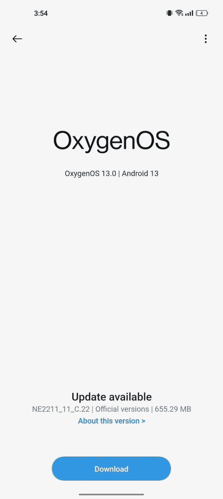

# 一加 10 Pro 更新提供了 11 月补丁以及令人印象深刻的优化和修复列表

> 原文：<https://www.xda-developers.com/oneplus-10-pro-oxygneos-13-c22-november-2022-patches/>

# 一加 10 Pro 的最新更新带来了 2022 年 11 月的补丁和几个错误修复

都快 12 月了，谁还在数？

最近的一加“专业”旗舰的所有者，是时候检查你的通知栏了:该公司正在给你发送一个新的软件更新。一加 10 Pro 现在收到了 OxygenOS 13 的 C.22 版本，该版本带来了一系列错误修复和系统改进。幸运的是，随着我们越来越接近月底，2022 年 11 月的安全补丁也已经到来。

 <picture></picture> 

Credit: Daringsourabh on the OnePlus Community forums

除了相机崩溃修复和通常的稳定性和性能增强，该公司还强调了其系统软件的三个不同的增强。它们与最近的应用程序切换滞后、黑暗模式下的屏幕闪烁错误和锁屏背景故障有关。

以下是完整的变更日志:

*   系统
    *   集成 2022 年 11 月 Android 安全补丁，增强系统安全性。
    *   提高系统稳定性和性能。
    *   增加可以在后台保持活动的应用程序的数量。
    *   修复了切换到黑暗模式后使用指纹解锁设备时可能出现的屏幕闪烁问题。
    *   修复了在最近的任务中切换应用程序时可能出现的延迟问题。
    *   修复了影响锁定屏幕背景的显示问题。

*   连接
    *   提高 Wi-Fi 连接的稳定性。

*   照相机
    *   修复了相机应用程序在某些情况下可能崩溃的问题。

**[一加十大职业 XDA 论坛](https://forum.xda-developers.com/f/oneplus-10-pro.12503/)**

## 为一加 10 专业版下载 OxygenOS 13 C.22

与一加的所有软件更新一样，适用于一加 10 Pro 的 OxygenOS 13 C.22 将以增量方式向用户推出。如果您的设备上没有收到更新，并且您不想等待它，您可以从下面提供的链接下载它，然后[手动刷新它](https://www.xda-developers.com/how-to-install-oxygenos-ota-updates-on-oneplus-phones/)。

*   一加 10 专业版
    *   印度(NE2211_11。C.22)
    *   欧洲(NE2213_11。C.22)
    *   全局(NE2213_11_C.22)
    *   北美(NE2215_11。C.22)

*感谢 XDA 资深会员 [Some_Random_Username](https://forum.xda-developers.com/m/some_random_username.8234677/) 和 XDA 认可开发者 [mlgmxyysd](https://forum.xda-developers.com/m/mlgmxyysd.8430637/) 提供下载链接！*

* * *

**来源** : [一加社区论坛](https://community.oneplus.com/thread/1210492219682193413)