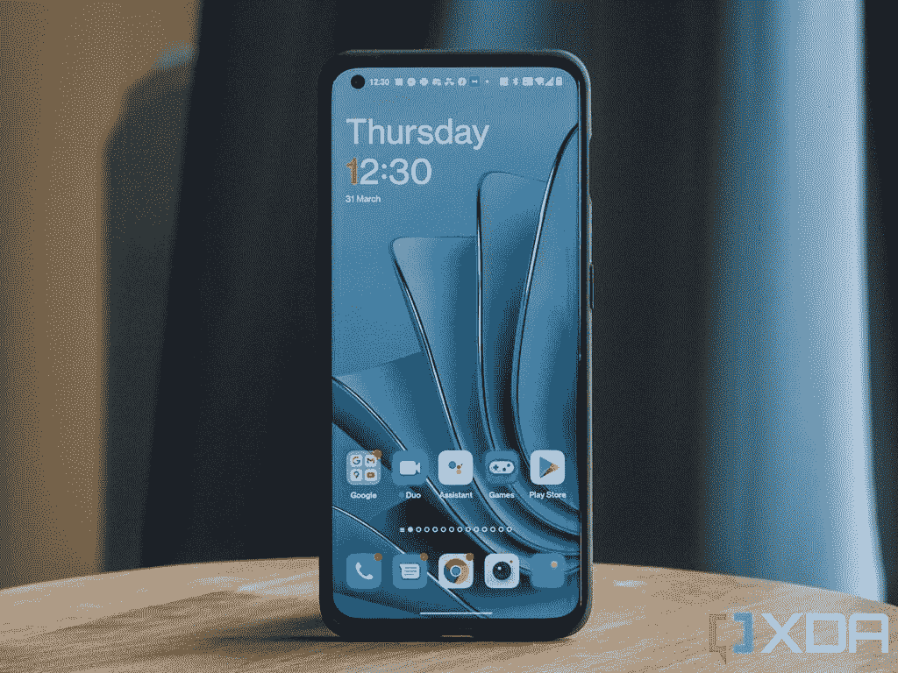

# 一加 10 专业评论:一加 9T 专业从来没有

> 原文：<https://www.xda-developers.com/oneplus-10-pro-review/>

一加在试图平衡发烧友群体和大众时总是处于一个微妙的位置。一方面，该公司的不稳定开端导致了一个有趣的失败者故事。但另一方面，该公司已经偏离了许多让其智能手机变得伟大的东西。在过去的一年里，我们看到一加与 OPPO 的关系越来越密切，许多人担心我们所熟悉和热爱的一加已经不在了。然而，对于一加 10 Pro，该公司明确表示，它还没有解决。

一加很多营销活动的问题在于，其“永不和解”的口号越来越容易变成对公司的一种侮辱。几乎每年我们在购买一加设备时都不得不“适应”智能手机体验的一个方面。但这一次，比以往任何时候都更难说出价格。起价 899 美元，这实际上比去年发布的一加 9 Pro 在 T2 便宜，但没有多少地方你可以说你正在降级。

总体而言，一加 10 Pro 巩固了一加作为高端智能手机品牌的地位，值得您花费时间。此外，也许有些争议，我认为 ColorOS 代码库合并是一加智能手机多年来发生的最好的事情之一。更进一步说，我希望一加和 OPPO 已经开始使用统一的操作系统，因为这将节省开发时间，确保增加稳定性。

如果你想买一台一加 10 Pro，那么我会非常谨慎地考虑原因。这感觉不像一加 10 专业版:感觉更像一加 9T 专业版。开箱即用的 SoC 表现类似，广角摄像头实际上是一个降级，稍微快一点的充电实际上是*更差*当你考虑到充电的时间基本相同**和**你会得到一个更差的充电器。有一些改进，但它们是微不足道的，你需要问问自己，一加 10 Pro 是否值得比一加 9 Pro 多花 100 美元。这就是为什么它让我们想起了一加曾经为其旗舰产品做过的中期“T”升级——如果设计相似，一加 10 Pro 完全可以冒充一加 9T Pro。

 <picture></picture> 

OnePlus 10 Pro

##### 一加 10 专业版

一加 10 Pro 是一加最新最棒的旗舰智能手机，将一些性能最好的硬件打包在一个包中。它有一个伟大的芯片组，良好的摄像头，和超级快速充电都在一个独特的设计。

***关于本次回顾:*** *我于 2022 年 3 月 21 日收到了来自英国一加的一加 10 Pro。我们还在美国和印度收到了来自各自 pr 的一加 10 Pro。一加没有对这次审查的内容提出任何意见。*

* * *

## 一加 10 专业版:规格

| 

规格

 | 

一加 10 专业版

 |
| --- | --- |
| **构建** | 

*   铝制中框，玻璃背板

 |
| **尺寸&重量** | 163 x 73.9 x 8.55 毫米 |
| **显示** | 

*   6.7 英寸 QHD+120 赫兹流体 AMOLED
*   第二代 LTPO 校准:1Hz 至 120Hz

 |
| **SoC** | 高通骁龙 8 代 1 |
| **RAM &存储** | 

*   高达 12GB LPDDR5 RAM
*   高达 256GB 的 UFS 3.1 存储

 |
| **电池&充电** | 

*   5000 毫安时
*   80W SuperVOOC 有线快充(北美仅限 65W)
*   50W AirVOOC 无线快速充电
*   反向无线充电支持

 |
| **安全** | 显示屏内指纹传感器 |
| **后置摄像头** | 

*   **主:** 48MP，索尼 IMX789
*   **次要:** 50MP，超广角，三星 S5KJN1SQ03，150 FoV
*   **三级:** 8MP，OmniVision OV08A19

 |
| **前置摄像头** | 32MP，索尼 IMX615 |
| **端口** | USB Type-C 3.1 |
| **音频** | 双立体声扬声器 |
| **连通性** |  |
| **软件** | 

*   中国:基于 Android 12 的 ColorOS 12.1
*   全球:[基于 Android 12 的 OxygenOS](https://www.xda-developers.com/tag/oxygenos/) 12.1

 |
| **其他特性** | 

*   警报滑块
*   x 轴线性电机

 |

* * *

## 一加 10 专业版:设计

*   全新的独特设计
*   非常优质的感觉
*   可在阳光直射下看到的出色显示

一加 10 Pro 看起来与该公司过去的设备明显不同，这在很大程度上归功于背面的新相机设计。虽然从正面看，这款手机与其他手机几乎没有什么区别，但背面却是一个完全不同的故事。它从边缘开始呈方形，以容纳三个摄像头，并向外弯曲到设备的主体，而不是突然切断。哈苏品牌显著地蚀刻在相机岛的侧面。

[sc name = " pull-quote-wide " quote = "一加 10 Pro 的显示屏看起来很棒，外面光线充足，由于其最大亮度为 1300 尼特，即使在阳光直射下也保持可见"]

不过，在那个难以区分的前端，该设备装有 6.7 英寸 120Hz LTPO AMOLED 面板，与一加 9 Pro 非常相似。这是第二代 LTPO，虽然一加说可以低至 1Hz。它看起来很棒，外面很亮，由于其最大亮度为 1300 尼特，即使在阳光直射下也能保持可见。

 <picture></picture> 

OnePlus 10 Pro in sandstone black case

总体而言，一加 10 Pro 比一加 9 Pro 更具个性

总体而言，一加 10 Pro 比去年的一加 9 Pro 更具个性。围绕着“P2D 50T”的信息(我们被告知这意味着“第二代手机，50MP，三镜头”-是的，我们也不明白)，有一个 LED 手电筒。下面是标准的一加徽章，没有别的了。

手机顶部有一个扬声器格栅，既可以作为耳机，也可以作为第二个扬声器，尽管它没有底部发射扬声器那么大声。它们听起来很不错，声音也很大。

这款手机很厚，拿在手中有点重，尽管 OxygenOS 12.1 的单手模式在试图单手使用手机时有所帮助。背面根本不是指纹磁铁，有轻微的哑光感所以也不滑。

触觉方面，一加 10 Pro 也做得非常出色

触觉方面，一加 10 Pro 也做得非常出色。它不如 iPhone 13 Pro、三星 Galaxy S22 Ultra 或谷歌 Pixel 6 Pro，但在我看来，它们是当前智能手机硬件的巅峰。当你将一加 10 Pro 与价格高得多的手机(谷歌 Pixel 6 Pro 除外)进行比较时，它就很能说明问题，并可能让你知道它们仍然有多好。我能感觉到口袋里的通知，打字感觉很好，这对我来说就足够了。

我对这个设计的一个主要抱怨是，我有点困惑为什么“P2D 50 吨”的信息会印在背面，因为它看起来很碍眼，没有任何特殊的意义。我推测 50 可能是指 50MP 主摄像头，但我不知道其余部分是什么意思，也不知道为什么会在那里，直到我问了一加。

我们有翠绿色的变体，虽然我不是绿色手机的典型粉丝，但我可以处理一加 10 Pro 在这种配色中的外观。这不是我见过的最糟糕的绿色手机，你在盒子里得到的附带外壳也是同样的颜色。一加还提供其他手机保护套，尽管量子摄影保护套看起来有点俗气和怪异。我一直用的是[黑砂岩保险杠套](https://onepluscom.pxf.io/c/2233363/916678/12532?subId1=UUxdaUeUpU40733&subId2=exda&u=https%3A%2F%2Fwww.oneplus.com%2Fproduct%2Foneplus-10-pro-sandstone-bumper-case)。

遗憾的是，目前还不知道一加是否打算在中国以外推出白色版的一加 10 Pro。

* * *

## 一加 10 专业版:相机

*   就像一加 9 专业版一样出色的主传感器
*   降级超宽传感器
*   长焦在弱光下挣扎

我们已经在 XDA 上广泛地评论了相机，所以一定要看看我们对一加 10 Pro 的[相机评论。不过，我还是总结一下自己的经历。我发现一加 10 Pro 的相机在主传感器上表现非常好，在日常使用中拍摄了一些非常棒的照片。这是一台索尼 IMX789，与一加 9 Pro 一样，能够拍摄出精彩的照片。一加 10 Pro 的相机质量远不及](https://www.xda-developers.com/oneplus-10-pro-camera-review/) [Pixel 6 Pro](https://www.xda-developers.com/google-pixel-6-pro-camera-review/) 或 Vivo X70 Pro Plus，但它也和任何旗舰级相机一样耐用。

如果你是为相机购买一加 10 专业版，你可能不应该这样做

不过，让我失望的是超宽传感器。它没有去年的传感器好，一加 9 Pro 的超宽传感器采用了索尼 IMX766。今年的一加 10 Pro 只装有三星 JN1，这是一个较小的传感器，无法拍摄高质量的照片。当你用一加 10 Pro 拍照时，你可能会注意到照片质量略有下降，但这是因为传感器较小。长焦相机有时也在弱光下挣扎。

总的来说，一加 10 Pro 在拍照性能上很受欢迎，尽管感觉该公司在这方面并没有太大的飞跃。对主传感器的任何改进都只能通过软件来实现，在这种情况下，它可能会被移植到一加 9 Pro 上。换句话说，如果你是为了相机而购买一加 10 Pro，你可能不应该这样做。以更低的价格购买一加 9 Pro，或者完全购买另一部手机。

* * *

## 一加 10 专业版:性能

*   开箱后的性能大致相当于骁龙 888
*   没有基准作弊
*   出色的游戏性能

如果说一加有什么是众所周知的，那就是业绩，该公司真的很重视这一点。一加 10 Pro 集智能手机迄今为止最好的硬件于一身，拥有最快的 UFS 3.1 存储，高达 12GB 的 LPDDR5 RAM，以及迄今为止最好的高通芯片组——高通骁龙 8 Gen 1。它具有超越其前辈的所有代次飞跃和 4 纳米节点尺寸，可在不大幅增加功耗的情况下获得更好的性能。骁龙 8 Gen 1 保留了高通已经运行了一段时间的 1+3+4 配置，单个 Prime 内核基于 ARM 的新 Cortex-X2。

如果说一加有什么出名的话，那就是表演

Kryo 内核基于 ARMv9 架构。使用新技术的第一批 CPU 设计是 Cortex-X2、Cortex-A710 和 Cortex-A510，这些正是构成高通 Kryo 芯片基础的 CPU 设计。对于骁龙 8 Gen 1，单一的 Cortex-X2 内核的时钟频率为 3GHz。Cortex-A710 中间内核的效率比其前身 A78 提高了 30%，性能提升了 10%。Cortex-A710 内核的主频为 2.5GHz。至于三个 Kryo 效率内核，它们基于新的 Cortex-A510 设计。Cortex-A510 的性能比 A55 提高了 35%,效率也提高了 20%。这些内核的时钟频率为 1.79GHz。

然而，事情是这样的。根据骁龙 8 Gen 1 参考结果，我和我的同事 Aamir Siddiqui 在 AnTuTu 和 Geekbench 5 中得到的结果比我们预期的要低得多。我在 Geekbench 5 中的成绩比预期的低了几百分，在 AnTuTu 中，少了 20 万分。好像有点不对劲，所以我调查了一下。从我的调查结果来看，似乎一加已经默认限制了骁龙 8 代 1 的整体性能。

在我的测试中，我测得一加 10 Pro 实际上可以达到的峰值频率是主内核 2.4GHz，中间内核 2.1GHz，高效内核 1.79GHz。一加限制骁龙 8 Gen 1 的性能可能有两个原因:节省电池，反过来，也产生更少的热量。我花了两天时间运行了九个 CPU 节流测试(相当于 4.5 小时的测试)，以及其他基准测试，并尽可能正常使用我的手机。根据 DevCheck 的说法，这两天我的手机只有九分钟在 2.9GHz。我运行了 Geekbench 5，在整个测试中，花在 2.9GHz 上的时间增加了三秒。让手机真正达到这些时钟速度是非常困难的，这让我相信一加缩小了允许一些内核提升到峰值频率的条件。一加也从未在其网站的任何规格表上提及骁龙 8 Gen 1 的频率，也没有在评论指南中提及。

一加在这里做出了正确和诚实的举动，应该为此受到赞扬

我已经测试过了，它不是一加在某些应用程序运行时解锁的东西。基准测试得分低于其他设备，但唯一的选择是像三星或小米那样做，将频率乘数提高到骁龙 8 Gen 1 在检测到基准测试应用程序或游戏运行时实际能够*仅*的水平。**一加在这里做出了正确和诚实的举动，应该为此受到赞扬。**我能找到的唯一错误是，一加对此并不坦率，但你实际上**可以**禁用它。进入你的手机的电池设置和高级部分，你可以启用“高性能模式”，这将使你的手机更容易达到那些更高的频率。启用它会显示一个警告，告诉你你的手机会变热，甚至会推送一个同样的通知。

尽管人为限制了性能，但一加 10 Pro 仍然在性能上表现出色

尽管人为限制了性能，但一加 10 Pro 仍然在性能上表现出色。当谈到提供最高性价比时，它不像该公司其他年份的产品那样完美主义，但鉴于消费者在骁龙 8 Gen 1 热卖中面临的一系列问题，它是消费者的最佳选择。您仍然可以获得骁龙 888 的卓越性能，但有足够的处理空间，产生的热量更少。此外，一加似乎允许在某些条件下临时使用这些峰值频率，即使在高性能模式之外。当然，您也可以从 GPU 和 SoC 的其他部分中获益。

鉴于许多制造商目前因仅在检测到某些包正在运行时才提高其设备的性能而受到抨击，我们也进行了大量测试，以了解一加是否也在从事同样的做法。我们运行了 Geekbench 5 的股票版本和 CPU 节流测试，我们还重新打包了这两个应用程序，以使用 Genshin Impact 的包名。结果显示，一加似乎没有以任何方式进行任何形式的优惠待遇，这是一件好事。

### 应用程序打开速度基准

我们使用 Android 的 ActivityManager shell 接口创建了一个内部应用启动速度测试脚本，来测量 9 个应用的主活动从冷启动(即当不在存储器中时)。我为一加 10 Pro 修改了这个测试。这 9 个应用程序是谷歌浏览器、Gmail、谷歌地图、信息、谷歌照片、谷歌 Play 商店、Slack、Twitter 和 YouTube。我们在 10 次迭代中启动了这 9 个活动(并在启动之间终止了每个应用程序)以减少差异。有趣的是，所有的应用程序启动都很快，与我在其他设备上的体验相比，我从来没有觉得一个应用程序需要太长时间才能加载。这些结果还不错，尽管比我预期的稍差。结果也有很大的差异。

老实说，这些结果*也*有点令人失望。这些发射时间实际上比一加 9 Pro 实现的要慢；不多，但足以让我质疑原因可能是什么。不过，直到实际使用手机时，我才注意到这一点，所以我不会太轻视它。这只是需要注意的一些事情，因为我很困惑一加会允许其旗舰智能手机的性能下降。

### UI 口吃/邱建测试

一加 10 Pro 拥有 120Hz 的刷新率显示屏，但这款手机实际上能保持 120 FPS 吗？我感觉一加 10 Pro 非常流畅，没有太多的“微口吃”或明显的帧速率下降。虽然手机会在视频开始播放时将刷新率降至 60 赫兹，但我测试了在脸书或推特上滚动，提要**中的视频不会将刷新率降至 60 赫兹**。这意味着你可以在社交媒体上滚动，而不会一直在 60Hz 和 120Hz 之间切换。

为了量化一加 10 Pro 在现实场景中保持 120 FPS 的表现，我们运行了谷歌开源 JankBench 基准的修改版。该基准测试模拟了您将在日常应用中看到的一些常见任务，包括滚动带文本的列表视图、滚动带图像的列表视图、滚动带阴影效果的网格视图、滚动低命中率文本渲染视图、滚动高命中率文本渲染视图、用键盘输入和编辑文本、用卡片重复透支以及上传位图。我们的脚本记录了测试过程中每一帧的绘制时间，最终在一个图中绘制出所有帧及其绘制时间，以及几条代表 4 种常见显示器刷新率(60Hz、90Hz、120Hz 和 144Hz)的目标帧绘制时间的水平线。)

有趣的是，一加似乎对何时允许显示器达到其真正的 120Hz 潜力非常挑剔。究竟是性能原因还是散热原因尚不清楚，但上述测试显示了不同的目标刷新率。与谷歌 Pixel 6 Pro 相比，一加允许该设备实现的帧速率是一致的，尽管原因尚不清楚。然而，我从来没有注意到手机在使用时会降低刷新率(我通常对此很敏感)，如果这是因为一加已经接近完美地降低了显示屏的刷新率，那我完全没问题。

### 持续的性能和热量

如果你想要持续的性能，你需要专业玩家模式

持续的性能非常重要，尤其是如果你是一个手机游戏玩家。事情是这样的:一加在游戏中耍了一些花招，而且这真的不难发现。此外，该公司对此也非常开放，宣传其 Hyperboost 游戏技术将提高游戏性能。我们能够将 CPU 节流测试重新打包为 Genshin Impact，设备将识别它并在“专业玩家模式”下执行应用程序。这种“职业玩家模式”减少了热量节流，这意味着结果比常规版本的测试保持更高的时间更长。

一加没有隐瞒这项技术的存在，事实上，在发射活动中公开宣传这项技术。这不像三星和小米都被指控的基准欺诈那样邪恶，但它将一加置于一个有趣的位置。例如，它是否面临着来自 Geekbench 的同样愤怒？鉴于此，除非手机已经预热，否则你不会看到比平时更高的结果，我不太确定。据我所知，它只是提高了热限制，以减少热节流，仅此而已。看看下面这三个测试，是我在“职业玩家模式”下进行的 CPU 节流测试。

现在，将它与未被改动的应用程序版本进行比较。它的节流时间比启用职业玩家模式时提前了大约五分钟。不过，最高可得分数大致相同。

当我们联系一加时，我们得到了以下信息:

*“超加速游戏引擎技术[...]与兼容游戏配合使用，使其运行更流畅。Hyperboost 的兼容游戏之一是 Genshin Impact，所以这应该可以解释你看到的结果。当然，我们正在与尽可能多的游戏品牌合作，让这项技术得到更广泛的支持。”*

老实说，我希望“职业玩家模式”也能支持高性能模式。我不明白为什么没有，因为它只会有意义。启用职业玩家模式应该集所有功能于一身，但目前，一加还没有做到这一点。要获得最佳性能，您需要首先启用高性能模式，然后启用专业玩家模式。然而，很高兴看到一加在检测游戏或基准测试时似乎没有提高 CPU 频率。

### 游戏性能和存储速度

一加 10 Pro 拥有出色的 GPU，但我们已经知道这一点。它似乎没有受到任何大规模的节流，事实上，即使在我自己的游戏体验中，它也表现得非常好。AetherSX2 之类的模拟器工作得非常好(我一直很喜欢 *Ratchet & Clank* )，而且体验比一加 9 Pro 好得多，例如在游戏性能方面。总体而言，一加 10 Pro 似乎是一款相当不错的游戏手机，不过我会推荐更像 [RedMagic 7](https://www.xda-developers.com/redmagic-7-review/) 的手机，以获得更好的游戏性能，特别是持续性能。

* * *

## 一加 10 专业版:电池和充电

*   80W 快充快，跟 65W 充电一样快
*   良好的电池寿命
*   80W 充电砖比 65W 充电砖差

一加 10 Pro 在包装盒中装有 5000 毫安时电池和 80W 充电器...也就是说，只要你住在北美以外。美国的一加粉丝将不得不在盒子里为 65W 的充电解决*。原因？一加表示，它使用的 SuperVOOC 充电不支持美国的 110V/120V 电源插座，因为世界其他地方一般使用 220V。*

虽然乍一看肯定很糟糕，但我们使用随附的 80W 充电器、一加 9 Pro 的 65W 充电器和一加 50W 无线充电器测试了一加 10 Pro 从 10%到 90%的充电速度。虽然与 50W 无线充电相比，差异会很明显，但 80W 充电和 65W 充电之间几乎没有任何差异。你实际上并没有错过，正如我们下面进一步提到的，实际上 65W 充电对你更好。

就 0-100%而言，80W SuperVOOC 可以在 33 分钟内充满电，50W AirVOOC 可以在 46 分钟内充满电。相比之下，使用 65W 充电器充电需要 35 分钟，意味着全球变型和北美变型在充电速度上的差异可以忽略不计。

总而言之，很难说消费者真的被骗了。这两种充电类型基本相同，尽管当 OPPO 正在研究高达 250W 的充电速度时，我会担心未来。在我看来，很明显，OPPO 不再将美国视为一个重要的市场，这意味着这些新的充电技术可能不会优先进入市场。OPPO 不在美国发布手机，所以除非一加变得足够重要，让 OPPO 优先考虑为美国的电源插座开发充电技术，否则 65W 充电很可能将是一加所能达到的峰值。

除了充电失败之外，与今年发布的其他旗舰产品相比，我对电池寿命也印象深刻，尽管与前几年相比，电池寿命仍然有点低。我一直坚持长时间使用手机超过五个小时，这对于我使用手机的时间来说是一个不小的成就。我使用很多社交媒体，拍照，听音乐，看视频，甚至偶尔玩玩小游戏。

如上所述，这是否可能与一加在性能和刷新率方面明显的笨拙有关？有可能，尽管我不知道为什么有人会在意。我没有*注意到*任何性能下降或帧速率降低，在一天结束时，这才是最重要的。不管发生了什么，好的表现就是好的表现。总的来说，我喜欢一加 10 Pro 的电池续航时间和电池充电速度——不管它是 65W 还是 80W。

然而，我有一个主要的抱怨，实际上是关于 80W 充电器本身。一加的 65W 充电砖是一个很好的充电器，不仅因为它可以为一加手机提供高安培数，而且它实际上是最好的 USB 供电兼容充电器之一*。它可以以 45W 的功率为一系列设备充电，没有任何问题，我经常用它为笔记本电脑、谷歌 Pixel、任天堂 Switch 和其他接受 USB 供电的设备充电。*

 *北美用户最好使用 65W 的充电器，而不是 80W 的充电器

鉴于 80W 充电器与美国用户获得的 65W 充电器相比并没有任何真正的速度优势，我实际上认为北美用户在盒子中使用 65W 充电器比 80W 充电器更好。当谈到两者之间的充电速度差异时，可能会有几分钟的差异，但是，65W 充电器的效用要大得多。我很恼火这种变化正在发生，我希望该公司在未来回到运送 USB 电源传输兼容充电器。

* * *

## 一加 10 专业版:OxygenOS 12.1

*   比最初的 OxygenOS 12 释放有了很大的改善
*   看起来不错
*   ColorOS 12 引擎盖下

我花了六年时间才能够在一加的智能手机上可靠地收到通知，但老天保佑，他们终于做到了

还记得 OxygenOS 12 首次亮相时的混乱场面吗？谢天谢地，OxygenOS 12.1 要好得多。我在一加 10 Pro 上比以前任何版本的 OxgyenOS 都更喜欢它，令人震惊的是，其中一个原因是我终于收到通知了。我花了六年时间才能够在一加智能手机上可靠地收到通知，但老天保佑，他们终于做到了。我收到电子邮件，收到延期通知，甚至收到*银行*警报。举例来说，我知道这对于任何一个 iPhone 用户来说听起来有多荒谬，但是我完全被震惊了，欣喜若狂。

除此之外，一加自己的安卓系统与之前的版本并没有太大的不同。从视觉上看，一切看起来都差不多。你知道和喜欢的相同定制选项都存在，一加发射器和一加架子也在那里，这是一个非常好的全面体验，即使我发现 OxygenOS 现在缺少一些与竞争对手相比的功能。在我看来，就定制而言，甚至谷歌也开始胜过一加——谷歌并不以让用户在 Pixel 手机上定制太多而闻名。

老实说，我认为这部分归功于 ColorOS 和 OxygenOS 的合并，但我也认为 OPLUS 应该继续致力于统一操作系统。这仍然是与 ColorOS 合并的代码库，如果你寻找它，它在整个系统中非常明显。同样提到的“VOOC”(而不是 Warp Charge)，还有设置应用程序的布局都是直接从 ColorOS 抄袭来的。这并不是一件坏事，但本质上采用 ColorOS 并将其重新皮肤化为 OxygenOS 需要开发时间，并且会引入自己的错误。对“统一操作系统”的愤怒实际上并没有得到回应，因为它仍然是非常 ColorOS 的引擎盖下。

事实上，为了说明这一点，当设置一加 10 专业版时，我遇到了一些非常有趣的事情。我最近评论了 [Realme GT 2 Pro](https://www.xda-developers.com/realme-gt-2-pro-review/) ，这款手机的一个功能是“GT 模式”，本质上是一种系统范围的游戏模式，在性能方面将一切设置为全速。我在发布时的谷歌设置期间恢复了我在一加 10 Pro 上的 Realme GT 2 Pro 设置，有趣的是，GT 模式切换也在一加 10 Pro 上恢复了。它没有被跳过，因为，不管出于什么原因，它被认为是兼容的。几个小时后，我注意到开关消失了。

因此，我认为 OxygenOS 显然有些“古怪”。操作系统肯定有一些方面让我很困惑。例如，可以从手机右上方拉下的一加搁板实际上是一个应用程序，而不仅仅是一个类似于通知抽屉的覆盖层。在没有 YouTube Premium 的情况下观看 YouTube 时拉下它会暂停您正在观看的视频，并且很容易不小心拉下它。向上滑动关闭它实际上会绘制一个动画，就像你正在关闭一个应用程序一样，因为它随后会从手机的底部消失。非常奇怪。OxygenOS 12.1 非常稳定，这是最重要的。

至于软件更新，一加承诺三年进行重大更新，四年进行安全更新。理论上，这应该会让一加 10 Pro 一直升级到 Android 15。

* * *

## 一加 10 专业版:杂项

### 扬声器

一加 10 Pro 的扬声器听起来很好，声音也很大。这里没有我的抱怨——总的来说，我是一个球迷。它们的声音和三星 Galaxy S22 Ultra 或 iPhone 13 Pro 一样大，考虑到它们只是手机扬声器，它们听起来还不错。

### 指纹扫描仪

上一代一加 9 系列的特点是显示屏上的光学指纹扫描仪，位于手机的底部边缘。这有点奇怪，很难用你的拇指来定位，尽管你最终会习惯的。一加 10 Pro 将指纹扫描仪从底部恢复到传统预期的高度。它和以前一样好用，现在你也不用做任何手指体操了。

### 电话、信号强度和 5G

一加 10 Pro 的信号强度非常好，在我知道以前的骁龙 888 设备无法接收到信号的地方，我可以接收到信号。这里没有我的抱怨，其他打电话的人也能听得很清楚。

同样值得记住的是，一加 10 Pro 的 5G 功能有几个警告。其中一个没有毫米波支持，美国电话电报公司也不会有 5G 支持，就像一加 9 Pro 一样。美国的竞争在这方面更胜一筹，所以你需要评估这些是否是你的交易破坏者。

### 引导加载程序解锁和内核源代码

一加在解锁引导程序方面一直做得很好，一加 10 Pro 也不例外。你可以像往常一样在你的开发者选项中解锁引导加载程序，而且该公司也在按时发布内核源代码方面做得很好*。它们还没有发表，但希望在未来几天手机到达普通消费者手中之前会发表。当他们进行平台跳转时，他们的来源确实会过时，所以请记住这一点。*

### 从技术上讲，这是一部折叠式手机

JerryRigEverything 发现一加 10 Pro 是一款折叠手机，尽管这是一次性操作。在他对一加 10 Pro 的耐用性测试中，这款设备在弯曲测试中崩溃，这意味着你可能应该小心你后口袋中的手机。虽然你可能很难将手机掰成两半，但如果你以正确的(或者我猜是错误的)方式持续施加压力，它可能最终会弯曲。一加还没有解决掰成两半的问题，但无论如何，要小心一加 10 Pro。

### 薛定谔的 IP68 等级

一加 10 Pro 的 IP 评级问题实际上有点滑稽，因为它表明 IP 评级只是一个许可问题。总结一下我们之前在这里讨论过的:IP 等级并不能保证你的手机在被水损坏后会得到保修。相反，它确保的是你的手机是防水的*，但如果水进入，那么你仍然要支付保修期外的维修费用。IP 等级仅仅给你一个概念，什么样的*应该*是没问题的。*

 *尽管如此，一加 10 Pro 的防护等级为 IP68...只在 T-Mobile 上。然而，这款手机在其他地区的结构是相同的(除了根据美国法律，NA 一加 10 Pro 在相机模块的中心也有一个气压计)，这意味着它在美国的 IP68 等级实际上也适用于全球。一加不能在规格表上做广告，因为 IP 等级是公司花钱购买广告许可证的东西，但请放心，你的手机是防水的。

本质上，一加 10 Pro 的防护等级为 IP68，但它也没有。

* * *

## 一加 10 专业版物有所值吗？

一加 10 专业本质上是一加 9T 专业从来没有。它在所有方面都有微小的改进，但没有一个是那么重要的。对于一些人来说，很难证明为基本型号额外投资 100 美元是合理的，但如果你能以低得多的价格买到一加 9 Pro，那么老实说，我不确定一加 10 Pro 是否值得。

开箱即用的性能将与一加 9 Pro 相似，相机体验也将相似，充电也是如此。虽然有些人对他们在美国只能获得 65W 充电感到恼火(理论上你应该这样)，但当使用 80W 充电而不是 65W 充电时，真的没有太大的升级。事实上，在我看来，65W 的一加充电器既好又通用，这使得它比一加 10 Pro 附带的 80W 充电器更好。这在很大程度上也证明了一个事实，即一加 9 Pro 本身其实是一款非常好的产品，价格下降使它比推出时更划算。由于当时的竞争，一加 9 Pro 确实没有引起人们的注意。OxygenOS 12 的更新确实带来了负面影响，尽管围绕更新的许多问题已经得到了充分解决。

总而言之，一加 10 Pro 处于一个奇怪的境地。这是一款出色的手机，但很难证明比该公司自己的一加 9 Pro 多花的钱是合理的。如果你打算买一部一加智能手机，那么评估一下你是否需要为一加 10 Pro 多花点钱。[一加 9 Pro 经常有很棒的交易](https://www.xda-developers.com/best-oneplus-9-deals/)，很值得选择。如果你真的想买一台一加 10 Pro，那么一定要看看你能得到的最好的交易和最好的案例。**