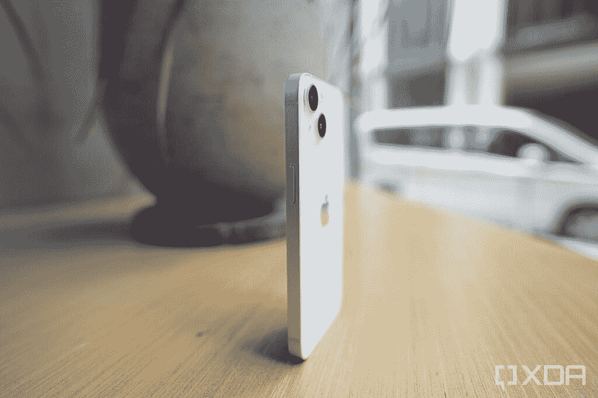

# 一加 10 Pro vs 苹果 iPhone 13:2022 年买哪款手机好？

> 原文：<https://www.xda-developers.com/oneplus-10-pro-vs-apple-iphone-13/>

一加 10 Pro T1 将自己定位为市场上的高端安卓旗舰产品。它在价格上提供了一套很好的内部配置，但与去年的一加 9 Pro 相比，这只是一个微小的升级。因此，尽管有一个“专业”的绰号，一加 10 专业版经常发现自己与市场上更标准的手机竞争。在这篇文章中，我们将看看一加 10 Pro 与[苹果 iPhone 13](https://www.xda-developers.com/apple-iphone-13-review/) 的对比，看看一加最新最棒的旗舰产品与市面上最好的 iPhone 相比如何。

**浏览这篇文章:**

## 一加 10 Pro vs 苹果 iPhone 13:规格

在我们开始比较之前，让我们快速浏览一下每款手机的规格，看看它们带来了什么:

| 

**规格**

 | 

**一加 10 Pro**

 | 

**苹果 iPhone 13**

 |
| --- | --- | --- |
| **构建** | 

*   铝制中框
*   大猩猩玻璃 5 背面
*   大猩猩玻璃 Victus 正面
*   IP68 等级(仅适用于 T-Mobile 型号)

 | 

*   铝制中框
*   玻璃正面和背面
*   前玻璃的“陶瓷护罩”
*   IP68 等级

 |
| **尺寸&重量** | 

*   163 x 73.9 x 8.55 毫米
*   201g

 | 

*   146.7 毫米 x 71.5mm 毫米 x 7.65mm 毫米
*   174 克

 |
| **显示** | 

*   6.7 英寸 QHD+120 赫兹流体 AMOLED
*   1,440 x 3,216 像素
*   1Hz 至 120Hz 之间的可变刷新率
*   1300 尼特峰值亮度
*   HDR10+认证

 | 

*   6.1 英寸超级视网膜 XDR 有机发光二极管
*   2，340 x 1，080 分辨率
*   60Hz 刷新率
*   1300 尼特峰值亮度
*   HDR10
*   真实色调显示

 |
| **SoC** | 

*   高通骁龙 8 代 1 SoC

 |  |
| **风筒&储存** | 

*   8GB/12GB 内存
*   128GB/256GB/512GB UFS 3.1 存储

 | 

*   4GB 内存
*   128GB/256GB/512GB

 |
| **电池&充电** | 

*   5000 毫安时
*   65W 有线快速充电(北美)
*   80W 有线快速充电(北美以外的任何地方)
*   50W 无线充电
*   反向无线充电
*   包装盒中包含充电器

 | 

*   3240 毫安时
*   高达 20W 的有线充电
*   最高 7.5W 的无线充电
*   MagSafe 充电功率高达 15W
*   包装盒中不含充电器

 |
| **安全** | 光学显示指纹扫描仪 | Face ID |
| **后置摄像头** | 

*   主要:48MP 宽，f/1.8，1/1.33 英寸，OIS
*   二级:50MP 超宽，f/2.2/150 FOV
*   第三:800 万像素长焦，3.3 倍光学变焦
*   哈苏颜色校准

 | 

*   初级:12MP 宽，f/1.6 光圈，1.6μm
*   次要:12MP 超宽，f/2.4 光圈

 |
| **前置摄像头** | 32MP，f/2.2/0.8 米 | 12MP 原深感摄像头系统 |
| **端口** | 

*   USB 类型-C
*   没有耳机插孔
*   没有 microSD 卡插槽

 | 

*   闪电港
*   没有耳机插孔
*   没有 microSD 卡插槽

 |
| **音频** |  |  |
| **连通性** | 

*   5G(毫米波)适用于除美国美国电话电报公司以外的几乎所有地区和运营商
*   支持 2×2 MIMO 的 Wi-Fi 6 (802.11ax)
*   蓝牙 5.2
*   国家足球联盟
*   GPS，伽利略，GLONASS，北斗

 | 

*   5G(低于 6 GHz 和毫米波)
*   支持 4×4 MIMO 和 LAA 的千兆级 LTE
*   支持 2×2 MIMO 的 Wi-Fi 6 (802.11ax)
*   蓝牙 5.0

 |
| **软件** | 

*   中国:基于 Android 12 的 ColorOS 12.1
*   全球:基于 Android 12 的 OxygenOS 12.1

 | iOS 15 |
| **其他特色** | 

*   双物理 SIM
*   警报滑块
*   承诺三大 Android 操作系统更新
*   四年的安全补丁

 | 

*   Apple Pay
*   eSIM 支持
*   与 MagSafe 附件兼容

 |

* * *

## 设计和展示

一加 10 Pro 带有非常熟悉的设计美学，其圆形边缘和前后玻璃面板与中框相接处的微妙曲线。今年的主要区别是相机岛，至少可以说，这是非常两极化的。有些人似乎喜欢这种设计，而另一些人则认为它不像我们过去从该品牌看到的其他一些手机那样优雅。与此同时，iPhone 13 看起来像任何其他玻璃平板智能手机，有坚硬的边角和平坦的侧面。它的背面还有一个熟悉的摄像头岛，用于安装双摄像头。

不管你对外观有什么看法，不可否认的是，一加 10 Pro 在使用时握在手中感觉更舒适。尽管在这次比较中，一加 10 Pro 明显更高、更厚、更重。具有弯曲侧面的手机往往可以很好地握在手中，一加 10 Pro 正是如此。设备背面的哑光纹理也增加了手机的整体高级外观。

 <picture></picture> 

iPhone 13

这两款手机都有一个铝制中框，正面和背面都有玻璃。一加 10 Pro 使用大猩猩玻璃 Victus 来保护显示屏，而 iPhone 13 的前玻璃使用了“陶瓷盾”。今年所有的 iPhones 都具有 IP68 的防尘防水等级，但只有一加 10 Pro 的 T-Mobile 版本具有“官方”IP 等级。一加 10 Pro 底部有一个 USB-C 端口，而 iPhone 13 带有一个照明端口，用于充电和数据同步。一加的标志性提醒滑块——现在似乎正在从许多一加设备上删除——在一加 10 Pro 上出现。iPhone 13 的左手边还有一个响铃/静音开关。

 <picture></picture> 

OnePlus 10 Pro in sandstone black case

再来看显示屏，一加 10 Pro 的显示屏明显更大，为 6.7 英寸，边框最小，顶部有一个穿孔摄像头，用于自拍相机。iPhone 13 看起来与过去几年的许多其他 iPhone 完全一样，正面有一个凹口，其余三面有相对较厚但统一的边框。从正面看，一加 10 Pro 肯定更现代，但我们将由您来决定哪一款更好。毕竟是口味问题。

抛开审美差异不谈，一加 10 Pro 在纸面上肯定有更好的显示效果。这是一个 6.7 英寸的 AMOLED 面板，支持 3216 x 1440 像素的最大分辨率，这意味着它有大约 525 ppi。iPhone 13 较小的 6.1 英寸 Super Retina XDR 有机发光二极管显示屏不如一加 10 Pro 的面板清晰，因为它只支持 2532 x 1170 像素的最大分辨率，相当于约 460 ppi。更不用说，一加 10 Pro 还支持 120Hz 的刷新率，这为屏幕上的平滑滚动和其他动画铺平了道路。

两款智能手机都经久耐用，但一加 10 Pro 看起来更现代。iPhone 13 看起来并不糟糕，但总的来说，iPhone 迫切需要更新设计，以对抗现代 Android 旗舰产品。当你转向显示器时，差异会更加明显，因为一加 10 Pro 的 AMOLED 面板不仅更大，而且配置更好，可以提供更精致的体验。

* * *

## 硬件和软件

一加 10 Pro 拥有最新的骁龙 8 Gen 1 芯片组，高达 12GB 的内存和高达 256GB 的内部存储。这是目前市场上你能买到的最强大的安卓手机之一。相比之下，iPhone 13 包装了苹果的 A15 仿生芯片，内存为 4GB，内部存储高达 512GB。A15 Bionic 是一款功能强大的芯片组，在一般性能方面轻松击败骁龙 8 Gen 1。然而，在现实世界的使用中，你将从两种设备中获得相同的体验。除非你真的将两款手机都推到了极限，否则你可能看不到明显的区别，所以没什么好担心的。你可能已经知道，苹果的 iOS 可以流畅地处理任何事情，即使内存更少，iPhone 13 也是如此。

两款手机的基本型号都配有 128GB 的内部存储空间，你可以选择花更多的钱来获得每部手机最大 512GB 的存储空间。您不能通过添加 microSD 卡来增加这些设备的存储容量，因此请确保选择正确的存储类型。在电池方面，一加 10 Pro 内置了一块 5000 毫安时的大电池，而 iPhone 13 则配备了一块小得多的 3240 毫安时电池。这使得一加 10 Pro 似乎在电池方面更好，但事实并非如此。苹果的 A15 仿生芯片和 iOS 软件发挥了它们的魔力，让 iPhone 13 的电池在两次充电之间持续很长时间。在适度使用的情况下，这两款手机都应该能够坚持至少一天半。

不过，一加 10 Pro 的快速充电功能领先于 iPhone 13。美国的一加 10 Pro 型号支持 65W 充电，而在世界其他地区销售的设备支持最高 80W 充电。iPhone 13 只支持最高 20W 的快充。一加 10 Pro 最好的一点是，它在盒子里配有快速充电器，而 iPhone 13 没有。这两款手机都支持无线充电，但一加 10 Pro 的速度也明显更快。

总的来说，两款手机在性能方面都相当快，但一加 10 Pro 凭借其快速充电能力在电池领域独占鳌头。iPhone 在充电方面仍然慢得令人痛苦，我们希望随着即将到来的 iPhone 14 的到来，情况会有所改变。

在软件方面，一加 10 Pro 搭载了基于 Android 12 的 OxygenOS 12。iPhone 13 配备了 iOS 15，并将在今年晚些时候收到 iOS 16 的稳定版本。就软件而言，这种差异完全是主观的，因为 Android 和 iOS 都有各自的优势和劣势。然而，一加似乎在氧气方面遇到了困难。该软件过去的几个版本都很不稳定。更不用说，一加的手机也没有得到及时更新。幸运的是，苹果的 iOS 没有受到这些问题的困扰，因为该公司继续向用户提供大体上完美的软件体验。iOS 上的错误通常仅限于测试版，而你最终在手机上得到的是可以正常工作的软件，尽管在体验上有些有限。

* * *

## 摄像机

一加 10 Pro 背面有一个三摄像头设置，其中包括一个 f/1.8，1/1.43 英寸的索尼 IMX789 主摄像头；一个 8MP，f/2.4 的长焦变焦镜头，3.3 倍光学变焦；以及 50MP，f/2.2 超宽摄像头。相比之下，iPhone 13 只有两个后置摄像头，一个 12MP，f/1.6 宽，一个 12MP，f/2.6 超宽镜头。一加 10 Pro 的功能肯定更全面，但 iPhone 13 的照片和视频更可靠。与一加 10 Pro 的照片相比，它始终捕捉到平衡的图像，具有更多细节和更好的颜色。这并不是说使用一加 10 Pro 拍摄的图像看起来不好。它们只是不像用 iPhone 13 拍摄的那样一致。我们将在下面留下一些相机样品，让您更好地了解这些设备的性能。

一加 10 Pro 的前面有一个 32MP 的自拍摄像头，而 iPhone 13 使用 12MP 的摄像头进行自拍和视频通话。就视频而言，一加 10 Pro 可以录制 24fps 的 8K 视频或最高 60fps 的 4K 视频。苹果的 iPhone 13 以高达 60fps 的速度超越了 4K 分辨率，但它捕捉的画面更好看。iPhones 仍然是移动视频之王，在这次比较中也是如此。

**一加 10 Pro 相机样品:**

**iPhone 13 相机样品:**

* * *

## 一加 10 Pro vs 苹果 iPhone 13:你该买哪个？

一加 10 Pro 在美国的起价为 899 美元，而配备 128GB 存储空间的基本款 iPhone 13 的价格为 799 美元。一加 10 Pro vs iPhone 13 是一场艰难的比赛，因为除了其他因素，你还必须考虑“Android vs iOS”的辩论；通常情况下，您更喜欢哪种操作系统将最终决定您的硬件选择。一加 10 Pro 是一个伟大的多面手，但我们认为它不足以吸引那些完全沉浸在苹果生态系统中的人。如果你想从 iOS 转到 Android，市场上肯定有更好的选择。这并不是说这是一部糟糕的手机，因为一加 10 Pro 是目前市场上最快的安卓旗舰之一。它还配备了令人印象深刻的 6.7 英寸 AMOLED 显示屏和开放的 Android 体验，以取悦铁杆 Android 用户。然而，一加的软件游戏不像以前那么强大了，它也没有因为不一致的摄像头而给人留下深刻印象。

iPhone 13 在所有这些方面都大放异彩，因为它提供了可靠的软件体验，而且与一加 10 Pro 相比，未来还将获得更多更新。iPhone 13 可能没有多功能的相机设置，但它的双摄像头系统无论在白天还是晚上都能拍摄出更好的图像。如果你想要更好的相机系统来对抗市场上的其他现代旗舰，你也可以选择 iPhone 13 Pro。购买 iPhone 13 而不是一加 10 Pro 的唯一缺点是，你必须忍受较慢的充电速度和较小的 60Hz 显示屏。

总的来说，一加 10 Pro 和 iPhone 13 都提供了良好的体验。选择这两款设备并不一定意味着你买了一部糟糕的手机，但与一加手机相比，iPhone 13 恰好提供了更完美的体验。你也可以阅读我们对每一款手机的评论(本文前面有链接),以更详细地了解它们。或者，你也可以看看我们的[一加 10 Pro 与 iPhone 13 Pro](https://www.xda-developers.com/oneplus-10-pro-vs-apple-iphone-13-pro/) 对比，如果你有兴趣看看更贵的 iPhone 如何与一加旗舰相抗衡。

 <picture></picture> 

OnePlus 10 Pro

##### 一加 10 专业版

一加 10 Pro 是一加最新最棒的旗舰智能手机，将一些性能最好的硬件打包在一个包中。

 <picture></picture> 

OnePlus 10 Pro

##### 一加 10 专业版

iPhone 13 带来了强大的 A15 Bionic 和一个非常好的主摄像头，以及常见的苹果软件包和生态系统。

当你在这里的时候，一定要看看我们的[一加 10 Pro 交易](https://www.xda-developers.com/best-oneplus-10-pro-deals/)和 [iPhone 13 交易页面](https://www.xda-developers.com/best-iphone-13-deals/)，看看你是否能在这些手机上找到一些不错的交易。我们还收集了一些[最佳一加 10 Pro 保护套](https://www.xda-developers.com/best-oneplus-10-pro-cases/)和[最佳 iPhone 13 保护套](https://www.xda-developers.com/best-oneplus-10-pro-cases/)，如果你有兴趣购买的话。