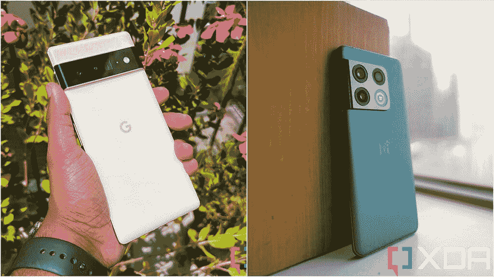
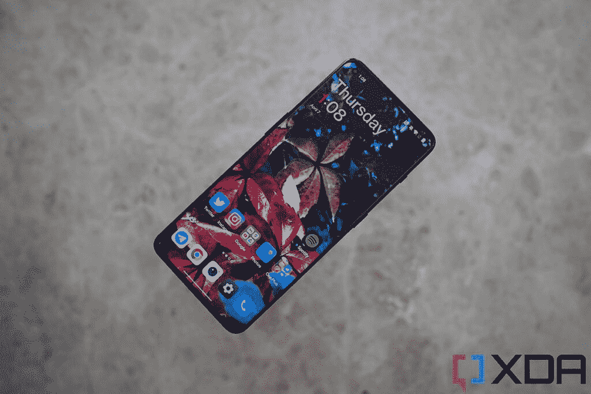

# 一加 10 专业版 vs 谷歌像素 6 专业版:可怕的三星替代品

> 原文：<https://www.xda-developers.com/oneplus-10-pro-vs-google-pixel-6-pro/>

如果你正在美国寻找一款新的安卓旗舰手机，不管出于什么原因，不想买三星 Galaxy 智能手机，那么一加和谷歌是两个最明显的选择。但毫无疑问，两家公司的最新产品，[一加 10 Pro](https://www.xda-developers.com/oneplus-10-pro-review/) 和[谷歌 Pixel 6 Pro](https://www.xda-developers.com/google-pixel-6-pro-review/) 都是非常出色的旗舰产品，可以与三星的最佳产品相媲美，甚至赢得了一些领域。这些不仅仅是“替代选择”，而是真正的好选择，任何认真对待智能手机的人在购买新手机时都应该考虑。

 <picture></picture> 

OnePlus 10 Pro

##### 一加 10 专业版

一加 10 Pro 采用了引人注目的设计、华丽的屏幕和快速、灵活的软件。

 <picture></picture> 

Google Pixel 6 Pro

谷歌 Pixel 6 Pro 是谷歌有史以来在手机中推出的最好的硬件，它具有最好的相机系统和软件智能。

 <picture></picture> 

Pixel 6 Pro (left) and OnePlus 10 Pro (right).

**浏览本文:**

## 一加 10 Pro vs 三星 Galaxy S22:规格

| 

**规格**

 | 

**一加 10 Pro**

 | 

**谷歌 Pixel 6 Pro**

 |
| --- | --- | --- |
| **构建** | 

*   铝制中框
*   大猩猩玻璃 5 背面
*   大猩猩玻璃 Victus 正面
*   IP68 等级(仅适用于 T-Mobile 型号)

 | 

*   铝制中框
*   大猩猩玻璃 Victus 正面和背面
*   IP68 等级

 |
| **尺寸&重量** | 

*   163 x 73.9 x 8.55 毫米
*   201g

 | 

*   163.9 x 75.9 x 8.9 毫米
*   210g

 |
| **显示** | 

*   6.7 英寸 QHD+120 赫兹流体 AMOLED
*   1，440 x 3，216 像素，约 525 PPI
*   HDR10+认证
*   1Hz 至 120Hz 之间的可变刷新率

 | 

*   6.7 英寸有机发光二极管
*   1,440 x 3,120 像素
*   HDR10+认证
*   60Hz 到 120Hz 之间的可变刷新率

 |
| **SoC** | 

*   高通骁龙 8 代 1 SoC

 |  |
| **风筒&储存** | 

*   8GB/12GB 内存
*   128GB/256GB/512GB UFS 3.1 存储

 | 

*   8GB/12GB 内存
*   128GB/256GB/512GB UFS 3.1 存储

 |
| **电池&充电** | 

*   5000 毫安时
*   65W 有线快速充电(北美)
*   80W 有线快速充电(北美以外的任何地方)
*   50W 无线充电
*   反向无线充电
*   包装盒中包含充电器

 | 

*   5004 毫安时电池
*   25W USB PD 3.0 PPS 有线充电
*   无线充电
*   不含充电器

 |
| **安全** | 光学显示指纹扫描仪 | 光学显示器内指纹传感器 |
| **后置摄像头** | 

*   主要:48MP 宽，f/1.8，1/1.33 英寸，OIS
*   二级:50MP 超宽，f/2.2/150 FOV
*   第三:800 万像素长焦，3.3 倍光学变焦
*   哈苏颜色校准

 | 

*   主要:50MP 主要，f/1.9，1/1.31”，OIS，装箱
*   中学:12MP 超宽，f/2.2
*   第三:48MP 潜望镜，4 倍光学变焦

 |
| **前置摄像头** | 32MP，f/2.2/0.8 米 | 11MP，f/2.2/1.22μm |
| **端口** | 

*   USB 类型-C
*   没有耳机插孔
*   没有 microSD 卡插槽

 | 

*   USB 类型-C
*   没有耳机插孔
*   没有 microSD 卡插槽

 |
| **音频** |  |  |
| **连通性** | 

*   5G(毫米波)适用于除美国美国电话电报公司以外的几乎所有地区和运营商
*   支持 2×2 MIMO 的 Wi-Fi 6 (802.11ax)
*   蓝牙 5.2
*   国家足球联盟
*   GPS，伽利略，GLONASS，北斗

 | 

*   5G:非独立(NSA)，独立(SA)，Sub6 / mmWave
*   LTE:增强型 4×4 MIMO，最高 7CA，LTE Cat.20
*   wi-Fi 802.11 a/b/g/n/AC/ax(2.4/5/6 GHz)
*   蓝牙 v5.2
*   国家足球联盟
*   GPS，伽利略，GLONASS，北斗

 |
| **软件** | 

*   中国:基于 Android 12 的 ColorOS 12.1
*   全球:基于 Android 12 的 OxygenOS 12.1

 | 带 Pixel 启动器的 Android 12 |
| **其他特性** | 

*   双物理 SIM
*   警报滑块
*   承诺三大 Android 操作系统更新
*   四年的安全补丁

 | 

*   单一物理 SIM
*   承诺四大 Android 操作系统更新
*   五年的安全补丁

 |

## 一加 10 专业版 vs 谷歌像素 6 专业版:硬件和设计

一加和谷歌都值得称赞，因为他们设计的智能手机看起来与众不同，这都源于相机模块的设计。一加 10 Pro 有一个巨大的陶瓷电镀模块，其左侧弯曲，无缝融入铝框架。这不是第一部这样做的手机(三星最早在 Galaxy S21 系列中就这样做了)，但一加 10 的相机模块非常引人注目，尽管如此，它在视觉上还是很突出。

为了不被超越，谷歌的 Pixel 6 系列使用了一个矩形条带，贯穿手机背部的整个宽度。这条带子有点突出，看起来像面甲——如果你熟悉 x 战警，那它就特别像独眼巨人的面甲。

我认为这两种设计看起来都很棒，并赋予了这些典型的弯曲的玻璃铝夹层设备特性

我认为这两种设计看起来都很棒，并赋予这些典型的弯曲玻璃铝夹层设备特性。这些手机有一个清晰的设计愿景，不像普通的老式乏味的 Galaxy S21 FE 或廉价的小米手机。套餐的其他部分也很棒。

### 显示

两款手机都配备了 6.7 英寸的有机发光二极管面板，分辨率为 WQHD+分辨率，刷新率高达 120Hz，但尽管 Pixel 6 Pro 的屏幕非常好，但一加 10 Pro 的面板更好，可以说是同类最佳。一加的面板是 LTPO 2.0 面板，这意味着它的刷新率可以在 1 赫兹到 120 赫兹之间动态变化。Pixel 6 Pro 的面板只能在 60 赫兹到 120 赫兹之间循环。这意味着一加 10 Pro 屏幕的电池效率更高。它还可以变得更亮，最大亮度为 1300 尼特，而 Pixel 6 Pro 的屏幕只有大约 500 尼特。

 <picture></picture> 

OnePlus 10 Pro screen is as good as it gets.

好吧，公平地说，这个数字差距(500 到 1300)听起来很大，但在现实世界的使用案例中，你不会在室内注意到它，因为屏幕不需要接近那个亮度。只有在户外阳光直射下，你才会注意到 Pixel 6 Pro 的显示屏有点暗。

 <picture></picture> 

Pixel 6 Pro screen.

两款手机都配备了显示屏下指纹扫描仪，但像素也在这里消失了。一加的光学扫描仪比 Pixel 6 Pro 快得多。同样，Pixel 6 Pro 的指纹扫描仪无论如何都不可怕，只是不如一加的好。

### 处理器

一加 10 Pro 运行在[高通骁龙 8 Gen 1](https://www.xda-developers.com/qualcomm-snapdragon-8-gen-1/) 上，而 Pixel 6 Pro 运行在谷歌自己专有的张量 SoC 上。骁龙 8 Gen 1 拥有更强的原始处理能力，但张量 SoC 可以说更智能，更适合处理像素问题。这是因为谷歌建立了张量，并设计了芯片来优先处理机器学习任务。而且它很有效 Pixel 6 Pro 拥有我用过的所有手机/电脑中最好的语音听写功能，以及一些非常有趣的需要深度机器学习的相机技巧。我将在它们各自的部分中更多地谈论这些。只知道骁龙 8 代 1 是一个更快的芯片，可以以更高的帧率显示图形，但张量更聪明。

### 电池、内存和其他组件

两款手机都装有 5000 毫安时的电池(Pixel 6 Pro 实际上有 5003 毫安时的电池，但我们不要在这里迂腐)，这大约是现代旗舰手机电池目前所能达到的最大容量。两款手机都可以无线充电，但一加 10 Pro 的无线充电速度高达 50W，比 Pixel 的 25W 快。有线充电也是一加的一个主要优势——10 Pro 可以以高达 80W 的速度充电，充电器包含在盒子里(尽管由于当地的限制，美国型号获得了 65W 的充电砖，关于 65W 如何优于 80W 充电，还有一个完全独立的讨论)。Pixel 6 Pro 最大可充 30W 电，充电器不含，所以这里没得选。

至于内存，一加 10 Pro 起价 8GB，但提供 12GB 版本，而 Pixel 6 Pro 只配有 12GB 内存。尽管如此，我还是要说，即使是 8GB 内存的一加 10 Pro 感觉也比 12GB 内存的 Pixel 6 Pro 快。两款手机都有 128GB、256GB 或 512GB 的存储选项。

每部手机还具有出色的触觉和非常好的立体声扬声器，两者都有 IP68 防水和防尘等级。一加 10 Pro 还有一个提醒滑块，这是一个物理开关，允许用户快速将手机从静音变为振动或开机。

* * *

## 一加 10 专业版 vs 谷歌像素 6 专业版:相机

一加 10 Pro 的三摄像头系统由一个 48MP，f/1.8 主摄像头和 1/1.24 英寸索尼传感器组成；一个 50MP 超宽传感器，具有疯狂宽的原生 150 度视野，一个 8MP 长焦镜头，可以做 3.3 倍光学变焦。

与此同时，Pixel 6 Pro 配备了 50MP、f/1.9 三星 GN1 传感器和 1/1.31 英寸传感器；12MP 超宽相机，f/2.2 光圈，但 114 度视野有限；以及 48MP 潜望镜变焦镜头，可以做 4 倍光学变焦。

就主相机硬件而言，这是一个非常接近的选择，两者都是很好的传感器，但我更喜欢 Pixel 使用的 GN1 传感器，因为它有一个更大的图像传感器，可以增加进光量，并产生更多的真实散景。将这一点与谷歌的图像处理相结合，谷歌的图像处理一直是业内最好的之一(如果不是最好的话)，我只是认为 Pixel 6 Pro 的主摄像头捕捉到了出众的照片。然而，一加 10 Pro 的主摄像头仍然非常非常好。

转到超宽，这是关于你是想要牺牲图像锐度来获得更宽、更全面的视野，还是更紧凑、更清晰的拍摄。事情是这样的，Pixel 6 Pro 的超宽边框太紧了，几乎不能算作超宽。

对于变焦拍摄，Pixel 6 Pro 的 4 倍光学在纸面上似乎并不比一加 10 Pro 的 3.3 倍光学长多少，但因为 Pixel 使用了潜望镜镜头技术，所以它的 4 倍变焦比一加 10 Pro 的长焦 3.3 倍变焦更清晰，更接近真正的无损拍摄。如果你保持 3.3 倍到 5 倍的变焦范围，这并不明显。但移动到 10x、20x，Pixel 6 Pro 的变焦镜头显然更清晰、更好。

然而，这并不全是硬件的问题，因为现在两款手机都在计算摄影上很重。对于一加来说，这是由哈苏工程师制作的“专家颜色分级”，以及非常直观的手动视频模式。对于 Pixel 来说，它是完全基于张量的机器学习，让它执行一系列令人敬畏的摄影技巧，如在主题周围添加逼真的运动模糊(让某人或某物看起来像是在高速移动)，或使用 Pixel 的“对象橡皮擦”擦除不想要的背景干扰谷歌的算法在识别人脸和场景以及优化照片以最佳拍摄氛围方面也是不可思议的。

对于视频录制，一加 10 Pro 可以拍摄高达 8K 的视频，而 4K 的 Pixel 6 Pro 最高，但大多数人不需要 8K 视频。如果我们坚持 4K，我认为 Pixel 6 Pro 的主摄像头可以产生更好的视频，但其超宽视频确实存在噪音。一加 10 Pro 的超宽视频看起来好多了。

这两款手机都非常适合自拍，无论白天还是晚上都能拍出细致入微的照片。总的来说，一加 10 Pro 相机系统非常好，但 Pixel 6 Pro 相机是最好的相机之一。事实上，我个人将 Pixel 6 Pro 与[三星 Galaxy S22 Ultra](https://www.xda-developers.com/samsung-galaxy-s22-ultra-review/) (排名第一的是 [Vivo X80 Pro](https://www.xda-developers.com/vivo-x80-pro-review/) )并列为第二或第三[最佳相机系统](https://www.xda-developers.com/best-smartphone-cameras/)。

* * *

## 一加 10 Pro vs 谷歌 Pixel 6 Pro:软件

曾几何时，运行在一加手机上的 OxygenOS 软件与运行在 Pixel 手机上的 Android 非常相似。但现在情况不同了，一加改变了一些个性，以匹配它的堂兄 ColorOS(中国版的一加 10 Pro，事实上，直接运行 ColorOS)，Pixel 6 Pro 搭载了谷歌的改进版 Pixel，看起来与其他任何形式的 Android 都很不同。

简而言之，我喜欢谷歌对 Pixel 6 Pro 版本的 Android 所做的事情。使用一个奇怪命名的主题“Material You”，用户界面比以前更加可定制化，旨在迎合用户的口味。例如，如果你使用粉红色的壁纸，那么 UI 颜色元素将会改变以适应粉红色。一切都有一个异想天开的外观，从大型椭圆形的快捷切换按钮到几乎贯穿整个屏幕的始终显示时钟。

一加 10 Pro 的软件很好，但 Pixel 6 Pro 的软件感觉像是一场迷你进化，让我们得以一瞥智能设备的未来能为我们做些什么

具有讽刺意味的是，一加的 OxygenOS 很久以前就提供了这些功能，比如改变用户界面颜色主题的能力。我仍然非常喜欢 OxygenOS，因为它有很多快捷手势(我喜欢在睡眠屏幕上直接控制音乐播放，甚至不需要打开显示器)，但这一次，Pixel 6 Pro 只是有更好的个性。

如前所述，Pixel 的软件也更加智能。我之前提到过语音听写非常棒，值得再说一遍:Pixel 的语音听写比我用过的任何其他计算设备都好得多。谷歌设计的 Gboard 也支持这一点，所以我可以用我的声音打字，而不用触摸键盘。我敢说语音听写的准确率远远超过 90%(相比之下，据我估计，Siri 的准确率约为 70%)。手机甚至知道何时插入标点符号。这都与 Tensor 有关，因为其他运行 Android 的手机几乎无法理解我的讲话。Pixel 6 Pro 将我的声音转化为文本的能力是不可思议的，改变了游戏规则——当我使用 Pixel 时，我可以合理地减少输入次数。

一加 10 Pro 的软件很好，但 Pixel 6 Pro 的软件感觉像是一个迷你进化，让我们看到了智能设备的未来可以为我们做些什么。

* * *

## 一加 10 Pro vs 谷歌 Pixel 6 Pro:性能和电池寿命

在电池和屏幕尺寸大致相同的情况下，你可能会认为电池续航时间大致相同——但事实并非如此，因为一加 10 Pro 的面板更节能，我注意到一加 10 Pro 的电池续航时间略长——足以持续一整天 12 个小时，而 Pixel 6 Pro 经常会短一个小时左右。请记住，我是一个重度用户，所以对于其他人来说，这些手机应该是全天手机。一加 10 Pro 充电速度更快是另一个优势。

 <picture></picture> 

The Pixel 6 Pro (also with stickers to change up the colors)

至于性能，也是势均力敌。一加 10 Pro 感觉像一部速度更快的手机——解锁速度更快，应用程序启动速度略快，动画播放速度也更快。Pixel 6 Pro 本身并不慢，但也不是超级快。到处都有一些随机的应用程序崩溃。然而，Pixel 6 Pro 的智能——像被动识别我附近播放的音乐的能力，或者前面提到的惊人的语音听写，确实增强了智能手机的整体体验。

一加 10 Pro 功能更强大，但 Pixel 6 Pro 更智能、更个性化。

* * *

## 一加 10 Pro vs 谷歌 Pixel 6 Pro:你该买哪个？

虽然这两款手机都以 899 美元的价格推出，但 Pixel 6 Pro 一直有优惠，这让价格降低了一点。事实上，目前，至少在亚马逊上，Pixel 6 Pro 比一加 10 Pro 便宜约 50 美元。总而言之，一加 10 Pro 客观上有更好的显示屏、指纹扫描仪、充电速度和原始处理能力。但是 Pixel 6 Pro 有更好的主摄像头，更好的变焦摄像头，以及更智能和个性化的软件。

两款手机都很好，但我个人会选择 Pixel 6 Pro，因为它有更好的摄像头和更智能的软件。能够通过语音口述整个段落，然后口头命令 Pixel 6 Pro 发送信息，这一点永远不会过时。

 <picture></picture> 

OnePlus 10 Pro

##### 一加 10 专业版

一加 10 Pro 采用了引人注目的设计、华丽的屏幕和快速、灵活的软件。

 <picture></picture> 

Google Pixel 6 Pro

谷歌 Pixel 6 Pro 是谷歌有史以来在手机中推出的最好的硬件，它具有最好的相机系统和软件智能。