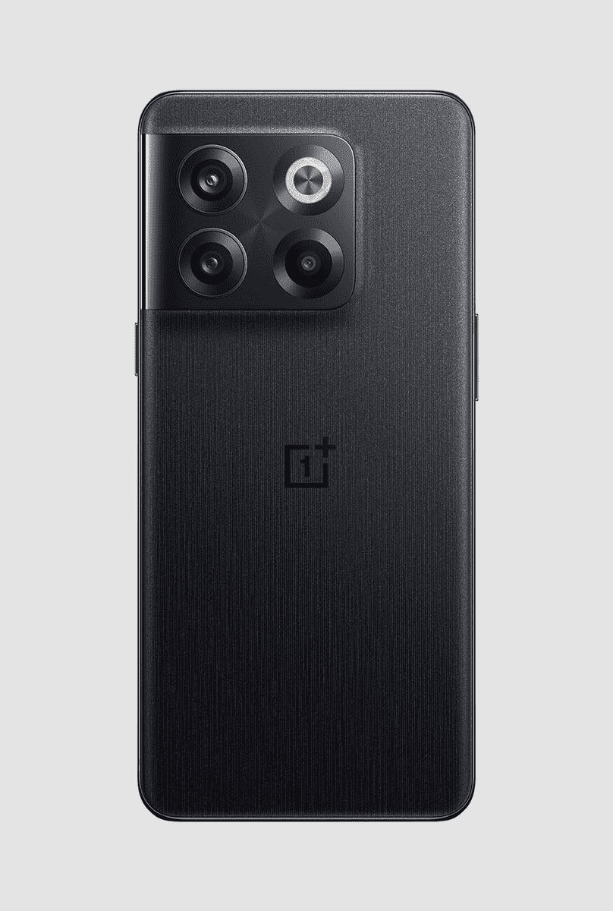

# 一加 10T 提供 5G 支持吗？

> 原文：<https://www.xda-developers.com/oneplus-10t-5g-support/>

一加最新的平价旗舰产品[一加 10T](https://www.xda-developers.com/oneplus-10t-review/) ，比今年早些时候的一加 10 Pro 有了几项改进。该设备集成了高通顶级的骁龙 8 Plus Gen 1 SoC、150W 有线快速充电支持，以及顶级规格型号上高达 16GB 的 LPDDR5 RAM，以实现更好的多任务处理。但一加 10T 并不是一款全面的旗舰产品，因为一加在这款设备上做了一些手脚，以保持低价。

一加 10T 配备了分辨率较低的 FHD+显示屏，缺乏 1-120Hz 可变刷新率支持，没有标志性的警报滑块，也没有从一加-哈苏合作中受益。它的摄像头硬件也比一加 10 Pro 低一级。但谢天谢地，一加在连通性方面没有做出任何牺牲。与 Pro 型号一样，一加 10T 提供 5G 支持，Wi-Fi 6，NFC 和蓝牙 5.2 无线连接。但是，该设备的地区变体在这些方面存在一些差异。

虽然一加 10T 的所有版本都提供低于 6GHz 的 5G (SA/NSA)支持，但频段支持因地区而异。查看下表，快速了解美国、英国、欧洲和印度版本的一加 10T 支持的频段。

| 

地区

 | 

5G SA 频段

 | 

5G NSA 频段

 |
| --- | --- | --- |
| **美国** | n1/N2/n3/n5/n7/n8/n20/n25/n28/n30/n38/n41/n66/n71/n77 | n1/N2/n3/n5/n7/n8/n20/n25/n28/n30/n38/n41/n66/n71/n77 |
| **英国** | n1/N2/n3/n5/n7/n8/n20/n25/n28/n30/n38/n40/n41/n66/n71/n77/n78 | n1/N2/n3/n5/n7/n8/n20/n25/n28/n30/n38/n40/n41/n66/n71/n77/n78 |
| **欧洲** | n1/N2/n3/n5/n7/n8/n20/n25/n28/n30/n38/n40/n41/n66/n71/n77/n78 | n1/N2/n3/n5/n7/n8/n20/n25/n28/n30/n38/n40/n41/n66/n71/n77/n78 |
| **印度** | n1/n3/n5/n8/n20/n28A/n38/n40/n41/n77/n78 | 1978 年 3 月 5 日 8 月 40 日 41 时 77 分 |

注意，一加 10T 不提供毫米波 5G 支持。但是，鉴于毫米波 5G 在美国的可用性相当有限，缺乏它不应该成为大多数用户的交易障碍。

**TL；DR:** 一加 10T 的所有变体都提供低于 6GHz 的 5G 支持(SA/NSA)，但支持的频段因地区而异。查看上表，了解美国、英国、欧洲和印度支持的 5G 频段列表。

 <picture></picture> 

OnePlus 10T

一加 10T 的所有变体都提供 5G 支持，但支持的频段因您所在的地区而异。

你打算买一台一加 10T 体验 5G 吗？点击上面的链接，马上订购一个！当你在这里的时候，看看我们关于一加 10T 的[最佳交易的综述](https://www.xda-developers.com/best-oneplus-10t-deals/)和我们关于一加 10T 最佳案例的[建议](https://www.xda-developers.com/best-oneplus-10t-cases/)。