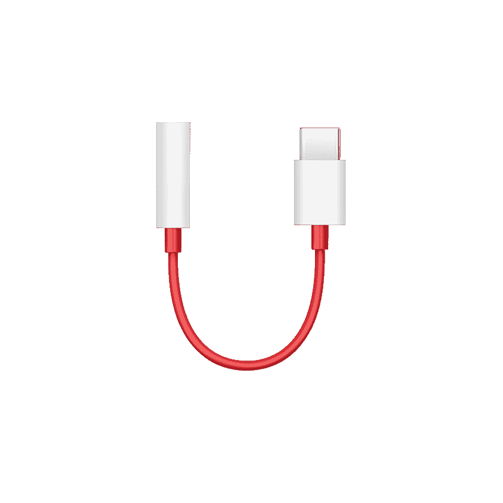

# 一加 10T 有耳机插孔吗？

> 原文：<https://www.xda-developers.com/oneplus-10t-headphone-jack/>

一加 10T 是最新的安卓手机，它带来了许多令人敬畏的 2022 顶级移动功能，例如 120 赫兹的有机发光二极管显示屏，来自高通的最新骁龙 8 Plus Gen 1 芯片，快速响应的安卓 12 版本，以及 50MP 主摄像头和令人尊敬的 1/1.57 英寸图像传感器。它甚至有着诱人的价格，大量的[购买交易](https://www.xda-developers.com/best-oneplus-10t-deals/)，这使得它成为那些想买一辆的人的一个好选择。

但是一加 10T**没有**的是一个 3.5 毫米耳机插孔。不，设备上没有耳机插孔。与几乎所有现代旗舰智能手机一样，如果你想听到手机的声音，10T 只能依靠立体声扬声器或蓝牙音频。对我们许多人来说，这没什么大不了的，因为无线音频技术近年来有了突飞猛进的发展，一加自己也生产各种价位的耳塞，从平价到高档。如果你愿意挥霍一点，一加 Buds Pro 是该公司最高端的无线音频解决方案，它与一加 10T 配合得相当完美。

 <picture></picture> 

OnePlus Buds Pro

##### 一加芽专业

这些耳塞售价 150 美元，配有 ANC 和出色的设计。

然而，有些音响发烧友更喜欢使用传统的有线耳机。或者可能是一个严肃的游戏玩家和视频编辑，他们根本不想处理任何延迟。在这种情况下，你最好买一个 USB-C 转 3.5 毫米的加密狗。一加在其网站上出售一款官方的，典型的一加红白配色。但是亚马逊上也有一些不错的选择。

 <picture></picture> 

OnePlus Type-C to 3.5mm adapter

##### 一加 USB-C 转 3.5 毫米适配器

一加官方 USB-C 转 3.5 毫米加密狗保证可以与一加 10T 配合使用。

 <picture></picture> 

OnePlus Type-C to 3.5mm adapter

##### Jsaux USB-C 转 3.5 毫米适配器

这款第三方加密狗内置智能 DAC 芯片，有助于节约能源，并为您的耳机或耳塞提供卓越的高品质声音。

无论如何，一加 10T 是一款非常强大的智能手机，所以如果你感兴趣，不要让耳机插孔的缺乏阻止你。说实话，2022 年没有多少旗舰手机仍然配备 3.5 毫米耳机插孔。如果你买的是一加 10T，一定要看看手机的[最佳案例](https://www.xda-developers.com/best-oneplus-10t-cases/)。

 <picture></picture> 

OnePlus 10T

一加 10T 几乎是一款全新的旗舰产品，价格远远高于其价格区间。