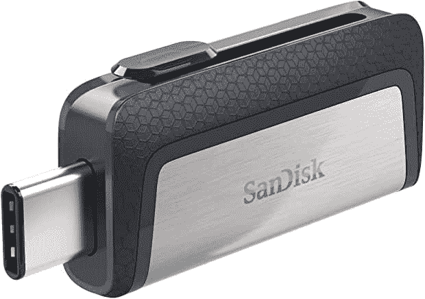

# 一加 10T 有 microSD 卡槽吗？

> 原文：<https://www.xda-developers.com/oneplus-10t-microsd/>

[一加 10T](https://www.xda-developers.com/oneplus-10t-review/) 是该品牌以其价值著称的最新超值产品。它的起价为 649 美元，配备了最新的高通骁龙 8 Plus Gen 1，以及一个充满活力的 120Hz 有机发光二极管屏幕，可以在 90Hz 到 120Hz 之间动态调整。还有一个 5000 万像素的主摄像头，配有一个尺寸良好的 1/1.56 英寸传感器。北美还有令人瞠目结舌的 125 瓦快充，欧洲和亚洲有 160 瓦快充，加上广受好评的一加 10 系列设计语言，相机模块融入底盘，形成独特的外观。

总的来说，一加 10T 有很多令人喜欢的地方，但一些超级用户需要的东西在这里仍然缺失:那就是可扩展存储。事实上，令人遗憾的是，一加 10T 没有 microSD 卡插槽，所以你将不得不使用 128GB 或 256GB 的存储空间。确保你做出明智的选择。

省略 microSD 卡插槽并不令人惊讶，因为大多数手机品牌都放弃了这个插槽，理由是技术原因，如 SD 卡插槽空间缺乏统一标准，或者有故障的存储卡实际上可能会严重影响手机的性能。但手机品牌放弃 microSD 卡插槽的真正原因可能没有那么无私:品牌希望能够为更高的存储版本收取溢价。例如，10T 的存储空间增加了一倍，达到 256GB，需要额外支付 100 美元(不过公平地说，你也确实将 RAM 增加了一倍，达到了 16GB)。

如果你不想支付加价，有更多负担得起的选择来获得更多的手机存储空间，你只需接受需要使用第二个小工具的麻烦。例如，如果您想要一个物理存储设备，您可以购买一个 USB Type-C 闪存驱动器。SanDisk 是一个声誉良好的品牌，生产一些最好的产品。

 <picture></picture> 

SanDisk 128GB Ultra Dual Drive USB Type-C

##### 闪迪 128GB 超双硬盘 USB Type-C

SanDisk 是一个久经考验的品牌，生产一些速度最快、最可靠的 SD 卡和 USB-C 驱动器。我们在 XDA 的许多人用这个来满足我们的文件传输需求。

 <picture></picture> 

OnePlus 10T

一加 10T 是该公司产品组合中的性能旗舰，它当然名副其实。出色的性能和超长的电池续航时间概括了我们对一加 10T 的第一印象。

如果你确实想购买这款设备，一定要查看一下你可以利用的[最佳一加 10T 交易](https://www.xda-developers.com/best-oneplus-10t-deals/)。如果你已经挑选了一个，考虑购买一个[推荐的一加 10T 机箱](https://www.xda-developers.com/best-oneplus-10t-cases/)。