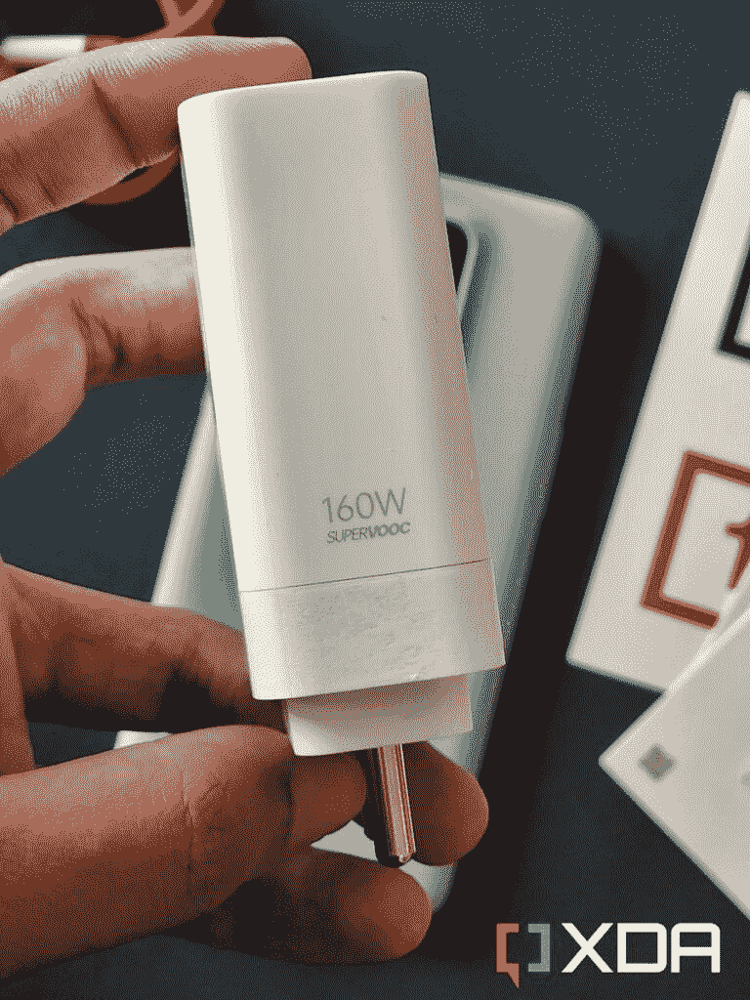

# 在美国、欧盟和印度，一加 10T 零售盒里装的是什么？

> 原文：<https://www.xda-developers.com/oneplus-10t-unboxing/>

一加 10T 终于上市了，它搭载了最新最棒的骁龙 8 Plus Gen 1 芯片组。这款强大的芯片组配备了高达 16GB 的 LPDDR5 内存，高达 256GB 的 UFS 3.1 存储，4800 毫安时电池，支持 150 瓦的有线快速充电。凭借如此强大的内部功能，毫无疑问，这款手机将成为 2022 年最强大的安卓手机之一。然而，它在显示屏和摄像头方面确实落后于一加 10 Pro，所以它不是你可能期望的顶级旗舰产品。但如果你有兴趣购买这款手机，并想知道包装盒内的内容，那么这里有一个快速拆箱的一加 10T:

## 一加 10T(美国和欧盟)拆箱:零售箱里是什么？

在美国和欧盟销售的一加 10T 的包装盒上有以下内容:

*   一加 10T(您选择的颜色)
*   160W SuperVOOC 充电器
*   USB-C 到 USB-C 电缆
*   SIM 弹出工具
*   特定于地区的文档，包括快速入门指南
*   黑色和红色的一加贴纸
*   基本屏幕保护(预应用)

一加 10T 的盒子里有很多好东西，包括一些贴纸和预先应用在手机上的屏幕保护。令人欣慰的是，该公司仍然是少数几家将手机与充电器捆绑在一起的制造商之一。

 <picture></picture> 

160W SuperVOOC charger

在这种情况下，你会得到一个非常强大的 160W SuperVOOC 充电器，能够在不到半小时的时间内为手机充满电。这和你用[一加 10R 耐力版](https://www.xda-developers.com/oneplus-10r-review/)得到的充电砖是一样的。不过注意，在美国你在手机上充电会被限制在 125W，充电器本身最多只支持 45W。所以你在桌子上留下了一些充电电位。

 <picture></picture> 

OnePlus 10T

一加 10T 是该公司产品组合中的性能旗舰，它当然名副其实。出色的性能和超长的电池续航时间概括了我们对一加 10T 的第一印象。

## 一加 10T(印度)拆箱:零售盒子里是什么？

在印度销售的一加 10T 的包装盒上有以下内容:

*   一加 10T(您选择的颜色)
*   160W SuperVOOC 充电器
*   USB-C 到 USB-C 电缆
*   SIM 弹出工具
*   特定于地区的文档，包括快速入门指南
*   黑色和红色的一加贴纸
*   基本屏幕保护(预应用)
*   号外:红色有线俱乐部会员卡
*   附加:带有一加品牌的同色硅表壳

在印度，你会得到一些贴心的额外服务，比如颜色搭配的硅胶包和红色有线电视俱乐部会员卡。

 <picture></picture> 

OnePlus 10T

一加 10T 是该公司产品组合中的性能旗舰，它当然名副其实。出色的性能和超长的电池续航时间概括了我们对一加 10T 的第一印象。

如果你想了解更多关于设备系列的信息，请阅读我们的[一加 10T 评测](https://www.xda-developers.com/oneplus-10t-first-impressions/)和我们的[一加 10 Pro 评测](https://www.xda-developers.com/oneplus-10-pro-review/)。