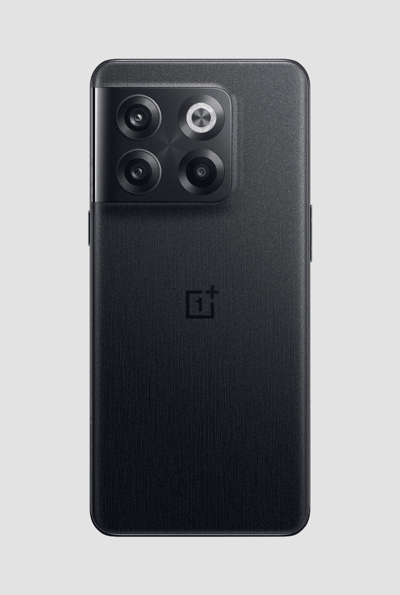
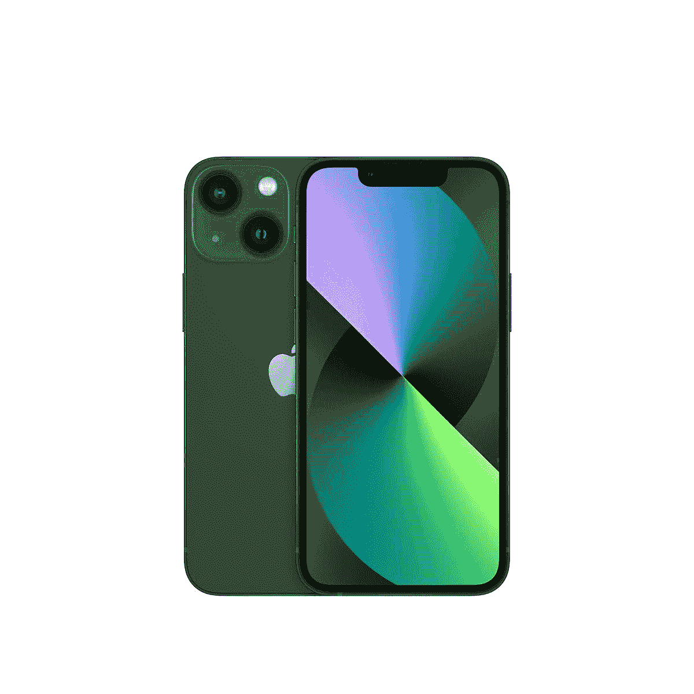

# 一加 10T vs 苹果 iPhone 13:你该买哪款智能手机？

> 原文：<https://www.xda-developers.com/oneplus-10t-vs-apple-iphone-13/>

当我们决定升级我们的智能手机时，我们经常会考虑下一步该买什么设备。选择是无穷无尽的，事情会变得混乱。一加 10T 是一款运行 OxygenOS 的 2022 旗舰车。另一方面，我们有 2021 年的高端[苹果 iPhone 13](https://www.xda-developers.com/apple-iphone-13-review/)——运行 iOS。这是这两款不同的高端手机之间的战争。如果你决定[买一加 10T](https://www.xda-developers.com/best-oneplus-10t-deals/) ，别忘了[用箱子](https://www.xda-developers.com/best-oneplus-10t-cases/)保护它。同样，[选择](https://www.xda-developers.com/best-iphone-13-cases/)[购买 iPhone 13](https://www.xda-developers.com/best-iphone-13-deals/) 就获得一个 case 。毕竟，安全总比后悔好。

## 一加 10T vs 苹果 iPhone 13:规格

|  | 

一加 10T

 | 

苹果 iPhone 13

 |
| --- | --- | --- |
| **处理器** | 

*   高通 SM8475 骁龙 8 加第 1 代

 |  |
| **正文** |  | 

*   146.7 x 71.5 x 7.65mm 毫米
*   174 克

 |
| **显示** | 

*   6.7 英寸液晶 AMOLED 显示屏
*   2412 x 1080 分辨率，394 ppi
*   HDR10+和 120Hz 支持

 | 

*   6.1 英寸 Super Retina XDR 有机发光二极管显示屏
*   2532×1170 分辨率，460 ppi
*   HDR、真音、广彩(P3)支持
*   1200 尼特最大亮度

 |
| **摄像机** | 

*   宽:50MP，1.8 英寸
*   超宽:800 万像素/2.2 英寸
*   宏:2MP，2.4
*   前置:16MP，2.4 英寸

 | 

*   宽:12MP，1.6 英寸
*   超宽 12MP，2.4 英寸
*   正面真实深度:12MP/2.2

 |
| **记忆** | 

*   8GB、12GB、16GB 内存
*   128GB、256GB 固态硬盘

 | 

*   4GB 内存
*   128GB、256GB、512GB 固态硬盘

 |
| **电池** |  | 

*   长达 75 小时的音频播放

 |
| **连通性** |  |  |
| **水**水**阻力** | 

*   北美的 IP54
*   其他地方没有 IP 等级

 |  |
| **安全** | 

*   显示不足的指纹扫描仪

 |  |
| **操作系统** | 

*   OxygenOS 12.1(基于 Android 12)

 |  |
| **颜色** | 

*   月光石黑
*   翠绿色

 | 

*   红色
*   星光
*   午夜
*   蓝色
*   粉红色
*   格林（姓氏）；绿色的

 |
| **材质** |  | 

*   玻璃背面
*   铝制框架

 |
| **价格** |  |  |

* * *

## 设计:iPhone 13 得到一个 *A-Plus，10/10*

设计是一件主观的事情，但我会做客观的观察，同时也分享我的个人观点。当我们买一部新手机时，我们希望它坚固、美观。一部脆弱或者没有吸引力的手机会让我们想要不去管它，远离它。从构造开始，两款手机都有玻璃背面。然而，iPhone 13 的铝制框架胜过了一加 10T 的塑料框架。

除此之外，两款手机的中心都有各自制造商的标志，iPhone 的相机系统更简约。此外，苹果 iPhone 有六种表面可供选择，而一加手机只能选择两种。我个人认为 iPhone 13 看起来比一加 10T 更高端。后者的身体给人一种廉价的感觉。

## 显示:在孔和展开孔之间选择

再来看前面，两款手机都有边到边的显示屏。然而，一加 10T 有一个穿孔，而 iPhone 13 有一个臭名昭著的缺口。哪个更不让人分心由你决定。就我个人而言，我觉得打洞是一个碍眼，但每个人都有自己的。不然两个屏幕都还过得去。但是，iPhone 有一个更清晰的。

一加 10T 拥有 2412 x 1080 的 6.7 英寸显示屏。与此同时，iPhone 13 拥有 6.1 英寸的显示屏，像素分辨率更高，为 2532 x 1170。所以在这一轮，这真的取决于你是喜欢更大还是更清晰的显示器。孔/凹口参数仍然是次要的。

## 表演:选择一条龙

高通骁龙 8 Plus Gen 1 和苹果 A15 仿生芯片是两款强大的处理器。它们在 GeekBench 测试中的得分几乎相同，在 GPU 性能方面，骁龙芯片的得分略高。如果你打算在手机上玩大型手机游戏，你可能会考虑一加手机。无论是哪种方式，一加 10T 和苹果 iPhone 13 都不会让这一部门失望。

值得注意的是，苹果手机在存储领域可以达到 512GB。与此同时，一加设备的最大容量为 256GB。因此，如果你在本地存储大量大文件，在购买这两款手机之前，你可能需要考虑这一点。最终，这两款智能手机都是旗舰产品。所以你可以期待他们表现出色。此外，不要忘记它们运行不同的操作系统。因此，如果你在或避开某个生态系统，把操作系统也算进去。

## 相机:一加 10T 发现了它的第三只眼睛

优秀的智能手机摄像头是必不可少的，尤其是现在，我们越来越多地在线记录我们的生活。也许一加 10T 和 iPhone 13 的后置摄像头系统之间最大的区别是前者多了一个镜头——一个微距镜头。另外，它们背面都有宽和超宽的。正如规格表所反映的那样，一加已经设法在其手机上安装了更好、更多的镜头。

尽管如此，iPhone 13 在摄影和摄像部门仍然是一款非常有能力的手机。不过，如果你选择一加 10T，你可能会得到更清晰的输出。同样，Android 智能手机上的前置摄像头分辨率更高。不过，请注意，iPhone 有一个具有 3D 映射功能的 TrueDepth 前置摄像头系统。所述系统能够在 iPhone 13 上实现 Face ID 认证，一加 10T 用 iPhone 13 代替了显示屏下的指纹识别器。

## 电池:一个支持闪电快速充电，另一个有闪电端口

这两款手机在平均使用情况下，一次充电可以持续一整天，让我们专注于它们的充电。一加 10T 支持 150W 充电。同时，iPhone 13 支持 20W *快速*充电。因此，前者在不到 20 分钟的时间内从 0%充满到 100%，而后者需要大约 30 分钟才能充满 50%，因此速度会更慢。

此外，一加 10T 有一个 USB Type-C 充电端口，这比苹果的 Lightning 端口更常见和普遍采用。因此，这一轮对一加手机来说是一个明显的胜利——因为它充电更快，有一个优越的端口。

* * *

## 一句话:一加 10T 和 iPhone 13 面向不同的客户

那么这两个你应该买哪个呢？那取决于你在寻找什么。两款手机价格差不多，所以预算不应该是一个因素。如果你关心电池方面，更好的后置摄像头系统，或更大的显示屏，请选择一加 10T。如果你想拥有更清晰的显示屏，使用 iOS，携带更小、更简约的手机，那么瞄准 iPhone 13。毕竟，它们是两款在不同领域大放异彩的旗舰手机，任何一款都不应该让人失望。

 <picture></picture> 

OnePlus 10T

一加 10T 是一款高端智能手机，配有三后置摄像头系统。它装有骁龙 8 加第一代芯片，运行 OxygenOS 12.1。

 <picture></picture> 

Apple iPhone 13

##### 苹果 iPhone 13

iPhone 13 是苹果的高端手机。它封装了 A15 仿生芯片，运行 iOS 15。

*这两款手机你会买哪一款，为什么？请在下面的评论区告诉我们。*