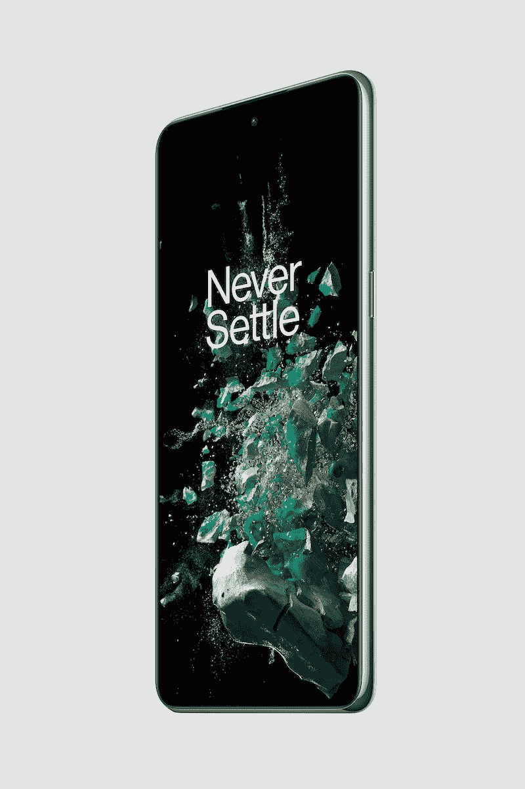
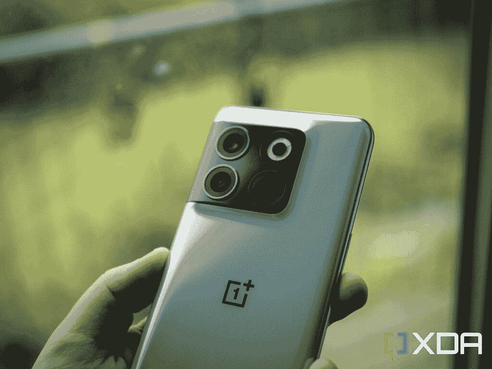

# 一加 10T vs 三星 Galaxy S22:两款超值安卓旗舰选择

> 原文：<https://www.xda-developers.com/oneplus-10t-vs-samsung-galaxy-s22/>

三星的基础型号 [Galaxy S22](https://www.xda-developers.com/samsung-galaxy-s22-review/) 在 2022 年的大部分时间里一直是最好的“平价旗舰”之一，但新的挑战者以[一加 10T](https://www.xda-developers.com/oneplus-10t-review/) 的形式到来，它带来了更新的顶级高通芯片，以及通常的 120Hz 有机发光二极管显示屏和优质的构建质量，价格略低。

 <picture></picture> 

OnePlus 10T

一加 10T 几乎是一款全新的旗舰产品，价格远远高于其价格区间。

 <picture></picture> 

Samsung Galaxy S22

三星 Galaxy S22 是三星的基础型号旗舰手机，虽然它失去了令人敬畏的变焦镜头和 S-Pen，但它仍然是一款非常好的旗舰手机。

* * *

## 一加 10T vs 三星 Galaxy S22:规格

| 

规范

 | 

三星 Galaxy S22

 | 

一加 10T

 |
| --- | --- | --- |
| **打造** | 

*   铝制中框
*   大猩猩玻璃 Victus 正面和背面

 | 

*   塑料中框
*   大猩猩玻璃 5 正面和背面

 |
| **尺寸&重量** | 

*   146 x 70.6 x 7.6 毫米
*   168 克

 | 

*   163 x 75.37 x 8.75mm 毫米
*   203.5 克

 |
| **显示** | 

*   6.1 英寸 AMOLED
*   1080 x 2340 像素
*   高达 120Hz 的可变刷新率

 | 

*   6.7 英寸 FHD+流体 AMOLED
*   具有自适应刷新率的 120Hz 刷新率(60Hz/90Hz/120Hz)
*   康宁大猩猩玻璃 5

 |
|  | 

*   高通骁龙 8 第 1 代(美国、中国、印度和其他地区)
*   Exynos 2200(欧洲、南美和其他地区)

 | 

*   高通骁龙 8 加第 1 代

 |
| **内存&存储** |  |  |
| **电池&充电** | 

*   3700 毫安时
*   25W 有线快速充电(包装盒中不含充电器)
*   15W 无线充电

 | 

*   4800 毫安时
*   125 瓦有线快速充电支持(北美)
*   150W 有线快速充电支持(国际)

 |
| **安全** | 超声波显示指纹扫描仪 | 光学显示指纹扫描仪 |
| **后置摄像头** | 

*   **初级:** 50MP 宽，f/1.8
*   **中学:** 12MP 超宽，f.2.2
*   **第三:** 10MP 长焦，3 倍光学

 | 

*   主要:50MP f/1.8 索尼 IMX766，OIS
*   超宽:800 万像素 f/2.2，119.9 度 FoV
*   宏:2MP

 |
| **前置摄像头** | 10MP | 16MP |
| **端口** | USB-C | USB-C |
| **音频** | 立体声扬声器 | 立体声扬声器 |
| **连通性** | 

*   5G(毫米波)
*   支持 2x2 MIMO 的 Wi-Fi 6 (802.11ax)
*   蓝牙 5.2
*   国家足球联盟

 | 

*   5G(毫米波)
*   支持 2×2 MIMO 的 Wi-Fi 6 (802.11ax)
*   蓝牙 5.1
*   国家足球联盟

 |
| **软件** | Android 12 上的 OneUI 4.3 | Android 12 上的 OxygenOS |
| **其他特性** | 双物理 SIM | 双物理 SIM |

* * *

## 一加 10T vs 三星 Galaxy S22:硬件和设计

一加 10T 和 Galaxy S22 都采用了看起来很酷的设计，相机模块的一侧融入了框架。虽然我个人更喜欢一加的外观，但我必须赞扬三星开创了这一设计，因为它首次亮相于 2021 年的 Galaxy S21 系列。Galaxy S22 是典型的玻璃铝板，而一加 10T 的前后都是玻璃，但框架是塑料的。

三星的手机也有略新版本的大猩猩玻璃加固(Victus)，而一加 10T 使用的是大猩猩玻璃 5。如果你想为你的一加 10T 找一个箱子，我们已经为你挑选了一些。如果你也想要 [Galaxy S22 cases](https://www.xda-developers.com/best-samsung-galaxy-s22-cases/) ，我们会帮你搞定。

### 显示

相比 Galaxy S22 的 6.1 英寸屏幕，一加 10T 是一款更大的设备，因为它的屏幕为 6.7 英寸。两个屏幕看起来都很棒，120Hz 面板使用了一些最新的有机发光二极管技术，呈现深黑色和强烈的红色。但是 Galaxy S22 的屏幕稍微好一点，最大亮度稍高，刷新率之间的变化范围更大(低至 24Hz，一直到 120Hz)。

一加 10T 面板并不懒散，它也充满活力的动画(其刷新率可以是 60 赫兹，90 赫兹或 120 赫兹)。但 Galaxy S22 屏幕以微弱优势胜出。

### SoC、内存和电池

自从 Galaxy S22 在今年年初问世以来，它运行在一个稍微旧一点的芯片上，即高通骁龙 8 Gen 1，而不是为一加 10T 提供动力的 8 Plus Gen 1。新的 Plus 芯片功能略强，但能效明显更高。这一点，加上 10T 中更大的电池(4800 毫安时)，意味着一加的手机比 Galaxy S22 的 3700 毫安时电池续航时间更长。

这两款手机都配备了 8GB 的内存和 128GB 起的存储空间。一加 10T 可以将内存和存储增加一倍，达到 16GB 和 256GB，而 Galaxy S22 只能将存储增加一倍，内存保持在 8GB。老实说，这没什么大不了的，因为 8GB 内存在 2022 年已经足够了。

### 摄像机

Galaxy S22 配备了三镜头系统，其中三个实际有用的镜头覆盖了广角、超广角和 3 倍变焦焦距范围。主摄像头是一个 50MP 三星 GN5 传感器，具有 1/1.5 英寸的图像传感器尺寸，该摄像头用于捕捉清晰的像素分格图像。超宽是一个 12MP 的拍摄者，具有 122 度的宽 FoV，最后是一个 10MP 的 3 倍长焦变焦镜头。

一加 10T 也有三个后置摄像头，但其中一个镜头是无用的 2MP 宏观传感器，更多的是为了展示。8MP 超宽传感器在像素数量上也有点低，所以在弱光场景下图像更柔和。但至少 10T 的主摄像头是好的:50MP 索尼 IMX766 传感器，与 Galaxy S22 的主摄像头具有相同的 1/1.5 英寸图像传感器尺寸。在主摄像头性能方面，两款手机都非常好，几乎不分上下。但 Galaxy S22 显然在变焦和超宽摄影方面胜出。

### 

10T 在自拍方面也略有优势，因为它的 16MP 拍摄器没有更高的像素密度，但一加没有像三星的所有手机那样应用厚重的皮肤增亮滤镜。尽管如此，总体来说，Galaxy S22 相机系统还是比较出众的。

* * *

## 一加 10T vs 三星 Galaxy S22:软件

Android 12 是这两款手机的游戏名称，每款手机都运行在该公司自己的 Android 皮肤上。三星的 OneUI 功能更加丰富，允许你在可调整大小的浮动窗口中打开应用程序，并将类似 PC 的布局输出到外部显示器。但一加的 OxygenOS 是一个视觉上更迷人的用户界面，动画看起来不仅更快，而且更流畅。这在很大程度上是一种错觉——oxygen OS 总是优先考虑动画的外观，但我不能否认基本的智能手机任务，如在应用程序中跳转，甚至是放下通知托盘，在我看来，一加手机比三星手机更赏心悦目。然而，无法在浮动窗口中打开应用程序(你只能在 OxygenOS 上进行分屏多任务处理)对于像我这样喜欢经常进行多任务处理的人来说有点限制。

这两个软件都不会妨碍核心 Android，所以所有常见的 Android 12 功能都在这里。最终，这归结为偏好:你想要漂亮、流畅的动画，还是更多的功能？事实证明，当我试图在旅途中工作时，三星 DeX 确实非常有用。

三星的最后一个好处是:这家韩国科技巨头承诺至少四年的安卓软件更新，而一加只保证三年。如果你一次使用手机多年，这可能是一个因素。

* * *

## 一加 10T vs 三星 Galaxy S22:性能

除了电池寿命——由于拥有更高效的芯片和更大的电池尺寸，一加 10T 明显胜出——这两款手机的总体性能将类似，尽管一加 10T 运行的芯片功能略强，CPU 时钟速度快 7%，GPU 效率高 10%。事实是，你不会发现做 99%的日常工作有什么不同，比如发短信、发邮件或在网站上阅读文字。

两款手机都有出色的触觉和立体声扬声器，尽管一加 10T 是更好的媒体消费或游戏设备，因为它有更大的屏幕和更高效的 GPU。然而，Galaxy S22 作为一台多任务生产力机器是优越的，因为 OneUI 能够在可调整大小的窗口和三星 DeX 中打开应用程序。

如果你关心基准测试，一加 10T 显然在 Geekbench 中得分更高，因为它拥有更新的芯片。你可以在下面的截图中看到，更新的骁龙 8 Plus Gen 1 在多核性能方面尤其胜出。无论哪种方式，这两款手机都是非常旗舰级的手机，它们并不缺乏动力。

* * *

## 一加 10T vs 三星 Galaxy S22:该买哪款手机？

与 Galaxy S22 的 799 美元相比，一加 10T 的 649 美元更实惠一些。然而，后者是三星的官方零售价格，亚马逊上有[交易将 Galaxy S22](https://www.xda-developers.com/best-samsung-galaxy-s22-deals/) 降至 699 美元。[一加 10T 可能也有一些交易](https://www.xda-developers.com/best-oneplus-10t-deals/)，所以一定要四处看看。

 <picture></picture> 

Samsung Galaxy S22

三星 Galaxy S22 是三星的基础型号旗舰手机，虽然它失去了令人敬畏的变焦镜头和 S-Pen，但它仍然是一款非常好的旗舰手机。

存 50-150 美元是不是一件大事取决于你的消费能力。我们确实认为 Galaxy S22 是一款稍微更精致的设备，因为它有更好的相机系统，更亮的屏幕，更长的软件更新保证期，但一加 10T 有更流畅的动画，更大的媒体消费屏幕，以及更好的电池寿命。

 <picture></picture> 

OnePlus 10T

一加 10T 几乎是一款全新的旗舰产品，价格远远高于其价格区间。

无论哪种方式，这两款手机都非常好，如果你在市场上购买旗舰级手机，但不想支付近 1000 美元，这两款手机都将为你提供良好的服务。如果你想让我分享我会选择哪款手机，如果价格差距为 150 美元，我会选择一加 10T，但如果价格差距仅为 50 美元，我会选择 Galaxy S22。