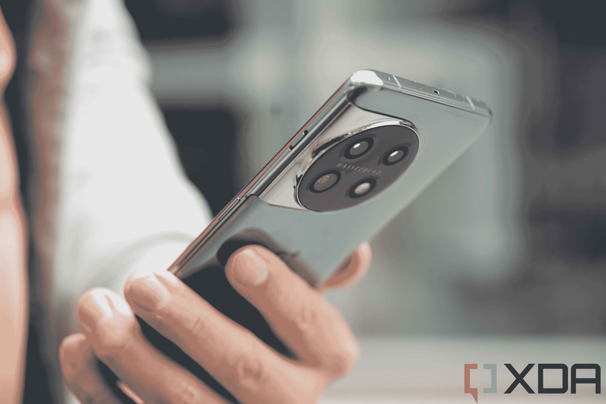
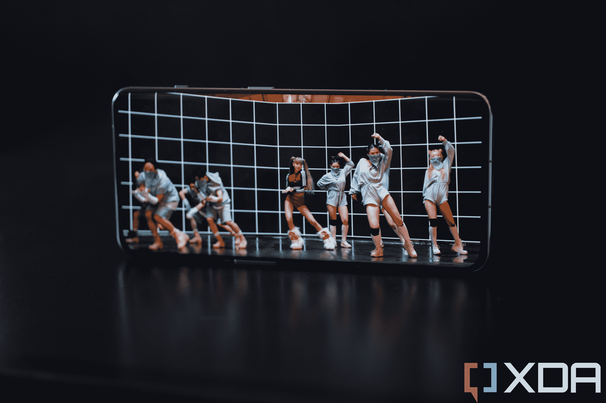
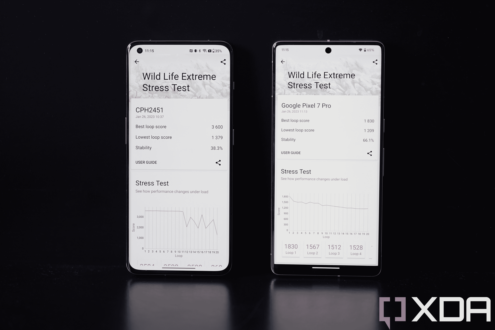

# 一加 11 评论:一个抛光的“几乎旗舰”在非旗舰价格，但这就足够了吗？

> 原文：<https://www.xda-developers.com/oneplus-11/>

一加是一个通过发布我称之为“几乎旗舰”的产品而出名的品牌，这些产品包装了许多顶级组件，但最终省略了一些阻止它们成为高端产品的额外功能。这不是一件坏事；价格是顶级旗舰产品零售价的 60-70%，这一数字对消费者有利。然而，几年前，一加开始推出具有额外功能的实际旗舰产品，如功能强大的摄像头传感器、无线充电和官方 IP 评级。结果，价格上涨，逐渐接近三星、苹果和华为对他们最好的手机的要价。

长期粉丝并不高兴，主流消费者也不太看好一加这个超高端手机品牌。但随后，一加和 Oppo 在一年半前正式公布了他们的密切关系，从而正式使一加成为一个子品牌，几乎打消了这些溢价的野心。

结果是一加 11 号。今年没有“专业”型号，这款手机在美国的 699 美元起价是自一加 8 以来的最低价格。但与一加 8 不同，它妥协了很多(它有 90Hz 的显示屏，没有变焦镜头，而所有其他 Android 旗舰都有 120Hz 的面板和变焦镜头)，一加 11 看起来和感觉都非常像一款顶级旗舰，准备好与 Galaxy S23 Ultras、 [Google Pixel 7 Pros](https://www.xda-developers.com/google-pixel-7-pro-review/) 和[Vivo X90 Pro plus](https://www.xda-developers.com/vivo-x90-pro-plus-review/)竞争。然而，如果你知道在哪里看，你会看到一加 11 也在一些领域妥协。

换句话说，一加 11 是对该公司最初根基的回归:它是一款“近乎旗舰”的产品，最终可能会达到 Galaxy S23 Ultra 的 90%左右，但价格要低得多。

**关于这篇评论:** *这篇评论是在对一加提供的一台一加 11 进行了两周的测试后写的。该公司没有参与此次审查。*

一加 11 是该公司的回归，以低于三星的价格提供近乎旗舰的体验。

**Brand**

OnePlus

**SoC**

Qualcomm Snapdragon 8 Gen 2

**Display**

6.7-inch 2K 120Hz Super Fluid AMOLED, LTPO 3.0

**RAM**

8GB/16GB

**Storage**

128GB/256GB

**Battery**

5,000 mAh

**Operating System**

OxygenOS 13, over Android 13

**Front camera**

16MP

**Rear cameras**

50MP wide (f/1.8, 1/1.56-inch), 48MP ultra-wide (f/2.2), 32MP telephoto (f/2.0)

**Dimensions**

163.1 x 74.1 x 8.5 mm (6.42 x 2.92 x 0.33 in)

**Colors**

Titan Black, Eternal Green

**Weight**

205g

**Price**

$699

**Pros**

*   与其他旗舰产品一样的优质制造质量
*   极好的热量
*   强劲的主摄像头

**Cons**

*   按照 2023 标准，长焦镜头的光学范围很短
*   没有无线充电
*   峰值亮度不如其他手机亮

## Oneplus 11:价格和可用性

*   这款手机有两种版本
*   它的起价为 699 美元，对于更高的 RAM/存储选项，起价为 799 美元
*   预订现已开放

一加 11 配备 8GB 内存和 128GB 存储空间的基本款起价为 699 美元，配备 16GB 内存和 256GB 存储空间的基本款起价为 799 美元。它从 2 月 7 日开始接受预订，产品将于 2 月 16 日上市。在美国，这款设备将在亚马逊、百思买以及一加自己的网上商店销售。与往年不同的是，它将不会由 T-Mobile 承载。

## 设计和硬件:便于握持和使用

*   一加 10 系列设计的演变
*   骁龙 8 第二代和 UFS 4.0
*   UFS 4.0 存储，出色的触觉

一加 11 延续了一加 10 系列的设计美学，在设备背面的左侧配备了不锈钢摄像头模块，与铝制框架融为一体。去年，一加将三摄像头系统放置在一个圆形的岛上，而不是像厨房灶台一样的方形摄像头模块。我是去年设计的粉丝，现在仍然认为这个改进的版本看起来更好。此外，在一加 10T 中消失的警告滑块又回来了，位于更厚的底盘上，相机凸起融入了侧面。

但更重要的是，握着一加 11 感觉棒极了。前后玻璃面板(Gorilla Glass Victus 正面，Gorilla Glass 5 背面)在左右两侧巧妙地弯曲，无缝融入相机模块。与一加 10 手机不同，后者的背面无光泽但很滑，今年的玻璃恢复了轻微的光泽，提供了更多的握持力。虽然这种光滑的表面现在确实再次吸引了一些指纹污迹，但它远没有一加 9 或 2019 年左右的大多数安卓手机那么糟糕。显然，有一些防污涂层在起作用。

这款手机完全没有锋利的边缘和无缝的一体式设计感觉，让我想起了 Oppo Find X5 Pro，但由于其陶瓷机身，溢价略低。该设备重 205 克，厚度为 8.5 毫米，按照最近的标准来看并不算大也不算重。我非常喜欢拿着一加 11，肯定比 iPhone 14 Pro Max 或 Galaxy S22 Ultra 更喜欢。

### SoC 和内存

尽管在其他领域做出了妥协，但一加 11 没有妥协，并在 SoC 方面全力以赴。它采用骁龙 8 第二代和 128 或 256GB 的 UFS 4.0 存储。后者是最新的内存标准，速度更快，能效更高。处理器是不言自明的——它是目前所有安卓设备中最强大的芯片。

### 电池和其他部件

这里的 5,000 mAh 电池也就差不多是 2023 年旗舰中的标配了，在北美可以 80W 的速度充电，其他地方都是 100W(这和北美的电压有关)。没有无线充电——这是削减成本的另一个标志——但这并没有让我太困扰，因为手机可以持续一整天。

一加今年扩大了触觉引擎，结果是强大和全面的触觉。我将手机设置为一直振动，振动马达非常强劲，如果设备在坚硬的表面上接听电话，隆隆的声音会非常大。

立体声扬声器也在这里，它们很好，光学显示指纹扫描仪也是如此。这款手机的防护等级为 IP64，这意味着它可以防尘，可以承受水的飞溅，但不能完全浸没在水中。

## 展示:性价比很高

*   它有一个华丽的 6.7 英寸 OLED 面板，刷新率可变
*   三星 E4 面板可能会更好

## 

一加 11 号有一个杀手级的显示器。6.7 英寸的 OLED 面板看起来很华丽，大多数人都不会觉得有什么可抱怨的。这是一个四高清 LTPO 3.0 面板，刷新率在 1-120Hz 之间，由几乎完全对称的边框包裹。

但是正如我前面所说的，如果你知道去哪里看，你可以看到这是一加为了达到一个更低的价格点而稍作调整的地方。这个显示屏是三星 E4 面板，它仍然很棒，比大约 99%的其他屏幕都好。但也有安卓手机，即 Vivo X90 Pro+和小米 13 Pro，使用三星最新的 E6 面板，视角更优，最大亮度更高，更省电。

但这完全是吹毛求疵。你必须是一名显示器专家，并把 Vivo X90 Pro+放在一起才能看出区别。在真空中，一加 11 屏幕非常棒，在推送 HDR 内容时，它的最大亮度为 800 尼特或 1300 尼特，足够亮。

## 相机:与其他基本旗舰相比非常棒

*   拥有 5000 万像素主摄像头、4800 万像素超宽摄像头、3200 万像素长焦摄像头和 1600 万像素前置摄像头
*   主摄像头产生自然的颜色，通常比 iPhone 14 更好的 HDR

总的来说，一加 11 相机系统处理所有的基本良好。所有三个镜头的颜色和动态范围都是一致的，所以如果你连续拍摄超宽、广角和长焦，它们看起来就不会像是在一天的不同时间拍摄的。

配有 1/1.56 英寸传感器的 50MP 主摄像头反应灵敏，可以捕捉准确的颜色，这应该归功于 Hasselblad color science。对焦很快，通常能拍出非常美观的图像。在弱光条件下，夜间模式在消除噪点和抵抗过度锐化方面表现出色。

1/1.57 英寸的图像传感器尺寸在 2023 年已经不能称为大，当与 Vivo X90 Pro Plus 中看到的 1 英寸传感器相比时，我们可以看到一加 11 的图像没有那么深。

但是，将 699 美元的一加 11 的光学系统与绝对过分的高端 Vivo 相机系统进行比较并不公平。不应该期望一加 11 与 Pro Pluses、Pro Maxes 或 Ultras 竞争并获胜，而是像 iPhone 14 或谷歌 Pixel 7 这样的基础级旗舰产品。我认为一加在对付这两个人方面做得很好。事实上，一加 11 一直比 iPhone 14 更好地处理动态范围。看看下面的例子。

我在下面的 Flickr 相册上传了更多全尺寸的照片样本，我想我们都同意一加 11 的主摄像头在价格范围内做得很好。

一加 11 的长焦变焦镜头只有 2 倍的光学变焦，没有之前一加手机的 3.3 倍长，但作为回报，长焦镜头获得了更大的传感器，提高了 2 倍甚至 3 倍的拍摄范围。一加说，这个焦距范围更适合人像拍摄，为此，一加 11 号的人像拍摄非常好，边缘检测非常好。下面是长焦相机拍摄的所有人像。但是如果你放大 5 倍左右，图像质量会迅速下降。我喜欢每天拍摄 5 倍和 10 倍的照片，所以一加 11 的长变焦能力让我有所欠缺。

超宽相机和自拍相机都很好。像往常一样，超宽拍摄在弱光条件下会丢失细节，但白天拍摄效果很好。自拍相机捕捉自然的肤色，而没有三星或小米手机咄咄逼人的美化功能。

## 软件和性能:OxygenOS 速度超快

*   在 Android 13 上采用 OxygenOS——OxygenOS 看起来和感觉上都像 Oppo 的 ColorOS
*   许多 Oppo 特有的手势现在都在 OxygenOS 中

一加过去运行的可以说是最受欢迎的安卓软件。然而，当一加和 Oppo 正式承认他们基本上是同一家公司，OxygenOS 将与 ColorOS“合并”时，情况发生了变化。反弹很快，这导致了一种倒退，但又没有。

整个事情是戏剧性的，在我看来，有点夸张，因为我多年来一直喜欢使用 ColorOS。ColorOS 和 OxygenOS 早就有共同的特点，可以追溯到一加还在假装是一家完全独立的公司的时候。例如，一加手机以非常直观的快速启动手势而闻名，比如画一个圆圈来启动睡眠中的手机的摄像头，或者用三个手指向下滑动来抓取屏幕截图。这些功能在运行 ColorOS 的 Oppo 手机中已经存在多年。

一加 11 运行的是该公司称为 OxygenOS 的 Android 13 版本，但我真的看不出它和最近 Oppo 手机上运行的 ColorOS 有什么区别。甚至以前 Oppo 特有的手势，如使用夸张的向上滑动将应用程序“推入”一个小的浮动窗口，现在都出现在 OxygenOS 中。我一点也不介意。动画非常流畅，如果你愿意的话，用户界面可以大量定制。如果你想保持一个普通的 Android 外观，你可以。

一加 11 的另一个胜利是，该公司承诺为该设备提供四个主要的 Android 更新和五年的安全更新，这击败了大多数 Android 原始设备制造商，包括谷歌 Pixel 系列。

凭借骁龙 8 Gen 2 和最新的内存和存储标准，一加 11 像该公司的手机一样速度超快。由于流畅的动画，像在所有后台应用程序中循环这样的小事感觉超级快。

这里的骁龙 8 代 2 时钟不足，所以基准数据不会达到我测试的其他骁龙 8 代 2 设备的高度，如 Vivo X90 Pro Plus 或 iQoo 11。但这一点，加上出色的 VC 冷却背板，使一加 11 保持凉爽。我在应用程序 3D Mark 上运行了“野生动物极端压力测试”，一加 11 结束时，手机感觉几乎不热。谷歌 Pixel 7 完成了测试，去年的骁龙 8 代 1 旗舰产品，如小米 12 Pro，甚至无法通过测试。

有趣的是，虽然一加 11 完成测试时更酷，也获得了更高的峰值分数，但 Pixel 7 中的谷歌张量 G2 芯片能够在结束时一直保持稳定的性能，而一加 11 确实开始在后一段中蹒跚而行。尽管如此，很明显骁龙 8 Gen 2 是一个比 Tensor G2 更强大的芯片。

 <picture></picture> 

OnePlus 11 and Google Pixel 7's score for Wild Life Extreme Stress Test.

凭借出色的触觉、立体声扬声器和舒适的手感，一加 11 是一款非常棒的休闲沙发 YouTube 设备。在两周的使用中，我的性能没有任何问题，尽管我不是一个重度游戏玩家，所以我没有参加 40 分钟的 gen shin Impact T1 会议。

我发现一加 11 的电池续航时间不错，但以我的高标准来看并不惊人。一般来说，一加 11 一次充电肯定可以持续一整天 13 或 14 个小时，但当我在一个非常繁忙的下午使用时——我在从洛杉矶到拉斯维加斯的五个小时的公交车上，全程都在打电话浏览社交媒体和流媒体 Spotify——这款手机的电池电量下降了约 40%(屏幕打开了四个半小时)。这还不错，但 iPhone 14 Pro Max 或 Vivo X90 Pro+可以在剩余电池更多的情况下完成相同的任务。

长话短说，在一天结束之前，你真的必须按下它，一次打几个小时的电话来耗尽电池。缺乏无线充电可能会惹恼一些人，但有了超高速 80W 充电器，可以在 10 分钟内充满 45%的电池(充满电大约需要 25 分钟)，我不太介意。

## 你应该买一加 11 吗？

**你应该买一加 11 如果:**

*   你想要一部几乎是顶级的安卓手机，但价格却远远达不到四位数
*   比起更普通的 Pixel Launcher，你更喜欢一加的超流、快速用户界面和快捷手势
*   你想要非常舒适的手感

**你不应该买一加 11 如果:**

*   你关心拥有一个伟大的变焦镜头
*   你可以支付更多的钱，想要最好的东西
*   你已经在考虑谷歌 Pixel 7 了

一加 11 是一款非常精致、性能出色的全能手机。截至发布时，我还没有机会测试 Galaxy S23 Ultra，但我很有信心一加 11 将输给 Galaxy S23 Ultra，但会击败 Galaxy S23 和 S23+，成为许多人眼中的优秀手机(我指的是相机性能、电池寿命、UI 流畅性和总体易用性)。

这使得一加 11 在三星的两个顶级平板之间处于一个很好的价值主张位置。但正如开始提到的，谷歌 Pixel 7 还在潜伏，它甚至比 599 美元的一加 11 更实惠。Pixel 7 也有更好的主摄像头，因为它的图像传感器更大，谷歌的软件图像处理更优越。然而，一加 11 拥有更好的屏幕，更高的最大亮度和刷新率，更快更强大的处理器，具有讽刺意味的是，更长的“保证”软件更新期(与 Pixel 7 的三年相比，为四年)。

我认为一加 11 这次的定价是正确的，对于那些不一定需要过度杀伤的 Galaxy S23 Ultra，但也想要比乏味的 Galaxy S23 或 Pixel 7 手机好一点的手机的人来说，应该是一个不错的选择。我说“应该”，是因为品牌声誉和运营商的营销帮助在美国发挥着重要作用，而一加 11 没有出现在美国任何一家主要运营商的商店货架上，可能会影响其吸引力。对一加来说，这是一场艰苦的战斗，但我很高兴该公司正在努力。

一加 11 是该公司的回归，以低于三星的价格提供近乎旗舰的体验。

**Brand**

OnePlus

**SoC**

Qualcomm Snapdragon 8 Gen 2

**Display**

6.7-inch 2K 120Hz Super Fluid AMOLED, LTPO 3.0

**RAM**

8GB/16GB

**Storage**

128GB/256GB

**Battery**

5,000 mAh

**Operating System**

OxygenOS 13, over Android 13

**Front camera**

16MP

**Rear cameras**

50MP wide (f/1.8, 1/1.56-inch), 48MP ultra-wide (f/2.2), 32MP telephoto (f/2.0)

**Dimensions**

163.1 x 74.1 x 8.5 mm (6.42 x 2.92 x 0.33 in)

**Colors**

Titan Black, Eternal Green

**Weight**

205g

**Price**

$699

## 常见问题解答

### 问:一加 11 系列有什么颜色？

我们可能会在未来看到这款手机的更多颜色，但目前在美国你只能买到这两种颜色的一加 11 5G。如果有更多的颜色可供选择，我们会更新这个空间，敬请期待。

### 问:一加 11 有 SIM 卡插槽吗？它有 eSIM 吗？

一加 11 配有双 SIM 卡插槽，你可以在手机上使用两张 nano SIM 卡。值得注意的是，在美国销售的一加 11 5G 设备也支持 eSIM，这意味着您不必插入物理 SIM 卡来使用您的设备上的号码。然而，值得一提的是，在任何给定的时间点，您只能有两个激活的号码，这意味着您可以有两个 nano SIM 卡或一个 nano SIM 和一个 eSIM 激活。

### 问:一加 11 支持无线和反向无线充电吗？

一加这次决定放弃无线充电，这意味着一加 11 不支持无线或反向无线充电。这基本上是一加 10 Pro 的降级，后者支持高达 50W 的 AirVOOC 无线快速充电。考虑到与美国的许多其他旗舰相比，你仍然可以获得极快的充电速度，这不一定是一个障碍，但仍然值得考虑。

### 问:一加 11 号会有多少软件更新？

一加[最近承诺](https://www.xda-developers.com/oneplus-four-platform-updates-five-security/)将在更长时间内支持其“精选设备”。谢天谢地，一加 11 是新更新政策的一部分，这意味着你可以期待收到多达四个主要的 Android 更新和五年的安全更新。它凭借其更新的软件更新政策击败了大多数安卓原始设备制造商，包括谷歌 Pixel 系列，现在与三星为其旗舰手机提供的服务一致。如果你想知道，一加 11 5G 开箱即用，搭载基于 Android 13 的 OxygenOS 13。

### 问:一加 11 号有可扩展内存吗？

一加 11 和它的前辈一样，没有用于存储扩展的 microSD 卡插槽。相反，你可以选择 128GB 或 256GB 的存储空间。值得注意的是，只有 256GB 存储的设备使用 UFS 4.0，而 128GB 存储的基本型号使用 UFS 3.1。UFS 4.0 存储是最新的内存标准，速度更快，更节能，您可以在我们的 [UFS 4.0 存储](https://www.xda-developers.com/ufs-4/)指南中了解更多信息。

### 问:一加 11 有好的保修吗？

默认情况下，一加 11 5G 附带法律强制要求的标准保修。在美国，这意味着你可以获得 12 个月的有限保修，其中包括一加 11 的基本维修，只要它不是由于外部因素和误用而损坏。在某些国家，包括一些欧洲国家，最低有限保修期为 24 个月。您可以选择花更多的钱来延长您的有限保修或购买一加护理服务，该服务可为您的设备提供长达两年的意外跌落、碰撞、破损或液体溅入损坏保护。

### 问:一加 11 号支持卫星通话吗？

不，一加 11 不像 iPhone 14 系列那样支持卫星通信功能。高通最近推出了骁龙卫星，以便在骁龙 8 代 2 的智能手机上实现双向信息传递，但该功能在一加 11 5G 上尚不可用，至少目前还没有。

我们的一加 11 5G 常见问题部分到此结束，我们已经回答了您的许多迫切问题。如果您对这款手机有任何其他问题，请务必使用下面的评论部分让我们知道。