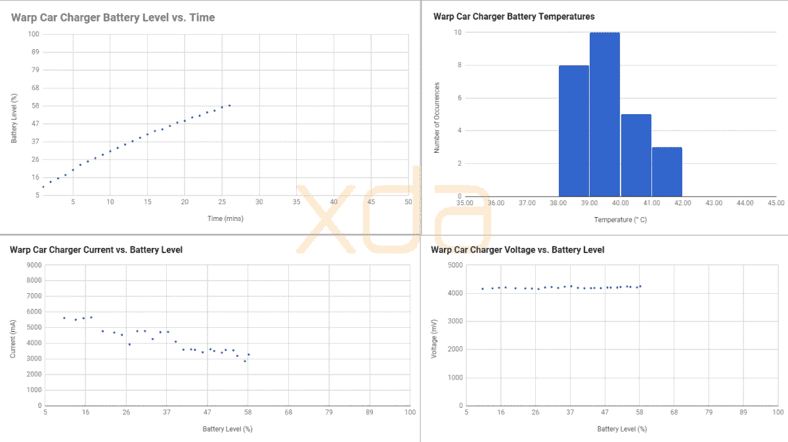
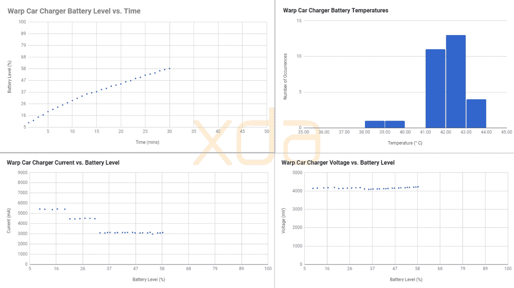

# 一加 7 临配件审查:案件，子弹无线 2，翘曲充电 30 车载充电器

> 原文：<https://www.xda-developers.com/oneplus-7-pro-accessories-review-cases-bullets-wireless-2-warp-charge-30-car-charger/>

在伦敦、纽约和班加罗尔同时举行的 3 场发布会上，一加发布了一加 7 Pro。一加的新旗舰有 QHD+ 90Hz 显示屏，几乎没有边框，没有凹口，弹出式自拍相机，三后置摄像头，高通骁龙 855，UFS 3.0 存储等等。凭借如此多的功能，一加 7 Pro 可以说是今年迄今为止发布的最好的智能手机。但是，一部优秀的智能手机并不是一加今天发布的唯一产品。为了补充新的一加 7 Pro，一加[推出了](https://www.xda-developers.com/ooneplus-bullets-wireless-2-warp-charge-30-car-charger)两款保护套，新的 Bullets Wireless 2 蓝牙无线耳塞和 Warp Charge 30 车载充电器。

## 一加 7 Pro 案例

最初的 OnePlus One 以其砂岩后盖而闻名。在智能手机设计缺乏创意、建筑材料廉价且容易弄脏的时代，OnePlus One 的砂岩背面是一股清新的空气。虽然一加 7 Pro 没有砂岩后盖，但一加再次提供了官方砂岩外壳作为配件。这款保护套不仅在左右两侧提供保护，还提供了很多额外的抓握功能。外壳没有覆盖手机的顶部或底部，但它确实延伸过了摄像头凸起。如果您的手出汗或出油，并且想要为您的一加 7 Pro 提供额外的保护，沙岩保护套就是为您准备的。

第二个案例也是我个人最喜欢的:尼龙保险杠案例。它也提供了很多抓地力，但背面的纹理并不粗糙，所以你的手指可以滑过它。尼龙保险杠外壳还可以保护一加 7 Pro 的所有侧面，同时保留弹出式摄像头、警报滑块和三后置摄像头的切口。

如果你想在花了几百美元购买一加 7 Pro 后节省一些钱，你可以从亚马逊或易贝购买第三方产品。如果你这样做，你会得到你所付出的。以我的经验来看，没有第三方案例能比得上一加提供的案例质量。在智能手机品牌中，我甚至会说一加是最好的第一方案例。这里的任何一个选择都不会错。

* * *

## 子弹无线 2 耳塞

一加正在跟进他们非常成功的子弹无线耳塞与新的子弹无线 2。据一加称，这些蓝牙无线耳塞支持长达 14 小时的音频播放。子弹无线 2 不像 Galaxy Buds 或苹果 AirPods 那样真正无线，但我更喜欢子弹上的颈带，因为它可以防止我失去它。由于耳塞也有磁性连接，如果我需要关注周围的环境，我可以将耳塞从耳朵上取下，让子弹挂在脖子上。耳塞本身非常适合我的耳朵，但你的里程可能会有所不同。如果原装耳机不合适，盒子里还有 3 种尺寸可供选择。

颈带有一个带标准媒体控制(播放/暂停/下一个/上一个和音量增大/减小)的部分，还有一个带配对按钮和 C 型充电端口的部分。当耳塞扣在一起时，媒体播放自动结束。当您拉开耳塞时，项目符号会自动尝试连接到最后连接的设备。

子弹有一个袋子，我觉得有点太小了。你需要掌握储存子弹的正确方法，因为子弹非常紧。

像最初的子弹一样，新的子弹无线 2 可以在任何支持蓝牙的设备上工作，但它的一些最好的功能只在选定的设备上支持。例如，任何支持高通 aptX HD 蓝牙音频编解码器的智能手机都可以获得最佳的音频流质量。快速配对让您可以在任何装有 Android 5.0+的智能手机上快速设置新的子弹无线 2。如果你有一部运行 OxygenOS 的一加智能手机，你可以从“耳机模式”设置页面获得更多控制。

我还没说子弹无线 2 上最好的功能:支持曲速充能 30。在我对一加 7 Pro 的评测中，我测量了这款智能手机使用 30W Warp Charge 30 电源插头和电缆的充电速度。同样的电源块和电缆也适用于子弹无线 2，不过如果你需要的话，耳塞还配有一根更小的电缆。一加宣传 10 小时的播放时间需要 10 分钟的充电时间。为了测试这一点，我通过连续媒体播放尽可能降低子弹无线 2 的电池电量，然后充电 10 分钟。我把耳塞连接到手机上，在耳塞和手机上以 100%的音量播放谷歌音乐，直到子弹断开连接并关闭。在我需要再次充电之前，子弹持续了令人印象深刻的 9 小时 7 分钟**。考虑到大多数用户不会以最大音量听音乐，这一点就更令人印象深刻了。子弹无线 2 上的 Warp Charge 30 解决了蓝牙耳机最大的问题。**

这款耳塞售价 99 美元，比 Galaxy Buds 和苹果 AirPods 都便宜。它们值这个价吗？如果你在网上做了足够的研究，你可能会发现一副更划算的蓝牙耳塞。如果你只是想要一副蓝牙质量好、电池续航时间长、有线充电速度极快的耳塞，那么子弹无线 2 绝对不会错。

* * *

## Warp Charge 30 车载充电器

由于你不能在你的汽车上使用原来的 Warp Charge 30 电源砖，一加提供了一种汽车充电器，实现了他们新的专有快速充电协议。

### 设计

这款车载充电器外观时尚，采用金属材质。一端插入汽车的点烟器，另一端是支持 Warp Charge 30 电缆的全尺寸 USB 端口。

### 驾驶模式

如果你把你的一加 7 Pro 插到车载充电器上，OxygenOS 的新驾驶模式就会被激活。该模式允许您自动打开“请勿打扰”模式或启动指定的应用程序。

通知有点烦人，因为它永远不会消失，即使在第一次设置驾驶模式后。

### 充电速度测试

车载充电器有多快？嗯，和你预期的一样快。它支持 30W 快速充电，但这里的主要好处是在充电时让你的手机保持相对凉爽。我用车载充电器做了两次充电测试:一次是在手机屏幕关闭的情况下(没有压力)，另一次是在手机亮度为 50%的情况下，在谷歌地图中导航并从谷歌播放音乐(有压力)时。即使在德克萨斯州的酷热中，手机的电池温度也从未接近危险水平。

 <picture></picture> 

Charging the OnePlus 7 Pro with the Warp Charge 30 Car Charger (No Stress.)

 <picture></picture> 

Charging the OnePlus 7 Pro with the Warp Charge 30 Car Charger (Stress.)

|  | 

没有压力

 | 

强调

 |
| --- | --- | --- |
| 平均电流(毫安) | 4241 | 3820 |
| 最小电流(毫安) | 2857 | 2976 |
| 最大电流(毫安) | 5654 | 5440 |
| 平均温度(℃) | 40 | 42(增长了 5.00%) |
| 最低温度(℃) | 38.1 | 37.2(下降了 2.36%) |
| 最高温度(℃) | 41.7 | 43.9(增长了 5.28%) |

车载充电器为你的日常通勤带来了 30 次 Warp Charge 仅此而已。如果你的工作需要长时间通勤，那么这款新车充电器绝对值得购买。

## 结论

一加再次确定了他们的第一次聚会配件。一加 7 Pro 的外壳感觉很好，并提供了很多额外的抓地力。子弹无线 2 适合，声音很大，持续时间长，充电真的很快。最后，Warp Charge 30 车载充电器为您的汽车带来了一加最新的快速有线充电技术。

[**一加七大职业论坛**](https://forum.xda-developers.com/oneplus-7-pro)