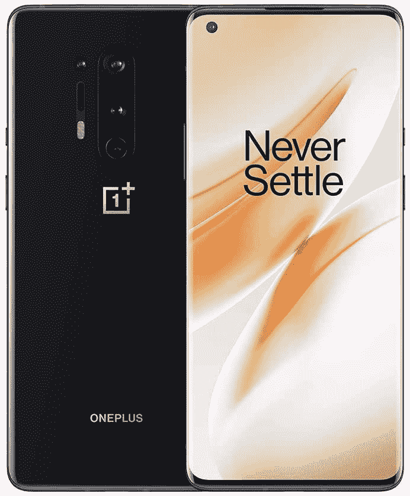

# 在亚马逊获得 200 美元的强大旗舰一加 8 Pro

> 原文：<https://www.xda-developers.com/oneplus-8-pro-deal-amazon/>

一加将取消这个月的所有交易！无论是黑色星期五级别的折扣还是一加商店的快闪交易，如果你已经在市场上购买了一部新手机或一副耳塞，已经有一些很棒的交易了。今天的一加大交易？在亚马逊，购买一加 8 Pro 可以节省 200 美元！

在 XDA 对[一加 8 Pro 和三星 Galaxy S20+](https://www.xda-developers.com/oneplus-8-pro-vs-samsung-galaxy-s20-plus-review-comparison/) 的超级深入比较中，8 Pro 能够与三星旗舰针锋相对，在某些情况下甚至超越了它。凭借出色的显示屏和摄像头，很难否认 8 Pro 的价值...而且现在在打折，更是一个不错的选择！

如果你不完全相信，也许我们的[一加 8 专业版评测](https://www.xda-developers.com/oneplus-8-pro-review-never-settle-on-hardware/)会有所帮助。这是一加的旗舰之一，感觉真的像一个高质量的旗舰，而不是感觉你正在解决一个低质量的手机。老实说，谁愿意接受更少呢？

所有这些，评论和比较，都是在假设你会为这部手机支付全价的基础上进行的。所以在这个设备上省下 200 美元的时候，那就更好了！无锁版 Onyx Black 256 GB 一加 8 Pro 仅售 800 美元，很难否认这对于一款更高端的一加手机来说是一笔不错的交易。如果你有亚马逊 Prime Rewards 卡，你也可以在 18 个月内每月支付 44.44 美元...我就是这样得到我的，毕竟！我确实说过我需要一部新手机，而 8 Pro 看起来正是升级的合适手机。

 <picture></picture> 

$250 off the OnePlus 8 Pro

在不倾家荡产的情况下，为自己打造一款坚固的旗舰。黑色的 256GB 一加 8 Pro 在亚马逊上只要 800 美元！如果你有 Prime Rewards 卡，你也可以注册一个 18 个月的 0% APR 付款计划。

亚马逊声称这是一项限时交易。不要坐在这一个，并得到一个闪亮的新一加手机今天！