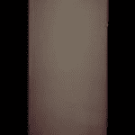
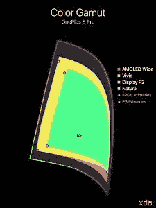
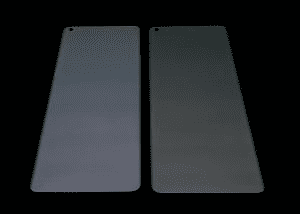
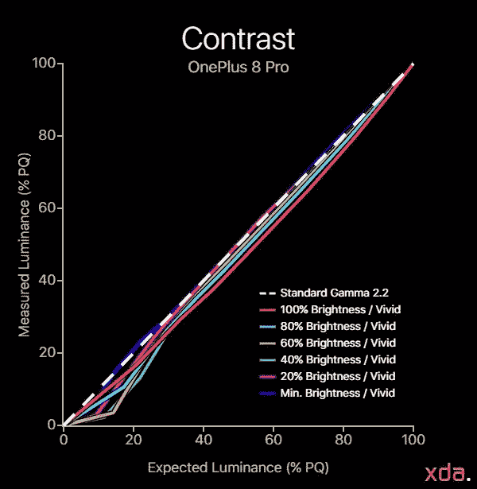
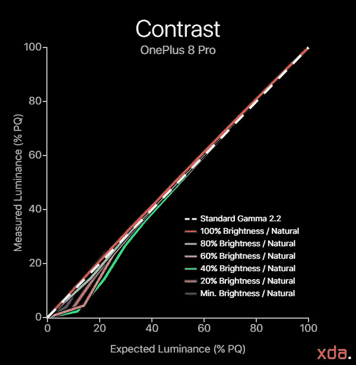
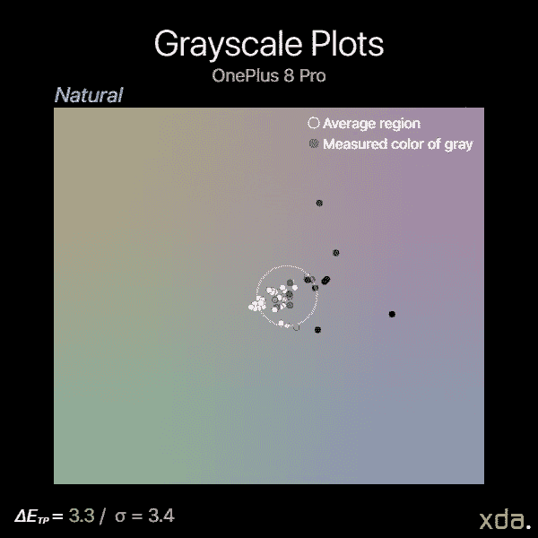
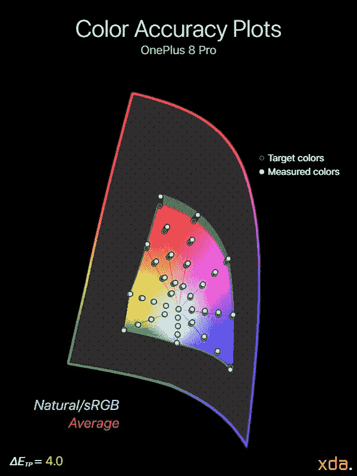
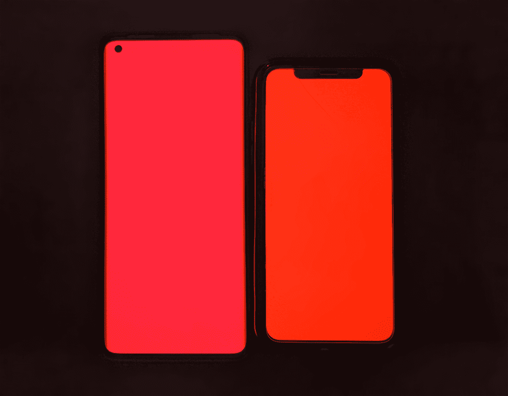

# 一加 8 专业版显示器分析——高价硬件

> 原文：<https://www.xda-developers.com/oneplus-8-pro-display-analysis-premium-hardware-at-a-cost/>

毫无疑问，一加最终决定进军高端高价智能手机市场。但是他们有什么可以证明的呢？迄今为止智能手机屏幕上最多的规格和功能。

虽然到现在为止，我们都应该知道硬件和纸上的规格只是整体质量和体验的一部分。面板特性、屏幕校准和软件实现的细微差别都会改变内容的显示方式。由于价格的原因，过去的预算友好的一加手机可以承受一些遗漏和缺点。至于价格，一加手机一般都有不错的显示屏。现在，一加 8 Pro 是[在高级类别](https://www.xda-developers.com/oneplus-8-pro-specifications-features-pricing-availability/)中严格定价，几乎没有出错的余地；任何事情*可以*挑剔*就应该*挑剔。

## **一加 8 Pro 显示器评测集锦**

赞成的意见

*   1440p 的超平滑和清晰的 120Hz 高刷新率
*   智能手机显示屏中最亮的
*   挑战显示技术的极限

骗局

*   在较低亮度下，阴影渲染一般，灰色着色和黑色挤压
*   收到有一致性问题的面板的可能性更高
*   校准显示模式中的错误校准红色色调
*   渲染 HDR/PQ 中的阴影太亮

#### **“顶级旗舰”组件**

就整个设备而言，一加 8 Pro 的构造非常好。包含的每一个组件都是高端的，[手机](https://www.xda-developers.com/oneplus-8-pro-review-never-settle-on-hardware/)没有遗漏任何重要的部件。虽然高质量的器件会增加裕量，但应该注意的是，它们通常需要更多的维护和保养，才能充分发挥潜力。

一加 8 Pro 的面板来自三星显示，但这一次一加似乎不会满足于三星的最佳产品。一加 8 Pro 拥有 6.78 英寸的高屏幕，分辨率为 QHD+ ( **3168×1440** ，**每英寸 513 像素**)，刷新率为 120 赫兹。与三星 Galaxy S20 不同，一加 8 Pro 能够以全 QHD+分辨率呈现 120 Hz。就色彩量而言，一加 8 Pro 与三星自己的旗舰产品 Galaxy S20 一样亮，一样宽。此外，一加 8 Pro 有一个**原生 10 位显示**面板，可以填充更多的色彩量。理论上，它应该允许更平滑的颜色梯度和更精细的阴影细节。

 <picture></picture> 

Darkened row along hole-punch camera, and cloudiness near the bottom

一加 8 Pro 的显示屏是一项雄心勃勃的努力，旨在为智能手机创造最佳的显示体验。我对一加的努力毫无保留。然而，在过去的几个月里，许多一加 8 Pro 的客户在有机发光二极管的显示器上遇到了一些异常。这些异常包括屏幕一致性问题、黑色挤压和前置摄像头的暗行。我自己的设备也面临着同样的问题，我收到的替换设备也是如此，但是我发现我的质量控制是可以接受的。然而，在看到来自其他用户的大量质量控制报告后，也许这就是他们使用三星最新最棒的面板所必须付出的代价。我们联系了一加就暗排问题发表声明，我们被告知“在一些弱光环境下，可能会观察到极其轻微的亮度差异。这不会影响设备的性能。”不幸的是，它没有告诉我们任何我们不知道的事情，并且它让我们对暗行问题无可奉告。

### **颜色配置文件**

 <picture></picture> 

OnePlus 8 Pro Gamut chart

一加 8 Pro 保留了两种通用的 Android 颜色配置文件:符合 sRGB 的自然配置文件和更生动的生动配置文件，后者基于 P3 显示器，带有更冷的白点。一加在“高级”选项下还有三个配置文件，允许用户在 sRGB、显示 P3 和显示器的原生色域之间手动切换，同时让用户可以选择调整白点。

与 sRGB 色彩空间相比，鲜艳的色域比*大 49%*，比*大 23%的红色偏向橙色*，比*大 33%的绿色*。AMOLED 的宽色域比 sRGB 大 55%，红色大 26%，绿色大 36%，蓝色大 18%。

### **软件显示功能**

在软件方面，一加为一加 8 Pro 增加了三个显示功能:

*   **舒适色调:**自动调节屏幕的白平衡，以适应周围环境光的颜色(5000K–7400K)。
*   **鲜明的色彩效果:**通过局部对比度增强和锐度过滤，将标准视频实时处理为 10 位 HDR。仅适用于某些应用程序。
*   **运动图形平滑:**实时处理视频的运动和帧率，消除抖动。仅适用于某些全屏应用程序。

客观地评价显示特征可能是一个棘手的问题。大多数时候，公司会对图片的饱和度、对比度或清晰度进行主观调整，这会扭曲内容的艺术意图。但是，确实存在一些调整，可以实际改善内容的原始颜色分级的表示。这些调整通常涉及使屏幕上的内容适应观看环境，因为观看环境在如何感知内容方面起着关键作用。这是舒适音调的基础，也是其他两个功能的话题点。

**舒适色调**类似于苹果的真实色调，当无缝集成时，我认为这是现代显示系统的一个主要特征。它类似于屏幕白平衡的自动亮度，但就像自动亮度一样，它的有用性在于它对用户的工作效率和无缝性。不幸的是，我总是发现一加的自动亮度在适应我的偏好方面是最差的*之一——我最终需要一天调整多次亮度，有时它完全不足或过度拍摄。另一方面，舒适色调*确实很好地适应了我的一加 8 Pro 上的屏幕白平衡，*除了*有一个警告:它不适用于锁屏，每次设备解锁时都需要重新应用和转换。夜间模式也是如此，当一加 8 Pro 的屏幕最初用蓝光照射你时，夜间模式尤其不和谐。它在应该是有用的显示特征中引入了不一致性。**

 **鲜艳的色彩效果和运动图形平滑都是一加实现的最终属于“主观调整”类别的功能，但两者都有值得谈论的资产，可以在提高内容播放保真度方面发挥作用。事实证明，内容的[感知对比度和运动也会因观看环境](https://www.spiedigitallibrary.org/conference-proceedings-of-spie/10396/103960H/Display-of-high-dynamic-range-images-under-varying-viewing-conditions/10.1117/12.2274253.short?SSO=1)而改变，因此需要进行调整以补偿不同的观看环境。鲜艳色彩效果中的色调映射和局部对比度增强据说能够适应环境光，运动后处理有助于消除高对比度场景中引入的伪像抖动。

 <picture></picture> 

Vibrant color effect (bottom) can skew critical color tones, such as flesh tones (left) and skies (right). Video sources: Mark Rober, "[Building the Perfect Squirrel Proof Bird Feeder](https://www.youtube.com/watch?v=hFZFjoX2cGg)"; Tom Scott, "[This Video Has X Views](https://www.youtube.com/watch?v=BxV14h0kFs0)"

作为几乎所有图片“增强”的典型特征，**鲜明的色彩效果**会扭曲色调。关键记忆颜色的微小变化，如肤色和天空色调，更容易被注意到。从上面的对比中可以看出这一点，马克·罗伯的脸不自觉地被晒伤了，汤姆的天空背景被染成了神秘的霓虹青色(这张照片没有完全捕捉到)。我们被告知，一加 8 Pro 应该有肤色保护，但它似乎对这个功能无效。

**运动图形平滑**，也称为运动估计/运动补偿(MEMC)，工作原理类似于许多电视机中的运动插值。它可以将内容的帧速率扩展到 60 FPS，还有一个实验设置可以将其扩展到 120 FPS，代价是将一加 8 Pro 的屏幕分辨率限制在 1080p。像大多数运动后处理一样，它经常是不一致的；简单运动，如平移/旋转对象和平移镜头，看起来比场景中的其他运动平滑得多。许多人可能会反对运动插值，因为它会导致运动看起来不自然，但如果有调整选项，它会是一个有用的工具，可以消除视频中的可见波动(这取决于屏幕亮度和观看环境)。遗憾的是，一加 8 Pro 没有提供调谐选项。

一加与一家专门从事视频和图像处理的公司 Pixelworks 合作开发了这些功能。一加 8 Pro 内部是 Pixelworks 的视觉处理器 Iris 5，它负责 HDR 升级和运动处理。两条 MIPI 通道为 Iris 5 芯片提供信息，Iris 5 芯片用于通过不同的通道发送视频流和 Android UI 界面。Iris 5 独立处理视频流，然后将具有 UI 的合成帧发送到显示器。我们已经发表了[一篇独立的文章](https://www.xda-developers.com/pixelworks-iris-5-visual-processor-android-display-experience-oppo-find-x2/)，报道 Pixelworks 和他们的 Iris 5 芯片还能做什么。对于一加 8 Pro，Pixelworks 还负责工厂显示器颜色校准和 DC 调光功能。

**收集数据的方法**

为了从显示器中获得定量的颜色数据，我将特定于设备的输入测试模式放置到手机中，并使用 X-Rite i1Display Pro 测量显示器产生的辐射，该辐射由 X-Rite i1Pro 2 分光光度计在其高分辨率 3.3 纳米模式下测量。我使用的测试模式和设备设置针对各种显示特性和可能改变我们所需测量的潜在软件实现进行了修正。除非另有说明，我的测量通常是在禁用显示相关选项的情况下进行的。我使用

*constant power*

模式(有时称为

*equal-energy*

图案)，与大约 42%的平均像素水平相关，以测量传递函数和灰度精度。测量发射型显示器时，不仅要使用恒定的平均像素电平，还要使用恒定的功率模式，这一点很重要，因为输出取决于提供给它的电流和电压。此外，恒定的平均像素水平并不固有地意味着恒定的功率；我使用的模式满足这两者。我使用更高的平均像素水平(接近 50%)来捕捉较低像素水平和许多白色背景的应用程序和网页(像素水平较高)之间的中点。我使用最新的色差度量δ

*E[TP]* [(ITU-R BT.2124)](https://www.itu.int/dms_pubrec/itu-r/rec/bt/R-REC-BT.2124-0-201901-I!!PDF-E.pdf)

，这是一个

[overall better measure for color differences](https://www.ibc.org/publish/specifying-colour-tolerances-for-hdr-and-wcg-displays-/2449.article)

比δ

*E* [00]

这在我早期的评论中使用过，目前仍在许多其他网站的展示评论中使用。那些还在用δ的

*E* [00]

对于颜色误差报告，鼓励使用δ

*E[ITP]*

，作为

[will be detailed in a session](https://2019.smpte.org/home/session/162191/%CE%94eitp-is-now-itu-r-bt.2124-is-the-industry-ready-to-move-on-from-%CE%94e2000)

来自电影电视工程师协会(SMPTE)和肖像显示器协会(CalMan 的所有者)

*E[ITP]*

通常在计算中考虑亮度(强度)误差，因为亮度是完整描述颜色的必要组成部分。然而，由于人类视觉系统分别解释色度和亮度，所以我将我们的测试模式保持在恒定亮度，并且在我们的测试模式中不包括亮度(I/强度)误差

*ΔE*

价值观。此外，在评估显示器的性能时，将这两种错误分开是有帮助的，因为就像我们的视觉系统一样，它们属于显示器的不同问题。这样，我们可以更彻底地分析和理解显示器的性能。我们的颜色目标基于 IC

[T]

C

[P]

/ITP 色彩空间，它比 CIE 1976 UCS 具有更好的色调线性，在感觉上更均匀。我们的目标以 100 cd/m 的基准在整个 ITP 色彩空间中大致均匀地间隔开

²

白色级别，以及 100%、75%、50%和 25%饱和度的颜色。颜色是在 73%的刺激下测量的，假设伽马功率为 2.20，这相当于最大亮度的 50%。对比度、灰度和颜色准确度在显示器的整个亮度范围内进行测试。在 PQ 空间中，亮度增量均匀分布在最大显示亮度和最小显示亮度之间。图表和图形也绘制在 PQ 空间中(如果适用),用于正确表示数据的实际感知。δ

*E[TP]*

值大约是 3

× the magnitude of Δ*E*[00] values for the same color. The metric assumes the most critically-adapted viewing condition for the observer, and a measured Δ*E[TP]* color difference value of 1.0 denotes a just-noticeable-difference for the color, and a value less than 1.0 signifies that the measured color is indistinguishable from perfect. For our reviews, a Δ*E[TP]* value of less than 3.0 is an acceptable level of accuracy for a reference display (suggested from ITU-R BT.2124 Annex 4.2), and a Δ*E[TP]* value greater than 8.0 is noticeable at a glance (tested empirically, and the value (8.0) also nicely lines up with roughly a 10% change in luminance, which is generally the change in percentage needed to notice a difference in brightness at a glance).

HDR 测试模式是针对

[ITU-R BT.2100](https://www.itu.int/dms_pubrec/itu-r/rec/bt/R-REC-BT.2100-2-201807-I!!PDF-E.pdf)

使用感知量化器(ST 2084)。HDR sRGB 和 P3 图案与 sRGB/P3 原色均匀间隔，HDR 参考水平白色为 203 cd/m

² [(ITU-R BT.2408)](https://www.itu.int/dms_pub/itu-r/opb/rep/R-REP-BT.2408-2017-PDF-E.pdf)

，并且对于其所有模式，PQ 信号电平为 58%。所有 HDR 模式都是在 HDR 平均 20% APL 和 20%显示尺寸窗口下测试的。

### **亮度**

如上所述，一加 8 Pro 的面板是智能手机市场上最亮的面板之一。迄今为止，最亮的智能手机 OLEDs 来自三星显示新一代面板，它们都具有相同的全屏白色输出，约为 750-800 尼特。帮助提高一加 8 Pro 清晰度的另一个关键方面是，它在明亮的条件下降低了屏幕对比度(系统伽马值约为 1.5)，从而减轻了色调。

重要的是要知道有机发光二极管显示器的亮度很大程度上取决于点亮像素的数量和强度。全屏显示白色是 OLED 面板能显示的最耗电的图像，这也是电源管理电路通常限制有机发光二极管亮度最多的地方。在高亮度情况下，当屏幕发出更少和/或更暗的像素时，显示器也通常会增强亮度信号。大多数 Android 手机也只有在启用自动亮度的情况下，并且当环境光传感器检测到大量光线时，才会达到峰值亮度。出于这些原因，我们的读者了解他们在线阅读的显示器亮度测量的背景和条件非常重要——1，400 尼特的显示器亮度数字与屏幕上几个点亮的像素相关，并不能正确表征显示器的典型亮度。

也就是说，也许低像素级亮度数字最相关的用例是 HDR 回放。HDR 内容依赖于屏幕小区域的强烈镜面高光，高光的预期净空通常通过测量显示器在 20% APL(对应于 20%点亮为白色，其余为黑色的屏幕)时的峰值亮度来衡量。在使用 HDR 模式时，我遇到了一加 8 Pro 的一个奇怪之处:对于生动的轮廓，我测得 20% APL HDR 峰值亮度约为 910 尼特，而自然轮廓仅测得约 550 尼特。这是一个重要的差距，虽然我知道为什么会这样，但这意味着 HDR 的内容应该在生动的侧面上查看，以体验面板的全部 HDR 潜力。

与此相关，对于中低像素级别的标准内容，鲜艳色彩配置文件的峰值亮度输出也明显高于自然配置文件。虽然它们具有大致相同的全屏白色亮度(791 尼特对 768 尼特)，但在 50% APL 下，生动的配置文件输出 971 尼特，而自然的配置文件仅输出 732 尼特。这不应该太令人惊讶，因为生动的配置文件是为了更有力的选择，但这是一个显著的差异，高于其他手机颜色配置文件的差异。这些亮度数据仅适用于一加 8 Pro 在检测到大量光线时的自动亮度。在手动亮度范围内，全屏白色仅达到 483 尼特(自然)/491 尼特(鲜艳)，50% APL 仅达到 470 尼特(自然)/574 尼特(鲜艳)。

但是为什么轮廓之间存在如此大的亮度差异呢？自然配置文件通过降低较低像素级别的亮度来应用均衡显示亮度的对策。因此，不同于典型的有机发光二极管行为，即白色级别*在较低像素级别增加*，自然配置文件旨在保持亮度一致，而不管像素级别如何。这种均衡是正确校准显示器的传递函数(对比度)所必需的，这也是自然配置文件比生动配置文件具有更好的校准对比度的原因(如下一节所述)。然而，一加 8 Pro 确实稍微超过了这种均衡，并且在较低的像素水平下，配置文件稍微降低了亮度，但没有达到显著的程度。

 <picture></picture> 

OxygenOS 10.5.8 (left) OxygenOS 10.5.2 (right)

在低端，一加 8 Pro 只能暗到 4.5 尼特。这明显高于大多数其他有机发光二极管手机(包括一些液晶显示器)，通常低于 2 尼特。一加 8 Pro 的夜间模式确实有一个进一步降低亮度的选项，当亮度达到最大值时，可以将一加 8 Pro 的亮度降至 3.0 尼特。随着夜间模式色温设置为最热，它甚至可以进一步降低到 2.4 尼特，仍然不像竞争对手那样暗淡。有趣的是，在我开始评测这台显示器时，一加 8 Pro 的最低基础亮度曾经是 2.9 尼特，但 [OxygenOS 版本 10.5.8](https://www.xda-developers.com/oneplus-8-pro-oxygenos-10-5-7-8-april-2020-security-patch-display-camera-system-optimizations/) 的更新将它提高到了 4.5 尼特。此次更新改进了暗灰色着色和黑色剪裁，而不仅仅是简单地提高最低亮度。

### **对比度和色调映射**

当谈到大多数内容的外观时，人们通常认为其*对比度*(*灰度成分*)比颜色的细微差别*色度成分*更重要。这并不是以任何方式破坏色彩，而是图像的对比度构成了它的结构，并对场景的情绪有很大的贡献。对于应用程序或 web 界面的设计，对比度在用户体验(UX)和可访问性方面起着至关重要的作用，显示器需要能够恰当地呈现色调细节，以实现最大的易读性。

有时被称为*显示伽玛、*或更准确地称为*传递函数*，显示器的色调映射决定了屏幕上所有色调的亮度和/或饱和度。它直接影响图像对比度，由于这个原因(以及许多其他原因)，它的重要性不能被夸大；我更愿意使用色彩准确度不达标的显示器，而不是对比度不规则的显示器。

就这一点而言，今天大多数移动显示器都具有校准的显示模式，其色彩准确度令人惊讶。然而，几乎所有的有机发光二极管仍然存在伽玛校准问题，特别是在较暗的近黑色色调。这是发射显示器类型的自然问题，但更多的显示器校准器应该开始在改善黑暗问题领域取得进展，包括一加。

 <picture></picture> 

Vivid Contrast chart (Combined); 42% APL

鲜艳颜色配置文件的校准明显具有比 sRGB 标准更高的对比度，尽管内部目标仍然是伽马值为 2.20，与 sRGB/自然相同。生动的轮廓之所以看起来有更多的对比度，实际上是由于缺乏对像素级别的亮度补偿而导致的“误校准”(在亮度一节中谈到)。我将*校准错误*加上引号，因为这是亮度均衡不足的副作用，OEM 厂商刚刚决定保留这种亮度均衡以获得更强有力的配置文件。如果没有亮度均衡校准，在较高的 APL 和显示器亮度下，产生的伽玛漂移会更高(增加对比度)。要查看亮度均衡的生动配置文件，您可以选择“高级显示选项”下的“显示 P3”选项，并调整白平衡进行匹配。

视觉上，生动的轮廓在最大手动亮度下具有大约 2.45 的近似伽马功率，在较低亮度下向 2.20 归一化。如果补偿我们眼睛的对比敏感度功能，这实际上是显示器应该做的*的对立面*。一般来说，显示器应该保持一致的对比度，与亮度无关，除非补偿对比敏感度功能或[巴特尔森-布莱曼效应](https://www.colorduels.com/what-is-simultaneous-contrast/)。不过，如果你一直关注对比图表，那么一加 8 Pro 还有一个更普遍的问题，它会影响这两种配置文件，我稍后会谈到这一点。

 <picture></picture> 

Natural Contrast chart (Combined); 42% APL

自然色配置文件旨在准确地表示 sRGB 色标，因此它*应该*紧密地跟踪 2.20 的伽马功率。它*多半是*做的；较高的 50%亮度色调跟踪 2.20，与显示器亮度无关，除了在 100%亮度时，它在大约 2.15 处稍微亮一些。尽管如此，正如我前面提到的，还是有一些问题。

在 60%或更低的显示亮度下，自然和生动的轮廓在较暗的色调中表现出扭曲，在大约 40%的亮度下表现出最不规则性。它给人一种强烈的黑色挤压的印象，即使显示器实际上修剪的阴影是非常正常的。这给黑暗场景和界面带来了问题，因为由于明显的挤压，许多细节和分离变得模糊不清。这可能是一加 8 Pro 最令人失望的地方，尤其是因为他们以前的显示器没有这个问题。(注:我知道一加 7T 据说有这个问题，但我没有收到一个单位审查)。oxygen OS 进行了一次更新，改进了黑色剪裁，这对非常低的近黑色阴影略有帮助，但对其余较低的 30%亮度色调仍然有效。

此外，应该注意的是，一加夜间模式功能中的*亮度*滑块作为半透明的黑色覆盖，随着*亮度*滑块设置得更暗，不透明度会增加。这会加剧阴影扭曲，压缩亮度范围，并将更多中间色调推入有问题的阴影范围。理论上，像一加 8 Pro 这样的 10 位面板应该有助于减少舍入误差和轮廓/条带，但它对这些潜在的色调映射问题无效。

从积极的方面来看，我很高兴地看到，在激活一加 8 Pro 的高亮度模式(在阳光下激活)后，系统伽马降低到约 1.5，以提高较暗色调的清晰度。据我所知，三星是唯一一家也这么做的原始设备制造商；在强烈的环境照明下，让显示器看起来更亮(实际上更“正确”)是一个重要的实现。

为了测试，我还在 60 Hz 刷新率模式下测量了自然曲线，以量化校准差异。如果差异足够大，当设备在两种刷新率之间切换时，例如在 YouTube 上播放视频时(为了省电)，可能会出现闪烁。根据我使用一加 8 Pro 的印象，每当手机切换模式时，我*确实*注意到闪烁。根据测量，差异正如我所观察到的:60 Hz 显示模式校准得更亮，对比度和凸起的阴影更少，尽管仍然有一些阴影扭曲。因此，无论何时发生刷新率切换，都会在图像质量上产生明显的闪烁。这种闪烁导致 Pixel 4 和 4 XL 的[显示器存在争议，但不同刷新率下显示器的校准不同是很常见的；这在](https://www.xda-developers.com/google-pixel-4-4-xl-display-analysis/)[的一加 7 Pro 中也有](https://www.xda-developers.com/oneplus-7-pro-display-review-finally-flagship-quality/)，但不太明显，因为一加在切换刷新率方面不像谷歌那么积极。

 <picture></picture> 

HDR PQ Contrast chart; 20% APL

HDR 内容是对比度性能最关键的地方。对照标准的 HDR PQ 传递函数评估一加 8 Pro，发现它在这里也有缺陷行为。虽然它很好地再现了中间色调，但它渲染的阴影细节过于明亮，极大地限制了它的对比度并淡化了场景。对于 HDR 高光，一加 8 专业版的峰值亮度取决于正在使用的颜色配置文件。在 100% PQ 下，自然曲线的峰值约为 550 尼特，这大约是 OLEDs 上 HDR 的最小标准峰值亮度。在 100% PQ 时，生动的配置文件的峰值可以高得多，约为 900–950 尼特，这使其成为查看 HDR 内容的首选配置文件。我在前面的亮度部分解释了为什么我认为会发生这种情况，但是对于绝对传递函数来说，这种差异不应该存在。

一个更重要的问题是，一加 8 Pro(以及其他所有 Android 设备)无法正确响应 HDR 最大亮度元数据，并且总是色调映射到 10，000 尼特。大多数 HDR 内容以 1000 尼特掌握，而不是 10000 尼特。1000 尼特对应于大约 75%的 PQ，在这种情况下，不考虑 HDR 元数据，生动的配置文件仅输出 730 尼特。这意味着它失去了大约 200 尼特的可用空间来突出显示。再加上它褪色的阴影，这大大限制了一加 8 Pro 在 HDR 的动态范围，总体来说，它的性能相当不合格。遗憾的是，一加 8 Pro 的 10 位面板对 shadows 的好处最大，但却无法发挥其全部潜力。

### **白平衡和灰度精度**

有问题的传递函数不可避免地会导致显示器其他区域的问题。除了对比度不佳之外，显示器的灰度通常会因不平衡而呈现出一种色调。虽然人类可以适应几乎任何白点的显示，但表观白点的突然变化总是会令人不舒服。

 <picture></picture> 

Natural 60 Hz + 120 Hz Grayscale Plots; 42% APL

从我们的灰度图来看，很明显一加 8 Pro 的灰度精度受到了影响。它在低到中等亮度下有明显的变化，对于较暗的色调，明显地向品红色和紫色着色。对于自然和生动的轮廓都是如此(尽管只显示了自然)。当我第一次收到我的一加 8 Pro 时，它也有一个接近最低亮度的令人讨厌的绿色色调，但 OxygenOS 10.5.8 通过简单地将最低亮度提高到不会发生这种情况的程度来解决这个问题——这是一个普通的补丁，由于没有在工厂校准期间处理它，它牺牲了大约 6%的面板较低手动 PQ 亮度范围。

我还在一加 8 Pro 切换刷新率的情况下添加了 60 Hz 显示模式的曲线图。从对比图中，我们看到它在色调亮度方面有明显的差异，但现在我们也看到在色调方面有轻微的差异。60 Hz 显示模式实际上比 120 Hz 显示模式更冷，但它在着色方面有更强的变化。

就色温而言，自然轮廓的白点在大约 6300K-6350K 之间稍微偏暖，但其颜色误差相当准确，平均约为δ*E[TP]*= 2.0。此外，它的色温可以在设置中调整为更冷或更暖。在 6900 K 的平均相关白点色温下，生动的配置文件运行起来要凉爽得多。*舒适色调*功能还可以使白点适应环境照明的色温，范围从 5000 K 到 7400 K

在 HDR 回放中，一加 8 Pro 的灰度一致性并不可怕，但也不显著。这两个轮廓的平均灰度都有明显的差异，但差异比挑剔的观察者所希望的要大。在这里，生动的配置文件表现更好的 HDR，更严格的颜色校准。但是，请记住，这两个轮廓仍然有凸起的阴影，从图中可以看出，都是绿色/黄色的。

### **色彩准确度**

一段时间以来，对于大多数旗舰来说，色度精度已经不是问题。一般来说，在显示器中，白色以外的色彩准确度通常不是我最优先考虑的，只要色彩没有过度的色调偏移。一加在他们以前的设备中对色彩准确性一直很好，所以我毫不怀疑一加 8 Pro 至少会表现得一样好。

 <picture></picture> 

Natural average sRGB Color Accuracy Plots; 50% APL

 <picture></picture> 

OnePlus 8 Pro (left) / iPhone 11 Pro (right)

...但也许我的乐观太天真了。甚至在对自然轮廓进行正式测量之前，我就注意到红色色调比标准色调更暗、更饱和。测量后，很明显*所有的*红色混合物都过饱和了(超出的部分在色域外的图中以灰色显示),并且在显示器的整个亮度范围内稍微向品红色(即粉红色)偏移。平均而言，最大饱和度的红色呈现出大约 13 的颜色误差δ*E[TP]，即使按照新的(更严格的)[δE ITP 标准](https://kb.portrait.com/help/ictcp-color-difference-metric)，这对于任何校准的颜色配置文件来说都是非常高的。红色的错误尤其令人不快，因为它们的影响出现在人类皮肤的颜色中，而我们对注意到皮肤中的错误特别敏感。*

还有其他发表的显示器评论显示了红色(和整个色域)的准确色差数字，所以我的结果让我不知该报告什么。起初，我认为我可能有一个有缺陷的显示器，所以我收到了更换。替换版也好不到哪里去，色调映射也好不到哪里去，显示一致性也好不到哪里去。这种问题的重复表明，它们在其他单元上也是显而易见的，但是是哪些单元呢？我联系了一加 8 Pro 的其他评测人员，包括评测过其显示屏的人(以及拥有 i1Pro2 测量设备的人)。我发现欧盟版本的一加 8 Pro(2023 年)没有错误校准的红色，但是国际/美国版本(2025 年)和印度版本(2021 年)有。似乎都有一致性和色调映射问题。为了得出这个结论，我已经联系了每种变体的至少三个所有者。

光谱的其余部分看起来很棒。绿色混合物是准确的(除了橙色)，蓝色在低亮度下只显示小问题。50%的灰度在整个亮度范围内都很出色，但在较低的亮度下，却受到色调映射问题的困扰。除了高饱和度的红色和橙色，颜色的亮度贡献也很出色。

 <picture></picture> 

Display P3 average P3 Color Accuracy Plots; 50% APL

检查更宽的显示 P3 色彩空间，它继续在红色混合物中显示相同的过饱和，而其余的似乎仍然很好。绿色和蓝色原色没有大问题，但是任何原色的错误校准都会影响白点，这在这里并不明显。sRGB 和 P3 色彩空间之间的这种镜像行为表明，问题不在于色彩管理系统，但我不知道这是如何发生的。我尤其不知道这怎么会是特定一加 8 Pro 变种的问题。

在我之前的章节中对对比度、灰度和亮度的测量显示，生动的配置文件比自然的配置文件对 HDR 内容表现得更好。然而，测量配置文件的颜色精度明确显示，自然色配置文件*显然*没有调整为呈现 HDR 内容。在 sRGB 和 P3，当播放 HDR 内容时，自然概况的范围受到严重限制。为了向读者保证，我的测量是在禁用任何可能改变原始渲染内容的设置的情况下进行的，例如舒适色调、夜间模式、鲜艳的色彩效果、运动图形平滑、DC 调光。

当在生动的个人资料中播放 HDR 的内容时，事情看起来好多了。不是参考水平，但一点也不差。在这种情况下，红色对于 sRGB 和 P3 的含量来说似乎有点不饱和，蓝色混合物稍微偏向青色。真正的问题仍然源于它的阴影太轻。

### **结论**

虽然一加似乎把除了厨房水槽以外的所有东西都装进了一加 8 Pro，但也许它需要水槽来清理一下。虽然我在显示器上遇到的大多数问题都与校准有关，但一致性和暗行的严重问题是由硬件造成的，因此无法通过更新来解决。由于一加 8 Pro 使用三星显示最新一代的有机发光二极管面板和新的发射器，一加似乎可能冒险使用可能尚未成熟的技术。据我所知，这些新面板的“无缺陷”面板的工厂产量可能仍低于前几代，一加可能会通过接受“不完美”面板来采用这些新面板。这也适用于一加 7T 使用的面板，它很早就使用了三星最新一代的面板。这也解释了为什么使用上一代显示屏的一加 7T Pro 没有这些问题。不过，这些问题并不是新面板固有的，因为我发现 iPhone 11 Pro 的显示器具有出色的均匀性和绝对的色彩精度。

我通常对自然档案中发现的问题缺乏关注感到恼火；考虑到工厂校准，红色在*任何*车型上都有问题，这很荒谬。更糟糕的是，在一加 8 Pro 首次发布几个月后，它们仍然存在。《自然概况》中的 HDR 问题显然是一个疏忽，但这恰恰说明一加在《自然概况》中投入的精力没有他们在《生动概况》中投入的多。我知道生动简档是更受欢迎的用户选项，但是自然简档*应该是* *用于准确内容回放的简档。*

对比度和色调映射问题是另一个很大的失望，这是我没有想到一加最好的智能手机。黑色挤压是显示器最糟糕的质量之一，因为它会导致细节的完全丢失，从而给场景添加污点。这在一加之前的展览中并不是什么大问题(也许除了一加 7T，我没有机会回顾它)，所以看到这种回归令人沮丧。我每天晚上在查看黑暗模式应用程序时都会明显感觉到这一点，考虑到一加 8 Pro 甚至不能像大多数其他显示器一样黑暗，这一点就更糟糕了。

一加 8 Pro 增加的新显示功能看起来很好，但我最终发现其中大多数都令人印象深刻。Comfort tone 在与环境照明的整合方面非常好，但就像夜间模式一样，每次我解锁设备后都会看到它重新应用，这很烦人(这方面的问题是锁屏，它需要在特定的显示模式下指纹解锁机制才能工作)。运动图形平滑/MEMC 是一种更新颖的东西，当它被更普遍地实现时，比如在 gif 或非全屏视频中。鲜艳的色彩效果/HDR 增强，就其目前的调整而言，只是令我反感。通常我不会对智能手机上的主观显示功能发表评论，但我希望未来的实现(不一定来自一加/Pixelworks)可以改善自适应方面，达到颜色等级爱好者可以欢迎它们的程度。就像音频世界中的心理声学和房间校正一样，这种显示器均衡对于显示监视器跟踪目标响应同样重要。

虽然看起来我只是在追逐一加 8 Pro 和它的显示器，但请理解我对我的显示器很势利。我从事色彩和设计工作，我需要它们看起来恰到好处(对我自己来说更是如此)。我也是一个家庭影院和校准爱好者，那些涉足那个世界的人知道其中的讲究。然而，一加 8 Pro 的硬件是*不可能*讨厌的。120 Hz 1440p 显示器与众不同，使用起来完全是一种享受，由于其亮度和色调映射，它是加州阳光下最清晰的户外显示器。我仍然不喜欢弯曲的边缘(并将永远不喜欢)，但一加 8 Pro 的视角偏移是我测量过的最低的。总的来说，我发现一加 8 Pro 的显示屏很像它的相机阵列:由于其在硬件方面的技术优势，它是目前最好的*之一，但不太可能因错过微调而老化。一旦所有其他公司都使用类似的面板，情况会如何呢？*

**[一加 8 Pro 论坛](https://forum.xda-developers.com/oneplus-8-pro)| |[一加 8 Pro 产品页面](https://onepluscom.pxf.io/c/2233363/916678/12532?subId1=UUxdaUeUpU28170&subId2=exda&u=https%3A%2F%2Fwww.oneplus.com%2Fus%2F8-pro&ourl=https%3A%2F%2Fwww.oneplus.com%2F8-pro)**

**规格**

| **一加 8 Pro** | **类型** |
| --- | --- |
| 灵活的有机发光二极管 | 五边形菱形像素**制造商** |
| 三星显示公司。 | **尺寸** |
| 6.18 英寸乘 2.81 英寸 | 6.8 英寸对角线17.3 平方英寸**决议** |
| 3168×1440 像素 | 19.8:9 像素宽高比**像素密度** |
| 每英寸 363 个红色子像素 | 每英寸 513 个绿色子像素每英寸 363 个蓝色子像素**像素锐度距离** *视力为 20/20 的可分辨像素距离。典型的智能手机观看距离约为 12 英寸* |
| < 9.5 英寸为全彩图像 | < 6.7 英寸为非彩色图像**角度偏移** *在倾斜 30 度时测量* |
| -亮度偏移 22% | 色移δ*E[TP]*= 3.3*优秀***黑色削波阈值** *要削波黑色的信号电平* |
| < 0.4% @最大亮度 | 最小: 4.5 尼特**峰值 50% APL:** 732 尼特**规格** |

| **自然** | **生动的** | **亮度** |
| --- | --- | --- |
| 最小: 4.5 尼特 | 峰值 HDR 20% APL: 550 尼特100% APL 峰值: 768 尼特50% APL 峰值: 732 尼特最小: 4.5 尼特峰值 HDR 20% APL: 550 尼特**峰值 50% APL:** 971 尼特最小: 4.5 尼特 | **峰值 HDR 20% APL:** 910 尼特峰值 100% APL: 791 尼特50% APL 峰值: 971 尼特2.15–2.81 平均 2.35**峰值 HDR 20% APL:** 910 尼特2.35–2.85 平均 2.49**伽玛** *标准是 2.20 的直线伽玛* |
| 2.15–2.81 平均 2.35 | 6401kδ*E[TP]= 2.0**非常高的方差* *强黑色剪裁*2.35–2.85 平均 2.49 | 6925kδ*E[TP]= 4.6**非常高的方差*强黑色剪裁**白点** *标准是 6504 K* |
| **sRGB:** 平均δ*E[TP]*= 4.0*过饱和红* | **比 sRGB** 的色域大 49% | **色差** |
| **sRGB:** 平均δ*E[TP]*= 4.0*过饱和红* | +33%绿色饱和度，轻微移动薄荷色(δ*H[TP]*= 2.6)**P3:** 平均δ*E[TP]*= 3.7*过饱和红***比 sRGB** 色域大 49% | **49% *larger* gamut than sRGB**+23%红色饱和度，轻微移动橙色(δ*H[TP]*= 3.1)+33%绿色饱和度，轻微移动薄荷色(δ*H[TP]*= 2.6)+33% green saturation, slightly shifted mint (Δ*H[TP]* = 2.6) |**