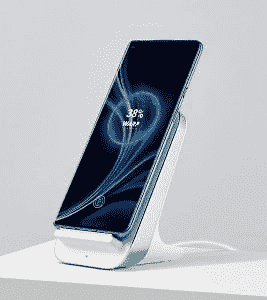

# 一加 8 和一加 8 临全规格和新的星际辉光颜色泄漏提前释放

> 原文：<https://www.xda-developers.com/oneplus-8-pro-full-specifications-new-interstellar-glow-color-leaks-before-release/>

[一加 8](https://www.xda-developers.com/oneplus-8-punch-hole-display-triple-cameras-leak/) 和[一加 8 Pro](https://www.xda-developers.com/oneplus-8-pro-leaked-renders-show-quad-camera-setup-punch-hole-display/) 将于 2020 年 4 月 14 日通过在线活动在[亮相。当一加 7T 正式宣布时，这个即将到来的系列设备的泄漏就已经存在，所以没有太多留给想象的空间。然而，这些设备的细节还不清楚，特别是考虑到这两款手机之间的差异。现在，一个新的漏洞浮出水面，它泄露了几乎所有关于这两个设备的谈话要点，它们的差异，以及星际辉光颜色变体的新色调。](https://www.xda-developers.com/oneplus-8-oneplus-8-pro-launch-globally-april-14/)

**XDA 论坛:[一加 8](https://forum.xda-developers.com/oneplus-8)|[一加 8 Pro](https://forum.xda-developers.com/oneplus-8-pro)**

这份完整的规格泄露来自[来自*winfuture . de*的 Roland Quandt。罗兰的泄密记录非常好。他披露的很多内容都是建立在旧消息和来自一加的确认的基础上，但是也有一些新的信息。](https://winfuture.de/news,115156.html)

## 一加 8 和一加 8 专业版:泄露规格

| 

泄露的规格

 | 

一加 8

 | 

一加 8 专业版

 |
| --- | --- | --- |
| **尺寸&重量** | 

*   160.2 x 72.9 x 8.0 毫米
*   180 克

 | 

*   165.3 x 74.4 x 8.5 毫米
*   199g

 |
| **显示** | 

*   6.55 英寸液态 AMOLED
*   FHD+，2400 x 1080 像素
*   90Hz 刷新率
*   20:9 宽高比
*   始终显示
*   HDR10+

 | 

*   6.78 英寸液态 AMOLED
*   QHD+，3168 x 1440 像素
*   120 赫兹刷新率
*   19.8:9 宽高比
*   始终显示
*   HDR10+
*   MEMC 理工大学

 |
| **SoC** | [高通骁龙 865](https://www.xda-developers.com/qualcomm-snapdragon-865-processor-specifications-features/) :

*   1 个 Kryo 585(基于 ARM Cortex-A77)主内核@ 2.84GHz
*   3 个 Kryo 585(基于 ARM Cortex-A77)性能内核@ 2.4GHz
*   4 个 Kryo 385(基于 ARM Cortex A55)高效内核@ 1.8GHz

肾上腺素 650 | [高通骁龙 865](https://www.xda-developers.com/qualcomm-snapdragon-865-processor-specifications-features/) :

*   1 个 Kryo 585(基于 ARM Cortex-A77)主内核@ 2.84GHz
*   3 个 Kryo 585(基于 ARM Cortex-A77)性能内核@ 2.4GHz
*   4 个 Kryo 385(基于 ARM Cortex A55)高效内核@ 1.8GHz

肾上腺素 650 |
| **闸板** |  |  |
| **存储** |  |  |
| **电池&充电** |  |  |
| **后置摄像头** | 照片:

*   **主要:** 48MP 索尼 IMX586，f/1.75，OIS，EIS，PDAF，CAF
*   **次要:** 16MP，超广角，f/2.2
*   **第三级:** 2MP，微距，f/2.4

视频:

*   4K @ 30/60 fps
*   1080p @ 30/60 fps
*   1080p @ 240 fps
*   720p @ 480 fps
*   HDR 视频

 | 照片:

*   **主:** 48MP 索尼 IMX689，f/1.78，1.12 像素，OIS，EIS，PDAF，CAF，LAF
*   **次要:** 48MP，超广角，f/2.2
*   **第三:**800 万像素，长焦，f/2.4，OIS，3 倍光学混合变焦
*   **四进制:**500 万像素，彩色滤光片，f/2.4

视频:

*   4K @ 30/60 fps
*   1080p @ 30/60 fps
*   1080p @ 240 fps
*   720p @ 480 fps
*   HDR 视频
*   音频缩放
*   彩色滤光照相机

 |
| **前置摄像头** | 1600 万像素索尼 IMX471，f/2.0，定焦，EIS，1080p@30fps | 1600 万像素索尼 IMX471，f/2.4，定焦，EIS，1080p@30fps |
| **其他特性** |  |  |
| **安卓版本** | 搭载 OxygenOS 的 Android 10 | 搭载 OxygenOS 的 Android 10 |
| **颜色** |  |  |

大多数(泄露的加上确认的)信息已经被压缩在上表中，但是我们想指出一些新泄露的信息。

例如，虽然我们知道[一加 8 系列将采用 MEMC 技术进行帧插入](https://www.xda-developers.com/oneplus-8-memc-youtube-netflix-vlc/)，但这次泄露提到只有一加 8 Pro 将获得这项技术，而普通的一加 8 不会获得这项技术。这在一定程度上确实有意义，因为 Pro 版本的显示屏刷新率为 120Hz，而普通版本的显示屏刷新率为 90Hz。然而，这两款手机据说都支持 HDR10+，并且都将[具有一个永远在线的显示屏](https://www.xda-developers.com/oneplus-will-finally-bring-an-always-on-display-mode-to-oxygenos/)。

*一加 8 号(带有先前泄露的星际辉光颜色)*

在内部，这两款手机都将[配备高通骁龙 865 SoC](https://www.xda-developers.com/oneplus-8-series-wont-exceed-1000/) 和 [5G 支持](https://www.xda-developers.com/oneplus-8-series-5g-confirmed/)。然而，泄漏表明，只有 Pro 版本将获得更快的 LPDDR5 RAM 模块，而常规版本将不得不使用常规 LPDDR4X RAM。幸运的是，这两款手机的存储保持一致，尽管我们确实注意到这两款手机都没有更高的 512GB 存储版本，由于缺乏 microSD 卡支持，这有点困难。

*一加 8 Pro*

两款手机的电池和充电技术也有所不同。由于尺寸较小，普通型号的电池比专业型号的略小。据说这两款手机的有线充电速度是一样的。然而，Pro 将通过[快速无线充电](https://www.xda-developers.com/oneplus-8-pro-wireless-charging-warp-charge-30-wireless/)以及反向充电获得优势。有趣的是，泄露的还提到了 Warp Charge 30 无线充电器的最大输出 30W 是一个仅在短时间内达到的峰值。

 <picture></picture> 

OnePlus Warp Charge 30 wireless charger; Render credits: @evleaks

据说手机上的前置摄像头是一样的。背面预计是另一个与众不同的区域。主摄像头是一个 48MP 传感器，但两款手机的实际传感器不同。辅助摄像头延续了这种差异，尽管两者都是超广角摄像头。常规型号的第三个摄像头是专用的微距摄像头。相反，Pro 拥有一个长焦传感器和第四个据说是彩色滤光片的摄像头，声称它允许用户“通过艺术灯光效果和滤光片以独特的风格从人群中脱颖而出”。Pro 仍然可以通过广角相机拍摄微距照片。根据泄露的消息，两部手机上都有 HDR 的录像。Pro 通过音频缩放(允许音频录制集中在一个方向)和闪烁传感器(防止录制显示时屏幕闪烁)将它提升了一个档次。

手机上最新泄露的信息是各自颜色的涂层。罗兰更进一步，分享了一加 8 号不同色调的星际辉光颜色变体。

我们不确定哪种颜色的变体会让消费者看到，因为泄露的文章保留了旧的渲染。

**XDA 论坛:[一加 8](https://forum.xda-developers.com/oneplus-8)|[一加 8 Pro](https://forum.xda-developers.com/oneplus-8-pro)**

泄露文章最后提到，这两款手机将在发布后大约一周内上市。然而，考虑到新冠肺炎的情况，我们不太确定硬性的截止日期，因为情况可能会迅速变化，并且因地区而异。

* * *

**来源:[winfuture . de](https://winfuture.de/news,115156.html)**