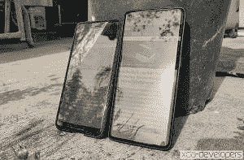
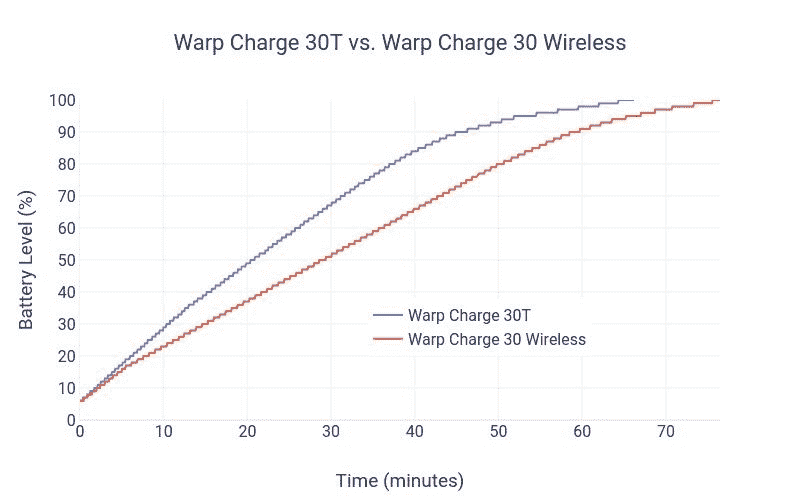

# 一加 8 专业版评测-永远不要选择硬件

> 原文：<https://www.xda-developers.com/oneplus-8-pro-review-never-settle-on-hardware/>

我们都知道它会来的。在多年努力让钱包更快乐之后，它与中游游骑兵的友谊已经结束。现在旗舰是它最好的朋友。这一切终于发生了:一加现在销售一加 8 Pro 的高端旗舰产品。

起价 899 美元，毫无疑问- *一加 8 Pro 是市场上最贵的手机之一*。诚然，最近所有的手机都经历了价格上涨，但这并没有让我们的口袋更轻松。随着我们的世界意识到全球危机，没有比在手机上花费刺激检查更糟糕的时间了，事实上，手机可能不会比你现在的手机提供*更多的功能。但是，如果*你真的*有零钱，一加 8 Pro 值这么高的价格吗？*

### 一加 8 专业版规格

| 

规格

 | 

一加 8 专业版

 |
| --- | --- |
| **尺寸&重量** | 

*   165.3 x 74.35 x 8.5 毫米
*   199g

 |
| **颜色、材料、表面处理** | 

*   缟玛瑙黑(亮面)
*   冰绿色(哑光磨砂)
*   群青蓝(哑光磨砂)

 |
| **显示** | 

*   6.78 英寸液态模制单孔冲头(3.8 毫米)切口
*   QHD+分辨率(3168 x 1440)，19.8:9 宽高比，513 像素
*   120Hz 刷新率，240Hz 触摸采样率
*   HDR10+
*   1300 尼特峰值亮度，4096 级调节
*   3D 康宁大猩猩玻璃
*   特征
    *   鲜艳的色彩效果
    *   阅读模式
    *   夜间模式
    *   MEMC
    *   HDR 升压
    *   自适应显示
*   没有用于活动笔支持的活动数字化仪

 |
| **摄像头(后置)** | 

*   **初级**
    *   48MP 索尼 IMX689，f/1.7，1.12 m 像素/48MP；224 米[4 英寸/12 毫米，OIS，环境信息系统
*   **二级**
    *   48MP，超广角，f/2.2，119.7 FOV
*   **叔**
    *   800 万像素，长焦，f/2.4，1.0 米像素，OIS，3 倍光学混合变焦
*   **第四纪**
*   **闪光灯**
*   **自动对焦**
    *   全像素全方位 PDAF+咖啡馆+LAF
*   **视频**
    *   4K @ 30/60 fps
    *   1080p @ 30/60 fps
    *   慢动作
        *   1080p @ 240 fps
        *   720p @ 480 fps
    *   时间流逝
        *   每秒 30 帧的 4K
        *   1080p @ 30 fps
    *   杂项功能
        *   HDR 视频，电影宽高比
        *   在每秒 30 帧的 4K 下超稳定
        *   音频缩放
        *   音频 3D
        *   彩色滤光照相机
*   **其他传感器**
    *   闪烁环境光线传感器(正面和背面)
    *   激光传感器
    *   前 RGB 传感器

 |
| **摄像头(前)** | 1600 万像素索尼 IMX471，f/2.45，1.0 米像素，定焦，EIS，1080p@30fps |
| **软件** | OxygenOS 10 基于 Android 102 年的软件更新(计划中的 Android 11 和 Android 12)，3 年的双月安全更新 A/B 分区实现无缝更新 |
| **片上系统** | 高通骁龙 865 CPU1x Kryo 585(基于 ARM Cortex-A77)主内核@ 2.84GHz3x Kryo 585(基于 ARM Cortex-A77)性能内核@ 2.4GHz4x Kryo 385(基于 ARM Cortex A55)效率内核@ 1.8GHzAdreno 650 GPU |
| **闸板** | 8/12GB LPDDR5 |
| **存储** | 128/256 GB UFS 3.0+双通道 |
| **电池** | 4510 毫安时 |
| **有线充电** | 30W 翘曲充电 30T (5V/6A)15W USB-C 供电(5V/3A) |
| **无线充电** | 翘曲充电 30 无线(30W)，10W 齐 EPPReverse 无线充电(3W) |
| **IP 等级** | IP68 |
| **安全** | 光学欠显示指纹扫描仪基于软件的面部识别 |
| **端口&按钮** | USB 3.1(第 1 代)Type-C 带视频输出(DisplayPort 备用模式)警报幻灯片双 nano-SIM 插槽* *第二个 SIM 将在发布后更新中激活 |
| **音频&振动** | 双立体声扬声器。由杜比 Atmos 调谐的音频。x 轴线性电机 |
| **多媒体编解码支持** | 音频播放:MP3、AAC、AAC+、WMA、AMR-NB、AMR-WB、WAV、FLAC、APE、OGG、MIDI、M4A、IMY、AC3、EAC3、EAC3-JOC、ac4 音频录制:WAV、AAC、AMRVideo 播放:MKV、MOV、MP4、H.265(HEVC)、AVI、WMV、TS、3GP、FLV、web 视频录制:MP4 图像查看:JPEG、PNG、BMP、GIF、WEBP、HEIF、HEIC |
| **连通性** |  |

*关于本次评测:*大约 2 周前，我收到了美国一加寄来的群青蓝色的一加 8 Pro 12GB RAM/256GB 存储型号进行评测。

## **设计，打造&手感**

迄今为止，一加还没有制造出一款*难看的*手机。他们通常在硬件和设计方面与市场上的其他公司保持一致。一加自称是一家非常重视设计的公司，经常发布关于其[视觉变化](https://forums.oneplus.com/threads/deep-dive-a-look-into-our-new-brand-visual-identity.1201086/)和[材料选择的深度剖析。](https://www.xda-developers.com/oneplus-experimented-cmf-marble-7t-gradient-6-alternatives/)它甚至[推出了一款概念手机](https://www.xda-developers.com/oneplus-concept-one-invisible-camera/)，这款手机纯粹是为了展示他们在颜色、材料和表面处理方面不断发展的熟练程度(CMF)。因此，可以预期的是，下一代一加手机将继续保持良好的外观，并建立在积极的设计选择上。

对于材料，一加谨慎行事:8 Pro 的两侧都是铝，后部点缀着闪闪发光的触感柔软的大猩猩玻璃。它很容易抓握，实际上感觉不像玻璃——第一印象很容易被误认为是涂层铝。许多人认为，一加向玻璃背面材料的过渡表明，它正准备引入无线充电，这种充电通过玻璃而不是金属工作。但是，当无线充电在一加以前的玻璃背手机中不存在时，许多用户对新材料的选择感到失望。凭借一加 8 Pro，一加决定最终为无线充电做好准备，实施其新的 30 瓦无线翘曲充电，并最终为他们使用易碎背衬材料的决定增加合理性。

而且说到材料，一加 8 Pro 用了很多*的* it。电话是巨大的。它的足迹是目前智能手机市场上最大的，与三星 Galaxy S20 Ultra 和 LG V60 并列。去年的型号一加 7 Pro 已经相当大了，比我喜欢的型号还要大。与它相比，8 Pro 的重量和尺寸相似，但它比它略窄、略高。然而，与 7 Pro 相比，显示面积有所增加，从 6.67 英寸对角线增加到 6.78 英寸。这看起来可能是免费的，但就我的使用来说，8 Pro 的宽度略有下降，这与 7 Pro 相比，在改善手感和手柄方面有所不同，即使屏幕更大。

最后，我们不能在不解决那个洞的情况下谈论手机的设计。一加现在选择在屏幕顶部打一个洞来容纳它的前置光学系统。这是一个有趣的偏离，从上一代一加似乎拥抱电动弹出式相机；它让一加 7 Pro 拥有真正的全屏显示，不受干扰。而在一加 7 & 7T 上，取而代之的是在屏幕的顶部中央有一个泪珠状的切口——在我看来，这比任何打孔器都不那么碍眼。我认为打孔比去年的两个摄像头安装实现都要差，唯一的好处是远离了电动机制，我在手机上并不完全舒服。

> 一加 8 设备上的新弯曲边缘是一种降级，完全没有必要，句号

关于屏幕入侵的话题，一加 8 Pro 显示屏的边缘也有弯曲。冲孔和弯曲边不协调地工作，因为曲率必然会将孔推得离边更远。弯曲的边缘对一加来说并不陌生；7 Pro 也有。然而，与 7 Pro 相比，8 Pro 的显示屏曲率开始*靠近屏幕边缘*，但曲率也*更尖锐*。因此，虽然与 7 Pro 相比，屏幕更少被弯曲或扭曲，但与弯曲边缘相关的恼人视觉缺陷(光晕、眩光、颜色偏移)在一加 8 Pro 上加剧了，特别是对于明亮的内容。当从边缘向内滑动时，例如当唤起“后退”手势时，感觉也更强烈，不像一加 7 Pro 那样令人愉快。在我使用这些设备的过程中，我经历了所有*手机中最意外的触摸。我真的希望一加和所有其他智能手机制造商一起，不要走弯路。*

## **一加 8 Pro 显示器**

除了洞和曲线，一加正在包装他们在 8 Pro 显示器上得到的一切。一加 8 Pro 使用了三星最新一代的显示面板，在这一部门，一加没有任何隐瞒:每英寸 513 像素的高屏幕密度，超平滑的 120Hz 刷新率(240Hz 触摸采样)，以及 800 尼特的峰值亮度。并且巨大的 6.67 英寸屏幕覆盖了手机正面的 93.6%。它又大又漂亮，就像三星自己的旗舰手机一样明亮漆黑。

 <picture></picture> 

Left: Pixel 3 XL (400 nits), Right: OnePlus 8 Pro (800 nits)

一加 8 Pro 还具有新的显示功能，如运动处理、自适应显示白平衡和 SDR 到 HDR 的向上映射。一加与一家名为 Pixelworks 的公司合作开发这些功能，一加 8 Pro 中有一个专用的显示处理器来处理这些功能。您可以在我们单独的一加 8 显示技术预览中了解更多关于这些功能(以及其他一些功能)的信息。

默认的颜色配置仍然是充满活力的，有力的，并且倾向于过饱和的颜色——尽管，一加*在这一代把它向后调了一点。对于那些想要准确颜色的人，一加声称他们的自然屏幕模式设置展示了与完美无异的颜色准确性。作为一名界面设计师、爱好校准器和配色师，我非常重视显示器校准。声称色彩再现“无法与完美区分”是一个大胆的说法，几乎对任何显示器都不太可能是真的。也就是说，需要有一些令人发指的问题，使这样一个小组看起来不好。*但是*，还有*有*的问题，我不会在这里详细讨论，但是在即将到来的完整显示分析中。然而，最糟糕的问题是黑色渲染、灰度一致性和均匀性的退化，这在过去他们做得很好。这些问题在一加 7T 中也有所存在，它们可能是一加跳到三星最新一代面板上的并发症。*

## **一加 8 Pro 相机**

坦率地说，我一直对一加的相机不感兴趣。自 OnePlus 5 以来，它似乎从未赶上过高端旗舰——那些一加被认为是“杀手”的旗舰。但是，它们的性能大多被认为是可以接受的，因为它们的价格比那些旗舰低得多。对此一加会坚持说他们没有偷工减料——我相信他们。他们没有多少钱可以承诺修复他们主观上奇怪的相机处理。

然而，一加 8 Pro 的具体定价是高端手机。它绝对需要与最好的竞争。我很高兴地说，*是的，*但也许仍然不是以我希望的方式。

一加 8 Pro *拍出的照片总体上看起来不错。但是，在典型的一加时尚中，它似乎仍然保留了我前面提到的一些不利的相机处理。然而，这一次一加通过其出色的主宽传感器弥补了它的处理。类似于我所说的显示器硬件，需要有潜在的软件问题来创建捕捉这么多光的传感器的问题。*

你可以期待来自一加 8 Pro 主传感器的图像捕捉到比大多数以前的旗舰更多的光。入库的 12MP 照片具有非常清晰的边缘，图像处理支持非常高的对比度和饱和度。它选择的白平衡不一定是最准确的，它倾向于选择一个可以带出场景中颜色的白平衡。与其他颜色相比，所有红色色调——棕色、粉色、品红色——也不成比例地过饱和，并且经常出现剪裁。即使有这么大的传感器，一加仍然决定将最低 ISO 限制在 100。

我将一加 8 Pro 与两年前的 Pixel 3 进行了比较，Pixel 3 当时因其捕捉细节而受到好评。我相信这是一个公平的基线设备来评估捕捉细节，但我们应该期待一加 8 Pro 在动态范围内击败它。然而，我发现一加 8 Pro 的场景色调映射非常类似于 Pixel 3 的高对比度，只是阴影中的噪点明显较少。

在这里，虽然我总体上更喜欢一加 8 Pro 的图像，但在捕捉一些泥土的层次和我的树的树皮碎片方面，它稍微落后于 Pixel 3。尽管光线很好，但一加 8 Pro 的全尺寸 4800 万像素的作物并没有比其 1200 万像素的拍摄更真实的纹理。然而，4800 万像素的图像是最清晰的图像，没有明显的锐化。这种锐化也可以在失焦的木栅栏上看到，它成为了一加 8 Pro 的 binned 相机的一个显著特征。

低光拍摄是一加 8 Pro 的传感器真正发光的地方。传感器的绝对尺寸让它吸收更多的光，像素 3 无法竞争。使用一加 8 Pro 的主传感器进行正常拍摄可与使用夜视的像素相媲美，后者需要几秒钟才能工作。

采取隔离的立场，前置摄像头一直表现良好。在良好的光线下，它保持了体面的面部细节，不像其他手机相机那样平滑。正面肖像剪裁仍然非常随意，因为我衬衫左侧的伪像清晰可见。

一加 8 Pro 的前置摄像头可以在困难的照明条件下积极曝光可见的人脸。然而，这是以牺牲面部细节为代价的；在室内环境下，一加 8 Pro 完全平滑了我的脸。然而，尽管 Pixel 3 曝光更准确，细节更多，但随之而来的噪音非常令人不快，大多数人可能更喜欢更亮的自拍。

最难捕捉的场景之一是人在太阳背光下的照片。一加 8 Pro 完全没有暴露面部，而 Pixel 3 虽然有很多噪声，但也能应付。对不同的对象尝试同样的拍摄会导致同样的无中生有的行为。

对于人像模式，一加 8 Pro 在散景方面要保守得多。它的多镜头设置比 Pixel 3 上的单镜头具有更好的剪切效果。虽然这两个散景对我来说都不是很有说服力，但我预计一加 8 Pro 在这里会做得更好，特别是当它的主传感器可以产生相当的景深时。它还采用了长焦镜头来获得更长的焦距，这往往更适合人类肖像。然而，我们的主体在一加 8 Pro 上的皮肤过于光滑，并且有明显的裸色，几乎就像应用了滤镜一样。

由于超宽和长焦传感器没有主传感器那么大，它们更加依赖一加的图像处理。正是在这些其他相机模式中，真正显示了传感器导致的图像质量差异。

在树设置中，超宽在白平衡和细节方面与主宽传感器匹配得很好，但我们可以看到树叶接触天空周围有一些明显的光晕。传感器优势在第二个弱光对中得到了戏剧性的展示，超宽与主传感器的结果完全不一致。超宽图像没有显示任何表面的细节。虽然 Pixel 3 上较小的传感器也不尽如人意，但与一加 8 Pro 超宽相机拍摄的过于平滑的照片相比，我更喜欢它的处理。

然而，当它被推到极限时，主传感器仍然可以屈服于一加的图像处理。上面主宽传感器捕捉到的图像展示了树木和天空之间可怕的光晕。我们的老朋友 Vinvcent Van Gogh 为我们提供了附带的超宽捕捉。

一加 8 Pro 的变焦功能是相机阵列中最薄弱的环节。长焦镜头在 8MP 下只支持 3 倍光学变焦，拍出来的图像看起来不太顺眼。它们与广角和超广角相比有明显不同的图像特征，放大 3 倍几乎没有价值。放大后会显示同样多的细节，而远摄传感器本身一开始并没有捕捉到那么多细节。

由于我必须在本地和附近拍摄几乎所有的照片，由于一些隐私问题，我很遗憾不能分享任何视频样本。然而，由于巨大的传感器，一加 8 Pro 上的视频具有很好的色彩和对比度。然而，4K30 的最大比特率似乎被限制在 50Mbps，在 HEVC 也没有保存选项。

录制时也可以切换到超宽和长焦，但过渡有点抖动，很明显。根据我的测试，4K30 视频录像的播放也相当抖动，这是一加手机经常出现的问题。

 <picture></picture> 

Left: Main lens closest focus, Right: Super Macro

一加 7T 的超级微距模式也回归了，现在它与所有三款相机都兼容。超级微距模式允许您捕捉近至 3 厘米的对象，这在尝试拍摄微小对象时很有帮助。它为一加相机阵列提供了更多的多功能性，这是大多数其他设备所不具备的。

一加还增加了智能宠物捕捉功能，可以检测到帧中何时有狗或猫，并启动相机对焦快门速度，以帮助清晰地捕捉我们毛茸茸的朋友。根据我的测试，它真的很好，只要摄像头检测到你的宠物。总的来说，相机也能捕捉到我的猫的黑色皮毛的细节。

还有第四个摄像头-彩色滤光片摄像头-主要用于红外摄影。有人建议将其用于可以应用于最终镜头的相机滤镜，但它们已经可以在没有彩色滤镜相机的情况下完成。只有 Photochrom 模式实际上需要彩色滤光片相机。

我认为唯一值得使用的滤镜是“哑光”滤镜，它可以降低红色中的过饱和，并更好地呈现阴影细节。在我测试过的许多条件下，它似乎有时能更准确地再现场景。

## **电池& W** **arp 充电 30/无线**

对于更大的设备，我们应该期待更大的电池。但是，尽管一加 8 Pro 的体积并不比 7 Pro 大多少，一加今年还是设法给电池增加了大约 500 毫安时的容量。虽然这不是类似尺寸的 S20 Ultra 的 5000 毫安时，但一加 8 Pro 的电池让我可以在不充电的情况下坚持一天多，在我们的家庭订单中。不幸的是，由于新冠肺炎，我无法在正常的环境下使用手机，比如处理不稳定的数据连接、更高的显示亮度或可怕的 GPS 锁定。

我一拿到我的一加 8 Pro，我就把它的分辨率设置为静态 QHD+,并将刷新率保持在 120 赫兹。我在这部手机上的日子通常由观看 YouTube 视频、参加变焦课程和会议、拍摄照片和视频组成，其余时间在 Reddit 上度过。在如此奢华的日程安排下，一加 8 Pro 每天都会让我连续看 6 个小时的屏幕，从 5 小时 30 分钟到 7 小时不等。然而，这主要是在无线网络上。

我花了一个典型的 60Hz 的一天，只是为了看看 120Hz 可能对电池产生的影响。这很痛苦，但我以不到 7 小时的屏幕时间结束了这一天。虽然这只是一天，但我确实期待一个更大的打击，我很高兴看到没有。

在 120Hz 时，操作系统将在视频播放、使用摄像头或通话时动态更改为 60Hz。我们还被告知，当内容静止和滚动后，显示器会下降到 60Hz，但是我们没有发现这种情况，至少通过我们用来检查它的方法。

无线充电一直是许多人要求一加为他们的手机添加的功能，最终在一加 8 Pro 中实现了。它支持标准的 Qi 无线充电，最高可达 10 瓦，使用一加 Warp Charge 30 无线充电器(另需 69.95 美元)，最高可充电 30 瓦。一加声称，他们的充电器只需 30 分钟就能充满 50%的电池，我们对此进行了测试和验证。从那里开始，充电到 100%还需要 48 分钟。

 <picture></picture> 

Warp Charge 30T vs. Warp Charge 30 Wireless

这个名字可能会让你相信它的充电速度和曲速充电 30 一样快。它没有；它的充电速度更接近 18W 的砖式电力传输充电器，对于无线充电器来说，这仍然是非常快的。

然而，无线充电的一个缺点是，它比有线充电在电池中产生更多的热量。根据我的测试，无线充电器将手机加热到最高 42 摄氏度，而有线 Warp Charge 30T 通常只能加热到 38 摄氏度。一加 Warp Charge 30 Wireless 内置风扇，有助于在充电时冷却手机，根据我的使用情况，它们只能在一片寂静中听到低低的“呼呼声”。一加还有一个功能是在睡觉时关掉风扇，这样当你想睡觉时就不会发出任何声音。

## **扬声器&触觉**

一加 8 Pro 的扬声器采用典型的现代双向设计。顶部有一个兼作听筒，还有一个是底部发射的。它们由杜比全景声增强，也可以与连接的耳机配合使用。然而，我的印象是双扬声器听起来*还不错*。对于价格，我期望更多。

当然，它们会变得很响，但对我来说听起来很小，尤其是在音量较低的时候。和最新的 Galaxies，iPhones 甚至像素比起来，不太能比。他们缺乏任何有冲击力的低音，并且摄影棚感觉有些封闭。虽然两个扬声器相当平衡，但整体声音仍然倾向于耳机扬声器的咝咝声。加入杜比全景声并不能解决单调乏味的声音。

不仅仅是扬声器，该设备的触觉音频也令人失望。今年，一加说一加 8 Pro 的振动马达增强了 11%，这一点我在平时的使用中并没有注意到，但现在无论何时都有一种可以听到的*扑通*声。就好像你能听到马达敲打玻璃的声音。这就像让键盘声音开着一样可怕。

这是一个小众主题，但我提到它是因为我已经被 iPhones 上的伟大触觉宠坏了。许多用户更喜欢禁用他们的振动，但我发现他们很乐意与高质量的电机互动。让我恼火的是，去年的一加 7 Pro 拥有出色的触觉。它们很强壮，有控制力，而且它们根本不会发出太多的声音。我很乐意选择“较弱”的发动机，如果它意味着一个安静的发动机。

## **软件&性能**

OxygenOS 通常因其速度、混合特性和没有任何真正的“膨胀”而受到称赞。这种情况在一加 8 Pro 中仍然存在。像许多其他 OEM 皮肤一样，OxygenOS 提供了许多股票 Android 中不存在的功能。

一加 8 系列的最新 OxygenOS 产品主要用于显示，但现在也有黑暗模式 2.0。这本质上是基于每个应用的“强制黑暗模式”，对于一加给予它的关注来说，这有点令人印象深刻。切换到黑暗模式时，界面颜色经常会发生冲突，而且它似乎还不支持那么多应用程序。一加还增加了新的壁纸，可以根据外面的天气改变颜色。

到目前为止，这就是我们所发现的一加 8 号氧原子的变化程度。不过这有点不幸，因为之前出现了一些问题，我希望这些问题能够得到解决。

在过去的两周里，我一直在使用一加 8 Pro，每天都要不停地调整亮度滑块。这是我第一次不得不在一个设备上这么做，因为其他设备正确地学习了我的自动亮度偏好。亮度超过 4000 的一加 8 Pro 仍然没有。一加在这方面一直很糟糕。对我来说，在大多数情况下，它似乎太暗了，而在睡觉前又太亮了。我每次都要改变它。

另一件在晚上困扰我的事是一加对夜灯的实现。每次你解锁手机时，它都会从正常状态淡入，所以如果你想在晚上查看手机，显示屏会让你暴露在蓝光下。显示器的舒适色调也有同样的作用。

也许最糟糕的是显示指纹扫描仪发出的光。如果你设置了它，并试图在晚上解锁手机，并且没有用拇指完全覆盖传感器，那么发出的明亮白光绝对会灼伤你的眼睛。可以理解的是，光对于照亮你的拇指指纹是必要的，但也许显示器只能照亮你拇指按压的区域。

指纹显示屏的另一个注意事项是，它会改变锁屏上的颜色配置文件。我使用的是自然屏幕模式，指纹锁屏显示设置为显示器的原生色域。这使我的锁屏壁纸和通知永久过饱和变色，这是我不喜欢的。

OxygenOS 中的手势系统也有问题，这只是谷歌的手势。在横向模式下，侧扫切换应用程序根本不起作用，在这个方向上向上滑动回家时也没有动画。抓住边缘偷看汉堡菜单似乎也不太管用。此外，如果您按住手势栏太长时间，那么即使手势栏移动，执行手势也不会起作用。

然而，在性能方面，OxygenOS 继续保持非常快的速度。虽然我不是系统动画和放松的粉丝，但它们运行起来一直没有停顿。一加 8 Pro 上的滚动和交互是我在任何设备上感受到的最流畅和最灵敏的。

通过我们标准的全面 CPU 测试套件，一加 8 Pro 毫无疑问地在各自的测试中获得了最快的性能分数。它们的表现与骁龙 865 设备的预期一致，两项测试都将设备温度保持在 35°c 以下

为了粗略评估一加 8 Pro 的 120Hz 滚动性能，我们记录了它在 Gmail 和谷歌 Play 商店中自动滚动的渲染帧时间。

我们发现一加 8 Pro 在 Play Store 中表现异常流畅，滚动性能几乎为零。Play Store 曾经是滚动 lagfests 的标志，随着一切的改进，我们现在能够以 120 FPS 的速度滚动，几乎没有丢帧。

在 Gmail 中，我们看到应用程序同样平滑地滚动。然而，该应用程序在电子邮件中填充时会丢弃帧。这对于应用程序来说是相当标准的，它更能说明应用程序的性能，而不是系统性能。

## **判决**

一加 8 Pro 无疑是一加最有 T2 感觉的旗舰手机——我知道这一点，因为这是我随身携带的最小心的一加手机。组件绝对是顶级的；没有任何明显的奇点，你可以责怪他们降低价格。主摄像头可以轻松拍摄出令人惊叹的照片，并且它可以免除仅通过传感器进行的一些令人震惊的图像处理。巨大的，几乎没有边框的显示面板实际上与三星在他们自己的旗舰机上放置的一样。然而，预计即将推出的旗舰产品也将拥有类似质量的组件，因此一加的技术领先可能是短暂的，除非它保持其软件脱颖而出。

> 一加 8 Pro 是第一款一加设备，我真的相信他们没有定居

虽然它的软件仍然需要额外的调整，但一加 8 Pro 是第一款我实际上*认为*他们没有解决的一加设备。无线充电？它就在那里，而且比大多数其他基本有线充电更快。实际的入口防护等级？一加终于得到了认证，只是说它有。不成功的方面看起来像是他们只需要继续与研发公司合作的事情，而不是他们可以投入资金来解决的简单事情。然而，这种泄密的努力绝对体现在价格上。他们不惜一切代价获得了旗舰地位，他们希望有所回报。

我们每年都这么说:一加继续进一步背离其最初的公司根基，背离那些让公司崛起的客户。这是手机的价格。当价格不是一个因素时，没有人真的认为一加是你能得到的最好的智能手机。现在，一加正在推动一加 8 Pro，试图成为最好的手机。

**[一加八大职业论坛](https://forum.xda-developers.com/oneplus-8-pro)**

**[一加八大职业论坛](https://forum.xda-developers.com/oneplus-8-pro)**

问题在于，一加 8 Pro 的定价与 Galaxy S20 非常接近，后者已经提供了可靠而完整的软硬件组合。从务实、节俭的角度来看，一加 7T 确实以近一半的价格提供了与*非常类似的*体验:你仍然可以获得非常明亮的**平板**显示屏，以及一个相当大的主传感器。然而，如果你特别想要一部*真正*大的手机——像 *S20 超*大——而不多花 500 美元，并且你想要那个*大*主传感器，那么一加 8 Pro 就是你的旗舰。

问题在于，一加 8 Pro 的定价与 Galaxy S20 非常接近，后者已经提供了可靠而完整的软硬件组合。从务实、节俭的角度来看，一加 7T 确实以近一半的价格提供了*非常可比的*体验:你仍然可以获得真正明亮的**平板**显示屏，以及一个尺寸合适的主传感器。然而，如果你特别想要一部*真的*大手机——像 *S20 超*大——而不多花 500 美元，并且你想要那个*大*主传感器，那么一加 8 Pro 就是你的旗舰。