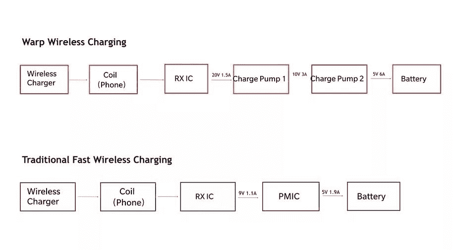

# 一加 8 和 8 Pro 宣布-这里是你应该知道的一切

> 原文：<https://www.xda-developers.com/oneplus-8-pro-specifications-features-pricing-availability/>

过去几周，一加 8 和一加 8 Pro 一直是泄密的话题。现在，在一次在线发布活动中，一加正式宣布了这些设备，结束了所有的猜测。凭借最新的高通骁龙 865 SoC、全面的 5G、高刷新率显示器支持、一加有史以来第一个快速无线充电解决方案以及新的颜色和表面处理，一加 8 和一加 8 Pro 可以提供很多东西。跟随我们深入了解一加 8 系列，看看它们是否符合“速度领先”的座右铭。

**[一加八大论坛](https://forum.xda-developers.com/oneplus-8)**| |**|[一加八大论坛](https://forum.xda-developers.com/oneplus-8-pro)**

## 一加 8 系列规格

| 

规格

 | 

一加 8

 | 

一加 8 专业版

 |
| --- | --- | --- |
| **尺寸&重量** | 

*   160.2 x 72.9 x 8.0 毫米
*   180 克

 | 

*   165.3 x 74.35 x 8.5 毫米
*   199g

 |
| **颜色、材料、表面处理** | 

*   缟玛瑙黑(亮面)
*   冰绿色(哑光磨砂)
*   星际辉光(光泽)
*   极地银

 | 

*   缟玛瑙黑(亮面)
*   冰绿色(哑光磨砂)
*   群青蓝(哑光磨砂)

 |
| **显示** | 

*   6.55 英寸液态模制单孔冲头(3.8 毫米)切口
*   FHD+分辨率(2400 x 1080)，20:9 宽高比，402ppi
*   90Hz 刷新率，180Hz 触摸采样率
*   HDR10+
*   3D 康宁大猩猩玻璃
*   特征
    *   鲜艳的色彩效果
    *   阅读模式
    *   夜间模式
*   没有用于活动笔支持的活动数字化仪

 | 

*   6.78 英寸液态模制单孔冲头(3.8 毫米)切口
*   QHD+分辨率(3168 x 1440)，19.8:9 宽高比，513 像素
*   120Hz 刷新率，240Hz 触摸采样率
*   HDR10+
*   1300 尼特峰值亮度，4096 级调节
*   3D 康宁大猩猩玻璃
*   特征
    *   鲜艳的色彩效果
    *   阅读模式
    *   夜间模式
    *   MEMC
    *   HDR 升压
    *   自适应显示
*   没有用于活动笔支持的活动数字化仪

 |
| **摄像头(后置)** | 

*   **初级**
    *   48MP 索尼 IMX586，f/1.75，0.8 m 像素，OIS，EIS
*   **二级**
    *   16MP，超广角，f/2.2，116 FOV
*   **叔**
    *   200 万像素，微距，f/2.4，175 万像素
*   **闪光灯**
*   **自动对焦**
*   **视频**
    *   4K @ 30/60 fps
    *   1080p @ 30/60 fps
    *   慢动作
        *   1080p @ 240 fps
        *   720p @ 480 fps
    *   时间流逝
        *   每秒 30 帧的 4K
        *   1080p @ 30 fps
    *   杂项功能
        *   电影纵横比
        *   在每秒 30 帧的 4K 下超稳定
*   **其他传感器**
    *   闪烁环境光线传感器(前)

 | 

*   **初级**
    *   48MP 索尼 IMX689，f/1.7，1.12 m 像素/48MP；224 米[4 英寸/12 毫米，OIS，环境信息系统
*   **二级**
    *   48MP，超广角，f/2.2，119.7 FOV
*   **三级**
    *   800 万像素，长焦，f/2.4，1.0 米像素，OIS，3 倍光学混合变焦
*   **第四纪**
*   **闪光**
*   **自动对焦**
    *   全像素全方位 PDAF+咖啡馆+LAF
*   **视频**
    *   4K @ 30/60 fps
    *   1080p @ 30/60 fps
    *   慢动作
        *   1080p @ 240 fps
        *   720p @ 480 fps
    *   时间流逝
        *   每秒 30 帧的 4K
        *   1080p @ 30 fps
    *   杂项功能
        *   HDR 视频，电影宽高比
        *   在每秒 30 帧的 4K 下超稳定
        *   音频缩放
        *   音频 3D
        *   音频挡风玻璃
        *   彩色滤光照相机
*   **其他传感器**
    *   闪烁环境光线传感器(正面和背面)
    *   激光传感器
    *   前 RGB 传感器

 |
| **摄像头(前)** | 1600 万像素索尼 IMX471，f/2.0，1.0 米像素，定焦，EIS，1080p@30fps | 1600 万像素索尼 IMX471，f/2.45，1.0 米像素，定焦，EIS，1080p@30fps |
| **软件** | OxygenOS 10 基于 Android 102 年的软件更新(计划中的 Android 11 和 Android 12)，3 年的双月安全更新 A/B 分区实现无缝更新 |
| **片上系统** | 高通骁龙 865 CPU1x Kryo 585(基于 ARM Cortex-A77)主内核@ 2.84GHz3x Kryo 585(基于 ARM Cortex-A77)性能内核@ 2.4GHz4x Kryo 385(基于 ARM Cortex A55)效率内核@ 1.8GHzAdreno 650 GPU |
| **闸板** | 8/12GB LPDDR4X | 8/12GB LPDDR5 |
| **存储** | 128/256 GB UFS 3.0+双通道 |
| **电池** | 4300 毫安时 | 4510 毫安时 |
| **有线充电** | 30W 翘曲充电 30T (5V/6A)15W USB-C 供电(5V/3A) |
| **无线充电** | 不 | 翘曲充电 30 无线(30W)，10W 齐 EPPReverse 无线充电(3W) |
| **IP 等级** | 不 | IP68 |
| **安全** | 光学欠显示指纹扫描仪基于软件的面部识别 |
| **端口&按钮** | 带视频输出的 USB 3.1(第 1 代)Type-C(显示端口备用模式)警报滑块双 nano-SIM 卡插槽**第二个 SIM 卡将在发布后更新中激活 |
| **音频&振动** | 双立体声扬声器。由杜比 Atmos 调谐的音频。x 轴线性电机 |
| **多媒体编解码器支持** | 音频播放:MP3，AAC，AAC+，WMA，AMR-NB，AMR-WB，WAV，FLAC，APE，OGG，MIDI，M4A，IMY，AC3，EAC3，EAC3-JOC，AC4音频录制:WAV，AAC，AMR视频播放:MKV，MOV，MP4，H.265(HEVC)，AVI，WMV，TS，3GP，FLV，WEBM视频录制:MP4图像浏览:JPEG，PNG，BMP，GIF，WEBP，HEIF，HEIC，RAW图像输出:JPEG、PNG |
| **连通性** |  |

* * *

## 设计

一加 8 和 8 Pro 在设计上*非常*相似，只是在 8 Pro 的后部包含了一些新的传感器。如果你熟悉去年的一加 7 和一加 7T 系列，但是，有几个重要的设计变化。

首先，一加抛弃了弹出式相机，这种相机让一加 7 Pro 和一加 7T Pro 看起来毫无特色。同样，不再有像一加 7 或一加 7T 那样的水滴凹槽。相反，一加正在追随一种今年愈演愈烈的展示趋势:打孔展示剪纸。一加 8 和一加 8 Pro 都在显示屏的左上角有一个小小的(3.8 毫米)打孔显示屏。在这个切口中有一个前置摄像头。如果你想知道为什么一加今年用了一个打孔的切口而不是弹出式相机，我们被告知一加想节省一些内部空间，以便他们可以安装更多的组件。从表面上看，这似乎是真的，因为一加 8 系列的电池比去年的型号更大，配备了一个独立的调制解调器(骁龙 X55)，一加 8 Pro 则配备了一个专用的视觉处理器(Pixelworks 的 [Iris 5)和无线充电线圈。尽管如此，一加 8 和 8 Pro 仍然分别比一加 7 和 7 Pro 更薄更轻。](https://www.xda-developers.com/pixelworks-iris-5-visual-processor-android-display-experience-oppo-find-x2/)

一加 8 系列和去年的一加 7/7T 之间的另一个主要设计差异是显示屏的曲率。虽然一加 7 和一加 7T 采用了平板显示器，但一加 7 Pro 和一加 7T Pro 采用了引人注目的曲面显示器。一加 8 和 8 Pro 的显示器在曲率方面基本处于一加 7/7T 和一加 7 Pro/7T Pro 的中间。与一加 7 Pro/7T Pro 的显示器相比，一加 8 系列显示器开始弯曲，越来越靠近边缘，也越来越陡峭，产生的眩光似乎也少得多。换句话说，更少的区域是弯曲的，但是曲线越靠近边缘越明显。

一加 8 和 8 Pro 的主要区别在于后部。这两款设备都有垂直对齐的摄像头，但一加 8 Pro 将双 LED 闪光灯从摄像头下方移到了摄像头左侧，并增加了一组额外的传感器。这些传感器包括彩色滤光照相机、激光传感器和闪烁环境光传感器。另外，两款设备之间更小的区别可以在底部看到:一加 8 Pro 底部有一个轻微的凹痕，可能有助于握持手机，因为 8 Pro 的显示屏略大(6.55 英寸对 6.78 英寸)。

### 一加 8

### 一加 8 专业版

总结一下，这两款手机的所有其他设计方面都是相同的:两款手机都在左侧有一个音量摇杆，两款手机都在右侧有一个提醒滑块和电源按钮，两款手机都在底部有一个 USB Type-C 端口，两款手机都有双扬声器(一个在右下方，另一个在顶部挡板)，两款手机都在左下方有一个双 nanoSIM 卡托盘，两款手机都在背面有[新一加标志](https://www.xda-developers.com/oneplus-unveils-new-logo-brand-visual-identity-refresh/)。两款手机也有相似的颜色，材料，和完成(CMF)；根据您得到的颜色，后玻璃盖将具有磨砂或光滑的表面。

你看不到的设计的一个主要方面是防水和防尘。一加 8 Pro 具有 IP68 的防尘防水认证等级，而一加 8 仅由一加自己进行了防尘防水实验室测试。请记住，IP 等级并不能保证你的手机在水中不会损坏——检查你的保修，看看它是否在保修范围内。

* * *

## 显示

一加一加 8 系列的座右铭是“以速度领先”今年，该公司将重点放在显示器上，尤其是在显示体验的流畅度方面。与一加 7T 相比，一加 8 的显示规格只有很小的改进，其中大部分是由于软件而不是硬件，而一加 8 Pro 的显示体验比一加 7 Pro 和 7T Pro 有显著改善。一加 8 Pro 采用了一加的第一个 120Hz 刷新率显示器，与三星 Galaxy S20 不同的是，[可以在显示器的原生 3168 x 1440 分辨率下使用。一加 8 Pro 还具有令人难以置信的亮度显示屏，据称峰值亮度为 1300 尼特——比谷歌 Pixel 4 的两倍多。此外，一加通过在一加 8 Pro 上引入总共 4096 级亮度调节，改善了自适应亮度体验。](https://www.xda-developers.com/future-galaxy-s20-update-enable-120hz-refresh-rate-qhd-resolution/)

在与视觉处理公司 Pixelworks 的合作中，一加还在一加 8 系列上引入了许多新的显示功能:

1.  这两款设备都通过 Pixelworks 的校准软件进行了校准，并在骁龙 865 的显示处理单元上运行“Pixelworks 色彩管理软件以优化功耗”,同时为 sRGB 和 DCI-P3 色域中的内容提供“行业记录”的色彩准确度。
2.  同样，这两款手机都具有“真实肤色”功能，以“[确保]所有显示模式的准确性，为所有涉及真人的内容传达真实的肤色，无论是照片、手机上拍摄的视频还是热门电影。”
3.  其次，这两款设备都具有“亮度平滑”功能，可实现“微调、自动亮度控制”，从而“实现超平滑的显示亮度过渡，并在环境照明变化时减轻屏幕闪烁，特别是在光线昏暗的观看环境中。”
4.  最后，这两款手机都配备了“DC 调光 2.0”，旨在减少 AMOLED 显示屏在低亮度下有时可察觉的闪烁引起的眼睛疲劳。 [DC 调光通常涉及](https://www.xda-developers.com/oneplus-dc-dimming-optional-feature-future-update/)为显示器提供连续电流，这会降低视觉质量，但 Pixelworks 表示，一加 8 系列上的 DC 调光 2.0 可以动态调整显示器的电流，以减少闪烁，而不牺牲质量。

虽然一加 8 和一加 8 专业版共享上述显示功能，但一加 8 专业版还具有 Pixelworks 的几个附加显示功能:

1.  首先，8 Pro 支持“HDR 增强”，这是一加对永远在线的 SDR 到 HDR 的映射的术语。这意味着所有 SDR 内容——无论是视频还是游戏——都从 SDR 向上转换到 HDR。当从 SDR 转换到 HDR 时，游戏和视频中的颜色将明显更加鲜艳，即使它们最初不是以 HDR 格式创建的。此外，在 SDR 到 HDR 的上变频过程中，局部对比度增强和锐度滤波(2D 峰化)也会增强对比度和锐度。
2.  接下来是 Comfort Tone，这是一种利用手机上的 RGB 传感器来自动调整显示屏色温以匹配环境照明温度的功能。这可以减少蓝光造成的眼睛疲劳，并在更多照明条件下使显示器看起来更像纸张。这个功能类似于苹果的 TrueTone 或者谷歌的 Ambient EQ。
3.  然后是“运动引擎”技术，为一加 8 Pro 上的 MEMC 提供动力。MEMC 代表运动估计/运动补偿，它是一种插值帧以提高视频内容帧速率的技术。一加表示，MEMC 可以提高在 MX Player、VLC、一加画廊、YouTube、网飞、亚马逊 Prime Video 和 Hotstar 等应用程序中播放的本地或云托管视频的帧速率，他们计划在未来支持更多的视频应用程序。视频可以从 24 或 30fps 提升到 60 或 120fps，同时“保留电影、直播电视、体育、共享视频和其他动态多媒体内容的预期运动外观。”
4.  最后，一加 8 Pro 是第一款采用双 MIPI 处理的智能手机，它可以通过增加 GUI 和屏幕文本的鲁棒性来增加 MEMC 的使用案例范围。

下表总结了一加 8 与一加 8 专业版的显示特性:

| 

显示技术

 | 

一加 8

 | 

一加 8 专业版

 |
| --- | --- | --- |
| 履行 | 骁龙上柔软的虹膜 | 骁龙虹膜 5 芯片+软虹膜 |
| 颜色校准 | 是 | 是 |
| 真实肤色 | 是 | 是 |
| 亮度平滑 | 是 | 是 |
| DC 调光 2.0 | 是 | 是 |
| 始终-HDR/SDR 向上映射(HDR 增强)* | 不 | 是 |
| 色调自适应显示(舒适色调) | 不 | 是 |
| 运动引擎(MEMC) | 不 | 是 |
| 双 MIPI 处理 | 不 | 是 |

*注:一加 8 具有“鲜艳色彩效果”设置，可在观看视频时实现“生动”的屏幕配置文件，但不会将 SDR 内容向上转换为 HDR 格式。

下面是 Pixelworks 提供的一张图片，展示了 Iris 5 视觉处理器和骁龙上的软 Iris 实现之间的差异:

随着这些新显示技术的加入，一加采取了许多措施来确保它们不会打扰用户:

*   当一加 8 和 8 Pro 处于空闲状态时，在相机应用程序或拨号器应用程序中，屏幕以 60Hz 运行。这是为了降低功耗。
*   MEMC 在一加 8 Pro 上是默认关闭的，以满足那些可能希望以原始格式观看视频的用户。
*   MEMC 仅适用于全屏模式下播放的视频。例如，当你在浏览社交媒体时观看视频，这种情况就不会发生。

* * *

## 表演

与往常一样，新的一加 8 系列智能手机将搭载来自高通的最好的移动处理器，即[骁龙 865](https://www.xda-developers.com/qualcomm-snapdragon-865-processor-specifications-features/) 。高通骁龙 865 有一个三集群 CPU 核心配置，1 个 Kryo 585(基于 ARM Cortex-A77)的“主要”核心运行在 2.84GHz 的最大频率，3 个 Kryo 585(基于 ARM Cortex A77)的“性能”核心运行在 2.4GHz 的最大频率，4 个 Kryo 385(基于 ARM Cortex-A55)的“效率”核心运行在 1.8GHz 的最大频率。高通说，骁龙 865 提供了比骁龙 855 快 25%的 CPU 性能，这是在以前的一加 8 系列中的 GPU 是新的 Adreno 650，与一加 7 系列的 Adreno 640 GPU 相比，其图形渲染速度快 20%，能效高 35%。总的来说，一加 8 系列应该提供一流的现实世界、游戏和理论(基准)性能。

一加也在一加 8 Pro 上提供 8GB 或 12GB 的 LPDDR5 内存，尽管一加 8 配备了 8GB 或 12GB 的 LPDDR4X 内存。然而，这两款设备都具有 128GB 或 256GB 的双通道 UFS 3.0+存储。一加 8 和 8 Pro 上的触摸采样率分别为 180Hz 和 240Hz。这两款手机都有一加的 RAM Boost 功能，旨在加快你最常用的应用程序的启动速度。

* * *

## 摄像机

正如人们所希望的那样，摄像头是新款一加手机的主要改进领域之一。随着多年来价格的逐渐攀升，一加现在已经牢牢地步入了高端旗舰产品的行列，所以这两款手机绝对需要在这里大显身手。至少在纸面上，这背后还是有些分量的。

我们将开始讨论前置摄像头，这在两款手机上几乎相同。由于今年没有弹出或凹口切口，前置摄像头位于显示屏左上角的打孔切口中。两款设备的传感器都是 16MP 索尼 IMX471，与一加 7 和 7T 系列上的传感器相同。镜头是 f/2.0 或 f/2.45 光圈镜头，1.0 m 像素大小，固定焦点，支持 EIS 稳定。您可以从前置摄像头以 1080p@30fps 的速度录制。

手机上的后置摄像头设置非常不同。

### 一加 8

一加 8 有三个后置摄像头。主要传感器是 48MP 索尼 IMX586，带有 f/1.75 光圈镜头和 0.8 百万像素预宁滨。船上有一个 OIS 模块以及对 e is 的支持，所以你的弱光和手持拍摄将会很稳定。第二个摄像头是 16MP 超广角传感器，116°视野，f/2.2 光圈镜头。超宽相机还支持夜景，因此您也可以拍摄弱光风景。第三个摄像头是专用的 2MP 微距摄像头，f/2.4 光圈，1.75 m 像素。板载双 LED 闪光灯，以及 PDAF 和 CAF 支持快速自动对焦。一加 8(和 8 Pro)还具有“智能宠物检测”功能，可提高快门速度，非常适合跟踪和聚焦这些快速移动的对象，以拍摄完美的宠物照片。

对于视频，您可以以高达 4K@60fps 的速度录制，慢动作支持高达 720p@480fps 或 1080p@240fps。您还可以通过超稳定模式的广角传感器以 4K@30fps 的速度进行视频录制。

### 一加 8 专业版

一加 8 Pro 采用了四后置摄像头设置，不是一个而是两个 48MP 摄像头，但两个摄像头都扮演着非常不同的角色。该设备上的主摄像头是 4800 万像素的索尼 IMX689，配有 f/1.7 光圈镜头，宁滨之前为 112 万像素，宁滨之后为 224 万像素。当然，也有人支持 e is 和 OIS。

第二个摄像头是 48MP 超广角摄像头，120°视野，f/2.2 光圈。这实际上是一加 7 Pro 和一加 7T Pro 上的主要传感器，只是配有超广角镜头。这款相机还支持微距模式，对焦距离接近 3 厘米。你也可以用超广角相机拍摄夜景。

第三个摄像头位于侧阵列上，是 800 万像素的长焦摄像头，支持 3 倍混合光学变焦、30 倍数码变焦和 OIS。这实际上是一个 12MP 的传感器，被裁剪为 8MP，以进一步实现无损变焦功能。

最后，第四个摄像头是一个 500 万像素的彩色滤光片，光圈为 f/2.4。这款相机主要用于添加滤镜和创建具有各种灯光效果的艺术照片，如新的“photochrome”模式。相机设置中的其他额外功能包括双 LED 闪光灯；所有像素全方位 PDAF，以及 CAF 和 LAF 非常快速的自动对焦；以及闪烁传感器，有助于减少视频录制显示时的屏幕闪烁。

视频录制功能包括 4K@60fps 和慢动作高达 720p@480fps 或 1080p@240fps。您还可以在超稳定模式下通过广角传感器以 4K@30fps 的速度进行视频录制。由于包含第三个麦克风孔，还支持 3D 音频和音频缩放。你也可以拍摄 HDR 视频，一加称之为“单帧 3-HDR”，这在拍摄高对比度照明场景时很有用。

* * *

## 电池和充电

### 曲速炸药 30 吨

与一加 7T 系列一样，一加 8 系列支持使用一加的 [Warp Charge 30T](https://www.xda-developers.com/oneplus-7t-warp-charge-30t/) 技术的快速有线充电。使用一加专有的 Warp Charge 电缆和 Warp Charge 30T 充电适配器，充电峰值为 30W (5V/6A)。一加的快速有线充电解决方案将电源管理和散热系统迁移到电源适配器，允许手机快速充电，但不会在电池附近产生大量热量。然而，这是以电源适配器必须相当大并且必须使用第一方电缆和适配器为代价的。幸运的是，一加 8 和 8 Pro 也支持 15W USB-PD 充电。

### 曲速充电 30 无线

一加 8 Pro 是一加第一款配备无线充电功能的智能手机。一加之前表示，他们一直等到无线充电速度达到他们喜欢的速度时才实施无线充电，显然，这意味着他们希望无线充电能够与他们最快的有线充电解决方案相媲美。新的 Warp Charge 30 无线充电技术支持 30W 的峰值输出，与 Warp Charge 30T 的峰值 30W 输出相当。通常情况下，感应充电比有线充电产生的热量多得多，所以通常效率不高。然而，一加表示，他们的解决方案有 97%的充电效率，这要归功于两件事:无线充电器中包含的风扇和手机中包含的“隔离电荷泵”以调节电压和电流。

 <picture></picture> 

How Warp Charge 30 Wireless differs from traditional fast wireless charging solutions. Source: OnePlus. Retrieved via: [The Verge](https://www.theverge.com/2020/4/7/21211422/oneplus-8-pro-wireless-charging-30w-fast-pete-lau)

无线充电器中的风扇可以达到 30db，但一加 8 Pro 上会有一个“夜间模式”选项，可以降低充电速度并关闭风扇。

虽然 Warp Charge 30 Wireless 没有成为市场上最快的无线充电解决方案——[OPPO ace 2](https://www.xda-developers.com/oppo-ace2-5g-snapdragon-865-40w-airvooc-wireless-charging/)和[华为 P40 Pro+](https://www.xda-developers.com/huawei-p40-pro-specifications-features-pricing-availability/) 都以 40W 的功率击败了它——但它明显快于苹果、谷歌或三星的无线充电解决方案。此外，一加 8 Pro 和 Warp Charge 30 无线充电支架都可以支持 5W 或 10W Qi 无线充电，让您可以自由地使用其他 Qi 无线充电器为一加 8 Pro 充电，或使用 Warp Charge 30 无线支架为其他设备充电。

作为额外的奖励，一加 8 Pro 支持反向无线充电，最大输出功率为 3W。当你没有另一个无线充电器，但你需要给另一部手机或配件充电时，这可以派上用场。

### 电池

一加 8 有 4300 毫安时电池，而一加 8 专业版有 4510 毫安时电池。这比一加 7 和 7T 系列有所增加，但它必须应对 5G 连接(在这两款机型上)和 120Hz 刷新率显示器(在 8 Pro 上)。

* * *

## 软件 OxygenOS 10 的新功能

一加 8 和 8 Pro 都在 Android 10 的基础上推出了 OxygenOS 10。一加没有对一加 8 系列的 OxygenOS 进行太多改变，而是选择为其现有的智能手机慢慢推出新功能。也就是说，一加强调了两个新特点:

*   黑暗主题 2.0:现在你可以[有选择地将强制黑暗模式](https://www.xda-developers.com/oneplus-tests-new-forced-dark-mode-more-apps-oxygenos/)应用于没有强制黑暗模式的第三方应用程序。
*   动态壁纸:新的动态壁纸可以根据室外温度条件微妙地改变色调。

一加 8 和 8 Pro 也支持[谷歌的实时字幕功能](https://www.xda-developers.com/oneplus-7t-pro-open-beta-1-build-live-caption-support/)和[谷歌助手的环境模式](https://www.xda-developers.com/google-assistants-ambient-mode-rolling-out-oneplus-phones/)，但不支持[始终显示](https://www.xda-developers.com/oneplus-will-finally-bring-an-always-on-display-mode-to-oxygenos/)、一加新的[即时翻译功能](https://www.xda-developers.com/oneplus-instant-translation-oxygenos-oneplus-7/)或[更新的一加启动器](https://www.xda-developers.com/oneplus-launcher-4-4-2/)以及改进的最近应用界面。这 3 个功能可能会在未来的 OxygenOS 和/或应用程序更新中出现。

最后，一加仍然坚持它的[软件维护计划](https://www.xda-developers.com/oneplus-software-maintenance-schedule/)。一加 8 和一加 8 Pro 将获得 2 年的软件更新，并计划更新到 Android 11 和 Android 12。这两款设备还将获得为期 3 年的双月安全更新，尽管该公司可能会为希望在稳定之前尝试新更新的用户开放 OxygenOS 开放测试程序。虽然一加尚未正式确认，但谷歌宣布时，该公司可能会准备好 Android 11 测试版。最后，两款设备都有 [A/B 双分区，支持无缝更新](https://www.xda-developers.com/google-virtual-ab-seamless-updates-android-11/)。

在台上，一加证实，一加 8 系列将支持谷歌 Stadia，这也将在未来出现在其他一加手机上。一加还提到，这些手机将支持亚马逊 Alexa 作为语音助手。

* * *

## 连通性

整个一加 8 系列都支持 5G。除了威瑞森一加 8 型号，你不需要购买任何一款手机的特殊 5G 版本来连接大多数运营商的 5G 网络。这是因为这两款设备都采用了高通的[骁龙 X55](https://www.xda-developers.com/qualcomm-snapdragon-x55-5g-modem-2019-android-smartphones/) 多模 2G/3G/4G/5G 调制解调器。不过，5G 频段支持因地区而异，因此请务必查看上面的规格表，以了解该设备是否支持您网络中不断增长的 5G 网络。一般来说，一加 8 和 8 Pro 应该能够连接到大多数运营商的 6GHz 以下(中低频)5G 网络，但只有威瑞森一加 8 将支持连接到运营商的毫米波“超宽带”网络。尽管印度没有 5G 网络，但印度机型支持 n78 频段的 5G，但这是因为一加没有办法避免 5G 支持，因为骁龙 865 只能与骁龙 X55 调制解调器配对。

两款设备还配备了高通的 FastConnect 6800 移动连接子系统。这支持 Wi-Fi 6 (802.11ax)和蓝牙 5.1。你需要一个 Wi-Fi 6 路由器来利用更快的速度。至于蓝牙 5.1，T2 并没有太多显著的改进。一加 8 和 8 Pro 支持高通的 aptX 和 aptX HD、索尼的 LDAC 和 AAC 编解码器，可提供高质量的蓝牙音频。最后，这两款设备都支持[双频 GNSS](https://www.xda-developers.com/dual-frequency-gnss-important-location-feature-your-phone-probably-missing/) 以提高定位精度，它们还应该[支持印度的 NavIC 系统](https://www.xda-developers.com/qualcomms-snapdragon-865-support-indias-navic-future-update/)。

* * *

## 杂七杂八的珍闻

以下是一些我们认为不值得放入各自章节的零碎内容:

*   这两款设备共用相同的双立体声扬声器(带杜比 Atmos 调音)和 X 轴线性振动电机。
*   这两款设备都配备了由 Goodix 制造的光学下显示指纹扫描仪。
*   一加与诺基亚合作，将后者的 [OZO 音频](https://www.globenewswire.com/news-release/2020/04/14/2015874/0/en/Nokia-strengthens-position-in-technology-licensing-with-OZO-Audio-deal-with-OnePlus.html)功能引入一加 8 Pro，包括音频缩放、音频 3D 和音频挡风玻璃。
*   这两款设备都支持通过 Type-C 端口进行视频输出，但没有桌面模式接口。

* * *

## 一加 8 系列的定价和供货情况

*缟玛瑙黑(左)、冰绿色(中)和星际辉光(右)的一加 8。*

*缟玛瑙黑(左)、冰绿色(中)和群青蓝色(右)的一加 8 Pro。*

以下是一加 8 和一加 8 专业版的价格。目前，我们只有美国的所有定价细节，但一旦我们有了其他市场的价格，我们将更新此图表。

| 

设备

 | 

美元

 | 

英国

 | 

欧盟

 | 

印度

 |
| --- | --- | --- | --- | --- |
| 一加 8 冰川绿(6GB 内存+ 128GB 存储) | - | - | - | ₹41,999 |
| 一加 8 缟玛瑙黑(8GB 内存+ 128GB 存储空间) | $699 | 599 | €699 | ₹44,999 |
| 一加 8 冰川绿(8GB 内存+ 128GB 存储) | $699 | 599 | €699 | ₹44,999 |
| 一加 8 星际辉光(12GB 内存+ 256GB 存储) | $799 | 699 | €799 | ₹49,999 |
| 一加 8 缟玛瑙黑(12GB 内存+ 256GB 存储) | - | - | - | ₹49,999 |
| 一加 8 冰川绿(12GB 内存+ 256GB 存储) | - | - | - | ₹49,999 |
| 一加 8 极银(8GB 内存+ 128GB 存储)* | $799 | - | - | - |
| 一加 8 专业冰川绿(8GB 内存+ 128GB 存储) | $899 | 799 | €899 | ₹54,999 |
| 一加 8 专业冰川绿(12GB 内存+ 256GB 存储) | - | - | - | ₹59,999 |
| 一加 8 专业缟玛瑙黑(8GB 内存+ 128GB 存储) | $899 | 799 | €899 | ₹54,999 |
| 一加 8 专业缟玛瑙黑(12GB 内存+ 256GB 存储) | - | - | - | ₹59,999 |
| 一加 8 专业群青蓝(12GB 内存+ 256GB 存储空间) | $999 | 899 | €999 | ₹59,999 |

*美国威瑞森无线公司独家拥有

从 4 月 29 日开始，亚马逊和 OnePlus.com 将提供一加 8 和一加 8 Pro 解锁版。威瑞森和 T-Mobile 都将只销售一加 8，而不销售一加 8 Pro。两款运营商机型都将于 4 月 29 日开始发售。以下是您需要了解的 T-Mobile 和威瑞森运营商型号:

*   T-Mobile
    *   可以在设备付清后解锁引导加载程序吗
    *   支持单个 nanoSIM 卡
    *   支持 T-Mobile 的 600MHz 5G 网络，稍后将支持通过 Sprint 合并获得的 2.5GHz 5G 网络
    *   根据 T-Mobile 网站的说法，它将是唯一一家携带星际辉光颜色的运营商。
*   威瑞森
    *   无法解锁引导加载程序
    *   支持单个 nanoSIM 卡
    *   仅提供 8GB RAM/128GB 存储版本
    *   除了缟玛瑙黑之外，还有专属的极地银
    *   支持威瑞森的 5G 超宽带(mmWave)网络，今年晚些时候，将支持威瑞森的低频带(低于 6GHz)网络

*威瑞森的一加 8 采用黑玛瑙(左)和极地银(右)。威瑞森单位将拥有毫米波天线，以支持威瑞森的 5G 超宽带网络，但没有其他内部变化。*

一加 8 和一加 8 Pro 将在以下市场销售:

### 一加 8 系列区域供货

*   北美洲
*   欧洲
    *   奥地利
    *   比利时
    *   保加利亚
    *   克罗地亚
    *   塞浦路斯
    *   捷克共和国
    *   丹麦
    *   爱沙尼亚
    *   芬兰
    *   法国
    *   德国
    *   希腊
    *   匈牙利
    *   爱尔兰
    *   意大利
    *   拉脱维亚
    *   立陶宛
    *   卢森堡
    *   马耳他
    *   荷兰
    *   波兰
    *   葡萄牙
    *   罗马尼亚
    *   斯洛伐克
    *   斯洛文尼亚
    *   西班牙
    *   瑞典
    *   联合王国
*   亚洲
    *   Mainland China
    *   香港
    *   印度

**[一加 8 品页面](https://onepluscom.pxf.io/c/2233363/916678/12532?subId1=UUxdaUeUpU27949&subId2=exda&u=https%3A%2F%2Fwww.oneplus.com%2Fus%2Foneplus-8%3Ffrom%3D8&ourl=https%3A%2F%2Fwww.oneplus.com%2Foneplus-8%3Ffrom%3D8)**| |**|[一加 8 品页面](https://onepluscom.pxf.io/c/2233363/916678/12532?subId1=UUxdaUeUpU27949&subId2=exda&u=https%3A%2F%2Fwww.oneplus.com%2Fus%2Foneplus-8-pro%3Ffrom%3D8pro&ourl=https%3A%2F%2Fwww.oneplus.com%2Foneplus-8-pro%3Ffrom%3D8pro)**

作为奖励，如果您购买新的一加 8 系列设备，您将获得 3 个月的 100 GB Google One 存储空间。

如果你想通过威瑞森购买手机，你还可以通过从另一家运营商切换到威瑞森无限和旧手机交易获得高达 700 美元的优惠。利用这一优惠，你将获得一台免费的流媒体电视(威瑞森的安卓电视盒子)、一个亚马逊 Echo Dot 和一个智能插头。无限制计划的当前威瑞森用户可以通过以旧换新获得高达 550 美元的折扣。您还可以在威瑞森设备上以每月 33.33 美元的价格购买这款手机，为期 24 个月，年利率为 0%。有关威瑞森优惠的更多详情，请访问[威瑞森的在线媒体中心](https://www.anrdoezrs.net/links/100122946/type/dlg/sid/UUxdaUeUpU27949/https://www.verizon.com/about/news-center)。

如果你想通过威瑞森购买手机，你还可以通过从另一家运营商切换到威瑞森无限和旧手机交易获得高达 700 美元的优惠。利用这一优惠，你将获得一台免费的流媒体电视(威瑞森的安卓电视盒子)、一个亚马逊 Echo Dot 和一个智能插头。无限制计划的当前威瑞森用户可以通过以旧换新获得高达 550 美元的折扣。您还可以在威瑞森设备上以每月 33.33 美元的价格购买这款手机，为期 24 个月，年利率为 0%。有关威瑞森优惠的更多详情，请访问[威瑞森的在线媒体中心](https://www.anrdoezrs.net/links/100122946/type/dlg/sid/UUxdaUeUpU27949/https://www.verizon.com/about/news-center)。

* * *

一加 8 系列配件

## 除了新的一加 8 系列，一加还将出售过多的配件。有前面提到的 Warp Charge 30 无线充电器，零售价为 69.95 美元，但也有一种新的蓝牙颈带式无线耳塞，称为子弹无线 z。然后，还有第一方和限量版的外壳，有各种颜色和表面。André限量版保护套将只销售 1 万个，它们将内置 NFC 芯片，供用户扫描以应用一种特殊的壁纸。

除了新的一加 8 系列，一加还将出售过多的配件。有前面提到的 Warp Charge 30 无线充电器，零售价为 69.95 美元，但也有一种新的蓝牙颈带式无线耳塞，称为子弹无线 z。然后，还有第一方和限量版的外壳，有各种颜色和表面。André限量版保护套将只销售 1 万个，它们将内置 NFC 芯片，供用户扫描以应用一种特殊的壁纸。

*一加 8 和 8 Pro 机箱(从左至右):青色、烟紫色和黑色的砂岩保险杠；透明保险杠外壳；尼龙保险杠外壳；Karbon 保险杠外壳；André限量版表壳。*

附件

| 

价格(美元)

 | 

Warp Charge 30 无线充电器

 |
| --- | --- |
| $69.95 | 子弹无线 Z |
| $49.95 | 砂岩保险杠外壳 |
| $24.95 | 透明保险杠外壳 |
| $24.95 | 尼龙保险杠外壳 |
| $34.95 | Karbon 保险杠外壳 |
| $39.95 | André限量版表壳 |
| André限量版表壳 | 我们不知道新冠肺炎疫情将如何影响一加 8 的销售，但这两款智能手机很可能会受到智能手机爱好者的欢迎，尽管价格上涨。此外，一加支持定制开发的历史通常会带来强大的社区支持。如果你对一加 8 或一加 8 专业版感兴趣，那么我们建议你点击下面两个链接之一加入 XDA 论坛。 |

**[一加 8 XDA 论坛](https://forum.xda-developers.com/oneplus-8)**| |**|[一加 8 亲 XDA 论坛](https://forum.xda-developers.com/oneplus-8-pro)**

*我们将在获得更多定价信息后更新本文。*

**[一加 8 XDA 论坛](https://forum.xda-developers.com/oneplus-8)**| |**|[一加 8 亲 XDA 论坛](https://forum.xda-developers.com/oneplus-8-pro)**

*我们将在获得更多定价信息后更新本文。*