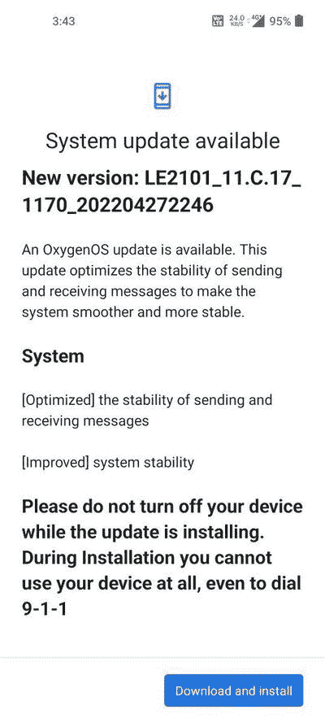

# 一加 8 系列和一加 9R 的最新 OxygenOS 12 更新带来了消息传递优化

> 原文：<https://www.xda-developers.com/oneplus-8-series-9r-oxygenos-12-c-17-update/>

在恢复一加 8 系列和一加 9R 的 OxygenOS 12 推出后不到三周，一加已经开始通过稳定渠道为这些设备播种另一个基于 Android 12 的更新。一加 8、8 Pro、8T 和 9R 的最新 OxygenOS 版本在之前的更新基础上增加了一些优化和错误修复。

 <picture></picture> 

Screenshot credit: OnePlus Community member [Antique19](https://forums.oneplus.com/members/antique19.5641932/)

新版本的版本号是 **C.17** ，它解决了设备在发送和接收消息时出错的异常问题。然而，奇怪的是，Android 安全补丁集没有变化，因此这些手机仍然在两个月前的 2022 年 3 月 SPL 上。

与所有 OxygenOS 更新一样，一加正在为一加 9R 和一加 8 系列分批推出最新的 OxygenOS 12 版本。这意味着新版本最初将交付给有限数量的用户，在接下来的几天里将有更广泛的推广。一旦该公司确认更新没有任何重大问题，它将被推送给更多的用户。

**XDA 论坛:[一加 8](https://forum.xda-developers.com/c/oneplus-8.10349/) || [一加 8 Pro](https://forum.xda-developers.com/c/oneplus-8-pro.10363/) || [一加 8T](https://forum.xda-developers.com/c/oneplus-8t.11579/) || [一加 9R](https://forum.xda-developers.com/f/oneplus-9r.12183/)**

* * *

## 下载:适用于一加 8 系列和一加 9R 的 OxygenOS 12 C.17

根据官方公告线程，只有一加 8 阵容的印度变种有资格获得此更新。我们仍然不知道欧洲版和全球版何时会获得 OxygenOS 12 的固定版本。一加 9R 是印度独有的型号，因此无论如何都会更新。

您可以等待您的设备在分阶段部署中被选中，也可以使用下面提供的下载链接手动下载更新。当我们得到更多的下载链接时，我们将继续更新这篇文章。

*   **一加 8**
*   **一加 8 Pro**
*   **一加 8T**
*   **一加 9R**

*感谢 XDA 公认开发者 [mlgmxyysd](https://forum.xda-developers.com/m/mlgmxyysd.8430637/) 和 XDA 资深会员 [Some_Random_Username](https://forum.xda-developers.com/m/some_random_username.8234677/) 的下载链接！*

* * *

**来源:**一加社区论坛( [1](https://forums.oneplus.com/threads/1581562/) 、 [2](https://forums.oneplus.com/threads/1581564/) 、 [3](https://forums.oneplus.com/posts/24205679) )