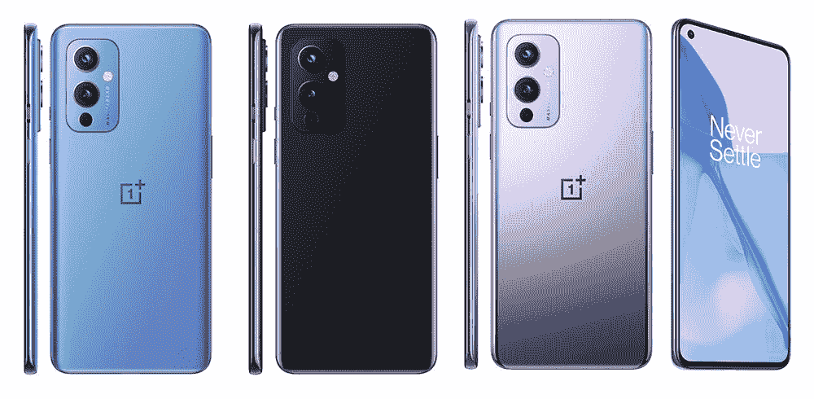
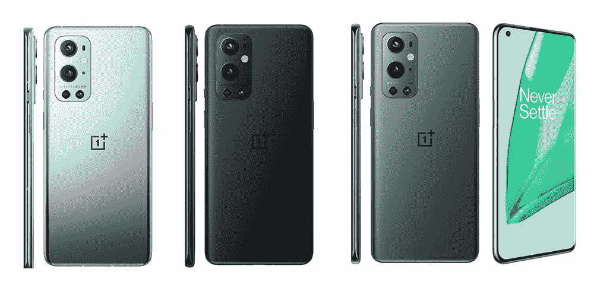
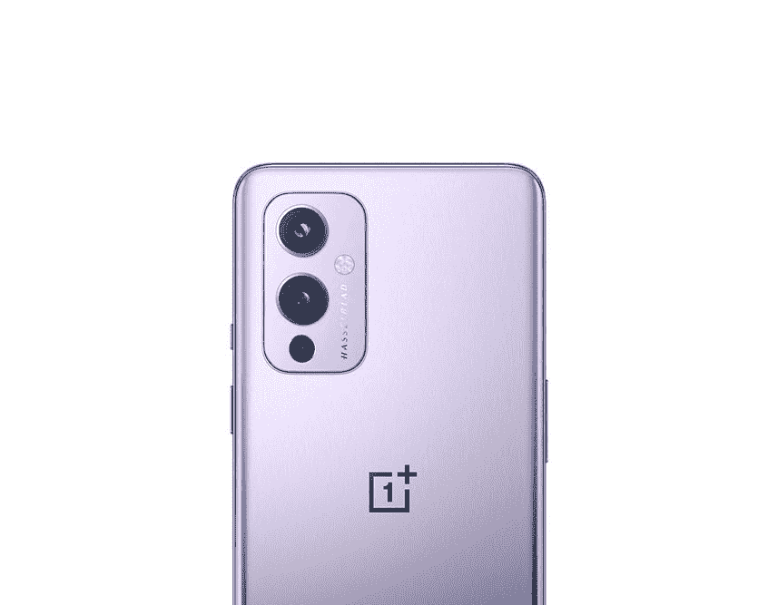

# 一加 9 和一加 9 专业版终于正式发布了！

> 原文：<https://www.xda-developers.com/oneplus-9-oneplus-9-pro-launch/>

一加刚刚结束了今年最大的发布会，并发布了两款新的旗舰手机——一加 9 和一加 9 Pro。正如在过去几个月的多次泄露和传言中所见，一加的最新手机配备了顶级的硬件，与哈苏合作开发的新相机系统[，以及其他一些很酷的功能。一加还推出了一加 9 系列的几个配件，包括新的第一方保护套、Warp Charge 50 无线充电器和一加手表。](https://www.xda-developers.com/oneplus-9-series-march-23-hasselblad-partnership-confirmed/)

## 一加 9 系列:规格

| 

规格

 | 

一加 9

 | 

一加 9 专业版

 |
| --- | --- | --- |
| **打造** | 

*   玻璃纤维增强聚合物框架
*   大猩猩玻璃 5 正面和背面

 | 

*   铝制框架
*   大猩猩玻璃 5 正面和背面

 |
| **尺寸&重量** | 

*   北美/欧洲:
*   印度/中国:

 | 

*   163.2 x 73.6 x 8.7mm 毫米
*   197g

 |
| **显示** | 

*   6.55 英寸 FHD+ AMOLED (2400 x 1080p)
*   402PPI
*   20:9 宽高比
*   120 赫兹刷新率
*   1100 尼特峰值亮度
*   支持 sRGB 和 DCI-P3 色彩空间
*   HDR10+
*   自动色温调节
*   大猩猩玻璃 5

 | 

*   6.7 英寸 QHD+ LTPO AMOLED (3216 x 1440p)
*   525 磅每英寸
*   20.1:9 宽高比
*   智能 120 赫兹刷新率(自适应 1-120 赫兹)
*   360Hz 触摸轮询速率
*   1300 尼特峰值亮度
*   10 位颜色深度
*   支持 sRGB 和 DCI-P3 色彩空间
*   HDR10+
*   MEMC
*   自动色温调节
*   大猩猩玻璃 5

 |
| **SoC** | 

*   高通骁龙 888
    *   1 个 Kryo 680(基于 ARM Cortex X1)Prime core @ 2.84 GHz
    *   3 个 Kryo 680(基于 ARM Cortex A78)性能内核@ 2.4GHz
    *   4 个 Kryo 680(基于 ARM Cortex A55)高效内核@ 1.8GHz
*   Adreno 660 GPU

 | 

*   高通骁龙 888
    *   1 个 Kryo 680(基于 ARM Cortex X1)Prime core @ 2.84 GHz
    *   3 个 Kryo 680(基于 ARM Cortex A78)性能内核@ 2.4GHz
    *   4 个 Kryo 680(基于 ARM Cortex A55)高效内核@ 1.8GHz
*   Adreno 660 GPU

 |
| **闸板&存放** | 

*   8GB LPDDR5 内存+ 128GB UFS 3.1 存储
*   12GB + 256GB

 | 

*   8GB LPDDR5 内存+ 128GB UFS 3.1 存储
*   12GB + 256GB

 |
| **电池&充电** | 

*   4500 毫安时电池
*   65W 有线快速充电(29 分钟内 1-100%)
*   45W 有线快速充电(USB PD)
*   15W Qi 无线充电(仅限北美/欧洲)
*   附带 Warp Charge 65T 充电器(支持高达 45W 的 USB PD 或 PPS，适用于非一加设备)

 | 

*   4500 毫安时电池
*   65W 有线快速充电(29 分钟内 1-100%)
*   45W 有线快速充电(USB PD)
*   50W 无线快速充电(43 分钟内 1-100%)
*   附带 Warp Charge 65T 充电器(支持高达 45W 的 USB PD 或 PPS，适用于非一加设备)

 |
| **安全** | 显示指纹扫描仪 | 显示指纹扫描仪 |
| **后置摄像头** | 

*   **主:** 48MP 索尼 IMX689，f/1.8，EIS，PDAF+CAF
*   **次要:** 50MP 索尼 IMX766 超宽，f/2.2，自由曲面镜头
*   **第三:** 2MP 单色传感器
*   双 LED 闪光灯
*   **视频:**
    *   8K 视频@ 30fps
    *   4K 视频@ 30/60fps
    *   慢动作:720p @480fps，1080p @ 240fps
    *   延时:1080p @ 30fps，4K @ 30fps
*   **附加功能:**夜景、超级微距、UltraShot HDR、智能场景识别、人像模式、专业模式、全景、倾斜移位模式、对焦峰化、猫/狗脸对焦、原始支持、滤镜、超稳定视频、视频夜景、视频 HDR、视频人像、焦点跟踪、超延时

 | 

*   **主:** 48MP 索尼 IMX 789，f/1.8，OIS，EIS，PDAF+CAF
*   **次要:** 50MP 索尼 IMX766 超宽，f/2.2，自由曲面镜头
*   **第三:**800 万像素 3.3 倍长焦，f/2.4，OIS
*   **四元:** 2MP 单色传感器
*   双 LED 闪光灯
*   **视频:**
    *   8K 视频@30fps
    *   4K 视频@ 30/60/120fps
    *   慢动作:720p @ 480fps，1080p @ 240fps
    *   延时:1080p @ 30fps，4K @ 30fps
*   **附加功能:**夜景、超级微距、UltraShot HDR、智能场景识别、人像模式、专业模式、全景、倾斜移位模式、焦点峰化、猫/狗脸对焦、原始支持、滤镜、超稳定视频、视频夜景、视频 HDR、视频人像、焦点跟踪、超延时

 |
| **前置摄像头** | 16MP 索尼 IMX471，f/2.4，FF，EIS | 16MP 索尼 IMX471，f/2.4，FF，EIS |
| **港口** | USB 3.1 第一代 C 类 | USB 3.1 第一代 C 类 |
| **音频** | 

*   双立体声扬声器
*   噪声消除支持
*   杜比全景声认证

 | 

*   双立体声扬声器
*   噪声消除支持
*   杜比全景声认证

 |
| **连通性** | 

*   LTE 4x4 MIMO
*   SA/NSA 5G
*   Wi-Fi 6 2x2 MIMO(双频带)
*   蓝牙 5.2 (aptX、aptX HD、LDAC、AAC 支持)
*   国家足球联盟
*   GPS (L1+L5 双频)、GLONASS、伽利略、北斗、A-GPS

 | 

*   LTE 4x4 MIMO
*   SA/NSA 5G
*   Wi-Fi 6 2x2 MIMO(双频带)
*   蓝牙 5.2 (aptX、aptX HD、LDAC、AAC 支持)
*   国家足球联盟
*   GPS (L1+L5 双频)、GLONASS、伽利略、北斗、A-GPS

 |
| **软件** | 基于 Android 11 的 OxygenOS 11 | 基于 Android 11 的 OxygenOS 11 |
| **其他特征** | 

*   IP68 防尘防水等级(仅限 T-Mobile 版本)
*   警报滑块
*   升级的触觉电机
*   一加酷玩冷却系统(五层系统，带有一个蒸汽室以及石墨和铜层)

 | 

*   IP68 防尘防水等级
*   警报滑块
*   升级的触觉电机
*   一加酷玩冷却系统(多层系统，带有蒸汽室和石墨层和铜层)

 |
| **颜色** | 冬天的薄雾，北极的天空，星光般的黑色 | 晨雾，森林绿，恒星黑 |

* * *

全新的一加 9 和 9 Pro 采用了基于一加无负担设计理念的全新设计。虽然这两款手机看起来很像它们的前辈，但一加改进了两款手机的相机岛设计，它们还采用了一些很酷的新背板装饰。一加 9 和 9 Pro 在右上角采用了矩形摄像头岛，而不是一加 8 系列的垂直对齐摄像头模块。一加 9 上有三个摄像头和一个双 LED 闪光灯，而一加 9 Pro 有四个摄像头和一个双 LED 闪光灯。正如在以前的泄露中看到的那样，相机岛也在两款手机上使用了哈苏品牌。

 <picture></picture> 

OnePlus 9

就制造质量而言，两款手机的正面和背面都采用了大猩猩玻璃 5，但一加 9 采用了玻璃纤维增强聚合物框架，而一加 9 Pro 采用了铝制框架。一加 9 Pro 还在所有地区获得 IP68 防尘防水等级，然而，一加 9 只在 T-Mobile 型号上获得该等级。

 <picture></picture> 

OnePlus 9 Pro

一加 9 配备了 6.55 英寸的 AMOLED 显示屏，刷新频率为 120 赫兹，分辨率为 2400 x 1080 像素。该显示器提供 1100 尼特的峰值亮度，通过 HDR10+认证，支持 sRGB 和 DCI-P3 色彩空间。另一方面，一加 9 Pro 配备了 6.7 英寸 LTPO AMOLED 显示屏，支持自适应刷新率(1-120Hz)，分辨率为 3216 x 1440 像素。它提供 1，300 尼特的峰值亮度，也通过了 HDR10+认证，并支持 10 位色深。此外，Pro-variant 上的显示器支持 sRGB 和 DCI-P3 色彩空间，并且支持 MEMC。

正如预期的那样，这两款设备都由高通的旗舰产品骁龙 888 芯片驱动。这款 SoC 在两款手机上都配有高达 12GB 的 LPDDR5 RAM 和高达 256GB 的快速 UFS 3.1 存储。由于骁龙 888 的集成骁龙 X60 调制解调器，这两款手机都支持 5G。其他连接选项包括 LTE、双频 Wi-Fi 6、蓝牙 5.2 和 NFC。在定位方面，这些手机支持双频 GPS、A-GPS、伽利略、GLONASS 和北斗。

 <picture></picture> 

OnePlus 9 cameras

在摄像头方面，一加 9 在背面采用了三摄像头设置，一个 48MP f/1.8 索尼 IMX689 主摄像头，一个 50MP f/2.2 索尼 IMX766 广角摄像头和一个 2MP 单色摄像头。一加 9 Pro 的硬件略好，包括一个 48MP f/1.8 索尼 IMX789 主摄像头，同样的 50MP 广角摄像头，一个 8MP 3.3x 倍长焦摄像头和一个 2MP 单色传感器。两款手机都配备了 16MP f/2.4 索尼 IMX471 自拍相机。

 <picture></picture> 

OnePlus 9 Pro

虽然一加 9 系列没有得到任何重大的电池容量升级，但一加已经包括了对更好的快速充电能力的支持。这两款手机都装有 4500 毫安时电池，一加 9 支持使用随附的充电器进行 65 瓦有线快速充电和 15 瓦 Qi 无线充电。另一方面，一加 9 Pro 通过专有的 Warp Charge 50 无线充电器支持 65W 有线快充和 50W 无线快充。随附的 65W 充电砖也获得了一些改进，它现在支持通过 USB PD 或 PPS 在非一加设备上进行高达 45W 的快速充电。这两款手机的另一个巧妙之处是，如果你没有随身携带专用充电器，你还可以通过高达 45W 的 USB PD 充电器进行快速充电。

**[一加 9 场 XDA 论坛](https://forum.xda-developers.com/f/oneplus-9.12151/) || [一加 9 场亲 XDA 论坛](https://forum.xda-developers.com/f/oneplus-9-pro.12153/)**

这两款一加 9 系列设备都运行现成的基于 Android 11 的 OxygenOS 11。这是以前在旧的一加设备上推出的相同的皮肤，但它有几个额外的功能。其中包括更名后的 Pro 游戏模式、相机应用程序中的 Hasselblad Pro 模式以及 Turbo Boost 3.0 内存优化。

* * *

## 一加 9 系列:定价和供货情况

一加 9 系列定价如下:

| 

没有。

 | 

设备

 | 

北美洲

 | 

欧洲

 | 

印度

 | 

中国

 |
| --- | --- | --- | --- | --- | --- |
| **1。** | **一加 9:** |  |  |  |  |
| **1.1** | 8GB + 128GB(星空黑，冬季薄雾) |  | €709 | ₹49,999 | ¥3,799 |
| **1.2** | 12GB + 256GB(星空黑) |  | €809 | ₹54,999 | ¥4,299 |
| **2。** | **一加 9 Pro:** |  |  |  |  |
| **2.1** | 8GB + 128GB(晨雾) |  | €909 | ₹64,999 | ¥4,999 |
| **2.2** | 8GB + 256GB | - | - | - | ¥5,499 |
| **2.3** | 12GB + 256GB(晨雾、松绿) |  | €999 | ₹69,999 | ¥5,999 |
| **3。** | 一加 9R |  |  |  |  |
| **3.1** | 8GB + 128GB(湖蓝、炭黑) | - | - | ₹39,999 | - |
| **3.2** | 12GB + 256GB(湖蓝、炭黑) | - | - | ₹43,999 | - |

这两款手机将于 3 月 26 日在北美接受预购，首次公开销售定于 4 月 2 日。感兴趣的买家将能够从一加的[网站](https://onepluscom.pxf.io/c/2233363/916678/12532?subId1=UUxdaUeUpU1185&subId2=exda&u=https%3A%2F%2Fwww.oneplus.com%2F)和其他主要的电子商务平台，如亚马逊、百思买和 B & H 获得解锁的设备。12GB+256GB 配置的晨雾一加 9 Pro 和冬季薄雾和 Astral 黑色配色的一加 9 (8GB+128GB)也将在同一日期通过 T-Mobile 上市。一旦公布，我们将尽快添加其他地区的价格和可用性详细信息。

一加还发布了 Warp Charge 50 无线充电器，现在采用了可拆卸电缆设计，可以在横向和纵向以 50W 的功率为一加 9 Pro 充电。

 <picture></picture> 

OnePlus 9

##### 一加 9

香草一加 9 是为那些谁想要旗舰性能，但不想支付最高美元。它提供了 6.5 英寸 120Hz AMOLED 显示屏，由哈苏调整的三摄像头设置，以及骁龙 888 SoC。

 <picture></picture> 

OnePlus 9 Pro

##### 一加 9 专业版

凭借 6.7 英寸的大尺寸四高清有机发光二极管显示屏和智能 120Hz 刷新率，一加 9 Pro 可能拥有市场上最好的显示屏。与 Hasselblad 合作调整的相机可拍摄出出色的静态照片，并捕捉精彩的 4K 视频。