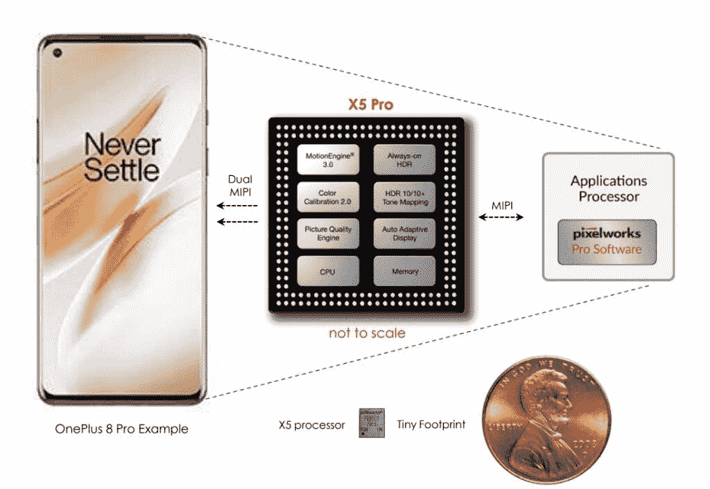
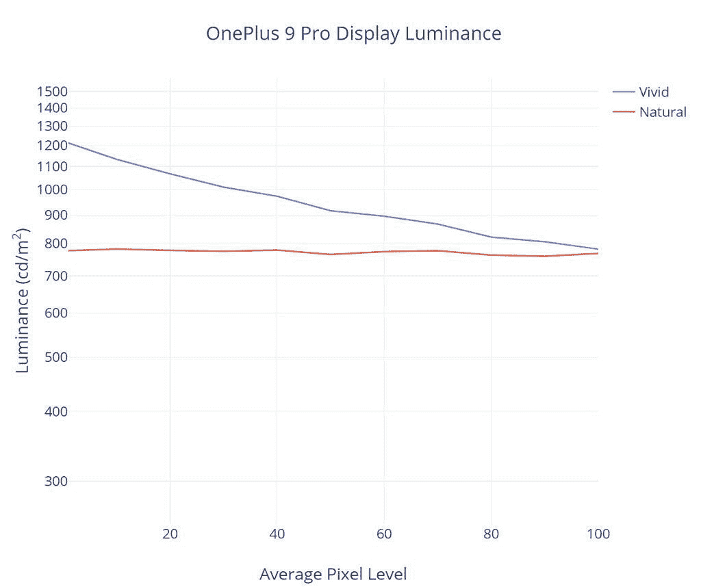
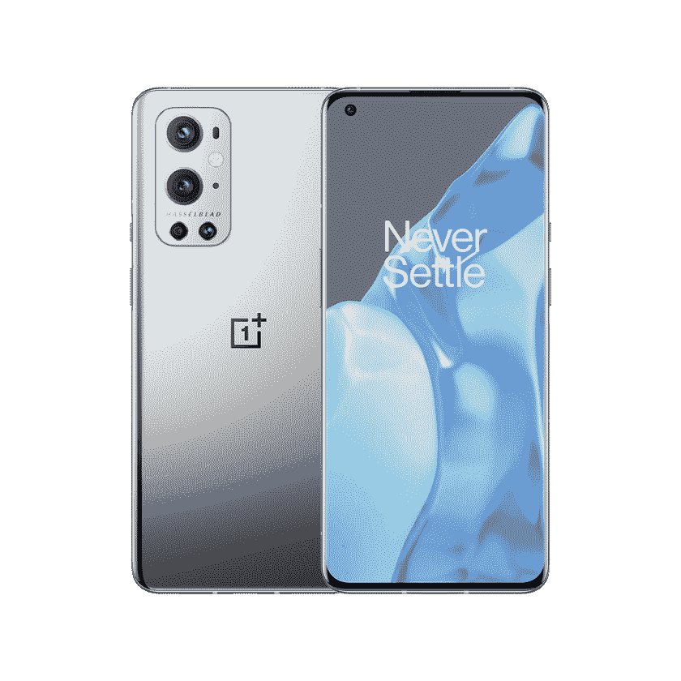

# 一加 9 专业显示器评论:教科书准确性不足以留下深刻印象

> 原文：<https://www.xda-developers.com/oneplus-9-pro-display-review/>

随着超高端智能手机的价格不断上涨，公司正在采取什么措施来区分他们的显示器？他们是否仍有可以改进的地方，而无需采用新的显示硬件？

随着整个价格范围内显示面板的质量不可避免地提高，这些问题变得更加不确定。为了解决第一个问题，一加在其旗舰产品一加 9 Pro 设备中包含了一系列有些独特的功能，如视频运动插值、自动显示白平衡和 SDR 至 HDR 视频转换。虽然我的两个开场问题直接相关，但我认为满足第一个问题的最佳方式是关注第二个问题——新硬件自然会出现在每个公司，但并不是每个公司都会很好地利用新硬件。一加 9 Pro 怎么样？

用于本次审查的一加 9 Pro 设备是由一加借给我们的。然而，一加没有为这项审查提供任何投入或赔偿。

## **展示回顾集锦**

*   出色的峰值亮度和阳光清晰度
*   校准色彩模式中出色的 sRGB 和 P3 色彩准确度
*   校准颜色模式下精确的 D65 白点
*   非常好的灰度精度

*   低亮度水平下阴影细节不佳
*   在最低亮度下不会变得很暗

### **一加 9 Pro 显示器规格**

一加继续从三星显示为其旗舰产品采购高端 OLEDs。一加 9 Pro 提供了一个大而超清晰的 6.7 英寸前面板，每英寸 525 像素，并支持 120 Hz 的刷新率，以实现更流畅的运动和与手机的交互。它的规格与去年的旗舰机型非常相似，但一加 9 Pro 实际上使用了更新的显示内部。

一组具有增强发射效率的新型发光材料正用于有机发光二极管，并采用了一种称为 LTPO 的新型显示器背板技术，以进一步提高显示器的能效。最后，一加 9 Pro 的显示驱动 IC 现在原生支持 10 位颜色深度，而不是求助于 8 位+ 2 位 FRC。如果这些规格看起来很熟悉，那是因为一加使用的面板实际上与 OPPO 在 [Find X3 Pro](https://www.xda-developers.com/oppo-find-x3-pro-display-review/) 中使用的面板相同。

新的混合背板利用 IGZO 驱动晶体管，它比传统的 LTPS 晶体管需要更少的功率来输出相同量的光。此外，IGZO 晶体管比 LTPS 晶体管具有低得多的截止漏电流，这使得它们更适合于以较低的刷新率驱动显示面板，因为它们可以充分地保持它们的电荷。氧化物晶体管是可行的真正硬件级可变刷新率的催化剂，这意味着一加 9 Pro 的高刷新率面板应该比它的前辈更少消耗电池。

 <picture></picture> 

Panel uniformity at 0.01 nits

**子像素排列**

三星显示所有的智能手机有机发光二极管面板都采用了 PenTile 钻石子像素排列，包括一加 9 Pro 上的那个。我认为将一加的子像素布局与其他几款旗舰 OLEDs 进行比较会很有趣，通过这样做，我们可以看到子像素比例的明显差异；iPhone 12 Pro Max 的 OLED 面板比一加 9 Pro 和三星 Galaxy Note20 Ultra 的有机发光二极管面板具有相对更大的子像素，特别是蓝色子像素。

据称[iphone 中的 OLEDs 具有更大的像素填充系数(实际发射的总像素面积的比例，也称为*孔径比*)，我们现在已经证实了这一点。使用显微镜照片(由 OPPO Find X3 Pro](https://www.displaymate.com/iPhoneX_ShootOut_1a.htm#:~:text=Sub-Pixel%20fill%20factor) 拍摄)作为参考，我粗略计算了一下 iPhone 12 Pro Max 的填充系数约为 35-40%，而典型的三星显示有机发光二极管只有 25-30%左右。

较高的像素填充因子的主要优点是更长的像素寿命。更大的子像素将持续更长时间(假设亮度被归一化)，从而导致更慢的显示器老化。另一件要注意的事情是，OLEDs 中的蓝色发射器的寿命最短，所以它们降解最快。这就是为什么随着时间的推移，随着红/绿/蓝有机发光二极管发射体以不同的速率衰减，OLED 通常会变黄。在我们的子像素比较中，iPhone 12 Pro Max 包含的蓝色子像素比一加的蓝色子像素相对大 70%左右，因此，iPhone 12 Pro Max 的 OLED 面板应该比典型的三星显示有机发光二极管经历更慢的老化，并且随着时间的推移呈现更少的泛黄。

### **一加 9 Pro 显示器特点**

一加 9 Pro 包括几个显示功能，可以调整屏幕或正在播放的媒体内容。

**运动图形平滑**通过插入额外的帧来增加视频内容的平滑度(在支持的应用中为)，将视频转换为每秒 60 帧(或在一加实验室启用时为每秒 120 帧)。这种功能在许多电视机中都有，虽然它可以使运动看起来更平滑更清晰，但有些人不喜欢它，因为它可以使内容[看起来像肥皂剧](https://www.google.com/search?q=soap+opera+effect)，或者其他时候它可能只是 [*看起来*不对](https://www.youtube.com/watch?v=_KRb_qV9P4g)。它也有可能在生成的帧中呈现不想要的伪像。从我在一加 9 Pro 上使用这项功能的情况来看，运动插值在平滑运动方面表现非常好，没有明显的伪像，尽管智能手机显示屏的屏幕尺寸较小可能意味着伪像不太容易察觉。

**舒适音**功能上与苹果的 True Tone 相同。它调整显示器的白平衡，以更好地匹配您的观看环境，这有助于提高白色外观的一致性。白色色温的调整范围从 5000 K 到 7400 K 不等，从我的使用来看，与真实色调相比，该功能倾向于避免相对于环境过于温暖的色调。在转换过程中，这种转换是无缝的，所以你可能根本感觉不到这个特性在做什么。这意味着该功能运行良好。这种类型的特征背后存在争议，因为人们认为它会影响颜色的准确性，但实际上，每当周围的光线变化时，屏幕上的感知颜色总是在变化；自动亮度和自动白平衡等功能试图抵消观看环境变化时出现的一些感知变化。这些功能的潜在效用取决于功能本身是否无缝工作，我确实认为舒适音调工作得很好。

**超级触摸**是一加 9 Pro 独有的设置，将触摸轮询频率从 240 Hz 提高到 360 Hz。启用此功能*应该会*改善触摸延迟，但是，我没有成功检测到任何差异，无论是游戏/应用程序，因为禁用此功能的响应时间已经非常好了。一加指出，这可能会导致一些场景中的轻微闪烁，但我没有看到这种情况发生。出于好奇，我简单测试了一下，看看该功能是否改善了暗像素的像素响应时间，但可惜的是，出现了相同数量的重影/“紫色拖影”。

**鲜明的色彩效果专业版**增加视频内容的对比度和饱和度，旨在将内容从标准动态范围提升到高动态范围。在写这篇文章的时候，这个功能似乎是无效的，因为尽管切换了十几个显示设置的组合，我还是无法让它工作。

**超高视频分辨率**是一项人工智能升级功能，可提高支持的应用程序中视频内容的清晰度。到目前为止，似乎只有三个应用程序受到支持:微信、Instagram 和 Snapchat。

**视觉舒适**是一加版的夜灯，通过使屏幕变暖来减少蓝光的发射。然而，该功能略有不同，因为它还可以降低显示器的饱和度，使其在昏暗的光线下看起来更舒适。

一加与专门从事视频和图像处理的皮克斯工程公司合作开发了其中一些功能。在一加 9 专业版的内部是 Pixelworks 的 X5 专业版视觉处理器，处理 HDR 升级(动感色彩效果专业版)和运动处理(运动图形平滑)。两个 MIPI 通道为 Pixelworks 芯片供电，这些芯片用于通过视频流发送，安卓用户界面通过单独的通道发送。X5 Pro 独立处理视频流，然后将带有用户界面的合成帧发送到显示器。我们已经发布了另一篇文章，涵盖了 Pixelworks 芯片还能做什么。Pixelworks 还负责一加 9 Pro 显示器的出厂颜色校准。然而，一加 8 Pro 上存在的一些显著特征在今年的车型中似乎缺失，比如 DC 变暗和夜间模式亮度滑块。

 <picture></picture> 

Source: Pixelworks.

要了解更多关于一加 9 Pro 的功能，[请阅读我们的发布报道](https://www.xda-developers.com/oneplus-9/)。对于我们对这些显示功能以及手机其他方面的主观想法，请[阅读我们的完整评论](https://www.xda-developers.com/oneplus-9-pro-review/)。有关我们对一加 9 Pro 显示器的数据驱动分析，请继续阅读。

**数据收集方法**

为了从一加 9 Pro 获得定量颜色数据，我对设备特定的输入测试模式进行分级，并使用 X-Rite i1Display Pro 测量显示器的发射，该 Pro 由 X-Rite i1Pro 2 分光光度计在其高分辨率 3.3nm 模式下测量。我使用的测试模式和设备设置针对各种显示特性和可能改变我所需测量的潜在软件实现进行了校正。我的测量通常是在禁用显示相关选项的情况下进行的，除非另有说明。我用

*constant power*

模式(有时称为

*equal energy*

图案)，与大约 42%的平均像素水平相关，以测量传递函数和灰度精度。测量发射型显示器时，不仅要测量恒定的平均像素水平，还要测量恒定的功率模式，这一点很重要，因为它们的输出取决于平均显示器亮度。此外，恒定的平均像素水平并不固有地意味着恒定的功率；我使用的模式满足这两者。我使用更高的平均像素水平(接近 50%)来捕捉较低像素水平和许多白色背景的应用程序和网页(像素水平较高)之间的中点。我使用色差度量δ

*E[TP]*   [(ITU-R BT.2124)](https://www.itu.int/dms_pubrec/itu-r/rec/bt/R-REC-BT.2124-0-201901-I!!PDF-E.pdf)

，这是一个

[overall better measure for color differences](https://www.ibc.org/publish/specifying-colour-tolerances-for-hdr-and-wcg-displays-/2449.article)

比δ

*E* [00]

这在我早期的评论中使用过，目前仍在许多其他网站的展示评论中使用。那些还在用δ的

*E* [00]

对于颜色误差报告，鼓励使用δ

*E[ITP.]*

Δ

*E[ITP]*

通常在其计算中考虑亮度误差，因为亮度是完整描述颜色的必要组成部分。然而，由于人类视觉系统分别解释色度和亮度，我将我们的测试模式保持在恒定亮度，并且在我们的δ中不包括亮度(I/强度)误差

*E[ITP]*

价值观。此外，在评估显示器的性能时，将这两种错误分开是有帮助的，因为就像我们的视觉系统一样，它们属于显示器的不同问题。这样，我们可以更彻底地分析和理解显示器的性能。我们的颜色目标是基于 ITP 颜色空间，它比 CIE 1976 UCS 具有更好的色调线性，在感知上更均匀。我们的目标以 100 cd/m 的基准在整个 ITP 色彩空间中大致均匀地间隔开

²

白色级别，以及 100%、75%、50%和 25%饱和度的颜色。颜色是在 73%的刺激下测量的，假设伽马功率为 2.20，这相当于约 50%的亮度。对比度、灰度和颜色精度在显示器的整个亮度范围内进行测试。在 PQ 空间中，亮度增量均匀分布在最大和最小显示亮度之间。图表和图形也绘制在 PQ 空间中(如果适用),用于正确表示对亮度的实际感知。δ

*E[TP]*

值大约是δ的 3 倍

*E* [00]

相同色差的值。测得的颜色误差δ

*E[TP]*

1.0 表示所测量的颜色的可察觉差异的最小值，并且该度量假设对于观察者来说是最关键的适应状态，从而不会低估颜色误差。颜色误差δ

*E[TP]*

小于 3.0 是参考显示器的可接受精度水平(建议见 ITU-R BT.2124 附录 4.2)，δ

*E[TP]*

大于 8.0 的值一眼就能看出来，这是我根据经验得出的结论。HDR 测试模式是针对

[ITU-R BT.2100](https://www.itu.int/dms_pubrec/itu-r/rec/bt/R-REC-BT.2100-2-201807-I!!PDF-E.pdf)

使用感知量化器(ST 2084)。HDR sRGB 和 P3 图案与 sRGB/P3 原色均匀间隔，HDR 参考白色水平为 203 cd/m

²   [(ITU-R BT.2408)](https://www.itu.int/dms_pub/itu-r/opb/rep/R-REP-BT.2408-2017-PDF-E.pdf)

和 58%的 PQ 信号电平。所有 HDR 模式都在 20% APL 下用恒定功率测试模式进行测试。

### **颜色配置文件**

像大多数其他 Android 手机一样，一加 9 Pro 提供了两种基本颜色配置文件，可以改变屏幕的颜色特征。

这款手机的默认配置是**生动配置**，它的饱和度和对比度略有提高，白点较标准更冷(~7000 K)。无论内容色彩空间如何，生动的配置文件都会将颜色映射到比显示 P3 的绿色和蓝色略大的色域。

**自然配置文件**是符合行业标准的色彩精确配置文件，遵循 2.2 伽玛功率和 D65 白点。默认情况下，该配置文件以 sRGB 色彩空间为目标，支持色彩管理以显示支持它的应用程序和内容的 P3。

有一个“高级”设置，允许用户手动瞄准 sRGB 或显示 P3 色彩空间，还有一个“AMOLED 广色域”设置，瞄准一加 9 Pro 的有机发光二极管显示器的原生色域。选择这些选项中的任何一个还会启用色温滑块，该滑块可用于调整屏幕的白点；辅助绿色/洋红色色调滑块也浮出水面。

### **一加 9 Pro 的显示亮度**

 <picture></picture> 

Peak luminance vs content APL

一加 9 Pro 的亮度与大多数其他高端三星显示 OLEDs 一样，全屏白色(100% APL)的亮度通常约为 800 尼特。这对于像样的户外显示器清晰度来说是足够的亮度，并且它为 HDR 内容提供了大量可用的输出。像其他 Android 设备一样，只有在启用自动亮度的情况下，这种峰值亮度才会在非常明亮的光线下激活——否则，峰值亮度将被限制在 500 尼特。三星确实制造了更亮的 OLEDs，可以达到 1000 尼特@ 100% APL，但迄今为止，它们只用于 Galaxy Note20 Ultra、 [Galaxy S21 Ultra](https://www.xda-developers.com/galaxy-s21-ultra-display-review/) 和小米 Mi 11 Ultra。

鲜明的配置文件允许较低的平均显示亮度(ADL)水平输出更亮的白色。这意味着，具有较高 ADL 水平的浅色主题应用程序的背景将具有大约 800 尼特的白色水平，但具有较少内容区域的深色应用程序允许更亮的白色水平。例如，一加 9 Pro 在 10%的 ADL 下能够获得高达 1100 尼特的白色(接近黑暗模式应用的 ADL)。然而，这是以较暗的中间色调和阴影为代价的，这会影响图像的对比度和细节。

自然轮廓保持独立于 ADL 的 800 尼特峰值白色水平。虽然这意味着配置文件无法输出与较暗应用程序中的生动配置文件一样亮的白色，但自然配置文件具有更一致的色调控制和图像对比度。我们稍后将会看到，在显示器的最大亮度下，自然配置文件实际上比生动配置文件渲染的中间色调和阴影更亮。因此，在许多情况下，与明亮照明下的生动配置文件相比，自然配置文件会以更好的细节和易读性来呈现内容。

在亮度滑块的低端，一加 9 Pro 的最低白色水平只能低至约 2.4 尼特，而大多数其他有机发光二极管显示器可以低至约 1.8-2.0 尼特。与其他一些手机不同，一加 9 Pro 没有任何可以进一步降低这种亮度的功能，这令人费解，因为一加的上两款旗舰都包括这样一个功能(即夜间模式)。更奇怪的是，当黑暗模式处于活动状态时，最低亮度的白色水平实际上提高了大约 3.9 尼特，这可能导致在黑暗环境中查看手机时白色太亮。我的假设是，这是一个粗糙的调整，旨在消除一些在最小亮度下出现的黑色剪裁，以便暗模式 UI 元素不会完全消失。当然，处理这种情况的正确方法是直接调整色调曲线，使接近黑色的色调不会被剪切，而不是将最小白色级别限制在这么高的值。

### **对比&色调映射**

通常，显示质量最重要的特征是对比度。虽然有机发光二极管技术可以通过自发光(自失效)像素创造出*最深*的可能对比度，但色调*精度*同样重要，如果不是更重要的话；色调准确度通过直接考虑图像对比度和颜色混合来影响照片和视频的整体外观。不幸的是，有机发光二极管显示器在特性上很难校准，很大程度上是由于它们的亮度随着内容 APL(更准确地说是*帧平均亮度级*)而波动。对我们来说幸运的是，最近的旗舰手机在这方面有了很大的改善——但在其他方面仍需要努力。

**色调映射图表** *在 40% APL (~27%目标 ADL)下测量*

按照标准做法，我们首先来看看一加 9 Pro 的 100 尼特显示器校准(黄色曲线)。我的测量显示，这两个轮廓都略低于 gamma-2.2 参考目标(在更生动的轮廓上更是如此)。自然轮廓在可以被认为是准确的范围内，但是，它被调整为具有稍微陡峭的阴影，其接近接近 2.30 的伽马功率。我认为，2.20 伽马功率是手机显示器的一个整体更好的目标，以便在考虑遮蔽屏幕眩光时，阴影细节仍然清晰可见。尽管 100 尼特的自然轮廓输出略暗，但它确实在这个白色级别周围很好地管理了阴影细节。然而，这随显示器亮度的不同而有很大的不同，我们稍后会谈到。

我还在最大亮度(高亮度模式)、400 尼特白色水平、20 尼特白色水平和最小亮度下测试显示器校准。请注意，随着显示器亮度变高(忽略最大亮度)，2.2 伽玛目标下的生动轮廓越多。这不是自然轮廓的情况，自然轮廓保持其 2.2 伽马追踪。这是因为生动轮廓允许其亮度随着内容 APL 波动，而自然轮廓使其亮度响应标准化。控制有机发光二极管亮度响应对于保持精确的色调映射校准是必要的，这是自然配置文件完成的。另一方面，生动的轮廓允许其白色以较暗的中间色调和阴影为代价稍微变亮。

在最大亮度下，一加 9 Pro 显著提高了阴影和中间色调的亮度，以改善明亮光线下的显示清晰度。这是一个非常受欢迎的选择，我很高兴看到，我希望看到更多的 OEM 厂商效仿，而不是仅仅试图最大化较低 APL 的白色亮度(例如三星)。正如我们所介绍的，鲜艳的轮廓确实有稍微亮一点的白色，因为它允许它在较低的 APL 下增强，但结果是，鲜艳的轮廓实际上在最大亮度下呈现比自然轮廓更暗的阴影和中间色调。这意味着在许多情况下，在高亮度下，自然轮廓是更清晰的显示轮廓。但是，鲜艳的轮廓可能会在强光下产生更准确的色彩饱和度，因为高环境照明会导致饱和度降低。

在较低的亮度级别(20 尼特和最低亮度)，一加 9 专业版继续跟踪 2.20 伽马功率，这不是低亮度下的最佳色调曲线目标。这是因为它导致阴影相对于 100 尼特的相同伽玛目标太暗。一些手机通过在较低亮度下降低伽玛功率来解决这一问题，这降低了图像对比度，但提高了阴影中的清晰度。好消息是，这些色调校准比一加 8 Pro 有所改进，后者的阴影色调有很大下降，这要糟糕得多。

我们经常看到有机发光二极管显示器在黑色附近的色调亮度上升太慢，我们可能会看到并解释为“黑色挤压”。当显示器的阴影色调太暗，以至于您环境中的照明发出的眩光模糊了阴影时，也会发生这种情况。例如，尽管 100 尼特的自然轮廓提供了低至#010101 的大量接近黑色的输出，但根据环境的不同，较陡的阴影可能仍会出现剪切。然而，我们并不宣称它的阴影是决定性的*粉碎*，因为它需要一个不太理想的环境来产生感知剪辑。只有在合理的环境下，在很少或没有眩光的情况下，显示器似乎会粉碎近黑色，这种情况才会出现问题，不幸的是，一加 9 Pro 在低亮度下(以及 400 尼特，我们稍后会看到)就是这种情况。

我发现，在低亮度和 400 尼特的白色水平下，一加 9 Pro 在阴影细节方面还有待改进。理想的显示器应该能够在很少或没有杂光的情况下清晰地区分接近黑色的颜色(一直到黑色),这是自然轮廓在 100 尼特白色水平下能够做到的。但是当我们向下移动到较低的亮度时，接近黑色的色调会变得越来越暗，直到它们在感觉上以越来越大的速度削波。在 20 尼特白电平下，一加 9 Pro 丢失的色调级别低于 2.7% (#070707)，在最小亮度下，该百分比会移动到丢失范围的 3.9%。这是在较低亮度下的适度细节损失，看到一加在这方面继续失败令人失望，特别是当他们以前的大多数手机(一加 7 Pro 和之前的)在这一类别中实际上表现得相当好。在 400 尼特的更高亮度水平下，一加 9 Pro(预计)能够输出低至#010101，但在此白色水平下的近黑色色调与 100 尼特相比要暗得多。结合这一事实，400 尼特显示器通常在更亮的条件下观看，具有更大的面纱屏幕眩光，您会得到我们前面谈到的感觉上破碎的黑色。

### **白平衡&灰度精度**

无论您喜欢哪种白点色温，白色在每个灰度级都应该保持一致，与显示器亮度无关。下面的灰度图表绘制了一加 9 Pro 在不同显示器亮度水平下，在生动和自然显示配置文件中测量的白色灰度颜色。

**灰度曲线为生动的轮廓**

**为自然轮廓绘制的灰度图**

一加 9 Pro 的校准白点色温在显示器的整个亮度范围内保持一致，生动配置文件的亮度范围约为 6900-7000K，自然配置文件的亮度范围约为 6500-6600K。灰色调也相当精确，因此对于任何给定的显示器亮度，很少或没有着色应该是可见的。尽管校准趋势通常保持不变，但染色的严重程度可能因装置而异。这些测量结果比一加 8 Pro 有了巨大的改进，后者显示了很大程度的色彩着色，尤其是在较低亮度下的深色。

### **一加 9 Pro 的色彩准确度**

**sRGB 色彩准确度图用于自然轮廓**

**显示 P3 自然色彩准确度图/显示 P3 轮廓图**

说到色彩准确度，一加 9 Pro 是我测量过的智能手机显示屏中最好的。对于 sRGB 和 P3 显示器，自然配置文件具有低得惊人的δ*E[TP]颜色误差，没有颜色测量出高于 6.0 的δ*E[TP]值。例外情况是在最低亮度下，颜色相对于标准的 2.2 伽玛(包括 sRGB 的红色原色)显得更加柔和，尽管显示器在如此低的亮度水平下压缩颜色是非常典型的。**

准确显示 P3 颜色准确性有利于未来当 P3 内容变得更加丰富时，P3 内容在 Android 世界中仍然非常稀缺。一些安卓手机刚刚开始支持 P3 拍照，但不幸的是，一加 9 Pro 不在其中。

生动轮廓的一个有趣特征是，显示器将通过在高亮度模式下扩展到面板的原生色域来增加其饱和度；这样做是为了抵消一些由高环境照明引起的去饱和。这种效果不会出现在自然轮廓中，但我认为应该出现，特别是当自然轮廓本身比生动轮廓具有更亮的中间色调和阴影时。

### **一加 9 Pro 上的 HDR10 回放**

*在 2 处测量* *00 尼特帧-平均光级，1000 尼特内容光级，100%显示亮度*

许多流媒体平台现在都以 HDR10 和杜比视界(Dolby Vision)的形式提供了大量的 HDR 内容，事实证明，高端手机上的有机发光二极管面板是播放这些内容的最有能力的显示器之一。由于一加 9 Pro 不支持杜比视界，我们将专门研究它的 HDR10 播放功能。

大多数通过流媒体服务提供的 HDR10 内容都假定最大潜在内容亮度级(“max CLL”——整部电影中任何单个像素的最大亮度)为 1，000 尼特或更低，因为目前很少有消费显示器超过此规格。当显示器的峰值亮度不能满足正在播放的内容的 MaxCLL 时，需要通过色调映射进行亮度衰减。由于一加 9 Pro 能够以合理的 APL 输出超过 1，000 尼特，因此它不需要为 MaxCLL 为 1，000 尼特或更低的 HDR 内容进行色调映射，但它确实需要。像大多数其他 Android 手机一样，一加 9 Pro 忽略了 HDR 内容的 MaxCLL，它似乎总是过早地滚降，这浪费了显示器在亮度方面的大量潜在输出。因此，对于 MaxCLL 为 1，000 尼特或更低的 HDR 内容，一加 9 Pro 在生动配置文件中最多只能输出约 800 尼特，在自然配置文件中最多只能输出约 600 尼特，而它应该能够输出全部 1，000 尼特。不过，很少有书能达到 1000 尼特。尽管如此，看到潜力被浪费还是很遗憾的。

其余部分的对比度在生动的轮廓中看起来很好，阴影中只有轻微的提升，近黑色中有一个扭结，在非常暗的场景中压碎了一些细节。另一方面，自然配置文件具有稍亮的中间色调和更亮的阴影，从而导致比 HDR PQ 目标更低的对比度。对于应该是*颜色准确的*配置文件来说，这是令人失望的表现，但它表明一加专注于校准生动配置文件中的 HDR 内容，这是在一加 9 Pro 上观看 HDR 内容时应该使用的配置文件。

对于 HDR 色彩准确度，一加 9 Pro 明显偏冷，测量漫射白色(约 203 尼特)和中间色调灰色的色温约为 7000 K。颜色精度相当好，但中间阴影会显得更温暖。校准的整体酷感在色彩准确度图表中非常明显，所有东西都明显偏向蓝色。

总体而言，一加 9 Pro 的 HDR 体验还不错。大多数显示器在最大显示亮度下校准 HDR10，但我希望看到更多的设备在更低的显示亮度水平下校准 HDR 10(例如，像 Apple 一样在 50%)，以便更高的亮度水平可以允许更亮的 HDR 设置。这将是一个有用的改变，因为标准的 HDR PQ 目标意味着在黑暗的环境中(5 尼特周围)观看，而没有多少人实际上这样做——尤其是在他们的手机上。

## **结论**

在大多数情况下，一加 9 Pro 的显示确实是一流的。它在自然配置文件中的色彩准确度是我测量过的最好的之一，尽管最近我实际上没有高度重视色彩准确度，因为大多数手机都做得很好——只要没有任何特别的色彩误差，一加 9 Pro 就没有。

白点是我们最容易注意到差异的颜色，在许多 OLEDs 的精确轮廓中，它通常被校准得过于温暖；令人欣慰的是，我们的一加 9 专业单位没有测量一个准确的 D65 白点。

在中等亮度水平(约 100 尼特)，显示器显示了很好的阴影细节，尽管对比度略有下降。在高亮度模式下，色调映射为更亮的中间色调和阴影的决定是一个受欢迎的决定，允许细节在阳光下清晰可见，生动的配置文件扩展到其原生色域的能力有助于保持色彩饱和度。

高刷新率面板非常平滑，工作正常，但我更希望它不要总是在视频内容出现时降至 60 FPS，因为用户有时可能仍然希望滚动——显示面板的能效提高应该能够负担得起。像舒适色调和运动图像平滑这样的功能对于那些喜欢使用它们的人来说也很好；然而，许多其他功能都相当平淡，甚至在大多数应用程序中不受支持。

**[一加九大职业论坛](https://forum.xda-developers.com/f/oneplus-9-pro.12153/)**

仅从显示器规格来看，直接说一加 9 Pro 是市场上最好的显示器之一似乎很容易。不幸的是，我不能说这是完全正确的。低亮度显示性能是许多智能手机公司似乎仍然忽视的一个领域，这让我感到惊讶，因为我花在手机上的很多时间实际上都是在弱光条件下。虽然一加 9 Pro 的低亮度性能本身并不“糟糕”，但它在照片和视频中留下的阴影细节对我来说有点太暗了，我不应该需要增加显示器亮度来在更暗的房间中分辨阴影细节。这不是我在以前的评论中纠缠太多的事情，因为通常还有其他重要的问题，但随着 OLEDs 的总体质量继续提高，我们对它们的标准也必须提高。老实说，我已经习惯了 iPhone OLEDs 的色调性能，最近又习惯了 [Google Pixel 5](https://www.xda-developers.com/google-pixel-5-display-review/) ，但我坚持认为它们在低亮度下的显示体验仍然是无与伦比的。正如我在我的[对比度&色调映射](#tonemap)文章中阐述的那样，2.20 的伽马功率不适合较低的亮度，那些负责校准的人需要超越那个简单的目标，就像他们在高亮度色调映射中展示的那样。此外，一加 9 Pro 在黑暗模式下只能达到 3.9 尼特的白色水平，这一事实在竞争对手低于 2 尼特时非常令人失望，这类似于 400 尼特和 600 尼特之间的差异。总的来说，一加 9 Pro 不是我喜欢在床头使用的手机，我可以用 iPhone 12 Pro 或谷歌 Pixel 5 来代替，这两款手机在晚上看起来都更舒服。

虽然拥有新颖的规格和技术很好，如高刷新率、视频运动插值或“完美”的色彩准确度，但在一天结束时，我注意到并关心的是让我的手机体验低于标准的东西。毕竟，我们的手机是我们拥有的最有用的工具之一，我们应该期待轻松舒适的体验。对于许多智能手机制造商来说，在低亮度领域已经停滞不前——有时是倒退。虽然这对大多数人来说不会是一个大问题，但有些人可能会觉得弱光下的易读性和舒适性并不比室外能见度更重要。而且，有时，公司似乎太专注于让他们的面板更亮，而忘记了还有更暗的深度。

 <picture></picture> 

OnePlus 9 Pro 5G

##### 一加 9 专业版

一加 9 Pro 5G 是一款超高端旗舰手机，具有顶级面板硬件和软件显示功能。

| **规格** | **一加 9 Pro** |
| --- | --- |
| **类型** | 灵活的有机发光二极管五边形菱形像素E4 材料公司 |
| **制造商** | 三星显示公司 AMB670YF01 |
| **尺寸** | 6.1 英寸乘 2.7 英寸对角线 6.7 英寸16.7 平方英寸 |
| **分辨率** | 3216×144020.1:9 像素宽高比 |
| **像素密度** | 每英寸 371 个红色子像素每英寸 525 个绿色子像素每英寸 371 个蓝色子像素 |
| **像素锐度距离** *视力为 20/20 的可分辨像素距离。典型的智能手机观看距离约为 12 英寸* | < 6.5 英寸为全彩图像< 9.2 英寸为非彩色图像 |
| **黑色削波阈值** *要削波黑色的信号电平* | <0.4% @ 100 nits<2.7% @ 20 nits<3.9% @ min brightness |

| **规格** | **自然** | **生动** |
| --- | --- | --- |
| **亮度** | **最小值:**2.4 尼特**峰值 100% APL:**768 尼特**峰值 50% APL:**765 尼特**峰值 HDR-1k 20% APL:**630 尼特 | **最小值:**2.5 尼特**峰值 100% APL:**782 尼特**峰值 50% APL:**916 尼特**峰值 HDR-1k 20% APL:**810 尼特 |
| **伽玛** *标准是 2.20 的直线伽玛* | 2.00–2.30 | 2.13–2.36 |
| **白点** *标准是 6504 K* | 6556 Kδ*E[TP]*= 2.0 | 6969 Kδ*E[TP]*= 4.6 |
| **色差***δ*E[TP]*值在 10 以上就显得δ*E[TP]*值在 3.0 以下就显得准确δ*E[TP]*值在 1.0 以下就显得与完美* | sRGB:平均δ*E[TP]*= 3.4最大δ*E[TP]*= 5.9**P3:**平均δ*E[TP]= 3.1*最大δ*E[TP]= 6.8* |  |