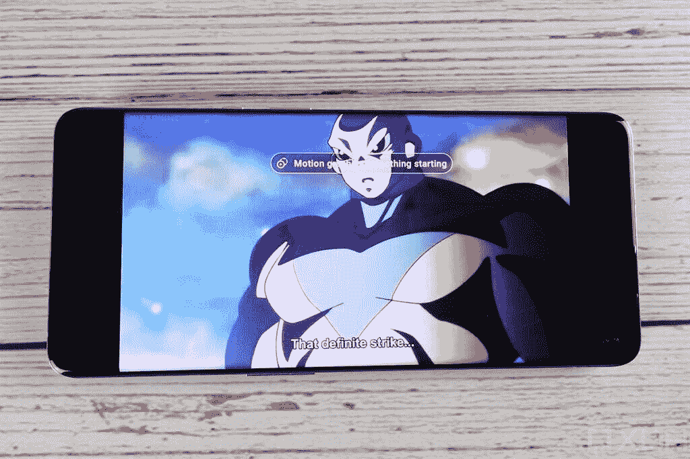
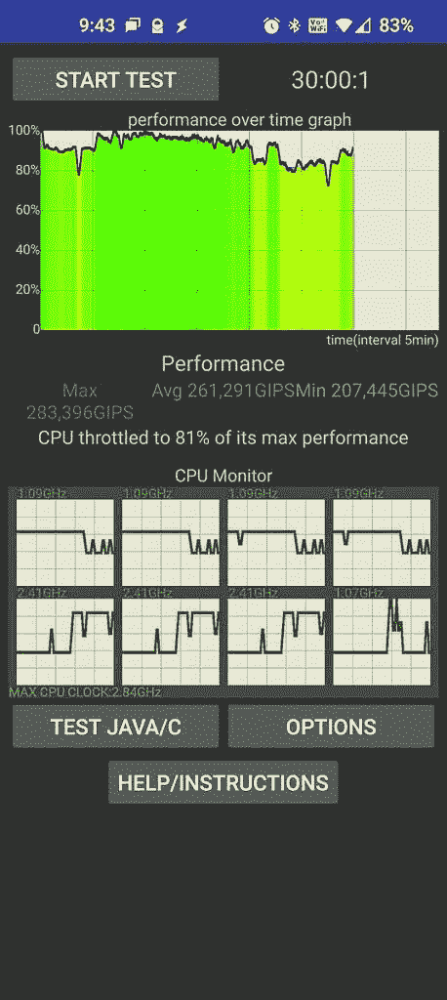

# 一加 9 专业评论:巩固一加作为一个优质手机品牌

> 原文：<https://www.xda-developers.com/oneplus-9-pro-review/>

自成为智能手机品牌以来，一加一直在努力解决其座右铭“永不妥协”与实际硬件之间的矛盾。从某种意义上说，如果你和一加一起去，你不得不在某个方面安顿下来，通常是显示器或相机(但绝不是性能)。不过，去年，随着顶级显示屏的推出，一加手机终于跃上了高端旗舰产品的行列。今年，一加凭借其新款[一加 9 Pro](https://www.xda-developers.com/oneplus-9/) 巩固了其高端智能手机品牌的地位。

经过[数周的预告](https://www.xda-developers.com/tag/oneplus-9/)，一加今天终于揭开了一加 9、一加 9 Pro 和[一加 9R](https://www.xda-developers.com/oneplus-9r-launch/) 的神秘面纱。一加 9 Pro 是三者中的英雄设备，它拥有超高端的硬件(以及超高端的价格标签)。一加 9 Pro 配备了 6.7 英寸的大尺寸 AMOLED 显示屏，以 Quad HD+分辨率运行，刷新频率高达 120Hz，在显示屏方面，它与去年的一加 8 Pro 一样出色。虽然去年的机型在显示和充电方面有许多显著的改进，但最大的变化发生在相机设置上。在与瑞典相机公司 Hasselblad 签署的多年合作伙伴关系中，一加承诺其新的一加 9 系列具有该公司迄今为止最大的相机升级。

在这个行业，营销和现实很少是一回事，但即使一加与哈苏在相机方面的合作以及 Pixelworks 在显示器方面的合作最终都是营销上的绒毛，也很难否认其结果。凭借一加 9 Pro，一加不仅实现了其“永不满足”的座右铭，还超越了这一点，成为目前最好的手机之一。

### 一加 9 专业版规格-单击展开

| 

规格

 | 

一加 9 专业版

 |
| --- | --- |
| **打造** | 

*   铝制框架
*   大猩猩玻璃 5 正面和背面

 |
| **尺寸&重量** | 

*   163.2 x 73.6 x 8.7mm 毫米
*   197g

 |
| **显示** | 

*   6.7 英寸 QHD+ LTPO AMOLED (3216 x 1440p)
*   525 磅/英寸
*   20.1:9 宽高比
*   智能 120 赫兹刷新率(自适应 1-120 赫兹)
*   360Hz 触摸轮询速率
*   1300 尼特峰值亮度
*   10 位颜色深度
*   支持 sRGB 和 DCI-P3 色彩空间
*   HDR10+
*   MEMC
*   自动色温调节
*   大猩猩玻璃 5

 |
| **SoC** | 

*   高通骁龙 888
    *   1 个 Kryo 680(基于 ARM Cortex X1)Prime core @ 2.84 GHz
    *   3 个 Kryo 680(基于 ARM Cortex A78)性能内核@ 2.4GHz
    *   4 个 Kryo 680(基于 ARM Cortex A55)高效内核@ 1.8GHz
*   Adreno 660 GPU

 |
| **风筒&储存** | 

*   8GB LPDDR5 内存+ 128GB UFS 3.1 存储
*   12GB + 256GB

 |
| **电池&充电** | 

*   4500 毫安时电池
*   65W 有线快速充电(29 分钟内 1-100%)
*   50W 无线快速充电(43 分钟内 1-100%)
*   附带 Warp Charge 65T 充电器(支持高达 45W 的 USB PD 或 PPS，适用于非一加设备)

 |
| **安全** | 显示指纹扫描仪 |
| **后置摄像头** | 

*   **主:** 48MP 索尼 IMX 789，f/1.8，OIS，EIS，PDAF+CAF
*   **辅助:** 50MP 索尼 IMX766 超宽，f/2.2，自由曲面镜头
*   **第三:**8MP 3.3 倍长焦，f/2.4，OIS
*   **四元:** 2MP 单色传感器
*   双 LED 闪光灯
*   **视频:**
    *   8K 视频@30fps
    *   4K 视频@ 30/60/120fps
    *   慢动作:720p @ 480fps，1080p @ 240fps
    *   延时:1080p @ 30fps，4K @ 30fps
*   **附加功能:**夜景、超级微距、UltraShot HDR、智能场景识别、人像模式、专业模式、全景、倾斜移位模式、焦点峰化、猫/狗脸对焦、原始支持、滤镜、超稳定视频、视频夜景、视频 HDR、视频人像、焦点跟踪、超延时

 |
| **前置摄像头** | 16MP 索尼 IMX471，f/2.4，FF，EIS |
| **端口** | USB 3.1 第一代 C 类 |
| **音频** | 

*   双立体声扬声器
*   噪声消除支持
*   杜比全景声认证

 |
| **连通性** | 

*   LTE 4×4 MIMO
*   SA/NSA 5G
*   Wi-Fi 6 2×2 MIMO(双频带)
*   蓝牙 5.2 (aptX、aptX HD、LDAC、AAC 支持)
*   国家足球联盟
*   GPS (L1+L5 双频)、GLONASS、伽利略、北斗、A-GPS

 |
| **软件** | 基于 Android 11 的 OxygenOS 11 |
| **其他特征** | 

*   IP68 防尘防水等级
*   警报滑块
*   升级的触觉电机
*   一加酷玩冷却系统(多层系统，带有蒸汽室和石墨层和铜层)

 |
| **颜色** | 晨雾，森林绿，恒星黑 |

*关于本次评测:*我在晨雾中收到了来自美国一加的 12GB 内存和 256GB 存储的一加 9 Pro。我已经用了大约两个星期的电话。一加没有审查这一评论，也没有为其内容提供任何投入。

**[一加 9 大职业论坛](https://forum.xda-developers.com/f/oneplus-9-pro.12153/)**

 <picture></picture> 

OnePlus 9 Pro

##### 一加 9 专业版

凭借 6.7 英寸的大尺寸四高清有机发光二极管显示屏和智能 120Hz 刷新率，一加 9 Pro 可能拥有市场上最好的显示屏。与 Hasselblad 合作调整的相机可拍摄出出色的静态照片，并捕捉精彩的 4K 视频。

## **一加 9 Pro 评测集锦**

*   简洁的设计非常符合人体工程学
*   弯曲度极小的大型沉浸式显示屏
*   高分辨率、自适应刷新率显示器，具有出色的色彩、亮度和文本清晰度
*   丰富的显示增强功能，包括舒适色调和 MEMC
*   在良好的光线下，从主和超广角拍摄出色的照片和视频
*   来自室内和室外主摄像头的良好低光照片和视频
*   哈苏专业相机模式提供了大量的功能
*   出色的日常和游戏性能，出色的散热性能
*   超快速有线和无线充电
*   为您的配件提供反向无线充电支持
*   一加仍然是最好的第一方案件
*   强大的触觉反馈引擎能够产生极其细微的振动
*   防尘防水等级 IP68
*   OxygenOS 仍然是基于 Android 的较好的操作系统之一，拥有大量的定制选项和特性
*   仍然很容易引导加载程序解锁和修改

*   晨雾是指纹磁铁
*   来自超广角相机的令人失望的照片和视频在低光场景下
*   中等长焦和自拍相机
*   不到恒星电池寿命
*   没有 3.5 毫米耳机插孔或 microSD 卡插槽
*   一加不再是长期软件支持的行业领导者
*   小心 bug:所谓的稳定 OxygenOS 更新可能比预期的要麻烦
*   OxygenOS 仍然有办法延迟来自聊天和 Discord 等消息应用程序的通知

* * *

## 浏览此评论

1.  [设计:晨雾中的一加 9 Pro](#oneplus9prodesign)
2.  [相机:一加 x 哈苏的合作关系重要吗？](#oneplus9procamera)
    1.  [画质](#oneplus9propicturequality)
    2.  [视频质量](#oneplus9provideoquality)
3.  [显示器:在一加 9 Pro 上观看内容有多愉快？](#oneplus9prodisplay)
    1.  [面板质量](#oneplus9propanelquality)
    2.  [显示特性](#oneplus9prodisplayfeatures)
4.  [性能:一加 9 Pro 有多快？](#oneplus9properformance)
    1.  [真实世界性能](#oneplus9prorealworldperformance)
    2.  [游戏性能](#oneplus9progamingperformance)
5.  [电池&充电:一加 9 Pro 能用多久？](#oneplus9probatterycharging)
    1.  [电池寿命](#oneplus9probatterylife)
    2.  [充电速度](#oneplus9prochargingspeeds)
6.  [软件:基于 Android 11 的 oxygen OS 11](#oneplus9prosoftware)
    1.  [用户界面](#oneplus9prosoftwareui)
    2.  [特性](#oneplus9prosoftwarefeatures)
    3.  [开发和修改命题](#oneplus9prosoftwaredevelopment)
7.  [配件:保险杠外壳、Warp Charge 50 无线充电器](#oneplus9proaccessories)
    1.  [卡邦保险杠外壳](#oneplus9prokarbonbumpercase)
    2.  [50W 无线充电器](#oneplus9prowarpcharge50wireless)
8.  [其他:音频、振动、连接&更多](#oneplus9promisc)
9.  [结论:你应该买一加 9 Pro 吗？](#oneplus9proconclusion)

* * *

## 设计:晨雾中的一加 9 Pro

当普通人看着智能手机时，他们很难区分矩形玻璃片和金属片。一加 9 Pro 正是如此——一个长方形的玻璃平板(正面和背面)和金属平板(框架上)。但即便如此，一加手机还是可以与其他手机区分开来，甚至是其母公司 OPPO 的手机。

一加表示，它努力在所有产品中创造一种“无负担设计”，该公司首席执行官 Pete Lau [将](https://www.fastcompany.com/90243905/elusive-oneplus-founder-pete-lau-talks-burdenless-design-and-the-death-of-the-notch)描述为一种极简主义、“效率”、轻薄和流动性的方法。当然，边框、显示屏曲率和打孔切口的尺寸都很小；这款手机的宽度可以让它很好地握在我的手掌里；由于包装了旗舰级的骁龙芯片，这款手机速度很快，但这些都是我们对高端旗舰手机的期望。那么，一加 9 Pro 的设计属于哪一类呢？

首先说一下设备的正面。一加 9 Pro 的 6.7 英寸 AMOLED 大显示屏几乎覆盖了整个正面。挡板非常小，顶部只有一个扬声器的空间，底部没有(而是位于设备的实际底部)。显示屏本身只是被左侧的一个小孔打断，用于单个前置摄像头。显示屏的左右边缘略微弯曲，与一加 8 Pro 的弧形边缘形成鲜明对比。我很高兴一加在这一代产品中减少了显示器的弯曲。我发现曲线越接近 90 度，手机就越不实用，因为光线反射和意外触摸。[有些人可能不同意](https://www.xda-developers.com/opinion-waterfall-displays-are-the-future-of-the-glass-slab-smartphone/)，因为所谓的“瀑布”显示器看起来更具未来感(因此被认为更高端)，但我认为大多数尝试“瀑布”显示器的原始设备制造商在后续型号中减少了曲率是有充分理由的。

接下来，手机的背面看起来很干净，只有一加的极简主义标志被蚀刻在中间的黑色和左上角一个可以理解的大摄像头凸起所破坏。一加再次选择了颜色、材料和表面处理，使设备在渲染和照片方面看起来很棒，但在可用性方面却是一个大杂烩。我有晨雾版的一加 9 Pro，虽然我喜欢从银色过渡到黑色的光滑灰色，但我不喜欢让手机成为脏污指纹磁铁的光滑镜面。如果你有选择的话，我会推荐你买松绿色的一加 9 Pro [和它的双层哑光表面。](https://forums.oneplus.com/threads/oneplus-9-pro-pine-green-inspired-by-nature.1403972/)

不管怎样，一加 9 Pro 拿在手中看起来和感觉都很棒。铝制框架比塑料框架感觉更高级，手机的尺寸(163.2 x 73.65 x 8.65 毫米)和重量(197 克)使它永远不会感觉笨重。我可以很容易地用一只手拿着手机，尽管我的拇指还没有大到够不到屏幕的顶部。将手机翻转到横向模式，用两个拇指触摸屏幕的任何部分都不会有任何问题。此外，这款手机的最小曲线和薄中框使其易于抓握，这应该证明是任何希望在一加 9 Pro 上玩游戏的人的福音。我之前的两部手机是[华硕 ROG 手机 5](https://www.xda-developers.com/asus-rog-phone-5-review/#ergonomics) 和[华硕 ZenFone 7 Pro](https://www.xda-developers.com/asus-zenfone-7-pro-review-a-flipping-fantastic-flagship-smartphone/) ，这两部手机在重量和厚度方面都是庞然大物，所以我喜欢缩小到厚度不到 9 毫米、重量不到 200 克的手机。

一加 9 Pro 拿在手中看起来和感觉都很棒

当你把它放在桌子上时，一加 9 Pro 令人惊讶地没有像我想象的那样摇晃，因为相机颠簸得很大。虽然背面大部分是平的，这有助于手机在桌子上的稳定性。侧面的按钮很容易按下，并且都包含在 2.2 毫米的铝制框架内。与[一加的廉价手机](https://www.xda-developers.com/oneplus-nord-n10-5g-oneplus-n100-us-canada-pricing-availability/)不同，一加 9 Pro 保留了右侧的提醒滑块，可以在三个位置之间切换，以静音所有提醒，设置提醒以振动手机，或启用所有提醒的声音。

在底部，你会发现辅助扬声器来完成手机的双立体声扬声器设置，你还会发现一个 USB Type-C 端口来快速充电，数据和视频输出。你可以看出视频输出是一加后来想到的，因为一加 9 Pro 上的 OxygenOS 11 仍然没有合适的桌面模式界面，所以当你把手机插入显示器时，你得到的只是屏幕上任何东西的镜像版本(除非你[特意定制它](https://www.xda-developers.com/taskbar-samsung-dex-desktop-mode-android-10/))。)在北美型号中，SIM 卡托盘只能容纳一张 nanoSIM 卡，但在欧洲或印度型号中可能可以容纳两张。这里仍然没有耳机插孔，所以你必须购买一个适配器或使用蓝牙音频附件来私下听音乐。

最后，关于耐久性的说明。一加 9 Pro 主要由玻璃制成，因此预计它比塑料手机更脆弱。难怪一加在正面和背面都涂了一层康宁的大猩猩玻璃，尽管它没有使用康宁最坚固的大猩猩玻璃 Victus。一加 9 Pro 还可以承受轻微的溅水和浸水，一加通过付费将设备的防尘防水等级定为 IP68 进行了认证。不过，你必须检查一下，确保水渍确实在保修范围之内。我无法让我的一加 9 Pro 评测单元通过跌落或进水测试，但我相信一些 YouTubers 会对这些说法进行测试。

* * *

## 相机:一加 x 哈苏的合作关系重要吗？

一加并不是第一家与相机公司合作的手机制造商。还有蔡司与 Vivo X60 系列、[索尼 Xperia 1 II](https://www.xda-developers.com/sony-xperia-1-ii-hands-on/) 以及 HMD Global 的多款诺基亚品牌手机上的镜头[的合作。然而，华为与徕卡在智能手机光学方面的合作可以追溯到 2016 年的 P9。这些合作关系的确切性质因公司而异，但有一点是肯定的，它们是智能手机品牌的主要营销机会。事实上，许多智能手机相机仍然很难在所有光线条件下拍摄出清晰和色彩准确的照片，这让人们相信这些合作关系纯粹是营销。](https://www.xda-developers.com/vivo-x60-pro-exynos-1080-zeiss-lenses-launched-china/)

即使在这种情况下这是真的——一加坚决否认这一点——如果手机拍摄出色的照片，价格不会上涨那么多，真的有关系吗？如果华为成功了，[似乎在 Vivo](https://www.xda-developers.com/vivo-x60-pro-plus-hands-on/) 也成功了，那么一加为什么不行呢？一加手机以提供中等拍照体验而闻名，所以很明显*需要改变一些事情。据一加称，他们计划在未来三年投资超过 1 . 5 亿美元来完善他们手机的移动图像功能。他们正在与 Hasselblad 合作，以校准图像传感器，调整颜色科学，并添加一个新的带有许多自定义选项的专业模式。最终，我们被告知，这种合作关系将演变为定制硬件，包括定制镜头。我们还没有到一加使用定制哈苏镜头的地步，但一加 9 Pro 确实采用了一种适用于所有图像传感器的新颜色解决方案，称为哈苏自然色校准和哈苏 Pro 相机模式。*

此外，一加还首次展示了索尼用于主摄像头的新型 1/1.43 英寸 IMX789 图像传感器。它是一个 48MP 图像传感器，采用索尼的 2x2 片上镜头解决方案，支持 12 位原始拍摄，并与光学图像稳定器模块配对，以稳定用户引起的运动。副摄像头采用了索尼最近的 1/1.56 英寸 IMX766 图像传感器，OPPO Find X3 Pro 也采用了该传感器，我们称赞其[拍摄了出色的广角镜头](https://www.xda-developers.com/oppo-find-x3-pro-review/)。IMX766 配有自由曲面镜头，可拍摄无失真(低至 1%)的超广角照片和距离拍摄对象 4 厘米的微距照片。

第三个摄像头是一个 800 万像素的长焦摄像头，提供 3.3 倍的光学变焦，并通过 OIS 稳定。自一加 7 Pro 以来，一加手机的变焦设置没有太多改进，但原生光学变焦加上超分辨率技术结合起来，在 5X 变焦下产生清晰的照片。还有一个 2MP 单色镜头，只对改善黑白照片有用。如果我说实话，这可能是为了让一加可以说一加 9 Pro 有一个“四摄像头”设置。最后但同样重要的是，自拍是由手机的 16MP 索尼 IMX461 和定焦镜头拍摄的。这三款相机都可以使用，但没有什么值得大书特书的，这就是为什么它们在一加的营销中不那么突出。

随着哈苏 x 一加合作伙伴关系的解释和相机规格的详细说明，这里有一个一加 9 Pro 拍摄的一堆照片和视频。

### 图像质量

由于尺寸限制，本评论中的所有图像都经过了调整和压缩。如果你有兴趣查看原始质量的样本照片，那么看看我放在一起的这个谷歌相册。

**[一加 9 Pro 原厂品质相机样品](https://photos.app.goo.gl/62dZq4NntFszYtvv6)**

一般来说，一加 9 Pro 的主摄像头会捕捉大量的光线，但会牺牲一些细节。与前几代照片不同，入库的 12MP 照片看起来过于清晰，但没有过饱和。光线良好的室外和室内照片通常也会显示出良好的对比度和动态范围，但即使有这么大的图像传感器，一加仍然将最低 ISO 限制在 100。

*一加 9 Pro 上主摄像头拍摄的室内外照片*

一加的图像处理倾向于高对比度和饱和色，红色色调比其他颜色更突出。然而，通过快速浏览我拍摄的照片，主相机拍摄的图像颜色似乎相当平衡。

以前的一加手机在切换完全不同的颜色配置文件时存在问题，即使在同一场景中轻微平移时也是如此，但我在一加 9 Pro 上没有遇到任何这样的问题。然而，我确实注意到，有时超广角相机拍摄的照片比主相机拍摄的照片更饱和，反之亦然。这表明一加仍然没有确定主摄像头和广角摄像头之间的颜色一致性。此外，所有主/超广角/长焦之间的白平衡并不完全一致，尽管这种差异不是一眼就能观察到的。

低光拍摄是一加 9 Pro 的主要图像传感器发光的地方。由于传感器的巨大尺寸，主摄像头可以吸收大量的光线，即使不使用专用的夜间模式(称为“夜景”)。不过，在昏暗的光线条件下，图像捕捉确实需要一两秒钟。在光线特别弱的情况下，夜景会显著地照亮图像，并显示出大量的细节，否则是看不到的，尽管代价是稍微平滑了图像。不幸的是，只有主摄像头在低光照条件下表现良好，因为超广角特别是自拍摄像头拍摄的图像显得柔和模糊。

*一加 9 Pro 上主摄像头拍摄的室内外弱光照片*

低光拍摄是一加 9 Pro 的主要图像传感器发光的地方。

在光线良好的情况下，前置摄像头可以保持体面的头发和面部细节，而不会过度平滑/美化我的脸。我的肤色看起来也很自然。然而，当试图拍摄阳光背光自拍时，一加 9 Pro 有时无法正确曝光我的脸。在昏暗的光线条件下，一加 9 Pro 会积极地暴露任何可见的面部，但结果是，往往会牺牲面部细节。自拍照片的人像模式对我来说一直是断断续续的，算法在捕捉我耳朵的轮廓时失败了几次(因此模糊了它们)。

*一加 9 Pro 上前置摄像头拍摄的自拍照片*

由于采用了多镜头设置，从后置摄像头拍摄的人像模式照片在边缘检测方面表现更好。但是，散景效果在我看来有点偏软。比起一加更保守的散景，我更喜欢模拟更浅景深的效果。与自拍照片相比，后期处理中似乎也应用了许多皮肤平滑处理。

正如我之前提到的，一加在超广角和主图像传感器之间的白平衡方面做得很好。我没有注意到有高对比度的光晕效应，而且在边缘附近也没有可见的物体或人的扭曲。不过，就像主摄像头一样，当裁剪成像素为 1200 万像素的照片时，你会丢失很多细节。一加通过过度锐化一切来弥补这一点，使图像看起来一目了然。

*在一加 9 Pro 上拍摄的超广角照片。*

一加 9 Pro 上的长焦相机只能产生 800 万像素的图像，可以放大以阅读远处物体的文本(但不要太远)。总的来说，我对长焦相机感到失望，因为图像往往是颗粒状的，与其他后置相机的图像相比，颜色配置文件不同，分辨率太低，无法进行任何进一步的裁剪。如果 3.3 倍光学变焦照片不能捕捉到赏心悦目的物体或动物，那么我对超过 3.3 倍的变焦水平不抱太大期望。

第四个相机是一个噱头，所以我没有麻烦采取任何黑白照片。我还没有测试新的[倾斜移位模式](https://www.xda-developers.com/oneplus-camera-new-features-oneplus-9/)，这是一个软件功能，通过模拟倾斜移位镜头的微型效果，使场景看起来比实际小。

总体而言，我想说我对一加 9 Pro 相机的印象是复杂的。虽然这款手机的主摄像头和超广角摄像头拍出的照片都很棒(后者只有在光线良好的情况下)，但我对中等长焦和自拍摄像头感到失望。我通常拍摄更多的长焦镜头，而不是广角镜头，但在这方面我可能是一个局外人。超广角和主摄像头是一加激烈营销的主题，所以我预计它们会很好——在大多数情况下，它们确实很好。一加相机过去一直在颜色精度和白平衡方面苦苦挣扎，但一加 9 Pro 不太担心这些。我不知道我们是否可以将这些改进归功于一加、哈苏，或者两者都有(该公司会告诉我们是两者都有)。不管怎样，他们已经取得了显著的进步，我希望他们继续改进，以获得更好的变焦镜头和自拍。

由于我通常在智能手机上使用自动模式拍照，如果我切换到手动模式，我可能会拍出更好的照片。如果你习惯于手动拍摄，那么你可以使用一加 9 和一加 9 Pro 独有的哈苏 Pro 相机模式。您可以更改 ISO、焦距、白平衡、快门速度等。您还可以用 12 位 raw 拍摄，与用 10 位 raw 拍摄相比，它可以捕捉 64 倍的颜色。

总的来说，一加相机应用程序是经过深思熟虑的。你可以通过在取景器中定向滑动来切换相机模式。不用像大多数相机应用程序那样滑动到“更多”部分，你只需从快门按钮附近的任何地方向取景器滑动，就可以显示完整的相机模式列表。更改缩放级别也简单明了，只要您按住三个默认缩放级别中的任何一个，就会出现一个滑动轮。这款相机的人工智能功能(称为“智能场景识别”)也不会像其他相机应用程序一样劫持你的拍照，唯一的例外是自动切换到广角“超级微距”模式；这种切换在大多数情况下都会发生，但无论如何都可以在设置中关闭。一加还借鉴并改进了谷歌相机应用程序中的功能，如快速分享功能，可以快速将视频记录分享到社交媒体应用程序，长按快门按钮可以通过专用的锁定按钮和缩放滑块进行快速拍摄。

总的来说，一加相机应用程序是经过深思熟虑的。

我对这个应用程序唯一的烦恼是在相机镜头之间转换时播放的长动画。我怀疑这样做是为了掩盖切换，但感觉比应该的要长。

### 视频质量

一加 9 Pro 上的视频录制随着 DOL-HDR 或数字重叠 HDR 的引入而得到改善，以便在背光环境下更清晰地录制对象。色彩看起来准确，没有过度饱和，而在良好的照明条件下录制时，对比度也显得不错。在低光照条件下，主相机在捕捉细节方面也表现得令人难以置信，尽管超广角和长焦相机就不一样了，因为这些镜头看起来场景要暗得多。

在一加 9 Pro 上，镜头之间的切换似乎得到了改善，因为在录制过程中，超广角、主镜头和长焦镜头之间的放大和缩小看起来无缝。以 4K60 录制的视频稳定效果良好，播放时看起来很流畅。4K60 视频的比特率可以超过 80，000 kbps，而音频以 288 kbps 的比特率录制。在录音过程中，即使在嘈杂和多风的环境中，麦克风也能清晰地拾取声音。摄像头旁边的麦克风用于实现音频缩放，这实质上意味着音频在摄像头放大的同一方向被放大。

一加 9 Pro 也可以在 8K30 和 4K120 录制，但这些模式的实际使用案例有限。不幸的是，前置视频被限制在 1080p60，并在帧中积极地暴露可见的人脸，经常会破坏背景。夜间拍摄的正面视频同样会过度暴露面部，导致面部细节的丢失。

夜景视频被限制在 1080p，但以 30fps 的速度录制，也会出现抖动，所以只建议你在手机指向一个方向时以这种方式录制。一加说一加 9 Pro 的特色是“夜景视频 2.0”，但我不确定这里有什么改进。

总的来说，我不会说视频录制是一加 9 Pro 的一个亮点，但它可以做得更好。再一次，超广角相机在低光照条件下与主相机不相上下。

* * *

## 显示器:在一加 9 Pro 上观看内容有多愉快？

虽然一加不生产自己的显示器，但在尖端显示技术方面，它的手机通常处于领先地位。通过从三星采购显示器，一加能够运输具有高刷新率和分辨率的优质 AMOLED 显示器。例如，一加 7 Pro 是第一款采用 90Hz 刷新率面板的主流手机，而一加 8 Pro(及其 OPPO 制造的同类产品)是第一款采用四高清分辨率显示屏和 120Hz 刷新率的手机。虽然三星自己已经抢先一加一步，在手机中推出了第一款可变刷新率 OLED 面板，但一加并没有落后太多。凭借一加 9 Pro，一加推出了其首款具有高分辨率可变刷新率显示屏的智能手机，巩固了该设备在智能手机显示屏方面的最佳地位。

此外，在显示器硬件方面，一加甚至已经超过了其母公司 OPPO。一加 8 Pro 和 OPPO Find X2 Pro 在显示硬件和功能方面几乎相同，但一加 9 Pro 和 OPPO Find X3 Pro 在显示功能方面有所不同。当然，OPPO Find X3 Pro 也具有 6.7 英寸的大尺寸四核高清+ AMOLED 显示屏，具有自适应刷新率，但 OPPO 的旗舰产品在显示功能方面有所退步，因为它选择了 Pixelworks 的软件解决方案——[不像它的前辈](https://www.xda-developers.com/oppo-find-x2-pro-display-review/)。另一方面，一加 9 Pro 拥有 [Pixelworks X5 Pro](https://www.xda-developers.com/pixelworks-iris-5-visual-processor-android-display-experience-oppo-find-x2/) 芯片和软件解决方案，支持 MEMC(运动估计运动补偿)等功能。

不过，额外的显示处理芯片并不意味着一加 9 Pro 一定会有更好的显示屏。XDA 的迪伦·拉加在对 OPPO 的旗舰产品[OPPO Find X3 Pro 的显示屏](https://www.xda-developers.com/oppo-find-x3-pro-display-review/)的评论中，几乎没有发现什么缺点。另一方面，迪伦对一加 8 Pro 的[评价不太好，因为他和其他人处理了许多质量控制问题。顶级显示器硬件很容易被低于标准的校准和糟糕的质量控制损坏，尽管幸运的是，我的审查单位没有显示这些问题。](https://www.xda-developers.com/oneplus-8-pro-display-analysis-premium-hardware-at-a-cost/)

凭借一加 9 Pro，一加推出了其首款具有高分辨率可变刷新率显示屏的智能手机，巩固了该设备在智能手机显示屏方面的最佳地位。

### 面板质量

一加 9 专业版——至少是我的特定设备——在其默认的“生动”屏幕校准模式下看起来非常出色。还有一个“自然”色彩模式，可能更好地针对 sRGB 和 P3 色域，还有一个“高级”模式，可以选择目标色域以及调整色温和绿色/品红色平衡。XDA 的 Dylan Raga 可能会在拿到一个单元后更详细地了解这些显示模式，所以我只是从外行的角度来看这篇评论。

在我使用一加 9 Pro 的两周时间里，我非常喜欢在上面观看视频和阅读网络内容。一加 9 Pro 在质量和功能上都超过了 OPPO Find X2 Pro 和三星 Galaxy Note 20 Ultra，成为我最喜欢的智能手机显示器，我希望这次没有质量控制问题，这样其他人都可以有和我一样的体验。

一加 9 Pro 在质量和功能上都超过了 OPPO Find X2 Pro 和三星 Galaxy Note 20 Ultra，成为我最喜欢的智能手机显示器

我一直在关注用户在使用一加 8 Pro 时遇到的各种显示问题，但不能说我已经注意到了这些问题。像迪伦的 OPPO Find X3 Pro 一样，我的一加 9 Pro 评测单元在低亮度和环境照明条件下准确地再现了灰色，没有调色。肤色看起来也很准确，在我观看的各种 YouTubers(如 Mark Rober)的肤色中，没有不自然地向红色或粉红色转移。每当刷新率自适应切换时，没有可辨别的颜色偏移。在低亮度设置和较暗的背景中，没有黑色挤压导致不可见的黑色场景(例如星际争霸中著名的对接场景)。其他低质量有机发光二极管屏幕的典型问题，如条带、彩虹效应或角度蓝移，在我的设备上不存在。默认情况下，显示器的白点看起来比许多人习惯的更冷、更饱和的 AMOLED 显示器更温暖。

一加表示，9 Pro 的峰值亮度可以达到 1300 尼特(可能是在 100% APL 和高亮度模式下测得的)。当我在户外使用手机时，即使在德克萨斯州的阳光直射下，我阅读显示屏也完全没有问题。当自适应亮度打开时，HBM 按预期发挥作用，它既提高了最大亮度，又似乎调整了伽马曲线，以提高显示器的感知对比度。在光谱的另一端，一加 9 Pro 变得足够暗，晚上看书非常舒服(我需要改掉这个坏习惯)。

即使在德克萨斯州的阳光直射下，我阅读显示屏也完全没有问题

一加表示，一加 9 Pro 采用了三星的 E4 发光材料，这也是有机发光二极管屏幕如此明亮而又不会大幅增加功耗的部分原因。此外，该公司表示，该设备具有原生 10 位颜色深度，但没有像 OPPO 旗舰产品那样的端到端 10 位颜色支持。该设备还支持视频流应用程序中的 HDR10+内容。

*一加 9 Pro 在阳光下变得足够亮，你可以看到光学欠显示指纹扫描仪的图标。当您将手指放在此图标上时，传感器周围的像素会暂时点亮至峰值亮度，以便读取您的指纹。它速度快，反应灵敏，但是在屏幕上的位置比我想要的要低。*

一加 9 专业版以 525ppi 的最高四核高清+分辨率(3216 x 1440)运行。在手机 6.7 英寸的大面板上，文字非常清晰，易于阅读。

一加 8 Pro 也有一个大而亮的高分辨率显示屏，但一加 9 Pro 是一加第一个采用“流体显示 2.0”的显示屏，该公司的术语是[自适应刷新率](https://www.xda-developers.com/smartphone-display-refresh-rates-explained/)。使用为有机发光二极管面板设计的 LTPO 或低温多晶氧化物背板，一加 9 Pro 具有“智能 120Hz”刷新率，使其能够根据内容从 1-120Hz 变化。这不同于当今大多数配有有机发光二极管面板的高端手机使用的“自适应”刷新率，后者只是在几个校准的显示模式之间切换。相反，OLED 面板的刷新率可以动态调整，就像许多电脑显示器中常见的典型液晶显示器一样。这在理论上导致更低的功耗，因为对于不经常更新的内容，如文本，手机可以以更低的刷新率空闲。

Android 没有提供检测面板实际刷新率的方法，因此我们无法轻松测试自适应刷新率对显示器功耗的影响。尽管如此，自适应刷新率的优势是显而易见的，实施似乎没有什么缺点，因为切换时没有明显的颜色偏移，这是以前有机发光二极管面板在显示模式之间切换的最大问题之一。

### 显示特征

一加 9 Pro 采用 Pixelworks 的 X5 Pro 解决方案，包括多种生活质量功能，以改善视觉体验。也许我最喜欢的一加 9 Pro 的显示功能是“舒适色调”使用 RGB 环境光传感器，一加 9 Pro 可以检测周围的色温，并相应地调整屏幕的色温。这很像谷歌的 Pixel 4 和 Nest Hub 上的 AmbientEQ 以及苹果的 iPhones 上的 TrueTone。根据我的经验，AmbientEQ 在 Pixel 4 [上几乎没有产生什么影响](https://www.xda-developers.com/google-pixel-4-ambient-eq-tweak/)，但在一加 9 Pro 上效果要明显得多。不管光线条件如何，我一直觉得一加 9 Pro 的显示屏对我的眼睛来说很舒服，这在很大程度上要归功于让“舒适色调”处于启用状态。

不管光线条件如何，我一直觉得一加 9 Pro 的显示屏对我的眼睛来说很舒服

我下一个最喜欢的功能是 MEMC，一加称之为设置中的“运动图形平滑”。该功能提高了支持的应用程序中视频内容的帧速率，使它们在用户面前看起来更流畅。例如，以 24 或 30fps 编码的视频可以提升到 60fps(或者 120fps，如果你在一加实验室设置中启用了“超级运动平滑”，但我不建议这样做)。只有少数应用程序受支持，如内置的图库应用程序、亚马逊 Prime Video、VLC、YouTube 和网飞，但与 OPPO Find X2 Pro 不同，MEMC 效应非常明显。我在电视上观看了许多启用了运动插值的动漫，我认为这种效果对于动画内容非常有效。

 <picture></picture> 

Watching the Goku vs Jiren fight from Dragon Ball Super is super enjoyable on the OnePlus 9 Pro with motion graphics smoothing.

它通常也适用于其他内容，尽管我注意到在非常快速移动的场景中，运动插值会产生一些伪像。对于一些用户来说，运动插值视频内容与真实人物在一起可能会不和谐，导致一些观众体验到“肥皂剧效应”就我个人而言，我更喜欢让它开着，而不是在屏幕平移时看视频抖动，但每个人都有自己的。在每个视频的开始，OxygenOS 警告你“运动图形平滑”正在“开始”，所以它永远不会在你不知道的情况下被打开。

还有一些其他有趣的显示功能，包括“鲜艳的色彩效果专业版”，这似乎是指 SDR 到 HDR 色调映射。这项功能将使视频看起来像 HDR，即使它们实际上是 SDR，允许您查看大量色彩鲜艳的正常内容。还有一个“超高视频分辨率”功能，这实际上是一个可爱的人工智能分辨率升级器，但遗憾的是，它只能在三个应用程序中工作:微信，Instagram 和 Snapchat。

最后，所有其他一加显示功能都在一加 9 Pro 上回归，包括视觉舒适性，以减少蓝色色调，实现更好的夜间观看，黑暗模式，以缓解夜间的眼睛疲劳，以及阅读模式，以单色或彩色效果实现更舒适的阅读体验。

* * *

## 性能:一加 9 Pro 有多快？

由高通骁龙 888 T1 驱动的一加 9 Pro 是一款真正的旗舰产品。骁龙 888 采用了一个八核 CPU，由一个主频高达 2.841GHz 的单个 ARM Cortex-X1 核心，三个主频高达 2.419GHz 的 ARM Cortex-A78 核心和四个主频高达 1.804GHz 的 ARM Cortex-A55 核心组成。它还采用了高通最强大的移动 GPU adre no 660，其核心数量和时钟频率未知。[在基准测试](https://www.xda-developers.com/qualcomm-snapdragon-888-benchmarks/)中，与一加 8 和 8T 中的骁龙 865 相比，高通骁龙 888 的 CPU 性能和图形渲染性能分别提高了 25%和 35%。最后，一加 9 Pro 将 SoC 与 8 或 12GB 的 LPDDR5 RAM 和 128 或 256GB 的 UFS 3.1 存储配对。

### 真实世界的性能

我们设计了一系列测试 Android 手机真实性能的基准。第一个测试是应用程序启动速度的真实测试，连续 30 次迭代，启动我们每天使用的 12 个流行应用程序。这些应用程序都是在设备上“冷”启动的，这意味着应用程序在启动前不会缓存在内存中。当应用程序的主活动第一次开始绘制时，计时就会停止，因此无需等待从网络加载内容。因此，该测试可以确定设备将应用程序从存储加载到内存的速度，但需要注意的是，该测试对应用程序和操作系统版本的变化非常敏感。

在一加 9 Pro 上，我们可以看到该设备平均需要半秒多的时间来启动许多流行的应用程序，如 Discord 和 YouTube。另一方面，Chrome、脸书、Messages、Photos 和 WhatsApp 等应用程序的加载时间低于或基本上为 300 毫秒。这些结果通常比去年发布的应用程序发布时间快，如[华硕 ZenFone 7 Pro](https://www.xda-developers.com/asus-zenfone-7-pro-review-a-flipping-fantastic-flagship-smartphone/) 、[谷歌 Pixel 5](https://www.xda-developers.com/google-pixel-5-review/) 和[一加诺德](https://www.xda-developers.com/oneplus-nord-review/)，但略落后于手机的当代产品，强大的 [ROG Phone 5 旗舰版](https://www.xda-developers.com/asus-rog-phone-5-review/#gamingperformancebatterylife)。不过，差异并不太明显，还要记住一个事实，即手机有足够的内存来保持大多数应用程序在内存中打开，或者至少作为缓存进行压缩。

我们创建的下一个测试是 Google 开源的 JankBench 基准的修改版本。该基准测试模拟了您将在日常应用中看到的一些常见任务，包括滚动带有文本的 ListView、滚动带有图像的 ListView、滚动带有低命中率的文本渲染视图、滚动带有高命中率的文本渲染视图、使用键盘输入和编辑文本、使用卡片重复透支以及上传位图。我们的脚本记录了测试过程中每一帧的绘制时间，最终将所有帧及其绘制时间绘制在一个图中，还有几条水平线代表四种常见显示刷新率(60Hz、90Hz、120Hz 和 144Hz)的目标帧绘制时间。)

*一加 9 Pro 在谷歌 JankBench 基准测试中的结果*

*华硕 ROG Phone 5 在谷歌 JankBench 基准测试中的结果*

在 7 次测试中有 5 次，一加 9 Pro 渲染 99%以上的帧的速度都超过了 8.33 毫秒，这是该设备 120Hz 显示屏的目标帧绘制时间。然而，在“编辑文本输入”测试中，一加 9 Pro 在所有渲染帧中有 10.9%遇到了“jank”，即帧丢失目标。这表明在键盘上输入文本时可能会偶尔丢帧。然而，以我的经验来看，我在打字时并没有真正注意到很多小水滴，对此我相当敏感。

一加 9 Pro 不擅长的另一项测试是“位图上传测试”，高达 62.9%的帧没有达到 120Hz 的目标。这确实令人失望，但在实践中，当我滚动浏览我的订阅源时，我经常使用的有很多图片和视频的“重型”应用程序——Twitter——并没有掉那么多帧。我可以肯定地说，在 Twitter 上滚动时会有一些抖动，在日常使用中不如我的 ROG Phone 5 流畅。然而，我对一加 9 Pro 的真实表现非常满意，但这表明即使是最先进的智能手机也仍有改进的空间。

### 游戏性能

正如我们之前在今年发布的其他骁龙 888 手机中看到的那样，基准并不是性能的唯一标志。像[华硕 ROG 手机 5](https://www.xda-developers.com/asus-rog-phone-5-review/) 这样的游戏手机旨在随着时间的推移保持最高性能，但一加 9 Pro 这样的主流手机必须在散热、电池寿命和美观之间进行平衡设计。高性能一直是一加手机的关键卖点之一，因此一加选择实施一种冷却解决方案，称之为“酷玩”据该公司称，Cool Play 是一种五层冷却解决方案，由蒸汽室均热板、石墨片、铜箔、热凝胶和铜碳组成。

此外，一加 9 Pro 支持 240Hz 的触摸采样率，这意味着显示器每秒钟被轮询 240 次触摸输入。[据一加](https://forums.oneplus.com/threads/deep-dive-lets-talk-screens.1401265/)称，还有一项名为 Hyper Touch 的功能，可以将显示器和处理器之间的同步速度提高 6 倍，使同步频率达到 360Hz，并将游戏延迟减少 25-30 毫秒。Hyper Touch 目前仅支持 *PUBG Mobile* 、*英雄联盟:荒野大镖客*、*使命召唤 Mobile* 和 *Brawl Stars* 但未来会支持更多游戏。我不是一个铁杆手机游戏玩家，所以我敲击键盘的速度不够快，所以像 Hyper Touch 这样的功能对我来说并不重要。如果你喜欢竞争性的移动游戏，那么你会发现增强的触摸响应能力非常有用。

为了测试一加 9 Pro 的游戏性能，我玩了两个 30 分钟的游戏*《海绵宝宝:比基尼之战》*和 *Genshin Impact* 。这是 Android 上对图形要求最高的两款游戏，除非你有顶级旗舰，否则它们都很难在最大图形设置下运行。

在这两款游戏中，一加 9 Pro 都设法接近 60fps 的中值，这是两款游戏的目标帧率。然而，在*海绵宝宝*中，当在 Goo Lagoon 周围走动时，帧速率经常下降到 30 多秒和 40 多秒，Goo Lagoon 在屏幕上显示了许多不同的演员，以及在具有复杂粒子效果的 Mermalair 中。至于 *Genshin 影响*，帧速率下降不太严重，但在平移到有许多对象和演员(例如 Monstadt)的区域时仍然存在。)平均来说，*海绵宝宝*只使用 1GB 内存，而*根申冲击*只使用 2GB 内存，留下大量内存来保持配套应用和浏览器标签打开。不过，这两款游戏的 GPU 使用量都接近极限，我很高兴看到这一点，因为这意味着实际上有手机游戏可以将 Adreno GPUs 推向极限。

在玩完每一款游戏后，我用红外测温仪测量了一加 9 Pro 的表面温度。我发现设备在摄像头附近最热，而在另一端最冷。在玩了 30 分钟的 *Genshin Impact* 后，这款手机的温度范围为 37.4 摄氏度至 42.3 摄氏度。对于*海绵宝宝*，这款手机的表面温度范围为 35.9 摄氏度至 38.5 摄氏度。这些温度并不是我所说的凉爽温度，但戴在手上也不热或不舒服。作为参考，房间的环境温度约为 27.9℃

总的来说，两款游戏的表现都非常好，没有让手机过热。由于外部冷却解决方案，像 ROG Phone 5 这样的专用游戏手机可以长时间几乎完美地运行这两个游戏，但一加 9 Pro 应该足以满足希望在 Android 上玩一些最好游戏的半铁杆游戏玩家。

...一加 9 Pro 应该不仅仅满足那些希望在 Android 上玩一些最好的游戏的半铁杆游戏玩家

虽然一加 9 Pro 不被视为游戏手机，但该操作系统确实提供了一些专用的游戏功能。其中一个关键的游戏功能被称为“职业游戏模式”，这是 Fnatic 模式的更名版本，此前一加最近[结束了与电子竞技团队](https://www.xda-developers.com/oneplus-phones-will-no-longer-have-a-fnatic-mode/)的合作关系。这种模式阻止警报和其他干扰，并清理后台资源，以分配游戏所需的 CPU 和 GPU。

从添加到[一加游戏](https://www.xda-developers.com/oneplus-game-space-2-5-0-update-brings-oxygenos-11-ui/)应用程序的任何游戏中都可以访问游戏工具栏——只需从左上角或右上角向下滑动即可查看当前时间、电池温度和电池电量，并切换一些设置，如专业游戏模式、通知、防误触、屏幕记录器或倒带记录。误触预防阻止通知上的意外滑动发生，而倒带记录将游戏的最后 30 秒保存为短视频。最后，游戏工具栏还可以让你以浮动窗口的形式启动 WhatsApp 或 Telegram 等消息应用，这样你就可以在不退出游戏的情况下回复 DMs。

 <picture></picture> 

Although I haven't tested it, the OnePlus 9 Pro seems to sustain high-level CPU performance under heavy loads, suggesting it'll handle most retro console emulation tasks with ease. Refer to my ROG Phone 5 review for a taste of what Snapdragon 888 devices are capable of emulating!

* * *

## 电池和充电:一加 9 Pro 能用多久？

### 电池寿命

在我的体验中，一加手机从未有过出色的电池寿命，但我仍然对一加 9 Pro 的电池寿命有些失望。平均来说，我每天会花 4 到 6 个小时的时间看屏幕，这取决于我当天所做的活动。在大量玩游戏和使用相机的日子里，我会连续看将近四个小时的屏幕。在普通的一天浏览网页(主要是 Reddit 和 Twitter)、发信息(在 Google Chat、Telegram、Discord 和 Slack 上)、处理银行业务/查看股票以及偶尔观看 YouTube 视频的过程中，这款设备能让我按时观看大约六个小时的屏幕。PCMark 的 Work 2.0 电池基准表明，这款手机在最大和最小室内亮度水平下分别可以持续五到七个小时，这或多或少符合我的体验。

*如果你要带着一加 9 Pro 去旅行，拍摄大量的照片和视频，那么一定要带上一个电源。*

我知道以原生 Quad HD+分辨率运行手机，启用智能 120Hz，并始终保持智能手表连接会减少电池寿命，但我个人习惯于智能手机的更长电池寿命(5-7 小时 SOT)。保持设备的轻薄(与我以前的手机相比)需要包装一个较小的 4，500 毫安时电池(分成两个 2，250 毫安时电池)，所以电池寿命不会比我预期的差。

知道这一点并不能改变市场上有其他旗舰产品可以给你更长的电池寿命的事实，如果你需要一部手机来支持你度过许多小时的重度游戏或疯狂观看会议。尽管根据 GFXBench 的 Manhattan 3.1 电池寿命基准，一加 9 Pro 在峰值室内亮度水平下的密集游戏会话中应该可以持续约 230 分钟，即 3 小时 50 分钟(不管设备的分辨率如何——我在全高清和四高清下进行了测试)。这足以让你每天以更合理的亮度玩一到两个小时你最喜欢的游戏，同时还有足够的电量打电话/发短信/发邮件/发信息。

不过，如果你可以用一加的任何一种专利充电器给手机电池充电几分钟，那么无论你做什么，你都可以毫无问题地让手机在一天的剩余时间里保持活力。

### 充电速度

去年的一加 8 Pro 是该公司第一款具有无线充电功能的手机。在 30W 的速度下，8 Pro 的无线充电器与该公司最新的有线充电技术 Warp Charge 30T 一样快。在一加 8T 上，一加采用了其母公司的 SuperVOOC 2.0，并引入了名为 Warp Charge 65 的 65W 快速有线充电技术。然而，一加 8T 缺乏无线充电，使得更快的有线充电感觉更像是一种妥协，而不是升级。现在，随着一加 9 Pro 的推出，该公司已经成功地将其最快的有线和无线充电技术添加到一个设备中。

翘曲充电 65T，据说一加 9 Pro 只需 29 分钟就能从 1%充电到 100%。借助 Warp Charge 50 Wireless，该设备据称只需 43 分钟即可从 1%充电至 100%。Warp Charge 65T 充电器可以通过 USB-PD PPS 以高达 45W 的速度为其他设备充电，而 Warp Charge 50 Wireless 如果支持 Qi-EPP，则可以以高达 15W 的速度为其他设备充电。由于 Warp Charge 50 无线是单独出售的，我们将在下面的“配件”部分详细讨论它。

[根据 OPPO](https://www.oppo.com/en/newsroom/stories/the-road-to-developing-65w-supervooc-2-0-flash-charging-technology/) 的说法，SuperVOOC 2.0 使用在两个电路之间划分电压，以允许大电流直接充电。一加 8T 上的 Warp Charge 65 以类似的方式工作，尽管一加表示，它已经改进了充电软件，以进一步降低一加 9 Pro 在更高瓦特数下更长时间充电的内阻。

在我的测试中，Warp Charge 65T 给一加 9 Pro 充电的速度比宣传的慢了很多(大约 41 分钟对 29 分钟)。我不知道为什么，因为我在电池设置中禁用了“优化充电”,并再次进行了测试。Warp Charge 65T 的速度仍然快得离谱，电池的温度似乎从未超过 40°C。这表明它对电池的寿命是安全的，尽管人们对高 C 率的影响存在争议，不管电池附近产生的热量如何。

不过，一加对其充电技术的安全性很有信心。它说大多数充电电路都放在充电砖内，而不是手机本身，这是他们自几年前推出最初的 20W Dash Charge 以来一直吹捧的事实。虽然该公司没有为那些仍然担心电池寿命的人提供专用的慢速充电开关，但 OxygenOS 确实有一个"[优化充电](https://www.xda-developers.com/oneplus-optimized-charging-battery-health/)"功能，可以在电池容量的 80%时停止充电，只在下一个闹钟预定响起的几分钟前充满剩余的电池。

最后，如果您有支持 Qi 无线充电的配件或其他智能手机，您可以从您的一加 9 Pro 进行无线充电。只需进入设置>电池并启用反向充电，然后将设备放在 9 Pro 的背面。反向无线充电其他设备的速度比无线充电 9 Pro 慢得多，而且它也不适用于一些充电线圈较小的产品，如三星的 Galaxy Watch 或 Galaxy Buds。不过，这是一个巧妙的功能，可能意味着下次旅行时可以少带一根充电电缆。

反向无线充电是一个美好的未来，这可能意味着您下次旅行时可以少带一根充电电缆。

至少现在，Warp Charge 65T 充电器是[随一加 9 Pro 一起包含在盒子](https://www.xda-developers.com/oneplus-confirms-the-oneplus-9-will-come-with-a-charger/)里的。不过，不知道一加会继续这样做多久，因为苹果和三星都已经停止提供充电器。

* * *

## 软件:基于 Android 11 的 OxygenOS 11

### 用户界面

一加 9 Pro 是一款非常高的设备，尽管它的高度与超高端市场的大多数旗舰产品一致。为了弥补手机的高度，一加[设计了 OxygenOS 11，以便单手使用](https://www.xda-developers.com/interview-oneplus-oxygenos-11-one-handed-use-dont-kill-my-app-more/)。当一加首次公布 OxygenOS 的单手 UI 变化时，许多人批评他们抄袭三星的 One UI，偏离了“库存”Android。事实证明，就连谷歌(Google)似乎也在 Android 12(T3)中采用了这种方式，所以考虑到很少有 Android 皮肤采用类似的 UI 设计，一加有点超前了。(然而，一加放弃了让[成为专用单手模式](https://www.xda-developers.com/oneplus-working-one-handed-mode-oxygenos/)的计划，但幸运的是，它将成为安卓 12 的原生功能[。)](https://www.xda-developers.com/android-12-dp2-new-features/)

虽然布局无法调整，但 OxygenOS 11 提供了许多选项来定制锁屏和环境显示、系统颜色、图标、字体等。大多数都可以在“设置”>“自定义”中访问。我最喜欢的是[画布 AOD](https://www.xda-developers.com/oneplus-8t-first-oxygenos-update-rolls-out-bringing-canvas-aod/) 和洞察时钟，后者为我每天过多使用手机而感到羞愧。

### 特征

一加在采用一些软件功能方面有点慢，比如一个总是显示的[和一个简单的黑暗模式开关，但总的来说，OxygenOS 是大多数“普通”Android 粉丝表示他们可以忍受的一种 Android 皮肤。不过，普通 Android 并不以其丰富的功能而闻名，其中 OxygenOS 功能丰富。有许多不同的手势控制选项、显示功能和杂项软件功能，如并行应用程序和应用程序锁。OxygenOS 中的许多功能已经存在多年了，但它们仍然存在，因为它们简单且对许多人有用。我最喜欢的功能包括自动关闭热点功能、阅读模式、环境显示的上下文信息、隐藏手势导航条的能力、面部解锁、快速启动和横向快速回复。](https://www.xda-developers.com/oneplus-will-finally-bring-an-always-on-display-mode-to-oxygenos/)

一加在加氧操作系统 11 中为一加 9 专业版增加的一个新软件功能是涡轮增压 3.0。这是该公司流程优先化技术的改进版本，根据您经常使用的应用程序优化内存使用。一加说，有了涡轮增压 3.0，你可以比以前多保留 25%以上的应用程序在后台打开。该公司使用内存压缩和虚拟内存(vRAM)来让应用程序更有效地存储在内存中。这不是一个容易测试的特性，所以我不能说是否比上一代有实际的改进。不过，我可以说，我的设备没有内存管理方面的任何问题。

我不太喜欢的加氧操作系统 11 的功能之一是“电池优化”，它通过一系列附加开关扩展了安卓现有的瞌睡控制，这些开关不会告诉你它们会对后台服务产生什么影响。更糟糕的是，没有简单的方法可以完全关闭所有这些功能，这也是为什么一加在 DontKillMyApp 网站上的排名如此之低。多年来，我一直无法在一加手机上收到来自“闲逛”(现在为“聊天”)、“不和”和“偷懒”的及时通知，而且似乎看不到解决方案。我不知道一加和其他中国原始设备制造商会怎样放弃他们在全球设备上积极的电池管理功能；我知道他们为什么为他们的国内产品这样做，但不明白为什么西方评论家多年来的抱怨还没有传到这些公司。

另一方面，我很高兴看到一加继续接受谷歌的应用和功能。例如，一加 9 专业版支持谷歌的直播字幕功能，并在美国附带谷歌电话和消息应用程序。

### 发展与修正命题

有许多智能手机品牌积极反对定制开发，很少承认但对此漠不关心，更少积极鼓励定制开发。一加过去很大程度上属于最后一类，但现在介于第二和第三类之间。一加的手机仍然很容易被引导加载器解锁，而且它们通常也很容易解锁，这要归功于它们的 MSM 工具快速进入互联网。他们的手机仍然在一群既愿意也有能力为其开发的发烧友中流行，这使得这些手机的定制只读存储器场景比大多数手机都更加活跃。总的来说，将“访问定制光盘”纳入一加设备的购买决策中仍然不是一个坏主意，我认为这不会随着一加 9 专业版而改变。

但是，在一加设备上进行自定义开发时，您应该注意一些问题。首先，当有新的 OxygenOS beta 更新时，一加设备的更新内核源代码有时永远不会被推送，这让定制内核用户陷入困境。其次，你不应该为了使用谷歌摄像头端口而购买一加设备，因为使用辅助摄像头和图像传感器的全分辨率存在已知问题。最后，你应该知道目前影响定制开发的一般挑战，包括安全网的[硬件认证的兴起和解锁引导程序后 Widevine DRM 的降级。在我看来，这些和其他问题并不是一加变得对开发社区充满敌意的结果，而是优先级变化的结果。不过，谢天谢地，他们还没有引入任何真正不利于开发的做法，比如针对引导加载程序解锁/取消绑定的帐户验证。](https://www.xda-developers.com/safetynet-hardware-attestation-feature-here-to-stay/)

* * *

## 配件:保险杠外壳，翘曲充电 50 无线充电器

### Karbon 保险杠外壳

在制造第一方智能手机外壳方面，一加或许是业内最好的。使用一加 9 Pro，您可以选择 Karbon 保险杠外壳、砂岩灰/黑色保险杠或特殊的机器人主题外壳。我个人非常喜欢砂岩外壳的砂岩纹理，但一加只在媒体工具包中包含了 Karbon Bumper 外壳。它是...很好，我想。Mario Serrafero 告诉我他绝对喜欢它，但我个人发现在我使用它一段时间后，它变得模糊不清。如果你是碳纤维纹理的粉丝，那么你会喜欢这个案例。它甚至用一个凸出在摄像头凸起附近的唇来保护摄像头，防止镜头实际接触到桌子。

在制造第一方智能手机外壳方面，一加或许是业内最好的。

### 50W 无线充电器

Warp Charge 50 Wireless 的功率为 50W，是一加设备上最快的无线充电技术，也是在北美销售的智能手机中最快的。与随一加 8 Pro 出售的 Warp Charge 30 无线充电器不同，新的 Warp Charge 50 无线充电器使用起来更加方便。它有两个充电线圈，因此一加 9 Pro 可以水平或垂直充电。它不再有集成的 USB-C 端口，所以你可以自由地尝试书桌的位置。

和以前一样，Warp Charge 50 无线充电器有一个内置风扇，可以在快速给手机充电的同时冷却组件。当你在一个安静的房间或充电器附近时，风扇肯定是可以听到的，但它不会大声到令人讨厌。不过，在晚上，你会想要使用 OxygenOS 电池设置中的“睡前充电”功能来关闭风扇，这样在你试图睡觉时，呼呼的声音就不会打扰你。

在没有启用就寝模式的情况下，Warp Charge 50 无线充电器在近 67 分钟内为我的一加 9 Pro 充满电，这明显比宣传的 43 分钟慢。同样，我禁用了“优化充电”并重新测试了它，但我找不到任何东西来解释为什么我的数据如此偏离。我能想到的唯一解释是，Android 的电池电量百分比表远远不够，一加实际上是在使用电量表 IC 来测量它的充电速度，但在以前的设备上，我的测试结果非常非常接近一加宣传的速度。无论如何，它很快，考虑到以 50W 的无线速度充电必须产生多少热量，它对电池温度的影响令人印象深刻。

启用就寝模式后，一加 9 Pro 通过 Warp Charge 50 无线充电器在大约 129 分钟内充满电。这几乎是没有打开就寝模式时的两倍，但这不是问题，因为这远远低于你晚上睡觉的时间。有趣的是，在没有启用就寝模式的情况下，电池温度实际上更低，这可能是因为风扇主动冷却了充电器。

Warp Charge 50 Wireless 是最快的无线充电技术...你会得到一部在北美销售的智能手机

* * *

## 其他:音频、振动、连接等

最后，我想简单谈谈这个设备的其他方面，包括音频、触觉和连接。一加 9 Pro 有双立体声扬声器，内置杜比的 Atmos 软件。虽然您可以在三种预设的“基于场景的增强”中进行选择，但您不能随意调节音频音频质量没什么值得大书特书的，但也不差。

另一方面，触觉学是一流的。自一加 7 Pro 以来，一加手机已经有了很好的触觉引擎，一加每年都在继续改进触觉反馈。一加 9 Pro 可以产生令人难以置信的细微振动，让打字感觉很棒。我“哇”了一声当我的手指滑过亮度条时，我感觉到手机轻微的震动。

一加 9 Pro 可以产生令人难以置信的细微振动，让打字感觉很棒。

连通性总是令人困惑。首先，没有 Wi-Fi 6E 支持，尽管我们不知道一加使用什么芯片进行 Wi-Fi 和蓝牙。在发布时，9 和 9 Pro 都将只支持美国电话电报公司和威瑞森的 4G LTE，尽管我被告知一加正在努力支持威瑞森的 5G。为了支持 T-Mobile 的毫米波网络，你需要通过他们购买手机，而不是一加。

如果你像我一样，只打算使用 T-Mobile 的 6GHz 以下和中频 5G 网络，那么你将享受到解锁的一加 9 Pro 提供的速度和对 T-Mobile 网络的广泛支持。在家里，我的网速下降了 200 多 Mbps，上升了 100Mbps，是我家里网速的两倍多。我还可以在 T-Mobile 上使用 VoLTE 和 VoWiFi，而无需等待运营商配置的更新或更改。作为一名美国人，从小米或 OPPO 等其他品牌进口手机很有诱惑力，但现实告诉我，只有购买一部能够正确支持美国运营商的设备，我才能拥有一部可用的手机，谢天谢地，这包括一加 9 Pro。

* * *

## 结论:你应该买一加 9 专业版吗？

你应该买一加 9 专业版吗？这是一个很难但很公平的问题。作为一名手机评测者，我不会坚持使用一款手机超过几个月，即使我这样做了，我也会在至少两款手机之间切换。如果我现在要买一部手机，我会想要一部硬件价格合理的手机。以它的基本零售价，我认为一加 9 Pro 是值得的。它的摄像头虽然在某些方面仍有欠缺，但在重要的方面已经有所改进。在我看来，它的显示屏是你能在安卓设备上找到的最好的。比起我最近用过的其他旗舰，拿着和装口袋都更舒服。它的表现也是一流的，延续了一加在这一领域的卓越表现。它的充电速度是北美所有智能手机中最快的。此外，它也是北美为数不多的易于 root 和 mod 的手机之一。

**[一加九大职业论坛](https://forum.xda-developers.com/f/oneplus-9-pro.12153/)**

另一方面，普通用户并不关心 root 访问的便利性。一般人会想要一部至少能用两年甚至更久的手机。一加承诺行业标准的两代操作系统更新和三年的安全更新，但谷歌和更重要的三星提供额外一代操作系统更新。三星通过为其手机提供[第四年的安全更新](https://www.xda-developers.com/samsung-3-years-android-os-updates-galaxy-note-20/)，巩固了其在长期软件支持方面相对于一加的优势。我个人仍然更喜欢 OxygenOS，因为我发现一个用户界面有点令人不知所措和令人费解，但很明显，三星已经为普通用户和高级用户提供了他们想要的东西。也许有一天一个用户界面会赢得我的心。

我敢肯定，普通用户也希望在新设备上获得优惠，在提供折扣、捆绑和以旧换新方面，很难击败三星。我使用各种促销优惠以很大的折扣购买了几款三星产品，但我还没有看到一加提供类似的优惠。然而，T-Mobile 自己可能会像往常一样，在一加 9 Pro 上提供一些疯狂的交易。如果我要在三星 Galaxy S21+和一加 9 Pro 的零售价格中选择一款，我会选择一加 9 Pro。不过，如果我能在一个上面省下几百美元，更便宜的选择是显而易见的。

最后，我无法对你是否应该购买一加 9 Pro 给出详细的结论。这绝对是一加有史以来最好的手机，也是我目前最喜欢的 2021 年手机，但有太多的变数(例如，地区，交易，用户偏好等)。)为我做出一个让大家都满意的结论。我个人推荐这款手机，不管它值不值得。我已经写了将近 10000 字，煞费苦心地详细解释了这款手机的每一个方面，但是，我希望你自己能够做出一个满意的决定。

一加 9 Pro 将于 4 月 2 日开始在全球发售，但预购将于 3 月 26 日星期五开始。在美国，8+128GB 的手机起价为 969 美元，12+256GB 的手机起价为 1069 美元。在北美有两种颜色可供选择:晨雾色和松绿色。然而，后者仅在价格更高的 12+256GB 配置中可用。

 <picture></picture> 

OnePlus 9 Pro

##### 一加 9 专业版

凭借 6.7 英寸的大尺寸四高清有机发光二极管显示屏和智能 120Hz 刷新率，一加 9 Pro 可能拥有市场上最好的显示屏。与 Hasselblad 合作调整的相机可拍摄出出色的静态照片，并捕捉精彩的 4K 视频。