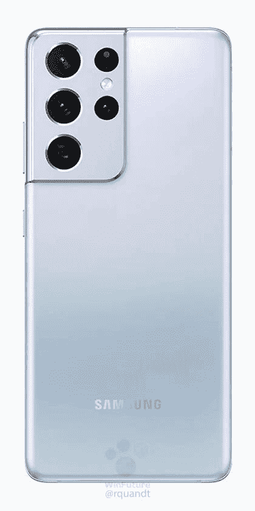
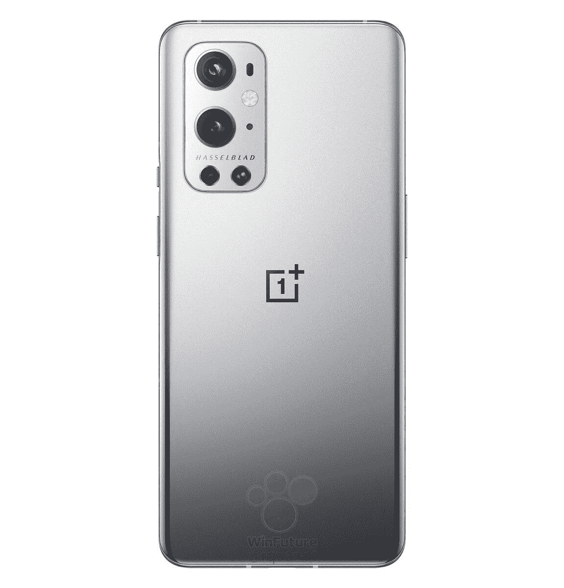

# 一加 9 专业与三星 Galaxy S21 超:超级手机之战！

> 原文：<https://www.xda-developers.com/oneplus-9-pro-vs-galaxy-s21-ultra/>

旗舰 Android 智能手机市场的竞争一如既往，一加 9 Pro 与 Galaxy S21 Ultra 的对比是一个热门话题。今年的 Galaxy S21 Ultra 起价比去年的 S20 Ultra 便宜 200 美元，功能甚至比以前的型号更多。与此同时，一加继续每年提高手机价格，目前的一加 9 系列也不例外。[一加 9 Pro](https://www.xda-developers.com/oneplus-9-pro-review/) 起价 1069 美元——比许多其他手机都贵，但仍比 Galaxy S21 Ultra 便宜 100 多美元(当 Ultra 不销售时)。

一加 9 Pro 和 Galaxy S21 Ultra 是当今最好的旗舰 Android 手机，但*哪一款*更好？在本指南中，我们将为您提供做出明智购买所需的所有事实和比较。我们还对一加 9 的相机进行了[评测，它与一加 9 Pro 的设置类似(尽管不完全相同)。](https://www.xda-developers.com/oneplus-9-camera-review/)

## 一加 9 Pro 和 Galaxy S21 Ultra 规格

| 

规格

 | 

一加 9 专业版

 | 

银河 S21 Ultra

 |
| --- | --- | --- |
| **打造** | 

*   铝制框架
*   大猩猩玻璃 5 正面和背面

 | 

*   铝制框架
*   大猩猩玻璃 Victus 正面和背面

 |
| **尺寸&重量** | 

*   163.2 x 73.6 x 8.7 毫米
*   197 克

 | 

*   165.1 x 75.6 x 8.9 毫米
*   229 克

 |
| **显示** | 

*   6.7 英寸 QHD+ LTPO AMOLED
*   3216 x 1440
*   525 PPI
*   20.1:9 宽高比
*   120 赫兹刷新率

 | 

*   6.8 英寸 QHD+ AMOLED
*   3200 x 1440
*   515 PPI
*   20:9 宽高比
*   120 赫兹刷新率

 |
| **SoC** | 高通骁龙 888 | 

*   **国际:** Exynos 2100:
*   美国:高通骁龙 888

 |
| **风筒&储存** | 

*   8GB 内存+ 128GB 存储
*   12GB 内存+ 256GB 存储空间

 | 

*   12GB 内存+ 128GB 存储
*   12GB 内存+ 256GB 存储空间
*   16GB 内存+ 512GB 存储空间

 |
| **电池&充电** | 

*   4500 毫安时电池
*   65W 翘曲充电有线快充
*   50W 无线快速充电
*   包括翘曲充电 65T 充电器

 | 

*   5000 毫安时电池
*   25W USB 供电 3.0 有线快充
*   15W 无线充电
*   4.5W 反向无线充电
*   大多数地区包装盒中没有充电器

 |
| **安全** | 显示指纹扫描仪 | 显示指纹扫描仪 |
| **后置摄像头** | 

*   初级: 48MP，f/1.8
*   **二级:** 50MP，超宽，f/2.2
*   **第三:** 8MP，3.3 倍长焦，f/2.4
*   **四元:** 2MP，单色传感器

 | 

*   **初级:** 108 MP 广角镜头，f/1.8
*   **次要:** 12 MP，超广角镜头，f/2.2，120 FoV
*   **三级:** 10 MP，长焦镜头，f/2.4，35，72mm
*   **四元:** 10 MP，长焦镜头，f/4.9，10，240mm

 |
| **前置摄像头** | 16MP，f/2.4，FF，EIS | 40MP，f/2.2 |
| **端口** | USB 3.1 第 1 代 C 型 | USB 3.2 类型 C |
| **音频** | 

*   双立体声扬声器
*   没有耳机插孔

 | 

*   双立体声扬声器
*   没有耳机插孔

 |
| **连通性** | 

*   LTE 4×4 MIMO
*   SA/NSA 5G
*   Wi-Fi 6 2×2 MIMO(双频带)
*   蓝牙 5.2
*   国家足球联盟
*   全球（卫星）定位系统

 | 

*   LTE 4×4 MIMO
*   SA/NSA 5G
*   Wi-Fi 6E
*   蓝牙 5.1
*   国家足球联盟
*   全球（卫星）定位系统

 |
| **软件** | OxygenOS 11(安卓 11) | One UI 3.1(安卓 11) |
| **其他特性** | 

*   IP68 防尘防水等级
*   警报滑块

 | 

*   IP68 防水等级
*   三星 DeX
*   Wacom 手写笔和 S Pen 支持(单独销售，外部存储)

 |

**[一加 9 Pro 论坛](https://forum.xda-developers.com/f/oneplus-9-pro.12153/)**| |**|[三星 Galaxy S21 Ultra 论坛](https://forum.xda-developers.com/f/samsung-galaxy-s21-ultra.12091/)**

## 设计和硬件:几乎相同，但不一样！

Galaxy S21 Ultra 和一加 9 Pro 具有相似的设计和构造。两款手机都是巨大的铝和玻璃平板，正面是曲面(“2.5D”)屏幕，背面是多摄像头设置。Galaxy S21 Ultra 是两款中较大的一款，配有 6.8 英寸的显示屏，但一加 9 Pro 紧随其后，配有 6.7 英寸的屏幕。一些一加 9 Pro 颜色变种的玻璃表面有光泽，而所有 Galaxy S21 Ultra 变种都有哑光表面。两款设备上的摄像头模块也赋予了它们独特的个性。

这些显示器几乎一样大，功能也很相似。这两款手机都有高质量的 AMOLED 面板，色彩鲜艳，黑色深，最高刷新率为 120Hz。这意味着从游戏到浏览 Twitter 的一切都将非常流畅。两款手机的显示屏下都有指纹传感器。

其余内部硬件也差不多。Galaxy S21 Ultra 和一加 9 Pro 都有 128GB 的内部存储空间，但没有 microSD 卡插槽。一加 9 Pro 最高可配置 12GB 内存和 256GB 存储，而最高端的 Galaxy S21 Ultra 则有 16GB 内存和 512GB 存储。

这两款手机有一个重要的区别:片上系统(SoC)，包括 CPU 和 GPU。无论你在哪里购买，一加 9 Pro 都是由骁龙 888 芯片组驱动的。然而，Galaxy S21 Ultra 中的 SoC 因地区而异——在美国和其他几个地区，它有一个[骁龙 888](https://www.xda-developers.com/qualcomm-snapdragon-888-explained-specs-features/) 和三星自己的 [Exynos 2100](https://www.xda-developers.com/samsung-exynos-2100-specs-features/) 芯片组。这两种芯片组在现实世界中的性能非常接近，差异并不真正*重要*，但在这里值得注意。

Galaxy S21 Ultra 和一加 9 Pro 都有全天电池续航时间。前者有一块 5000 的电池，最高 25W 快充，后者有一块略小的 4,500mAh 电池，65W 快充。这两款手机都可以使用标准的 Qi pads 以 15W 的功率无线充电(一加 9 Pro 使用[一加的 70 美元坞站](https://onepluscom.pxf.io/c/2233363/916678/12532?subId1=UUxdaUeUpU2423&subId2=exda&u=https%3A%2F%2Fwww.oneplus.com%2Fproduct%2Foneplus-warp-charge-50-wireless-charger)可以达到 65W)，它们可以作为其他设备的慢速无线充电板。

Galaxy S21 Ultra 还有一个硬件技巧:它兼容三星的 S Pen 手写笔。你可以将笔用作指针(如果你经常戴手套会很有帮助)，用[微软 OneNote](https://play.google.com/store/apps/details?id=com.microsoft.office.onenote) 或 [MyScript Nebo](https://play.google.com/store/apps/details?id=com.myscript.nebo) 之类的应用草草记下手写笔记，或者只是享受涂鸦的乐趣。然而，你不能像任何 Galaxy Note 设备一样将 S Pen 存储在手机中。你也不会得到 Galaxy S21 Ultra 附带的 S Pen，因为它是单独出售的。

两款手机的其余规格或多或少是相同的。它们共享 IP68 防水/防尘、4G LTE 和 5G 支持、双立体声扬声器和 USB Type-C 端口。这两款手机都没有耳机插孔，也没有在包装盒中包含使用 3.5 毫米有线耳机/耳塞的适配器。

## 相机:两者都很出色，但 Galaxy S21 Ultra 是变焦冠军

Galaxy S21 Ultra 有四个后置摄像头:一个 108MP 主镜头，一个 12MP 超宽，一个 10MP 长焦，另一个 10MP 长焦。这款手机根据需要的变焦大小在两个长焦相机之间切换——其中一个可以变焦 3 倍，而另一个可以变焦 10 倍。还有一个 4000 万像素的自拍相机，所有镜头都可以进行 4K/60FPS 视频拍摄。

与此同时，一加 9 Pro 有三个后置摄像头，外加一个 200 万像素的单色传感器，可以帮助其他镜头。有一个 4800 万像素的主摄像头，一个 5000 万像素的超宽摄像头和一个 800 万像素的长焦摄像头。支持 4K/120FPS 视频，以及 30FPS 的 8K。但是，如果使用后一种方法，您将很快用完存储空间。

照片看起来怎么样？嗯，这是两款手机之间的一场势均力敌的比赛。这两款设备的主要后置镜头拍摄的照片质量都很高，不过我更喜欢一加 9 Pro。Galaxy S21 Ultra 和大多数其他三星手机一样，有将色彩饱和度和亮度提高到不自然水平的趋势。在有树叶和草的照片中，绿色比现实生活中出现的颜色更像霓虹。我个人更喜欢一加 9 Pro 相机上更逼真的颜色，但这两款手机在这里都表现良好，包括在弱光条件下。

两款手机都能够在不剪切图像的情况下进行 3 倍变焦，这两款设备之间没有太大的区别。然而，一旦你超过 3 倍变焦，比赛就完全一边倒了。一加 9 Pro 的长焦镜头只能进行 3.3 倍的光学变焦，而 Galaxy S21 Ultra 可以达到 10 倍的光学变焦。在你需要从远处捕捉一些东西的情况下，Galaxy S21 Ultra 显然是赢家。

最后，两款手机都有广角镜头，在任何一款设备上效果都非常出色。无论你用哪部手机，捕捉广角都不是问题。需要注意的一点是，一加 9 Pro 的广角镜头的边缘失真明显减少，这可能是一些用户所欣赏的。

总之，两款手机在照片质量上足够接近，大多数人都会对这两款设备感到满意。如果你喜欢逼真的色彩平衡和亮度，一加 9 Pro 会略微领先，但如果你经常放大超过 3 倍，Galaxy S21 Ultra 是更好的选择。

## 最后的想法

Galaxy S21 Ultra 和一加 9 Pro 在几乎所有重要的方面都很相似。两款手机都有快速的内部硬件、全天电池、出色的摄像头、大屏幕等等。这两款设备都没有明显优于另一款，但对一些人来说，有一些很重要的小差异。Galaxy S21 Ultra 可以配置比一加 9 Pro 更多的存储空间和内存，所以如果你永远不想删除任何东西，三星的手机可能是更好的选择。一加 9 Pro 上的物理提醒滑块也是一些人的卖点，三星手机上没有这种滑块。

软件体验也是一个决定性因素。这两款手机都搭载了 Android 11，两家公司的“皮肤”在顶部添加了额外的功能——一加 9 Pro 上的 OxygenOS 和 Galaxy S21 Ultra 上的一个 UI。OxygenOS 总体上干净直观，尽管有报道称一加 9 系列存在软件缺陷，包括过去影响其他一加手机的[错过推送通知](https://www.xda-developers.com/oneplus-9-pro-review/#oneplus9prosoftwareui)的相同问题。

三星的 One UI 3.1(也基于 Android 11)比 OxygenOS 11 功能更多，但它也比你通常在一加手机的系统服务中看到的[更多恼人的广告](https://www.xda-developers.com/samsung-one-ui-2-5-add-lockscreen-ads-problem/)。[三星 DeX](https://www.xda-developers.com/tag/samsung-dex/) 是一项功能，你可以将手机连接到显示器/电视/PC，并在桌面环境下使用你的应用程序，这项功能受到一些三星粉丝的欢迎，在 OxygenOS 上没有类似的功能。

一加 9 Pro 的 12GB 内存和 256GB 存储空间起价为 1069 美元，尽管在一些国家(如印度)有更便宜的 8GB 内存/128GB 存储选项。Galaxy S21 Ultra 的 8GB 内存和 128GB 存储空间起价为 1200 美元，根据您所在的地区，其他配置有 12GB/256GB 和 16GB/512GB。然而，三星手机频繁上市，Galaxy S21 Ultra 的基本款已经几次跌破 1000 美元。

 <picture></picture> 

Samsung Galaxy S21 Ultra

Galaxy S21 Ultra 的起价通常为 1200 美元，但基本型号的售价通常接近 1000 美元。这是目前功能最丰富的智能手机之一。

 <picture></picture> 

OnePlus 9 Pro

##### 一加 9 专业版

目前来自一加的顶级手机有巨大的屏幕，出色的摄像头，超快充电，价格标签为 1069 美元。