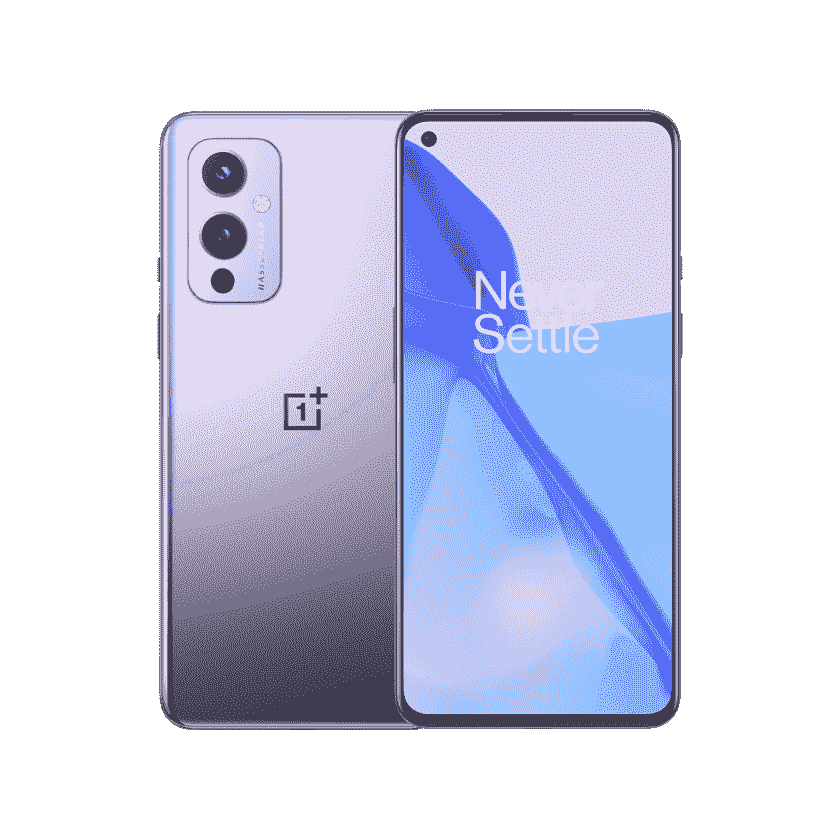

# 一加 9 系列今天在美国上市:在哪里买

> 原文：<https://www.xda-developers.com/oneplus-9-series-goes-on-sale-in-the-us-today-where-to-buy/>

一加 9 系列现在在美国销售，起价 729 美元。这些设备之前在 3 月 26 日开始接受预订，但现在可以更广泛地获得。

如果你不熟悉一加 9 系列，[我们为你介绍了](https://www.xda-developers.com/oneplus-9/)。从技术上讲，该系列有三种变体，但只有两种在美国上市。一加 9 是更“主流”的选择，具有 6.5 英寸的显示屏和三摄像头设置。与此同时，一加 9 Pro 提供 6.7 英寸显示屏和四摄像头设置。这两款相机都是与哈苏合作开发的。

如果你对新设备犹豫不决，可以看看我们的[一加 9 Pro 评测](https://www.xda-developers.com/oneplus-9-pro-review/)。除了 Galaxy S21 系列，一加的新设备是市场上最好的，尽管它们的价格不菲。让我们来分析一下不同的选项，以及在哪里可以找到一加 9 系列。

### 一加 9 系列:规格

| 

规格

 | 

一加 9

 | 

一加 9 专业版

 |
| --- | --- | --- |
| **打造** | 

*   玻璃纤维增强聚合物框架
*   大猩猩玻璃 5 正面和背面

 | 

*   铝制框架
*   大猩猩玻璃 5 正面和背面

 |  |
| **尺寸&重量** | 

*   北美/欧洲:
*   印度/中国:

 | 

*   163.2 x 73.6 x 8.7mm 毫米
*   197g

 |  |
| **显示** | 

*   6.55 英寸 FHD+ AMOLED (2400 x 1080p)
*   402PPI
*   20:9 宽高比
*   120 赫兹刷新率
*   1100 尼特峰值亮度
*   支持 sRGB 和 DCI-P3 色彩空间
*   HDR10+
*   自动色温调节
*   大猩猩玻璃 5

 | 

*   6.7 英寸 QHD+ LTPO AMOLED (3216 x 1440p)
*   525 磅每英寸
*   20.1:9 宽高比
*   智能 120 赫兹刷新率(自适应 1-120 赫兹)
*   360Hz 触摸轮询速率
*   1300 尼特峰值亮度
*   10 位颜色深度
*   支持 sRGB 和 DCI-P3 色彩空间
*   HDR10+
*   MEMC
*   自动色温调节
*   大猩猩玻璃 5

 |  |
| **SoC** | 

*   高通骁龙 888
    *   1 个 Kryo 680(基于 ARM Cortex X1)Prime core @ 2.84 GHz
    *   3 个 Kryo 680(基于 ARM Cortex A78)性能内核@ 2.4GHz
    *   4 个 Kryo 680(基于 ARM Cortex A55)高效内核@ 1.8GHz
*   Adreno 660 GPU

 | 

*   高通骁龙 888
    *   1 个 Kryo 680(基于 ARM Cortex X1)Prime core @ 2.84 GHz
    *   3 个 Kryo 680(基于 ARM Cortex A78)性能内核@ 2.4GHz
    *   4 个 Kryo 680(基于 ARM Cortex A55)高效内核@ 1.8GHz
*   Adreno 660 GPU

 |  |
| **内存&存储** | 

*   8GB LPDDR5 内存+ 128GB UFS 3.1 存储
*   12GB + 256GB

 | 

*   8GB LPDDR5 内存+ 128GB UFS 3.1 存储
*   12GB + 256GB

 |  |
| **电池&充电** | 

*   4500 毫安时电池
*   65W 有线快速充电(29 分钟内 1-100%)
*   45W 有线快速充电(USB PD)
*   15W Qi 无线充电(仅限北美/欧洲)
*   附带 Warp Charge 65T 充电器(支持高达 45W 的 USB PD 或 PPS，适用于非一加设备)

 | 

*   4500 毫安时电池
*   65W 有线快速充电(29 分钟内 1-100%)
*   45W 有线快速充电(USB PD)
*   50W 无线快速充电(43 分钟内 1-100%)
*   附带 Warp Charge 65T 充电器(支持高达 45W 的 USB PD 或 PPS，适用于非一加设备)

 |  |
| **安全** | 显示指纹扫描仪 | 显示指纹扫描仪 |  |
| **后置摄像头** | 

*   **主:** 48MP 索尼 IMX689，f/1.8，EIS，PDAF+CAF
*   **辅助:** 50MP 索尼 IMX766 超宽，f/2.2，自由曲面镜头
*   **第三:** 2MP 单色传感器
*   双 LED 闪光灯
*   **视频:**
    *   8K 视频@ 30fps
    *   4K 视频@ 30/60fps
    *   慢动作:720p @480fps，1080p @ 240fps
    *   延时:1080p @ 30fps，4K @ 30fps
*   **附加功能:**夜景、超级微距、UltraShot HDR、智能场景识别、人像模式、专业模式、全景、倾斜移位模式、对焦峰化、猫/狗脸对焦、原始支持、滤镜、超稳定视频、视频夜景、视频 HDR、视频人像、对焦跟踪、超延时

 | 

*   **主:** 48MP 索尼 IMX 789，f/1.8，OIS，EIS，PDAF+CAF
*   **辅助:** 50MP 索尼 IMX766 超宽，f/2.2，自由曲面镜头
*   **第三:**8MP 3.3 倍长焦，f/2.4，OIS
*   **四元:** 2MP 单色传感器
*   双 LED 闪光灯
*   **视频:**
    *   8K 视频@30fps
    *   4K 视频@ 30/60/120fps
    *   慢动作:720p @ 480fps，1080p @ 240fps
    *   延时:1080p @ 30fps，4K @ 30fps
*   **附加功能:**夜景、超级微距、UltraShot HDR、智能场景识别、人像模式、专业模式、全景、倾斜移位模式、对焦峰化、猫/狗脸对焦、原始支持、滤镜、超稳定视频、视频夜景、视频 HDR、视频人像、对焦跟踪、超延时

 |  |
| **前置摄像头** | 16MP 索尼 IMX471，f/2.4，FF，EIS | 16MP 索尼 IMX471，f/2.4，FF，EIS |  |
| **端口** | USB 3.1 第一代 C 类 | USB 3.1 第一代 C 类 |  |
| **音频** | 

*   双立体声扬声器
*   噪声消除支持
*   杜比全景声认证

 | 

*   双立体声扬声器
*   噪声消除支持
*   杜比全景声认证

 |  |
| **连通性** | 

*   LTE 4x4 MIMO
*   SA/NSA 5G
*   Wi-Fi 6 2x2 MIMO(双频带)
*   蓝牙 5.2 (aptX、aptX HD、LDAC、AAC 支持)
*   国家足球联盟
*   GPS (L1+L5 双频)、GLONASS、伽利略、北斗、A-GPS

 | 

*   LTE 4x4 MIMO
*   SA/NSA 5G
*   Wi-Fi 6 2x2 MIMO(双频带)
*   蓝牙 5.2 (aptX、aptX HD、LDAC、AAC 支持)
*   国家足球联盟
*   GPS (L1+L5 双频)、GLONASS、伽利略、北斗、A-GPS

 |  |
| **软件** | 基于 Android 11 的 OxygenOS 11 | 基于 Android 11 的 OxygenOS 11 |  |
| **其他特性** | 

*   IP68 防尘防水等级(仅限 T-Mobile 版本)
*   警报滑块
*   升级的触觉电机
*   一加酷玩冷却系统(五层系统，带有一个蒸汽室以及石墨和铜层)

 | 

*   IP68 防尘防水等级
*   警报滑块
*   升级的触觉电机
*   一加酷玩冷却系统(多层系统，带有蒸汽室和石墨层和铜层)

 |  |
| **颜色** | 冬天的薄雾，北极的天空，星光般的黑色 | 晨雾，森林绿，恒星黑 |  |

**[一加九大论坛](https://forum.xda-developers.com/f/oneplus-9.12151/)| |[一加九大论坛](https://forum.xda-developers.com/f/oneplus-9-pro.12153/)|**

* * *

## 一加 9 和 9 专业版价格

| 

没有。

 | 

设备

 | 

北美洲

 | 

欧洲

 | 

印度

 | 

中国

 |
| --- | --- | --- | --- | --- | --- |
| **1。** | **一加 9:** |  |  |  |  |
| **1.1** | 8GB + 128GB(星光黑，冬季薄雾) |  | €709 | ₹49,999 | ¥3,799 |
| **1.2** | 12GB + 256GB(星空黑) |  | €809 | ₹54,999 | ¥4,299 |
| **2。** | **一加 9 Pro:** |  |  |  |  |
| **2.1** | 8GB + 128GB(晨雾) |  | €909 | ₹64,999 | ¥4,999 |
| **2.2** | 8GB + 256GB | - | - | - | ¥5,499 |
| **2.3** | 12GB + 256GB(晨雾、松绿) |  | €999 | ₹69,999 | ¥5,999 |
| **3。** | 一加 9R |  |  |  |  |
| **3.1** | 8GB + 128GB(湖蓝、炭黑) | - | - | ₹39,999 | - |
| **3.2** | 12GB + 256GB(湖蓝、炭黑) | - | - | ₹43,999 | - |

* * *

## 在哪里购买一加 9

一加 9 是更实惠的选择，价格为 729 美元。这样你就能买到 8GB 内存和 128GB 存储空间的机型，这对大多数人来说绰绰有余。你可以在下面的零售商那里买到一加 9，但是要小心，因为运输时间已经开始下滑了。如果你想尽快得到一加 9 号，你应该赶快行动。

 <picture></picture> 

OnePlus 9

##### 一加 9

一加 9 是为那些想要旗舰性能，但不想支付最高美元。它提供了 6.5 英寸 120Hz AMOLED 显示屏，由哈苏调整的三摄像头设置，以及骁龙 888 SoC。

### 亚马孙

亚马逊推出黑色版一加 9，售价 729 美元。该型号拥有 8GB 内存和 128GB 存储空间，以及骁龙 888 处理器、6.55 英寸 120Hz 显示屏和三摄像头设置。该设备已解锁，并与 T-Mobile 和威瑞森兼容。

### **最好**买

百思买(Best Buy)销售的一加 9 是一种光滑的“冬季薄雾”，本质上是带有渐变的紫色。它看起来很优雅，并提供上述相同的规格。该设备将被解锁，并计划于 4 月 14 日发货。

### 一加

一加网站提供两种颜色的一加 9，并且是目前发货最快的，所以这可能是你最好的选择。一加网站称货物将在三天内发出。

### B&H

你也可以从 B&H 买到一加 9，尽管在撰写本文时还没有预计的发货日期。该网站仍然显示一个“预订”按钮，所以你可能想在未来几天回来检查。

### T-Mobile

最后，你可以在 T-Mobile 找到一加 9，这是你可以直接购买该设备的唯一运营商。你可以找到两种颜色的设备，并立即支付设备费用，或在 24 个月内每月支付 30.42 美元。

## 哪里可以买到一加 9 Pro

 <picture></picture> 

OnePlus 9 Pro

##### 一加 9 专业版

凭借 6.7 英寸的大尺寸四高清有机发光二极管显示屏和智能 120Hz 刷新率，一加 9 Pro 可能拥有市场上最好的显示屏。与 Hasselblad 合作调整的相机可拍摄出出色的静态照片，并捕捉精彩的 4K 视频。

如果你想让你的智能手机更上一层楼，一加 9 Pro 是值得一试的设备。你会得到一个更大的显示屏，高达 12GB 的内存和 256GB 的存储空间，以及一个四摄像头的设置。当然，如果你想要更高端的设备，你必须支付更高的价格。

### 亚马孙

起价 1069 美元，你可以在亚马逊的晨雾中找到一加 9 Pro，它看起来像一个银色的渐变。该设备解锁后可以与 T-Mobile 和威瑞森一起使用。

### 百思买集团

百思买提供松木绿和晨雾色的一加 9 Pro，起价 1069 美元。像一加 9 一样，百思买计划在 4 月 14 日发货。

### 一加

一加预计它将在短短三天内推出一加 9 Pro，所以如果你想让这款设备更快，这是你的最佳选择。你可以买到松绿色或晨雾色的设备，价格从 1069 美元起。

### B&H

《B&H 图片报》列出的一加 9 Pro 售价为 1069 美元，这是一款配备 12GB 内存和 256GB 存储空间的机型。不幸的是，零售商没有列出该设备何时可以购买。你应该过几天再去零售商那里看看最新的清单。

### T-Mobile

T-Mobile 在晨雾中列出了 256GB 存储空间的一加 9 Pro，售价为 1068 美元。如果你想选择包月，你可以在 24 个月内每月支付 44.50 美元。