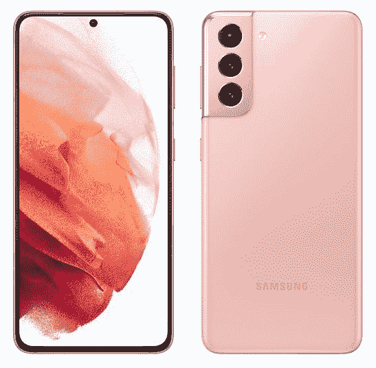

# 一加 9 vs 三星 Galaxy S21:哪个低于 800 美元的手机适合你？

> 原文：<https://www.xda-developers.com/oneplus-9-vs-galaxy-s21/>

旗舰 Android 手机市场的竞争一如既往，尤其是三星在过去一年中降低了许多手机的价格(或以更低的 MSRPs 销售)。Galaxy S20 粉丝版是 2020 年最物有所值的智能手机之一，Galaxy S21 系列的每部手机都比 S20 手机便宜 200 美元。与此同时，一加继续每年小幅提高手机价格，但与其他公司的旗舰产品相比，这些设备仍然具有价格竞争力。[一加 9](https://www.xda-developers.com/oneplus-9) 和[一加 9 Pro](https://www.xda-developers.com/oneplus-9-pro-review/) 是该公司今年的主要手机，后一款设备对其相机系统进行了一些显著的升级。

一加 9 和 Galaxy S21 是当今最好的旗舰 Android 手机，但是哪一款更好呢？在本指南中，我们将为您提供做出明智购买所需的所有事实和比较。

## 银河 S21 和一加 9 规格

| 

规格

 | 

一加 9

 | 

银河 S21

 |
| --- | --- | --- |
| **构建** | 

*   玻璃纤维增强聚合物框架
*   大猩猩玻璃 5 正面和背面

 | 

*   铝制中框
*   塑料背面
*   大猩猩玻璃面板

 |
| **尺寸&重量** | 

*   北美/欧洲:
    *   160 x 74.2 x 8.7 毫米
    *   192 克
*   印度/中国:
    *   160 x 73.9 x 8.1 毫米
    *   183 克

 | 

*   151.7 x 71.2 x 7.9mm 毫米
*   171 克

 |
| **显示** | 

*   6.55 英寸 FHD+ AMOLED (2400 x 1080)
*   402PPI
*   20:9 宽高比
*   120 赫兹刷新率
*   1100 尼特峰值亮度
*   HDR10+

 | 

*   6.2 英寸 FHD+动态 AMOLED (2400 x 1080)
*   421 PPI
*   20:9 宽高比
*   120 赫兹刷新率
*   1300 尼特峰值亮度
*   HDR10+

 |
| **SoC** | 

*   高通骁龙 888
    *   1 个 Kryo 680(基于 ARM Cortex X1)Prime core @ 2.84 GHz
    *   3 个 Kryo 680(基于 ARM Cortex A78)性能内核@ 2.4GHz
    *   4 个 Kryo 680(基于 ARM Cortex A55)高效内核@ 1.8GHz

 | 

*   国际:Exynos 2100:
    *   1x ARM Cortex X1 @ 2.9GHz +
    *   3 个 ARM Cortex A78 内核，2.8GHz 以上
    *   4 个 ARM Cortex A55 内核@ 2.2GHz
*   美国:高通骁龙 888:
    *   1 个 Kryo 680 Prime 内核@ 2.84GHz +
    *   3 个 Kryo 680 高性能内核@ 2.4GHz 以上
    *   4 个 Kryo 680 高效内核@ 1.8GHz

 |
| **风筒&储存** | 

*   8GB 内存+ 128GB 存储
*   12GB + 256GB 存储空间

 |  |
| **电池&充电** | 

*   4500 毫安时电池
*   65W Dash Charge 充电
*   45W USB 供电(USB-PD)快速充电
*   15W 无线充电(仅限北美/欧洲)
*   附带 Warp Charge 65T 充电器(支持高达 45W 的 USB PD 或 PPS，适用于非一加设备)

 | 

*   4000 毫安时电池
*   25W USB 供电(USB-PD)快速充电
*   15W 无线充电
*   4.5W 反向无线充电
*   在大多数地区，包装盒中没有充电器

 |
| **安全** | 显示指纹扫描仪 | 显示指纹扫描仪 |
| **后置摄像头** | 

*   **主:** 48MP 索尼 IMX689，f/1.8，EIS，PDAF+CAF
*   **次要:** 50MP 索尼 IMX766 超宽，f/2.2，自由曲面镜头
*   **第三:** 2MP 单色传感器

 | 

*   **主:** 12MP，广角镜头，f/1.8，1/1.76”，1.8 m，OIS，双像素 PDAF
*   **次要:** 12MP，超广角镜头，f/2.2，1/2.55”，1.4 m
*   **第三:**6400 万像素，长焦镜头，f/2.0，1/1.76”，0.8 米，OIS PDAF

 |
| **前置摄像头** | 16MP 索尼 IMX471，f/2.4，FF，EIS | 10MP，f/2.2，EIS |
| **端口** | USB 3.1 第一代 C 类 | USB 3.1 第一代 C 类 |
| **音频** | 

*   双立体声扬声器
*   没有耳机插孔

 | 

*   双立体声扬声器
*   没有耳机插孔

 |
| **连通性** | 

*   LTE 4×4 MIMO
*   SA/NSA 5G
*   Wi-Fi 6 2×2 MIMO(双频带)
*   蓝牙 5.2
*   国家足球联盟
*   全球（卫星）定位系统

 | 

*   LTE 4×4 MIMO
*   SA/NSA 5G
*   无线网络 6
*   蓝牙 5.1
*   国家足球联盟
*   全球（卫星）定位系统

 |
| **软件** | OxygenOS(安卓 11) | One UI 3.5(安卓 11) |
| **其他特性** | 

*   IP68 防尘防水等级(仅限 T-Mobile 版本)
*   警报滑块

 | 

*   IP68 防尘防水等级

 |

## 设计和硬件:几乎相同

Galaxy S21 是两款手机中较小的一款，屏幕尺寸为 6.2 英寸，但一加 9 的屏幕尺寸也没有大多少，为 6.55 英寸。这两款设备都有高质量的 AMOLED 屏幕，最大刷新率为 120Hz(不过为了延长电池寿命，你可以降至 60Hz)，并支持 HDR10+。

一加 9 和 Galaxy S21 有电源按钮和音量键，尽管一加 9 有一个额外的开关。右侧的提醒滑块(音量按钮上方)可以在静音、振动和响铃模式之间切换。其他大多数手机，包括 Galaxy S21，只允许你通过软件切换模式。

两款手机的屏幕上方都有一个扬声器格栅，底部还有一个扬声器。底部扬声器旁边是 USB Type-C 端口，用于充电和数据传输。不幸的是，Galaxy S21 和一加 9 都缺少一个 3.5 毫米耳机插孔，两家公司都没有在手机包装盒中提供适配器。你需要购买一个适配器(就像[这个](https://www.amazon.com/TITACUTE-Headphone-Adapter-Portable-Compatible/dp/B08P5HVL7L?tag=xda-4snv7e6-20&ascsubtag=UUxdaUeUpU2545&asc_refurl=https%3A%2F%2Fwww.xda-developers.com%2Foneplus-9-vs-galaxy-s21%2F&asc_campaign=Short-Term))来插入大多数类型的有线耳机。

后壳是这两款手机的一个显著区别——一加 9 有一个大猩猩玻璃背面，而 Galaxy S21 的背面是塑料的。这有助于一加 9 看起来更“高档”，但我个人更喜欢 Galaxy S21 上使用的哑光塑料。感觉不便宜，也不会像玻璃一样沾上指纹。

至于内部硬件，两款手机的入门级版本都有 8GB 的 RAM 和 128GB 的内部存储。价格更高的 Galaxy S21 拥有相同的内存容量和两倍的存储空间，而高端的一加 9 拥有 12GB 内存和 256GB 存储空间。无论你在哪里购买，一加 9 都是由骁龙 888 芯片组驱动的。然而，Galaxy S21 的芯片组因地区而异——在美国和其他几个地区有[骁龙 888](https://www.xda-developers.com/qualcomm-snapdragon-888-explained-specs-features/) ,在世界其他地区有三星自己的 [Exynos 2100](https://www.xda-developers.com/samsung-exynos-2100-specs-features/) 芯片组。

最后，Galaxy S21 和一加 9 都有全天的电池寿命。前者拥有 4,000mAh 电池，最高 25W 快充，后者拥有稍大的 4500 mah 电池，65W 快充。这两款手机都可以使用标准的 Qi pads 以 15W 的功率无线充电，但只有 Galaxy S21 可以在没有电缆的情况下为其他设备充电。

## 相机:这很难说

Galaxy S21 有三个后置摄像头:12MP 主摄像头、12MP 广角镜头和 64MP 长焦镜头。同时，一加有一个 4800 万像素的主镜头和 5000 万像素的超宽镜头，以及一个额外的 200 万像素的单色传感器来辅助其他镜头。两款手机都能拍出出色的照片，不过我个人更喜欢一加 9 的相机。Galaxy S21 捕捉了大量细节，对比度平衡，但经常将亮度和色彩饱和度提升到不自然的水平。这在下面的对比照片中很容易看出——树上的叶子比现实生活中出现的*要绿得多。我肯定更喜欢一加 9 的更现实的处理在这里。*

然而，一加 9 并非没有缺陷。[多年来](https://forum.xda-developers.com/t/watercolor-photos-auto-mode-camera-issue-when-the-camera-soft-is-upgraded.3657231/post-73420791)，当你放大足够远时，用一加手机拍摄的照片看起来就像一幅水彩画，OP9 也是如此。这种效果无论如何都不会破坏交易，但它确实意味着裁剪后的照片在 Galaxy S21 上看起来会更好一些。

即使当你在拍摄照片时变焦，而不是稍后裁剪，Galaxy S21 也会领先。S21 有一个专用的变焦镜头，所以它和一加 9 之间没有竞争。下面的照片是用两款手机在 10 倍变焦下拍摄的 S21 的照片看起来相对正常，而 OP9 的图像有更多的锯齿边缘和较少的细节。

在我们用两款手机拍摄的所有其他照片中，Galaxy S21 有让照片变亮的趋势，而一加 9 在色彩平衡方面通常更接近真实生活。不过，这两款手机在弱光条件下表现相似。

*一加 9 张照片样本*

*Galaxy S21 照片样本*

总之，这两款手机在捕捉照片和视频方面都没有问题，谁是赢家取决于你想要什么。如果你重视逼真的色彩，一加 9 是赢家。如果你不是水彩效果的粉丝和/或你经常拍摄远处物体的照片，Galaxy S21 是最佳选择。

## 最后的想法:银河 S21 是赢家

Galaxy S21 和一加 9 都是优秀的设备，它们在软件和性能上非常相似，没有一个明显比另一个好。然而，两者之间存在微妙的差异，这使得一加 9 相比之下更弱。Galaxy S21 有一个专用的长焦镜头，而一加 9 没有。三星的手机也有 IP68 防水/防尘保护，而只有 T-Mobile 版的一加 9 通过了 IP68 认证。不过，一加 9 仍然拥有更大的屏幕和更快的充电速度。

软件也是一个因素。尽管这两款设备都搭载了 Android 11，应该会获得多年的安全更新，[三星保证四年](https://www.xda-developers.com/samsung-4-years-security-updates-galaxy-mobile-devices/)，而一加通常会提供大约三年的安全更新(2018 年的 OnePlus 6[仍在更新](https://www.xda-developers.com/oneplus-6-6t-oxygenos-10-3-9/))。然而，一加 9 系列有无数的[软件](https://twitter.com/NexusBen/status/1385037193291370497) [漏洞](https://twitter.com/ArtemR/status/1386095584684171267)，包括过去影响其他一加手机的[错过推送通知](https://www.xda-developers.com/oneplus-9-pro-review/#oneplus9prosoftwareui)的相同问题。三星也并不完美，因为该公司喜欢在手机上给你展示广告，但在使用了几个月后，我的 Galaxy S21 还没有遇到任何严重的错误。

**[一加 9 大论坛](https://forum.xda-developers.com/f/oneplus-9.12151/)**| |**|[三星 Galaxy S21 论坛](https://forum.xda-developers.com/c/samsung-galaxy-s21.11933/)**

入门级的一加 9(8GB 内存和 128GB 存储)的零售价通常为 729 美元，而基本款 Galaxy S21(相同内存/存储)的建议零售价为 800 美元。然而，Galaxy S21 已经几次跌至 700 美元。Galaxy S21 可能已经比一加 9 贵了 80 美元，但当它更便宜时，就没有什么竞争了。

 <picture></picture> 

Samsung Galaxy S21

Galaxy S21 是三星 2021 年的入门级旗舰产品。它通常售价 800 美元，但它经常以 700 美元的价格出售，比一加 9 略便宜。

 <picture></picture> 

OnePlus 9

##### 一加 9

一加 9 仍然是一款总体上非常出色的智能手机，拥有大显示屏，超快充电，以及足够的电量来处理你扔给它的任何东西。