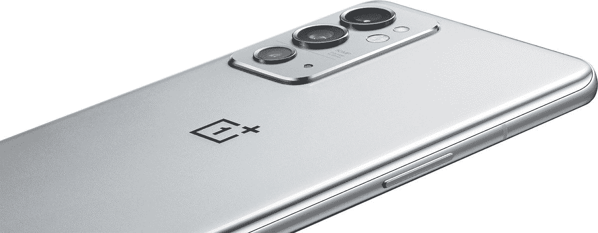

# 一加 9RT 和 Buds Z2 终于来到了印度

> 原文：<https://www.xda-developers.com/oneplus-9rt-buds-z2-india-launched/>

经过过去几个月的几次推迟，一加 9RT 和一加 Buds Z2 终于来到了印度。一加 9RT 是一款价格实惠的旗舰手机，它接替了去年底在中国推出的一加 9R。除了这款手机，一加还推出了其面向预算的无线耳塞的第二代产品——T2 一加耳塞 Z2 T3。随着[一加 10 Pro](https://www.xda-developers.com/oneplus-10-pro-china-launch/) 成为该品牌目前唯一的高端旗舰，一加 9RT 更像是普通一加 10 的权宜之计，当然，直到它到来。

## 一加 9RT:规格

| 

规格

 | 

一加 9RT

 |
| --- | --- |
| **构建** | 

*   玻璃背面
*   金属框架

 |
| **尺寸&重量** | 

*   163.2 x 73.2 x 8.7mm 毫米
*   197g

 |
| **显示** | 

*   6.62 英寸 FHD+三星 E4 AMOLED
*   120 赫兹刷新率
*   600Hz 触摸采样率
*   1300 尼特峰值亮度
*   1000000:1 对比度
*   100% DCI-P3 覆盖率
*   HDR10+

 |
| **SoC** | 

*   高通骁龙 888
    *   1 个 Kryo 680(基于 ARM Cortex X1)Prime core @ 2.84 GHz
    *   3 个 Kryo 680(基于 ARM Cortex A78)性能内核@ 2.4GHz
    *   4 个 Kryo 680(基于 ARM Cortex A55)高效内核@ 1.8GHz
*   Adreno 660 GPU

 |
| **内存&存储** | 

*   8GB/12GB LPDDR5 RAM
*   128GB/256GB UFS 3.1 存储

 |
| **电池&充电** | 

*   4500 毫安时
*   65W 快充支持

 |
| **安全** | 显示指纹扫描仪 |
| **后置摄像头** | 

*   主要:50MP 索尼 IMX 766，f/1.8，OIS
*   超宽:16MP，f/2.2
*   宏:2MP，f/2.4

 |
| **前置摄像头** | 16MP，f/2.4 |
| **端口** | USB 类型-C |
| **音频** | 立体声扬声器 |
| **连通性** | 

*   5G
*   长期演进
*   无线网络 6
*   蓝牙 5.1
*   国家足球联盟
*   全球定位系统/A-GPS

 |
| **软件** | 基于 Android 11 的 OxygenOS 11 |
| **其他特性** | 用于冷却的大型蒸汽室 |

一加 9R 是旗舰系列的一个更实惠的版本，配备了最新一代的 CPU。一加 9RT 也遵循同样的脚步，从去年开始搭载高通骁龙 888 芯片组。与一加 9R 上的骁龙 870 相比，这仍然是一个实质性的升级。您可以获得 8/12GB 的内存和 128/256GB 的板载存储。一加一直关注速度，这就是为什么我们在内部没有看到任何妥协。

一加还声称包括一个大型蒸汽室，以提高热性能。这是手机游戏玩家肯定会欣赏的。一加 9R 在印度是作为面向游戏玩家的手机销售的，而一加 9RT 似乎也瞄准了类似的人群。在正面，我们有一个 6.62 英寸的全高清+ AMOLED 显示屏，刷新率为 120Hz。这是三星的 E4 AMOLED 面板，左上角有一个打孔的切口。相信这款手机面向游戏玩家的另一个原因是支持的游戏上令人难以置信的 600Hz 触摸采样率。

在多年来在大多数手机上使用相同的传感器后，一加最终放弃了一加 9R 的 48MP IMX 586 传感器，转而在 9RT 上使用 50MP IMX 766 和 OIS。对于那些想知道的人，这与一加 9 Pro 的超宽相机上使用的传感器相同，该相机拥有业内最好的超宽相机之一。对于那些怀疑相机质量的人来说，这是一种安慰，至少在我们对该设备的评论出来之前是如此。超广角相机是一个 16MP 传感器，配有一个 2MP 微距镜头。前置另有一个 16MP 摄像头，用于自拍。

这款手机仍然运行 Android 11，尽管这有点令人失望，因为我们希望一加会推出基于 Android 12 的 OxygenOS 12 手机。一个 4500 毫安时的电池支持 65 瓦的快速充电，一加声称可以在半个小时内给手机充满电。其他一加常客，如显示指纹扫描仪和警报滑块都存在。当然，一加 9RT 是一款 5G 手机，支持 8 个 5G 频段。

## 一加 9RT:定价和供货情况

一加 9RT 将有两种饰面出售——纳米银和黑客黑。相信我这么说，黑客黑是我见过或握过的最好的黑手机。一加在手机的外观和手感方面做得非常好。至于可用性，OnePlus 9RT 将于 2022 年 1 月 16 日通过亚马逊和 OnePlus 商店在印度销售，基本 8+128GB 型号的起价为₹42,999，12+256GB 型号的起价一直到₹46,999。当您购买手机时，您可以获得 6 个月的免费 Spotify Premium。

 <picture></picture> 

OnePlus 9RT

##### 一加 9RT

一加 9RT 是一款旗舰手机，价格稍微适中。

## 一加芽 Z2:规格

| 

规格

 | 

一加芽 Z2

 |
| --- | --- |
| **扬声器驱动器** | 

*   11 毫米动态驱动器
*   针对低音再现进行了调整

 |
| **麦克风** | 三麦克风阵列 |
| **连通性** | 蓝牙 5.2 |
| **电池&充电** | 

*   耳塞:
    *   ANC on:最长 5 小时
    *   ANC 关闭:最长 7 小时
*   耳塞+外壳:
    *   ANC 开启:最长 27 小时
    *   ANC 关闭:最长 35 小时
*   快速充电支持
    *   充电 10 分钟可增加 5 小时的综合播放时间

 |
| **其他功能** | 

*   IP55 认证(仅耳塞)
*   杜比大气
*   Dirac 音频调谐器
*   支持主动噪声消除(40dB 峰值)
*   用于充电的 USB 型端口

 |
| **颜色** | 

*   黑曜石黑
*   珍珠白

 |

最初的[一加 Buds Z](https://www.xda-developers.com/oneplus-buds-z-affordable-true-wireless-earbuds-fast-charging/) 因其低廉的价格和良好的音质在印度非常受欢迎。这一次，一加对它们进行了相当大的改进，并增加了一些漂亮的功能，使它们成为更有吸引力的选择。对于初学者来说，你现在可以使用主动噪音消除(ANC ),这种技术现在已经慢慢应用到廉价的无线耳塞上。驱动器也更大，为 11 毫米，本质上是动态的。

耳塞和外壳看起来都与一加 Buds Z 相似，这并不一定是坏的，因为一加 Buds Z2 佩戴舒适，而且考虑到外壳的尺寸，易于携带。蓝牙 5.2 用于连接，三麦克风阵列用于 ANC 以及通话期间更好的语音质量，IP55 等级可以让你戴着耳塞去健身房。一加声称，Buds Z2 在使用 ANC 的情况下可以持续使用 5 小时，在 ANC 关闭的情况下可以持续使用 7 小时。充电情况下，有 ANC 时增加 22 小时，无 ANC 时增加 28 小时。当你没电的时候，10 分钟的快速充值可以给你 5 小时的播放时间。

## 一加芽 Z2:定价和可用性

 <picture></picture> 

OnePlus Buds Z2

一加 Buds Z2 将有两种颜色可供选择——曜石黑和珍珠白，并将于 2022 年 1 月 17 日通过亚马逊和一加商店开始销售。你可以以₹4,999.的价格买到 OnePlus Buds Z2 它比去年的 Buds Z 略贵，但 ANC 和更长的电池寿命使它成为一个值得的选择。

 <picture></picture> 

OnePlus Buds Z2

##### 一加芽 Z2

一加芽 Z2 带来了一些显着的改进，如支持 ANC 和增加电池寿命。